# Low-Level Design (LLD) Interview Notes - Complete Interview Edition

> Each topic: **Requirements → Architecture Diagram → Class Diagram (Mermaid) → Sequence/State Diagrams → Key Design Decisions → Production-Grade Code → Concurrency & Scaling → Follow-up Deep-Dives**.
> Diagrams use **Mermaid** (`classDiagram`, `stateDiagram-v2`, `sequenceDiagram`, `flowchart`) - render in GitHub/VS Code/Typora/Obsidian.
> Language: Java 17+. All code is interview-compilable in structure (minor imports elided for brevity).

---

## Table of Contents

- [Universal Framework](#the-universal-framework)
- [Part 1](#part-1): Parking Lot (Design+Code), Logging Framework (Design+Code), Traffic Signal (Design+Code), Vending Machine (Design+Code), Task Management (Design+Code)
- [Part 2](#part-2): PubSub (Design+Code), ATM (Design+Code), Hotel Management (Design+Code)
- [Part 3](#part-3): Elevator (Design+Code), Digital Wallet (Design+Code) + Locking Mechanisms, Ride Booking (Design+Code), Music Streaming (Design+Code) + Streaming Protocols
- Every topic opens with **Requirements (Actors / Functional / Non-Functional / Edge Cases)**; delivery script in the Universal Framework
- [Appendices](#appendix-e--compile-notes--common-imports): E (compile notes), F (12-point self-review)

---
# THE UNIVERSAL FRAMEWORK

## What interviewers actually grade (rubric hidden in their heads)

| Dimension | Weight | What "senior" looks like |
|---|---|---|
| Requirement clarification | 20% | You ask about scale, concurrency, persistence, failure modes BEFORE drawing |
| Modeling | 25% | Right entities, right ownership boundaries, composition > inheritance |
| Pattern fit | 15% | Named + justified, not forced |
| Code quality | 20% | Encapsulation, immutability, no public setters for lifecycle fields, enums with behavior |
| Concurrency & failure | 15% | Thread-safety unprompted; idempotency; compensation; timeouts |
| Communication | 5% | Thinks aloud, validates with interviewer |

## Delivering the requirements in the room (60-90 seconds)

## How to deliver requirements in the room (60-90 seconds)

> "Let me state requirements so we agree on scope. **Functional:** FR-1 … FR-n. **Non-functional:** concurrency - <key invariant>; performance - <only if relevant>; money/time correctness - <only if relevant>. **Edge cases worth designing for:** <top 3>. Given a 45-minute round, I'd scope us to FR-1..FR-3 in code and treat the rest as discussion - does that work?"

---

## The 7 questions to ask for ANY problem
1. **Scale**: single JVM? single machine? distributed?
2. **Concurrency**: how many simultaneous actors? Do they contend on shared state?
3. **Persistence**: in-memory OK, or must survive restart?
4. **Failure semantics**: what happens on crash mid-operation? (→ idempotency, WAL, sagas)
5. **Ordering guarantees** needed anywhere?
6. **Read vs write ratio**? (drives indexing/caching choices)
7. **Extensibility axes**: what will plausibly change? (→ strategy seams)

## The extensibility ladder (memorize - answers every "how would you extend?" question)
```
Hardcode → Enum + switch → Polymorphism (Strategy/State) → Rule/config engine → Plugin/SPI → External service
      ↑ cheapest most flexible ↑
Pick the LOWEST rung that satisfies known requirements; show you can climb when asked.
```

---

# PART 1

---

## 1. Parking Lot - Design

### Requirements

**Actors:** Driver (entry/exit), Parking Admin (pricing, floors), Display Board (read-only consumer).

**Functional Requirements**
- FR-1: A driver with a vehicle (Bike/Car/EV) enters → system assigns the *smallest sufficient* available spot and issues a ticket (id, entry time, spot, plate).
- FR-2: Driver exits with ticket → system computes fee (per vehicle type, hourly, daily cap), takes payment, vacates spot, returns receipt.
- FR-3: Display board shows free count per floor per spot type, updated in real time.
- FR-4: No valid spot → entry is rejected with "Lot Full" (never partial assignment).
- FR-5: Admin can change rates per type and view occupancy report.

**Non-Functional Requirements**
- NFR-1: Concurrent entries at multiple kiosks must never double-book a spot (correctness > throughput).
- NFR-2: Entry decision (spot assignment) < 100ms; fee computation deterministic and testable.
- NFR-3: Money handled with exact decimal arithmetic (no float).

**Key Edge Cases**
- Two kiosks race for the last compact spot → one wins via atomic claim, loser retries or is rejected.
- Exit without ticket (lost ticket) → admin flow: plate lookup, charge from entry time or max-daily.
- Vehicle stays past daily cap → cap applies; overnight = new billing day.
- EV in non-EV spot → allowed if type fits, but no charging; billing notes it.
- Payment declined at exit → gate stays closed; grace timer; retry or alternate payment.

---


### Architecture (C4-style, container view)

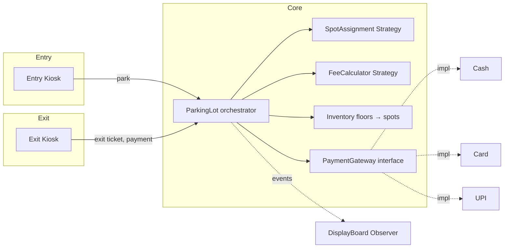
```mermaid
flowchart LR
 subgraph Entry
 E1["Entry Kiosk"]
 end
 subgraph Exit
 X1["Exit Kiosk"]
 end
 subgraph Core
 PL["ParkingLot orchestrator"]
 SA["SpotAssignment Strategy"]
 FC["FeeCalculator Strategy"]
 INV["Inventory floors → spots"]
 PAY["PaymentGateway interface"]
 end
 E1 -->|park| PL
 X1 -->|exit ticket, payment| PL
 PL --> SA
 PL --> FC
 PL --> INV
 PL --> PAY
 PAY -.->|impl| CASH["Cash"]
 PAY -.->|impl| CARD["Card"]
 PAY -.->|impl| UPI["UPI"]
 PL -.->|events| BOARD["DisplayBoard Observer"]
```

### Class diagram

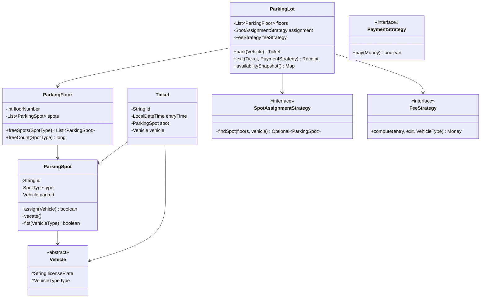
```mermaid
classDiagram
 class ParkingLot {
 -List~ParkingFloor~ floors
 -SpotAssignmentStrategy assignment
 -FeeStrategy feeStrategy
 +park(Vehicle) Ticket
 +exit(Ticket, PaymentStrategy) Receipt
 +availabilitySnapshot() Map
 }
 class ParkingFloor {
 -int floorNumber
 -List~ParkingSpot~ spots
 +freeSpots(SpotType) List~ParkingSpot~
 +freeCount(SpotType) long
 }
 class ParkingSpot {
 -String id
 -SpotType type
 -Vehicle parked
 +assign(Vehicle) boolean
 +vacate()
 +fits(VehicleType) boolean
 }
 class Vehicle {
 <<abstract>>
 #String licensePlate
 #VehicleType type
 }
 class Ticket {
 -String id
 -LocalDateTime entryTime
 -ParkingSpot spot
 -Vehicle vehicle
 }
 class SpotAssignmentStrategy {
 <<interface>>
 +findSpot(floors, vehicle) Optional~ParkingSpot~
 }
 class FeeStrategy {
 <<interface>>
 +compute(entry, exit, VehicleType) Money
 }
 class PaymentStrategy {
 <<interface>>
 +pay(Money) boolean
 }
 ParkingLot --> ParkingFloor
 ParkingLot --> SpotAssignmentStrategy
 ParkingLot --> FeeStrategy
 ParkingFloor --> ParkingSpot
 ParkingSpot --> Vehicle
 Ticket --> ParkingSpot
 Ticket --> Vehicle
```

### Key sequence - exit flow

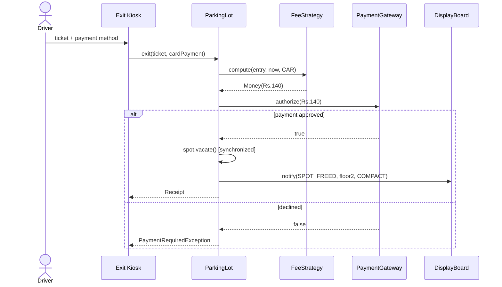
```mermaid
sequenceDiagram
 actor Driver
 participant X as Exit Kiosk
 participant PL as ParkingLot
 participant FC as FeeStrategy
 participant GW as PaymentGateway
 participant DB as DisplayBoard

 Driver->>X: ticket + payment method
 X->>PL: exit(ticket, cardPayment)
 PL->>FC: compute(entry, now, CAR)
 FC-->>PL: Money(Rs.140)
 PL->>GW: authorize(Rs.140)
 alt payment approved
 GW-->>PL: true
 PL->>PL: spot.vacate() [synchronized]
 PL->>DB: notify(SPOT_FREED, floor2, COMPACT)
 PL-->>X: Receipt
 else declined
 GW-->>PL: false
 PL-->>X: PaymentRequiredException
 end
```

### Key design decisions

1. **Spot allocation = constraint satisfaction**: assign the *smallest sufficient* spot (compact car in large spot wastes inventory). Encode `fits()` per (spot, vehicle) pair; state the rule explicitly.
2. **Money type**: never `double` - use a value object `Money(amount, Currency)` or `BigDecimal`. Rounding mode HALF_EVEN (banker's rounding) for financial calcs.
3. **Concurrency at the gate**: the race is two kiosks grabbing the last compact spot. Solutions, in increasing sophistication:
   - `synchronized` per spot (fine for single JVM).
   - DB-level: `UPDATE spots SET vehicle_id=? WHERE id=? AND vehicle_id IS NULL` → affected-rows==1 wins (optimistic, works across instances).
   - Redis `SET spot:42:lock NX PX` (distributed).
4. **Ticket as durable receipt**: include entryTime, spot id, vehicle plate - supports disputes and lost-ticket pricing.
5. **Display board via Observer**: `ParkingEvent` (SPOT_TAKEN / SPOT_FREED) → board recomputes per-floor counts. Keeps the kiosk path decoupled from UI.

### Follow-up deep-dives
- *Multi-site chain*: ParkingLot instances report to a central `AvailabilityService` (query aggregator); booking a reserved spot across sites = saga with hold-expiry (TTL on the hold).
- *EV charging*: EV spot state extends to CHARGING; billing combines parking fee + kWh consumed → **CompositeFeeStrategy**.
- *How do you find the nearest free spot in O(1)?*: per floor, per type, maintain `PriorityQueue`/`TreeSet` of free spot ids; re-heap on events.

---

## 2. Parking Lot - Code

```java
enum SpotType { BIKE, COMPACT, LARGE, EV }
enum VehicleType { BIKE, CAR, EV, TRUCK }

// ---------- Money value object (non-negotiable in interviews) ----------
record Money(BigDecimal amount, Currency currency) {
    Money {
        Objects.requireNonNull(amount);
        if (amount.signum() < 0) throw new IllegalArgumentException("negative");
    }
    static Money of(double amt, String ccy) { return new Money(BigDecimal.valueOf(amt), Currency.getInstance(ccy)); }
    Money plus(Money o) { assertSameCcy(o); return new Money(amount.add(o.amount()), currency); }
    Money times(long n) { return new Money(amount.multiply(BigDecimal.valueOf(n)), currency); }
    private void assertSameCcy(Money o){ if (!currency.equals(o.currency())) throw new IllegalArgumentException(); }
}

// ---------- Vehicle ----------
abstract class Vehicle {
    protected final String licensePlate;
    protected final VehicleType type;
    protected Vehicle(String plate, VehicleType t){ licensePlate = plate; type = t; }
    public VehicleType getType(){ return type; }
}
final class Car extends Vehicle { Car(String p){ super(p, VehicleType.CAR); } }
final class Bike extends Vehicle { Bike(String p){ super(p, VehicleType.BIKE); } }
final class EV extends Vehicle { EV(String p){ super(p, VehicleType.EV); } }

class VehicleFactory {
    static Vehicle create(String plate, VehicleType type) {
        return switch (type) {
            case CAR -> new Car(plate);
            case BIKE -> new Bike(plate);
            case EV -> new EV(plate);
            case TRUCK -> throw new UnsupportedOperationException("No trucks in this lot");
        };
    }
}

// ---------- Spot with optimistic reservation ----------
class ParkingSpot {
    private final String id;
    private final SpotType type;
    private volatile Vehicle parked; // null = free

    public boolean assign(Vehicle v) { // CAS-style reservation
        if (!fits(v.getType())) return false;
        return parked == null && PARKED.compareAndSet(this, null, v);
    }
    public void vacate(){ PARKED.set(this, null); }
    public boolean isFree(){ return parked == null; }

    public boolean fits(VehicleType vt) {
        return switch (vt) {
            case BIKE -> true; // bike fits anywhere
            case CAR -> type == SpotType.COMPACT || type == SpotType.LARGE;
            case EV -> type == SpotType.EV || type == SpotType.LARGE; // EV in large OK, no charge
            case TRUCK-> type == SpotType.LARGE;
        };
    }
    private static final AtomicReferenceFieldUpdater<ParkingSpot, Vehicle> PARKED =
        AtomicReferenceFieldUpdater.newUpdater(ParkingSpot.class, Vehicle.class, "parked");
}

// ---------- Strategies ----------
interface SpotAssignmentStrategy {
    Optional<ParkingSpot> findSpot(List<ParkingFloor> floors, Vehicle v);
}
class NearestAvailableStrategy implements SpotAssignmentStrategy {
    public Optional<ParkingSpot> findSpot(List<ParkingFloor> floors, Vehicle v) {
        return floors.stream() // floors ordered by proximity to gate
            .flatMap(f -> f.freeSpots().stream())
            .filter(s -> s.fits(v.getType()))
            .min(Comparator.comparing(s -> s.getType().ordinal())); // smallest sufficient spot
    }
}

interface FeeStrategy {
    Money compute(Instant entry, Instant exit, VehicleType type);
}
class HourlyFeeWithCap implements FeeStrategy {
    private static final Map<VehicleType, Money> RATES = Map.of(
        VehicleType.BIKE, Money.of(10, "INR"),
        VehicleType.CAR, Money.of(40, "INR"),
        VehicleType.EV, Money.of(30, "INR"));
    private static final Money DAILY_CAP = Money.of(200, "INR");
    private static final Money MINIMUM = Money.of(20, "INR");

    public Money compute(Instant entry, Instant exit, VehicleType type) {
        long minutes = Duration.between(entry, exit).toMinutes();
        long billableHours = Math.max(1, (minutes + 59) / 60); // ceil
        Money raw = RATES.get(type).times(billableHours);
        Money weekend = isWeekend(exit) ? raw.times(1).plus(Money.of(10,"INR")) : raw; // placeholder surcharge
        Money uncapped = raw.amount().compareTo(MINIMUM.amount()) < 0 ? MINIMUM : weekend;
        return uncapped.amount().compareTo(DAILY_CAP.amount()) > 0 ? DAILY_CAP : uncapped;
    }
    private boolean isWeekend(Instant i){
        return LocalDate.ofInstant(i, ZoneOffset.UTC).getDayOfWeek().getValue() >= 6;
    }
}

interface PaymentStrategy { boolean authorize(Money amount); }
class CardPayment implements PaymentStrategy {
    public boolean authorize(Money amount) { /* PSP call, tokenized card */ return true; }
}

// ---------- Events & observer ----------
record ParkingEvent(String spotId, int floor, SpotType type, EventType kind) {}
enum EventType { SPOT_TAKEN, SPOT_FREED }
interface ParkingEventListener { void onEvent(ParkingEvent e); }

class DisplayBoard implements ParkingEventListener {
    private final Map<String, AtomicLong> counts = new ConcurrentHashMap<>();
    public void onEvent(ParkingEvent e) {
        String key = e.floor() + ":" + e.type();
        counts.computeIfAbsent(key, k -> new AtomicLong())
              .addAndGet(e.kind() == EventType.SPOT_TAKEN ? -1 : +1);
    }
}

// ---------- Floor, Ticket, Receipt ----------
class ParkingFloor {
    private final int number;
    private final List<ParkingSpot> spots;
    ParkingFloor(int n, List<ParkingSpot> s){ number = n; spots = s; }
    int getNumber(){ return number; }
    Stream<ParkingSpot> freeSpots(){ return spots.stream().filter(ParkingSpot::isFree); }
    boolean contains(ParkingSpot s){ return spots.contains(s); }
}

record Ticket(String id, Vehicle vehicle, ParkingSpot spot, Instant entryTime) {}
record Receipt(String ticketId, Money fee, Instant exitTime) {}

// ---------- Orchestrator ----------
class ParkingLot {
    private final List<ParkingFloor> floors; // immutable after construction
    private final SpotAssignmentStrategy assignment;
    private final FeeStrategy feeStrategy;
    private final List<ParkingEventListener> listeners = new CopyOnWriteArrayList<>();
    private final Map<String, Ticket> activeTickets = new ConcurrentHashMap<>();

    ParkingLot(List<ParkingFloor> floors, SpotAssignmentStrategy a, FeeStrategy f){
        this.floors = List.copyOf(floors); this.assignment = a; this.feeStrategy = f;
    }

    public Ticket park(Vehicle v) {
        ParkingSpot spot = assignment.findSpot(floors, v)
            .filter(s -> s.assign(v)) // re-check under CAS
            .orElseThrow(() -> new LotFullException(v.getType()));
        Ticket t = new Ticket(UUID.randomUUID().toString(), v, spot, Instant.now());
        activeTickets.put(t.id(), t);
        emit(new ParkingEvent(spot.getId(), floorOf(spot), spot.getType(), EventType.SPOT_TAKEN));
        return t;
    }

    public Receipt exit(Ticket t, PaymentStrategy payment) {
        Instant now = Instant.now();
        Money fee = feeStrategy.compute(t.entryTime(), now, t.vehicle().getType());
        if (!payment.authorize(fee)) throw new PaymentDeclinedException(fee);
        t.spot().vacate();
        activeTickets.remove(t.id());
        emit(new ParkingEvent(t.spot().getId(), floorOf(t.spot()), t.spot().getType(), EventType.SPOT_FREED));
        return new Receipt(t.id(), fee, now);
    }

    void addListener(ParkingEventListener l){ listeners.add(l); }
    private void emit(ParkingEvent e){ listeners.forEach(l -> l.onEvent(e)); }
    private int floorOf(ParkingSpot s){ return floors.stream().filter(f -> f.contains(s)).findFirst().orElseThrow().getNumber(); }
}
class LotFullException extends RuntimeException { LotFullException(Object t){ super("No spot for " + t); } }
class PaymentDeclinedException extends RuntimeException { PaymentDeclinedException(Money m){ super("Declined: " + m); } }
```

**Key talking points**: `AtomicReferenceFieldUpdater` gives lock-free spot claiming (no synchronized on hot path); fee strategy is pure function → trivially testable; `Money` value object kills an entire class of bugs; events decouple the board without polling.

---

## 3. Logging Framework - Design

### Requirements

**Actors:** Application threads (producers), Ops/Admin (config), Log consumers (files, Kafka, dashboards).

**Functional Requirements**
- FR-1: `logger.info/warn/error(...)` with levels TRACE→FATAL; message below threshold is discarded cheaply.
- FR-2: Multiple appenders (console, rolling file, remote); each appender has its own layout + filters.
- FR-3: Async path: app thread never blocks on I/O; ordering preserved per appender.
- FR-4: Contextual data (request-id, user) travels with the record (MDC).
- FR-5: Graceful shutdown flushes queued records.

**Non-Functional Requirements**
- NFR-1: Hot-path cost near-zero when level disabled; allocation only on enabled path.
- NFR-2: Bounded memory regardless of downstream slowness (queue cap + drop policy).
- NFR-3: Throughput: 100k+ records/sec on one node (async pipeline).

**Key Edge Cases**
- Queue full → drop with counter (or block/oldest-drop per policy); never OOM.
- Exception attached → stack trace captured at call site (throwable reference), rendered by layout.
- Thread pool reuse → MDC must be snapshotted at capture, not read at write time.
- Rollover mid-write → single-writer thread makes rollover atomic for readers.
- Config reload at runtime → no restart, no lost records.

---


### Architecture

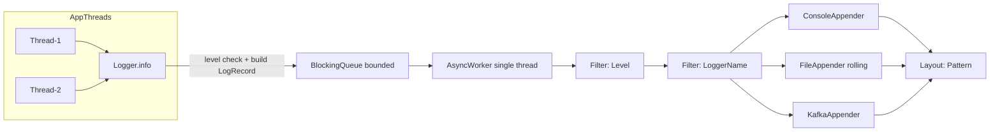
```mermaid
flowchart LR
 subgraph AppThreads
 T1["Thread-1"] --> L1["Logger.info"]
 T2["Thread-2"] --> L1
 end
 L1 -->|level check + build LogRecord| Q["BlockingQueue bounded"]
 Q --> W["AsyncWorker single thread"]
 W --> F1["Filter: Level"]
 F1 --> F2["Filter: LoggerName"]
 F2 --> A1["ConsoleAppender"]
 F2 --> A2["FileAppender rolling"]
 F2 --> A3["KafkaAppender"]
 A1 --> LY["Layout: Pattern"]
 A2 --> LY["Layout: Pattern"]
 A3 --> LY["Layout: Pattern"]
```

### Class diagram

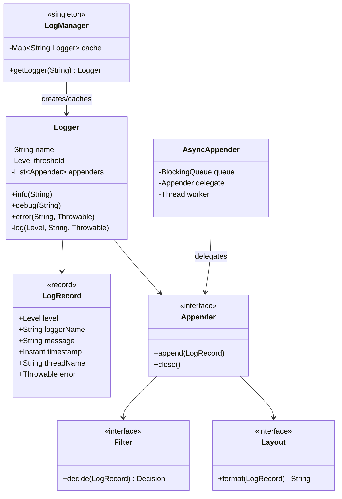
```mermaid
classDiagram
 class Logger {
 -String name
 -Level threshold
 -List~Appender~ appenders
 +info(String)
 +debug(String)
 +error(String, Throwable)
 -log(Level, String, Throwable)
 }
 class LogManager {
 <<singleton>>
 -Map~String,Logger~ cache
 +getLogger(String) Logger
 }
 class LogRecord {
 <<record>>
 +Level level
 +String loggerName
 +String message
 +Instant timestamp
 +String threadName
 +Throwable error
 }
 class Appender {
 <<interface>>
 +append(LogRecord)
 +close()
 }
 class AsyncAppender {
 -BlockingQueue queue
 -Appender delegate
 -Thread worker
 }
 class Filter {
 <<interface>>
 +decide(LogRecord) Decision
 }
 class Layout {
 <<interface>>
 +format(LogRecord) String
 }
 Logger --> LogRecord
 Logger --> Appender
 AsyncAppender --> Appender : delegates
 Appender --> Filter
 Appender --> Layout
 LogManager --> Logger : creates/caches
```

### Sequence - the async handoff (THE diagram to draw)

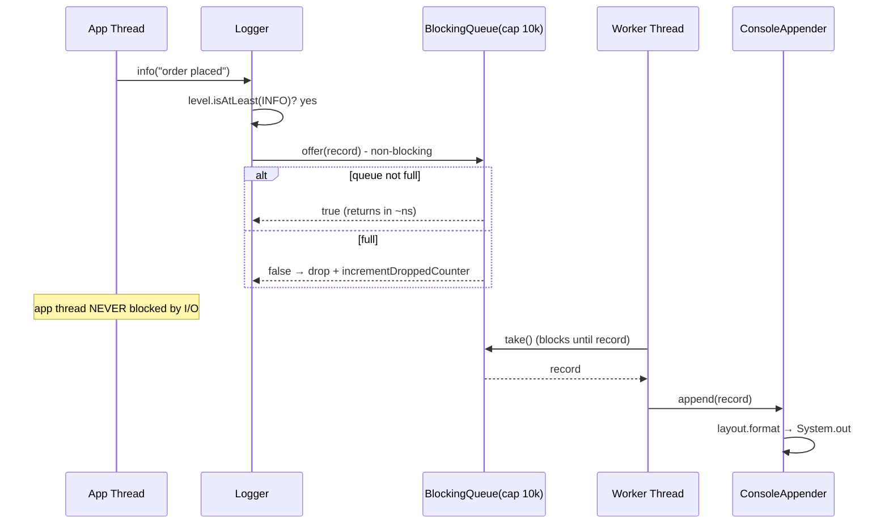
```mermaid
sequenceDiagram
 participant T as App Thread
 participant LG as Logger
 participant Q as BlockingQueue(cap 10k)
 participant W as Worker Thread
 participant C as ConsoleAppender

 T->>LG: info("order placed")
 LG->>LG: level.isAtLeast(INFO)? yes
 LG->>Q: offer(record) - non-blocking
 alt queue not full
 Q-->>LG: true (returns in ~ns)
 else full
 Q-->>LG: false → drop + incrementDroppedCounter
 end
 Note over T: app thread NEVER blocked by I/O
 W->>Q: take() (blocks until record)
 Q-->>W: record
 W->>C: append(record)
 C->>C: layout.format → System.out
```

### Key design decisions

1. **Level check BEFORE object allocation** - the hot path must allocate nothing on disabled levels. (Modern JVMs scalar-replace anyway, but the intent matters.)
2. **Immutability end-to-end**: `LogRecord` is a Java `record`; passed across the queue without defensive copies.
3. **Bounded queue + offer() = explicit backpressure policy**. Alternatives: blocking put (app stalls - dangerous), unbounded (OOM risk), drop-oldest (better for metrics than drop-newest). Know all three and their trade-offs.
4. **Appender chain ordering**: layout/filter per appender (console wants color, file wants ISO timestamps) - don't share mutable formatters across appenders.
5. **Rolling file appender**: size-based (`>100MB`) or time-based (daily); rollover must be atomic w.r.t. writers → single-writer thread guarantees this.
6. **MDC (Mapped Diagnostic Context)**: `ThreadLocal<Map<String,String>>` carrying request-id/user-id; copied into record at capture time (never read later - thread reuse!). Mentioning MDC is a strong signal.

### Follow-up deep-dives
- *How does log4j2 get 10x throughput?* - LMAX Disruptor ring buffer: lock-free, cache-line padded, single consumer; sequence counters instead of locks.
- *Exactly-once to Kafka?* - idempotent producer + transactional appender; at-least-once + dedup key (record id) otherwise.
- *Sampling*: at DEBUG in prod, sample 1/1000 via probabilistic filter to bound volume.

---

## 4. Logging Framework - Code

```java
enum Level { TRACE(0), DEBUG(1), INFO(2), WARN(3), ERROR(4), FATAL(5);
    final int priority; Level(int p){ priority = p; }
    boolean isAtLeast(Level o){ return priority >= o.priority; } }

record LogRecord(Level level, String loggerName, String message,
                 Instant timestamp, String threadName, long threadId,
                 Map<String,String> mdc, Throwable error) {
    static LogRecord capture(Level lvl, String name, String msg, Throwable t) {
        Map<String,String> mdcCopy = Map.copyOf(MDC.get()); // snapshot NOW
        Thread th = Thread.currentThread();
        return new LogRecord(lvl, name, msg, Instant.now(), th.getName(), th.threadId(), mdcCopy, t);
    }
}

// MDC - ThreadLocal diagnostic context
final class MDC {
    private static final ThreadLocal<Map<String,String>> CTX = ThreadLocal.withInitial(HashMap::new);
    static void put(String k, String v){ CTX.get().put(k, v); }
    static void clear(){ CTX.remove(); }
    static Map<String,String> get(){ return CTX.get(); }
}

// ---------- Filter chain (Chain of Responsibility) ----------
enum Decision { ACCEPT, NEUTRAL, DENY }
interface Filter { Decision decide(LogRecord r); }
class LevelFilter implements Filter {
    private final Level min;
    LevelFilter(Level min){ this.min = min; }
    public Decision decide(LogRecord r){ return r.level().isAtLeast(min) ? Decision.NEUTRAL : Decision.DENY; }
}
class ThresholdFilter implements Filter { // allows AND-composition
    private final List<Filter> chain;
    ThresholdFilter(List<Filter> chain){ this.chain = chain; }
    public Decision decide(LogRecord r) {
        for (Filter f : chain) if (f.decide(r) == Decision.DENY) return Decision.DENY;
        return Decision.NEUTRAL;
    }
}

// ---------- Layout ----------
interface Layout { String format(LogRecord r); }
class PatternLayout implements Layout {
    public String format(LogRecord r) {
        String mdc = r.mdc().isEmpty() ? "" : " " + r.mdc();
        String err = r.error() == null ? "" : "\n" + stackTrace(r.error());
        return r.timestamp() + " " + r.level() + " [" + r.threadName() + "] "
             + r.loggerName() + " - " + r.message() + mdc + err;
    }
    private String stackTrace(Throwable t){ /* StringWriter + printStackTrace */ return t.toString(); }
}

// ---------- Appenders ----------
interface Appender extends AutoCloseable {
    void append(LogRecord r);
    default void close() {}
}

class ConsoleAppender implements Appender {
    private final Layout layout;
    ConsoleAppender(Layout l){ layout = l; }
    public void append(LogRecord r){ System.out.println(layout.format(r)); }
}

class RollingFileAppender implements Appender {
    private final Layout layout;
    private final Path baseFile;
    private final long maxBytes;
    private volatile PrintWriter out;
    private final AtomicLong written = new AtomicLong();

    RollingFileAppender(Layout l, Path f, long max){ layout = l; baseFile = f; maxBytes = max; open(); }

    public void append(LogRecord r) {
        String line = layout.format(r);
        PrintWriter w = out;
        w.println(line); w.flush(); // durability vs perf: configurable
        if (written.addAndGet(line.length()) > maxBytes) rollover();
    }
    private synchronized void rollover() {
        out.close();
        Path rolled = baseFile.resolveSibling(baseFile.getFileName() + "." + Instant.now().toEpochMilli());
        try { Files.move(baseFile, rolled, StandardCopyOption.REPLACE_EXISTING); } catch (IOException ignored) {}
        written.set(0); open();
    }
    private void open(){ try { out = new PrintWriter(Files.newBufferedWriter(baseFile,
        StandardOpenOption.CREATE, StandardOpenOption.APPEND)); } catch (IOException e){ throw new UncheckedIOException(e);} }
}

// ---------- Async appender: bounded + drop policy ----------
interface OverflowPolicy { boolean onOverflow(LogRecord dropped); }
class DropNewest implements OverflowPolicy {
    private final LongAdder dropped = new LongAdder();
    public boolean onOverflow(LogRecord r){ dropped.increment(); return false; } // false = don't block
    long droppedCount(){ return dropped.sum(); }
}

class AsyncAppender implements Appender {
    private final BlockingQueue<LogRecord> queue;
    private final Appender delegate;
    private final OverflowPolicy overflow;
    private final Thread worker;
    private volatile boolean running = true;

    AsyncAppender(Appender delegate, int capacity, OverflowPolicy policy) {
        this.delegate = delegate; this.overflow = policy;
        this.queue = new LinkedBlockingQueue<>(capacity);
        this.worker = Thread.ofPlatform().daemon().name("log-worker").start(this::drain);
    }
    public void append(LogRecord r) {
        if (!queue.offer(r)) overflow.onOverflow(r); // never blocks app thread
    }
    private void drain() {
        while (running || !queue.isEmpty()) {
            try { delegate.append(queue.poll(100, TimeUnit.MILLISECONDS)); }
            catch (InterruptedException e) { Thread.currentThread().interrupt(); }
        }
        delegate.close();
    }
    public void close(){ running = false; worker.interrupt(); }
}

// ---------- Logger + Manager ----------
class Logger {
    private final String name;
    private final Level threshold;
    private final List<Appender> appenders;
    Logger(String n, Level t, List<Appender> a){ name = n; threshold = t; appenders = List.copyOf(a); }

    public boolean isInfoEnabled(){ return Level.INFO.isAtLeast(threshold); }
    public void info(String msg){ if (isInfoEnabled()) log(Level.INFO, msg, null); }
    public void error(String msg, Throwable t){ log(Level.ERROR, msg, t); }

    private void log(Level level, String msg, Throwable t) {
        if (!level.isAtLeast(threshold)) return; // cheap reject first
        LogRecord r = LogRecord.capture(level, name, msg, t); // allocate only when enabled
        for (Appender a : appenders) a.append(r);
    }
}

final class LogManager {
    private static final LogManager INSTANCE = new LogManager();
    private final ConcurrentMap<String, Logger> cache = new ConcurrentHashMap<>();
    private volatile Level rootLevel = Level.INFO;
    private volatile List<Appender> rootAppenders = defaultAppenders();

    static LogManager get(){ return INSTANCE; }
    Logger getLogger(String name) {
        return cache.computeIfAbsent(name, n -> new Logger(n, rootLevel, rootAppenders));
    }
    void setRootLevel(Level l){ this.rootLevel = l; } // affects NEW loggers;
                                                                 // existing ones need cache invalidation in production
    private static List<Appender> defaultAppenders() {
        return List.of(new AsyncAppender(
            new ConsoleAppender(new PatternLayout()), 10_000, new DropNewest()));
    }
}
```

**Key talking points**: `offer()` + drop policy = app latency isolated from disk latency; rollover synchronized but appends are not (single worker thread owns the file - no lock on hot path); `MDC` snapshot at capture (ThreadLocal unsafe across pooled threads); config reload is `volatile` swap → no restart.

---

## 5. Traffic Signal System - Design

### Requirements

**Actors:** Vehicles (implicit), Pedestrians, Traffic Authority (timing config), Emergency services (preemption).

**Functional Requirements**
- FR-1: Cycle Red→Green→Yellow→Red per direction with configurable durations; configurable rotation order.
- FR-2: **Invariant: at most one conflicting green at any instant; all-red buffer between phases.**
- FR-3: Pedestrian signals derive from vehicle phases (walk during parallel green).
- FR-4: Emergency preemption request overrides the cycle (within TTL).
- FR-5: Manual override mode for authorities.

**Non-Functional Requirements**
- NFR-1: Safety-critical correctness: the mutual-exclusion invariant must hold under any sequence of faults.
- NFR-2: Deterministic timing (real-time); recovery to a known-safe state after restart (fail-safe = all-red flashing).

**Key Edge Cases**
- Power loss mid-phase → fail-safe all-red; on reboot, resume from persisted phase or restart cycle.
- Preemption arrives during yellow → finish transition to all-red, then serve preemption (never green directly from green).
- Sensor fault (stuck "queue detected") → clamp/degrade to fixed timing; watchdog.
- Two emergency requests conflict → priority order (fire > ambulance > police) or first-expiry-first; authority decides.

---


### The safety invariants (state these FIRST - this is what separates seniors)

1. **Mutual exclusion**: at most ONE green in the junction (per conflicting movement group).
2. **Transition guard**: Green → Yellow → Red. Never Green → Red directly, never Red → Green skipping buffer.
3. **All-red clearance interval**: configurable (1-3s) between losing green and next gaining green - handles cars already in the box.
4. **Fail-safe**: on controller failure or sensor fault → all-red + blinking mode.

### State machine (the diagram interviewers want)

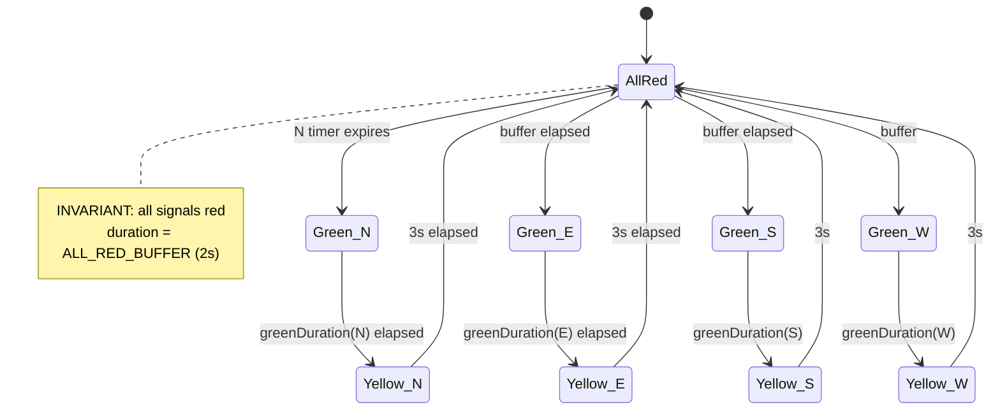
```mermaid
stateDiagram-v2
 [*] --> AllRed
 AllRed --> Green_N : N timer expires
 Green_N --> Yellow_N : greenDuration(N) elapsed
 Yellow_N --> AllRed : 3s elapsed
 AllRed --> Green_E : buffer elapsed
 Green_E --> Yellow_E : greenDuration(E) elapsed
 Yellow_E --> AllRed : 3s elapsed
 AllRed --> Green_S : buffer elapsed
 Green_S --> Yellow_S : greenDuration(S)
 Yellow_S --> AllRed : 3s
 AllRed --> Green_W : buffer
 Green_W --> Yellow_W : greenDuration(W)
 Yellow_W --> AllRed : 3s
 note right of AllRed
 INVARIANT: all signals red
 duration = ALL_RED_BUFFER (2s)
 end note
```

### Class diagram

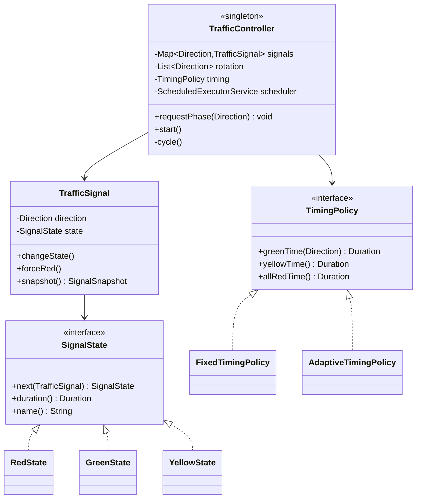
```mermaid
classDiagram
 class TrafficController {
 <<singleton>>
 -Map~Direction,TrafficSignal~ signals
 -List~Direction~ rotation
 -TimingPolicy timing
 -ScheduledExecutorService scheduler
 +requestPhase(Direction) void
 +start()
 -cycle()
 }
 class TrafficSignal {
 -Direction direction
 -SignalState state
 +changeState()
 +forceRed()
 +snapshot() SignalSnapshot
 }
 class SignalState {
 <<interface>>
 +next(TrafficSignal) SignalState
 +duration() Duration
 +name() String
 }
 class TimingPolicy {
 <<interface>>
 +greenTime(Direction) Duration
 +yellowTime() Duration
 +allRedTime() Duration
 }
 TrafficController --> TrafficSignal
 TrafficController --> TimingPolicy
 TrafficSignal --> SignalState
 SignalState <|.. RedState
 SignalState <|.. GreenState
 SignalState <|.. YellowState
 TimingPolicy <|.. FixedTimingPolicy
 TimingPolicy <|.. AdaptiveTimingPolicy
```

### Key design decisions

1. **State pattern carries duration + successor** - controller never switches on enums; adding a state (e.g., flashing-amber maintenance mode) = new class, no if-chains.
2. **Single-threaded scheduler owns all transitions** → no locks needed on state; signals expose immutable `SignalSnapshot` for read APIs (UI, traffic feed).
3. **Rotation vs demand-driven**: fixed rotation (simple) vs vehicle-actuated (loops/cameras report queue length → TimingPolicy adapts green). Model both behind `TimingPolicy`.
4. **Pedestrian signals** derive from the same phase: WALK during parallel green, clearance countdown ≥ yellow + all-red.
5. **Emergency preemption**: `PreemptionRequest` interrupts the cycle: force all-red → green the emergency corridor → resume. Implemented as a command queue checked by the scheduler before each transition.
6. **Crash recovery**: controller persists `{phase, state, elapsed}` every transition (small WAL); restart replays to resume mid-cycle.

### Follow-up deep-dives
- *Multi-junction coordination (green wave)*: a `CorridorController` offsets phase clocks of adjacent junctions along an arterial; mathematically it's a cyclic scheduling problem.
- *How to prove safety?* State the invariant and show it's enforced in exactly one place (the controller's transition function) - "single writer of truth" argument.
- *Deadlock between junctions?* Occurs when two adjacent junctions green opposing flows into a saturated link → use occupancy feedback to cap entry (like ramp metering).

---

## 6. Traffic Signal System - Code

```java
enum Direction { NORTH, SOUTH, EAST, WEST }

record SignalSnapshot(Direction direction, String stateName, Duration remaining) {}

// ---------- States (each knows successor + duration via policy) ----------
interface SignalState {
    SignalState next(TrafficSignal ctx);
    Duration duration(TimingPolicy policy, Direction d);
    String name();
}

final class RedState implements SignalState {
    public SignalState next(TrafficSignal ctx) { return new GreenState(); }
    public Duration duration(TimingPolicy p, Direction d){ return p.allRedTime(); }
    public String name(){ return "RED"; }
}
final class GreenState implements SignalState {
    public SignalState next(TrafficSignal ctx) { return new YellowState(); }
    public Duration duration(TimingPolicy p, Direction d){ return p.greenTime(d); }
    public String name(){ return "GREEN"; }
}
final class YellowState implements SignalState {
    public SignalState next(TrafficSignal ctx) { return new RedState(); }
    public Duration duration(TimingPolicy p, Direction d){ return p.yellowTime(); }
    public String name(){ return "YELLOW"; }
}

// ---------- Timing policies ----------
interface TimingPolicy {
    Duration greenTime(Direction d);
    Duration yellowTime();
    Duration allRedTime();
}
class FixedTimingPolicy implements TimingPolicy {
    public Duration greenTime(Direction d){ return Duration.ofSeconds(30); }
    public Duration yellowTime(){ return Duration.ofSeconds(3); }
    public Duration allRedTime(){ return Duration.ofSeconds(2); }
}
class AdaptiveTimingPolicy implements TimingPolicy { // sensor-driven
    private final Map<Direction, AtomicInteger> queueLengths = new EnumMap<>(Direction.class);
    public Duration greenTime(Direction d) {
        int q = queueLengths.getOrDefault(d, new AtomicInteger(5)).get();
        return Duration.ofSeconds(Math.min(60, 15 + 5L * q)); // 15s + 5s/car, cap 60
    }
    public Duration yellowTime(){ return Duration.ofSeconds(3); }
    public Duration allRedTime(){ return Duration.ofSeconds(2); }
    void reportQueue(Direction d, int vehicles){ queueLengths.computeIfAbsent(d, k -> new AtomicInteger()).set(vehicles); }
}

// ---------- Signal ----------
class TrafficSignal {
    private final Direction direction;
    private SignalState state = new RedState();
    TrafficSignal(Direction d){ direction = d; }

    synchronized void transition(TimingPolicy policy) { // only controller calls this
        state = state.next(this);
    }
    synchronized void forceRed(){ state = new RedState(); }
    synchronized SignalSnapshot snapshot(TimingPolicy policy, Instant stateEnteredAt) {
        Duration elapsed = Duration.between(stateEnteredAt, Instant.now());
        Duration remaining = state.duration(policy, direction).minus(elapsed);
        return new SignalSnapshot(direction, state.name(), remaining.isNegative() ? Duration.ZERO : remaining);
    }
    synchronized String stateName(){ return state.name(); }
    Direction getDirection(){ return direction; }
}

// ---------- Preemption ----------
record PreemptionRequest(Direction corridor, Instant expiresAt) {}
enum PreemptResult { GRANTED, QUEUED, EXPIRED }

// ---------- Controller: single writer of state ----------
class TrafficController {
    private static TrafficController instance;
    static synchronized TrafficController getInstance() {
        return instance == null ? instance = new TrafficController() : instance;
    }

    private final Map<Direction, TrafficSignal> signals = new EnumMap<>(Direction.class);
    private final List<Direction> rotation = List.of(Direction.NORTH, Direction.EAST, Direction.SOUTH, Direction.WEST);
    private final TimingPolicy policy = new FixedTimingPolicy();
    private final ScheduledExecutorService scheduler = Executors.newSingleThreadScheduledExecutor(r ->
        { Thread t = new Thread(r, "signal-controller"); t.setDaemon(true); return t; });
    private final Queue<PreemptionRequest> preemptions = new ConcurrentLinkedQueue<>();

    private int rotationIndex = 0;
    private volatile Instant stateEnteredAt = Instant.now();

    private TrafficController() {
        for (Direction d : Direction.values()) signals.put(d, new TrafficSignal(d));
    }

    public void start() {
        scheduler.submit(this::advancePhase); // boot into first green
    }

    /** The ONLY place state changes hands. Invariant enforced here. */
    private void advancePhase() {
        Direction current = rotation.get(rotationIndex);
        TrafficSignal signal = signals.get(current);

        // 1) force everyone red (fail-safe base state)
        signals.values().forEach(TrafficSignal::forceRed);

        // 2) check preemption before granting green
        PreemptionRequest pr = preemptions.peek();
        if (pr != null && pr.expiresAt().isAfter(Instant.now())) {
            current = pr.corridor();
            rotationIndex = rotation.indexOf(current);
            preemptions.poll();
        }

        // 3) green for chosen direction
        signals.get(current).transition(policy); // RED -> GREEN
        stateEnteredAt = Instant.now();
        Duration green = policy.greenTime(current);

        // schedule the rest of the phase
        scheduler.schedule(this::toYellow, green.toMillis(), MILLISECONDS);
    }

    private void toYellow() {
        Direction current = rotation.get(rotationIndex);
        signals.get(current).transition(policy); // GREEN -> YELLOW
        stateEnteredAt = Instant.now();
        scheduler.schedule(this::toRed, policy.yellowTime().toMillis(), MILLISECONDS);
    }

    private void toRed() {
        Direction current = rotation.get(rotationIndex);
        signals.get(current).transition(policy); // YELLOW -> RED
        stateEnteredAt = Instant.now();
        scheduler.schedule(this::nextRotation, policy.allRedTime().toMillis(), MILLISECONDS);
    }

    private void nextRotation() {
        rotationIndex = (rotationIndex + 1) % rotation.size();
        advancePhase();
    }

    public PreemptResult preempt(Direction corridor, Duration ttl) {
        preemptions.offer(new PreemptionRequest(corridor, Instant.now().plus(ttl)));
        return PreemptResult.QUEUED; // applied at next transition
    }

    public Map<Direction, SignalSnapshot> snapshotAll() {
        return signals.entrySet().stream().collect(Collectors.toMap(Map.Entry::getKey,
            e -> e.getValue().snapshot(policy, stateEnteredAt)));
    }
}
```

**Key talking points**: exactly one thread mutates signal states → invariant "at most one green" provable by code inspection; preemption is a *queued command* (no races with the phase clock); adaptive timing isolated behind `TimingPolicy` - swapping strategies changes no signal code.

---

## 7. Vending Machine - Design

### Requirements

**Actors:** Customer, Operator (restock, price, collect cash), (extendable) Card network.

**Functional Requirements**
- FR-1: Accept coins (accumulate balance), select item, dispense + return change; cancel refunds full balance.
- FR-2: Out of stock → selection rejected, money returned (or held per config).
- FR-3: Insufficient funds → show amount needed; stay in money-collection state.
- FR-4: Operator restocks and prices items; machine reports sold-out state.
- FR-5: (Extended) Exact-change-only mode: reject selections the machine cannot make change for.

**Non-Functional Requirements**
- NFR-1: Every money movement is exact (integer cents or BigDecimal); inventory decrement atomic.
- NFR-2: Illegal operations in a state must be impossible by construction (not error-handled at runtime).

**Key Edge Cases**
- Race: last item taken between selection and dispense → refund and abort.
- Power loss mid-transaction → on restart, refund balance or complete pending dispense per persisted state.
- Coin jam / invalid coin → rejected at insertion, not counted.
- Machine has balance but all items sold out → refund path.

---


### Full lifecycle state diagram

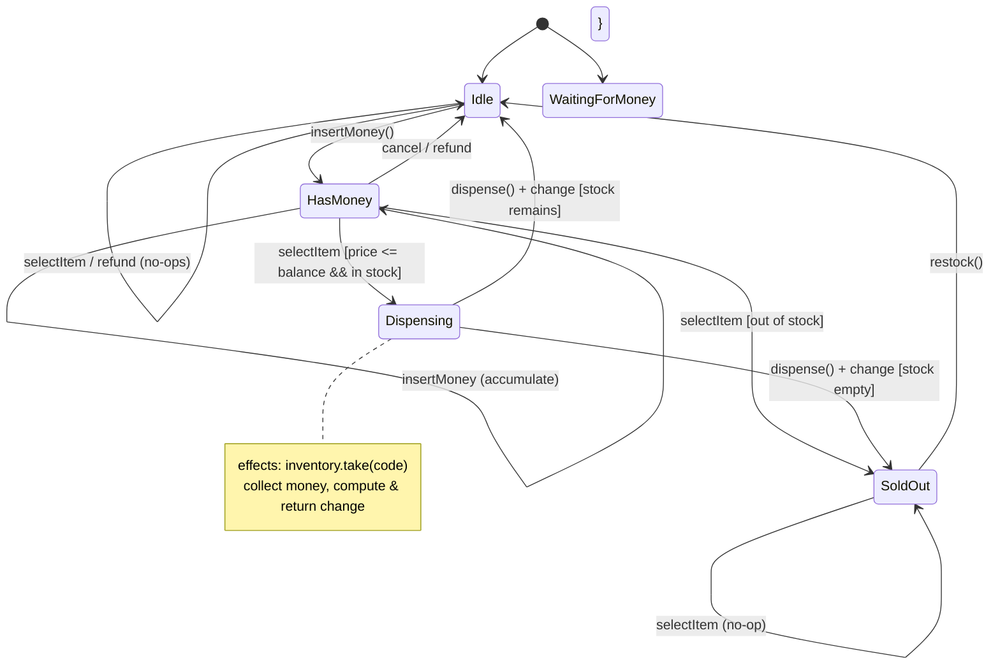
```mermaid
stateDiagram-v2
 [*] --> Idle
 Idle --> HasMoney : insertMoney()
 Idle --> Idle : selectItem / refund (no-ops)

 HasMoney --> HasMoney : insertMoney (accumulate)
 HasMoney --> Dispensing : selectItem [price <= balance && in stock]
 HasMoney --> SoldOut : selectItem [out of stock]
 HasMoney --> Idle : cancel / refund

 Dispensing --> Idle : dispense() + change [stock remains]
 Dispensing --> SoldOut : dispense() + change [stock empty]
 note right of Dispensing
 effects: inventory.take(code)
 collect money, compute & return change
 end note

 SoldOut --> Idle : restock()
 SoldOut --> SoldOut : selectItem (no-op)

 state Idle (
 [*] --> WaitingForMoney
 }
```

### Sequence - successful purchase with change

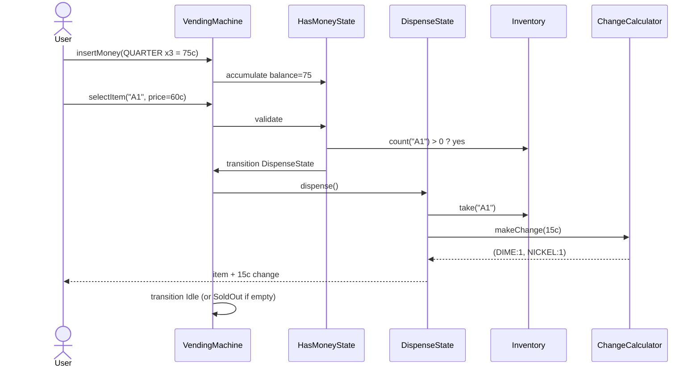
```mermaid
sequenceDiagram
 actor U as User
 participant VM as VendingMachine
 participant S as HasMoneyState
 participant D as DispenseState
 participant INV as Inventory
 participant CH as ChangeCalculator

 U->>VM: insertMoney(QUARTER x3 = 75c)
 VM->>S: accumulate balance=75
 U->>VM: selectItem("A1", price=60c)
 VM->>S: validate
 S->>INV: count("A1") > 0 ? yes
 S->>VM: transition DispenseState
 VM->>D: dispense()
 D->>INV: take("A1")
 D->>CH: makeChange(15c)
 CH-->>D: (DIME:1, NICKEL:1)
 D-->>U: item + 15c change
 VM->>VM: transition Idle (or SoldOut if empty)
```

### Class diagram

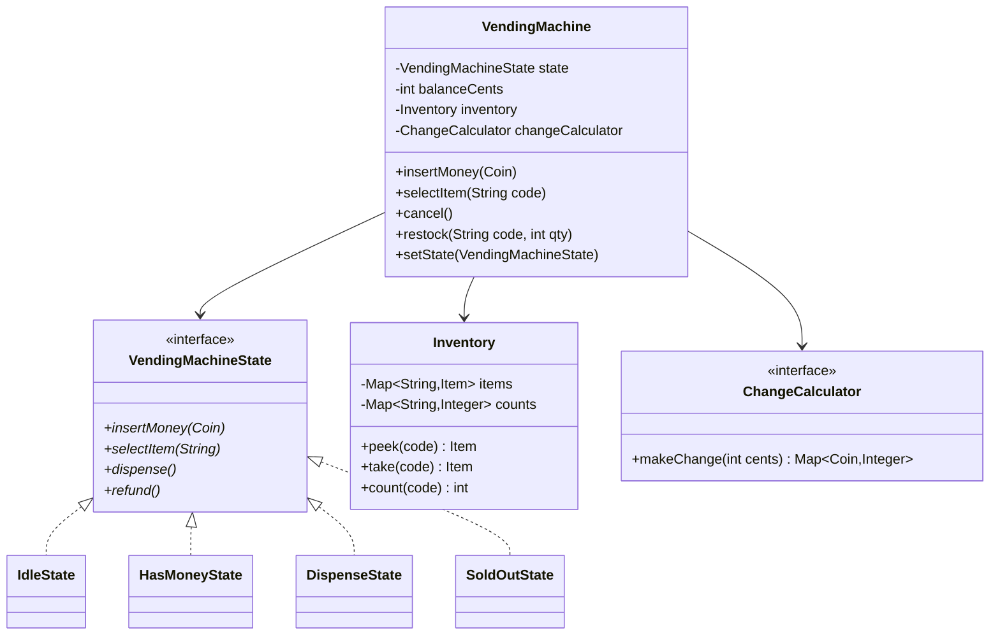
```mermaid
classDiagram
 class VendingMachine {
 -VendingMachineState state
 -int balanceCents
 -Inventory inventory
 -ChangeCalculator changeCalculator
 +insertMoney(Coin)
 +selectItem(String code)
 +cancel()
 +restock(String code, int qty)
 +setState(VendingMachineState)
 }
 class VendingMachineState {
 <<interface>>
 +insertMoney(Coin)*
 +selectItem(String)*
 +dispense()*
 +refund()*
 }
 class Inventory {
 -Map~String,Item~ items
 -Map~String,Integer~ counts
 +peek(code) Item
 +take(code) Item
 +count(code) int
 }
 class ChangeCalculator {
 <<interface>>
 +makeChange(int cents) Map~Coin,Integer~
 }
 VendingMachine --> VendingMachineState
 VendingMachine --> Inventory
 VendingMachine --> ChangeCalculator
 VendingMachineState <|.. IdleState
 VendingMachineState <|.. HasMoneyState
 VendingMachineState <|.. DispenseState
 VendingMachineState <|.. SoldOutState
```

### Key design decisions

1. **State pattern with default no-ops on the interface** = illegal operations are structurally impossible, not runtime-checked. Say this sentence in the interview.
2. **Money as `int` cents** is acceptable for USD-like currencies (no fractions of a cent); otherwise use BigDecimal. Know both.
3. **Change-making**: greedy is optimal for canonical denominations (US coins: 1,5,10,25). For arbitrary denominations → DP (coin change) - mention both, implement greedy.
4. **Exact-change-only mode**: machine tracks its own float (coins inside). If it can't make change for the expected purchase, it should *reject selection early* (else you dispense and can't refund - a real-world failure). Model `canMakeChange(amount)` check in `HasMoneyState`.
5. **Idempotency of `dispense()`**: in a real machine, dispense is mechanical and can fail mid-way (jam). Production design: transaction log (`WAL`) - state + balance + inventory persisted each transition; recovery replays or compensates.
6. **Card payment extension**: `PaymentMethod` interface (Cash / Card); card path skips balance accumulation and change entirely - the state machine gets a `CardInsertedState`. Showing this seam = extensibility points.

---

## 8. Vending Machine - Code

```java
enum Coin { PENNY(1), NICKEL(5), DIME(10), QUARTER(25);
    final int cents; Coin(int c){ cents = c; } }

record Item(String sku, String name, int priceCents) {}

// ---------- Change calculator (greedy, with DP fallback discussion) ----------
interface ChangeCalculator { Map<Coin,Integer> makeChange(int cents); }
class GreedyChangeCalculator implements ChangeCalculator {
    public Map<Coin,Integer> makeChange(int cents) {
        Map<Coin,Integer> out = new LinkedHashMap<>();
        for (Coin c : List.of(Coin.QUARTER, Coin.DIME, Coin.NICKEL, Coin.PENNY)) {
            int n = cents / c.cents;
            if (n > 0) { out.put(c, n); cents -= n * c.cents; }
        }
        if (cents != 0) throw new IllegalStateException("Cannot make change for residual " + cents);
        return out;
    }
}

// ---------- Inventory with concurrency-safe decrement ----------
class Inventory {
    private record Slot(Item item, AtomicInteger count) {}
    private final Map<String, Slot> slots = new ConcurrentHashMap<>();

    void load(Item item, int qty){ slots.put(item.sku(), new Slot(item, new AtomicInteger(qty))); }
    Item peek(String code){ Slot s = slots.get(code); return s == null ? null : s.item(); }
    int count(String code){ Slot s = slots.get(code); return s == null ? 0 : s.count().get(); }

    /** Atomic take: decrement only if stock > 0. Returns null if raced out of stock. */
    Item take(String code) {
        Slot s = slots.get(code);
        if (s == null) return null;
        while (true) {
            int cur = s.count().get();
            if (cur <= 0) return null;
            if (s.count().compareAndSet(cur, cur - 1)) return s.item();
        }
    }
    boolean isEmpty(){ return slots.values().stream().allMatch(s -> s.count().get() == 0); }
}

// ---------- Context ----------
class VendingMachine {
    private VendingMachineState state;
    private int balanceCents;
    private final Inventory inventory = new Inventory();
    private final ChangeCalculator changeCalculator = new GreedyChangeCalculator();

    VendingMachine(){ this.state = new IdleState(this); }

    // guarded accessors - states never touch fields directly
    synchronized void setState(VendingMachineState s){ this.state = s; onTransition(); }
    synchronized void addMoney(int cents){ balanceCents += cents; }
    synchronized int balance(){ return balanceCents; }
    synchronized int collect(){ int b = balanceCents; balanceCents = 0; return b; }
    Inventory inventory(){ return inventory; }
    ChangeCalculator change(){ return changeCalculator; }

    // durability hook (WAL) - mention in interview
    private void onTransition(){ /* persist {state, balance, inventoryDigest} */ }

    // public API delegates to current state
    public void insertMoney(Coin c) { state.insertMoney(c); }
    public void selectItem(String sku){ state.selectItem(sku); }
    public void cancel() { state.refund(); }
    public void restock(String sku, int qty) {
        Item existing = inventory.peek(sku);
        if (existing == null) throw new NoSuchElementException("Unknown SKU " + sku);
        inventory.load(existing, qty);
        if (state instanceof SoldOutState) setState(new IdleState(this));
    }
}

// ---------- States ----------
interface VendingMachineState {
    default void insertMoney(Coin c) { invalid("insert money"); }
    default void selectItem(String sku) { invalid("select item"); }
    default void dispense() { invalid("dispense"); }
    default void refund() { /* no money held - silent */ }
    private void invalid(String a){ throw new IllegalStateException("Cannot " + a + " in state " + getClass().getSimpleName()); }
}

final class IdleState implements VendingMachineState {
    private final VendingMachine vm;
    IdleState(VendingMachine vm){ this.vm = vm; }
    public void insertMoney(Coin c) {
        vm.addMoney(c.cents);
        vm.setState(new HasMoneyState(vm));
    }
}

final class HasMoneyState implements VendingMachineState {
    private final VendingMachine vm;
    HasMoneyState(VendingMachine vm){ this.vm = vm; }

    public void insertMoney(Coin c) { vm.addMoney(c.cents); }

    public void selectItem(String sku) {
        Item item = vm.inventory().peek(sku);
        if (item == null) { System.out.println("Unknown item " + sku); return; }

        if (vm.inventory().count(sku) == 0) {
            System.out.println("Sold out: " + item.name());
            vm.setState(new SoldOutState(vm));
            return;
        }
        int balance = vm.balance();
        if (balance < item.priceCents()) {
            System.out.printf("Need %d more cents%n", item.priceCents() - balance);
            return; // stay in HasMoneyState
        }
        int changeDue = balance - item.priceCents();
        vm.setState(new DispenseState(vm, sku, changeDue));
    }

    public void refund() {
        System.out.println("Refunding " + vm.collect() + " cents");
        vm.setState(new IdleState(vm));
    }
}

final class DispenseState implements VendingMachineState {
    private final VendingMachine vm; private final String sku; private final int changeDue;
    DispenseState(VendingMachine vm, String sku, int changeDue){
        this.vm = vm; this.sku = sku; this.changeDue = changeDue;
    }
    public void dispense() {
        Item item = vm.inventory().take(sku); // atomic decrement
        if (item == null) { // lost race - refund and bail
            System.out.println("Race: item just ran out. Refunding " + vm.collect());
            vm.setState(new IdleState(vm));
            return;
        }
        vm.collect(); // consume payment
        if (changeDue > 0) System.out.println("Change: " + vm.change().makeChange(changeDue));
        System.out.println("Dispensed: " + item.name());
        vm.setState(vm.inventory().isEmpty() ? new SoldOutState(vm) : new IdleState(vm));
    }
}

final class SoldOutState implements VendingMachineState {
    private final VendingMachine vm;
    SoldOutState(VendingMachine vm){ this.vm = vm; }
    public void insertMoney(Coin c){ System.out.println("Sold out - coins returned");
                                     /* don't even accumulate */ }
    public void refund(){ System.out.println("Returning " + vm.collect() + " cents"); }
}
```

**Key talking points**: `Inventory.take` is CAS-based → selection flow and restock can run concurrently without locks; `DispenseState` handles the race where stock hits zero between `selectItem` and `dispense` (defensive design unprompted); state transition hook doubles as a WAL persistence point.

---

## 9. Task Management System - Design

### Requirements

**Actors:** User (creator/assignee/viewer), Admin (permissions), System (scheduler, notifications).

**Functional Requirements**
- FR-1: CRUD tasks with title, description, priority, due date, assignee.
- FR-2: Lifecycle: TODO→IN_PROGRESS→(BLOCKED↔IN_PROGRESS)→DONE; CANCELLED from any pre-done state.
- FR-3: Subtasks; parent cannot complete until all subtasks done.
- FR-4: Search/filter by status, assignee, due date, priority - composable.
- FR-5: Notifications on assignment and approaching due date.

**Non-Functional Requirements**
- NFR-1: Concurrent edits never silently overwrite (optimistic concurrency).
- NFR-2: Filters composable without changing service code (open/closed).
- NFR-3: Audit trail of who changed what, when (extendable).

**Key Edge Cases**
- Two users edit simultaneously → conflict error to the second; merge/retry UX.
- Completing parent with open subtasks → rejected with reason.
- Reassign mid-notification → no stale emails (events carry snapshot).
- Overdue recurring task → next instance spawned from due date, not completion date.

---


### Domain model (DDD-flavored - mention "aggregate root" in the interview)

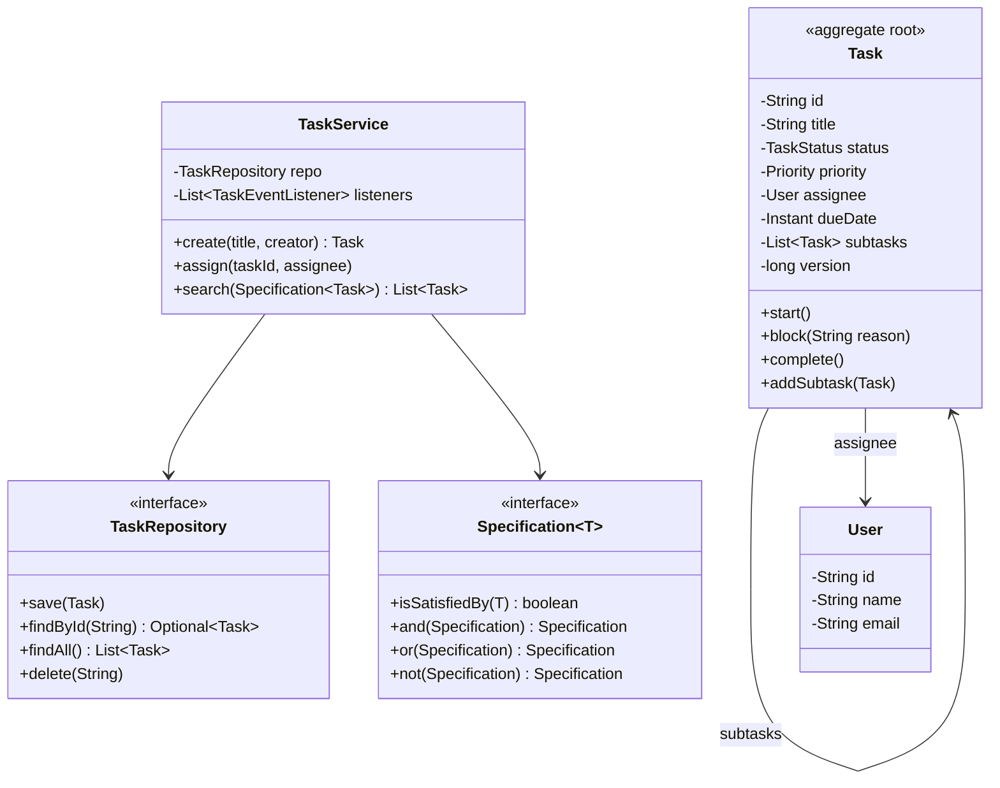
```mermaid
classDiagram
 class Task {
 <<aggregate root>>
 -String id
 -String title
 -TaskStatus status
 -Priority priority
 -User assignee
 -Instant dueDate
 -List~Task~ subtasks
 -long version
 +start()
 +block(String reason)
 +complete()
 +addSubtask(Task)
 }
 class User {
 -String id
 -String name
 -String email
 }
 class TaskRepository {
 <<interface>>
 +save(Task)
 +findById(String) Optional~Task~
 +findAll() List~Task~
 +delete(String)
 }
 class TaskService {
 -TaskRepository repo
 -List~TaskEventListener~ listeners
 +create(title, creator) Task
 +assign(taskId, assignee)
 +search(Specification~Task~) List~Task~
 }
 class Specification~T~ {
 <<interface>>
 +isSatisfiedBy(T) boolean
 +and(Specification) Specification
 +or(Specification) Specification
 +not(Specification) Specification
 }
 TaskService --> TaskRepository
 TaskService --> Specification~Task~
 Task --> Task : subtasks
 Task --> User : assignee
```

### Task lifecycle

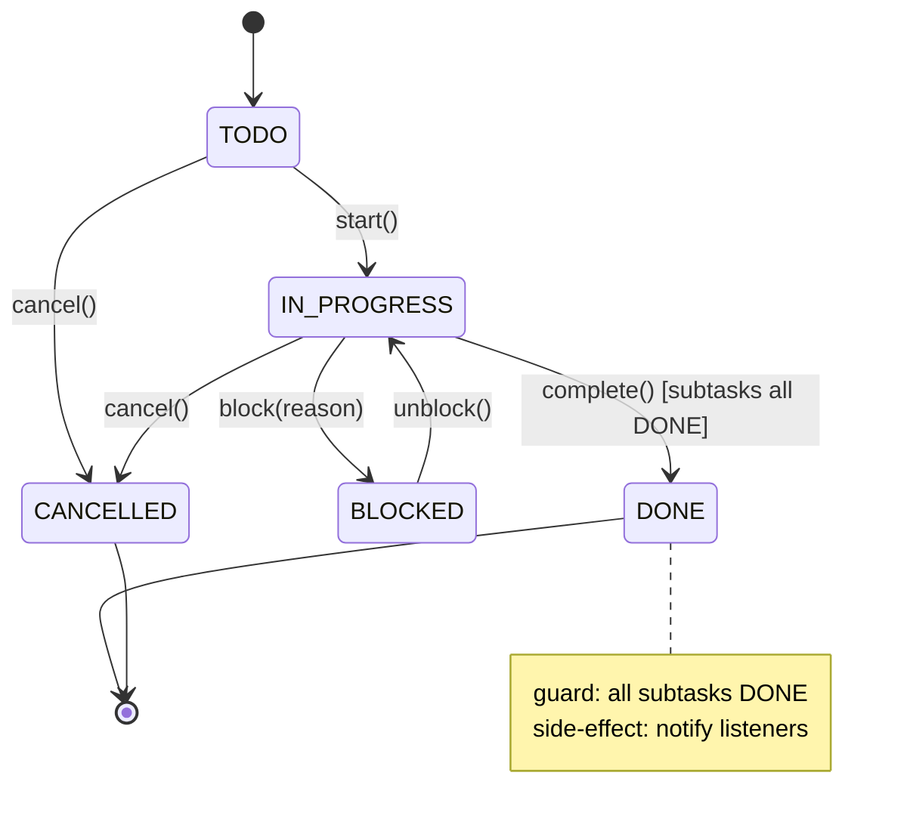
```mermaid
stateDiagram-v2
 [*] --> TODO
 TODO --> IN_PROGRESS : start()
 TODO --> CANCELLED : cancel()
 IN_PROGRESS --> BLOCKED : block(reason)
 BLOCKED --> IN_PROGRESS : unblock()
 IN_PROGRESS --> DONE : complete() [subtasks all DONE]
 IN_PROGRESS --> CANCELLED : cancel()
 DONE --> [*]
 CANCELLED --> [*]
 note right of DONE
 guard: all subtasks DONE
 side-effect: notify listeners
 end note
```

### Sequence - assignment with notification

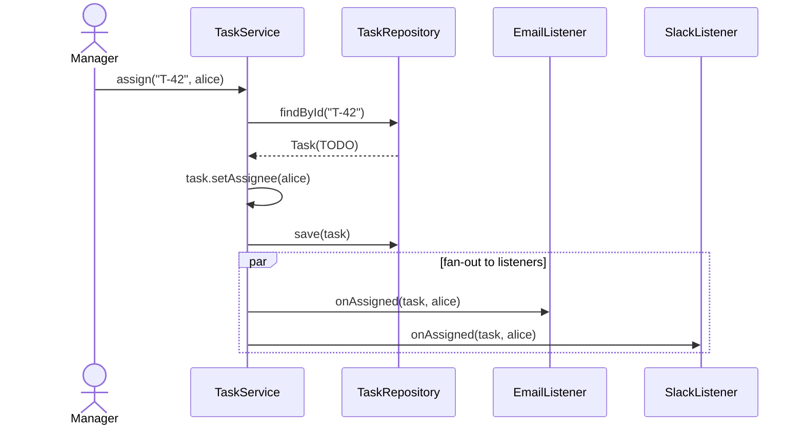
```mermaid
sequenceDiagram
 actor M as Manager
 participant S as TaskService
 participant R as TaskRepository
 participant EM as EmailListener
 participant SL as SlackListener

 M->>S: assign("T-42", alice)
 S->>R: findById("T-42")
 R-->>S: Task(TODO)
 S->>S: task.setAssignee(alice)
 S->>R: save(task)
 par fan-out to listeners
 S->>EM: onAssigned(task, alice)
 S->>SL: onAssigned(task, alice)
 end
```

### Key design decisions

1. **Aggregate root + closure rule**: subtasks are reachable only via parent; complete() guards on subtasks - invariants live inside the aggregate, not the service ("domain model rich, application layer thin").
2. **Optimistic concurrency**: `long version` on Task; `save` does `UPDATE ... WHERE id=? AND version=?` (or CAS in-memory). Two editors → one wins, loser gets conflict exception → retry or merge UI. Mention: never trust "last write wins" silently for task tools.
3. **Specification pattern**: filter logic is composable AND/OR/NOT without a god-method `search(status, assignee, dueBefore, priority, text...)`.
4. **Events, not direct calls**: listeners = Email/Slack/Analytics. New channel = new listener, zero changes to service. Event carries snapshot of task at change time (immutable).
5. **Domain events vs integration events**: in-process listeners (this design) vs outbox pattern + message broker (production). Naming this distinction = senior signal.
6. **Due-date scheduling**: a `DueDateScheduler` polls/uses `ScheduledExecutorService` per task or a min-heap by due date; fires REMINDER events.

---

## 10. Task Management System - Code

```java
enum TaskStatus { TODO, IN_PROGRESS, BLOCKED, DONE, CANCELLED }
enum Priority { LOW, MEDIUM, HIGH, URGENT }

// ---------- Specification ----------
interface Specification<T> {
    boolean isSatisfiedBy(T t);
    default Specification<T> and(Specification<T> o){ return x -> this.isSatisfiedBy(x) && o.isSatisfiedBy(x); }
    default Specification<T> or(Specification<T> o) { return x -> this.isSatisfiedBy(x) || o.isSatisfiedBy(x); }
    static <T> Specification<T> not(Specification<T> s){ return x -> !s.isSatisfiedBy(x); }
}
class StatusSpec implements Specification<Task> {
    private final TaskStatus s; StatusSpec(TaskStatus s){ this.s = s; }
    public boolean isSatisfiedBy(Task t){ return t.status() == s; }
}
class AssigneeSpec implements Specification<Task> {
    private final User u; AssigneeSpec(User u){ this.u = u; }
    public boolean isSatisfiedBy(Task t){ return t.assignee().map(a -> a.id().equals(u.id())).orElse(false); }
}
class OverdueSpec implements Specification<Task> {
    private final Clock clock; OverdueSpec(Clock c){ clock = c; }
    public boolean isSatisfiedBy(Task t){
        return t.dueDate().map(d -> d.isBefore(Instant.now(clock))).orElse(false)
            && t.status() != TaskStatus.DONE && t.status() != TaskStatus.CANCELLED;
    }
}

// ---------- Aggregate ----------
class Task {
    private final String id;
    private String title;
    private TaskStatus status = TaskStatus.TODO;
    private Priority priority = Priority.MEDIUM;
    private User assignee;
    private Instant dueDate;
    private final List<Task> subtasks = new ArrayList<>();
    private long version; // optimistic locking

    Task(String id, String title){ this.id = id; this.title = title; }
    public String id(){ return id; }
    public TaskStatus status(){ return status; }
    public Optional<User> assignee(){ return Optional.ofNullable(assignee); }
    public Optional<Instant> dueDate(){ return Optional.ofNullable(dueDate); }
    public long version(){ return version; }

    public void setAssignee(User u){ this.assignee = u; }
    public void setPriority(Priority p){ this.priority = p; }
    public void setDueDate(Instant d){ this.dueDate = d; }

    public void addSubtask(Task t){ if (t == this) throw new IllegalArgumentException("cycle");
                                    subtasks.add(t); }

    public void start() {
        if (status != TaskStatus.TODO && status != TaskStatus.BLOCKED)
            throw new IllegalStateException("Cannot start from " + status);
        status = TaskStatus.IN_PROGRESS;
    }
    public void complete() {
        if (status != TaskStatus.IN_PROGRESS) throw new IllegalStateException("Must be IN_PROGRESS");
        if (!subtasks.stream().allMatch(s -> s.status() == TaskStatus.DONE))
            throw new IllegalStateException("Subtasks incomplete");
        status = TaskStatus.DONE;
    }
    void bumpVersion(){ version++; }
}

// ---------- Domain events ----------
record TaskAssignedEvent(String taskId, String assigneeId, Instant at) {}
interface TaskEventListener { void onTaskAssigned(TaskAssignedEvent e); }

// ---------- Repository (with optimistic save) ----------
interface TaskRepository {
    Optional<Task> findById(String id);
    List<Task> findAll();
    /** @throws OptimisticLockException if version mismatch */
    void save(Task t);
    void delete(String id);
}
class OptimisticLockException extends RuntimeException {}

class InMemoryTaskRepository implements TaskRepository {
    private final Map<String, long[]> store = new ConcurrentHashMap<>(); // id -> [version]
    private final Map<String, Task> tasks = new ConcurrentHashMap<>();
    public Optional<Task> findById(String id){ return Optional.ofNullable(tasks.get(id)); }
    public List<Task> findAll(){ return List.copyOf(tasks.values()); }
    public void save(Task t) {
        tasks.compute(t.id(), (id, existing) -> {
            if (existing != null) {
                long[] v = store.get(id);
                if (v[0] != t.version()) throw new OptimisticLockException();
                v[0]++; t.bumpVersion();
            } else {
                store.put(id, new long[]{1}); t.bumpVersion();
            }
            return t;
        });
    }
    public void delete(String id){ tasks.remove(id); store.remove(id); }
}

// ---------- Service ----------
class TaskService {
    private final TaskRepository repo;
    private final List<TaskEventListener> listeners = new CopyOnWriteArrayList<>();
    TaskService(TaskRepository r){ repo = r; }

    public Task create(String title, User creator) {
        Task t = new Task(UUID.randomUUID().toString(), title);
        repo.save(t);
        return t;
    }

    public void assign(String taskId, User assignee) {
        Task t = repo.findById(taskId).orElseThrow();
        t.setAssignee(assignee);
        repo.save(t); // may throw OptimisticLockException
        var evt = new TaskAssignedEvent(t.id(), assignee.id(), Instant.now());
        listeners.forEach(l -> l.onTaskAssigned(evt)); // fan-out AFTER commit
    }

    public List<Task> search(Specification<Task> spec) {
        return repo.findAll().stream().filter(spec::isSatisfiedBy).toList();
    }

    // convenience composite: overdue AND not assigned to me
    public List<Task> myOverdueTasks(User me, Clock clock) {
        return search(new OverdueSpec(clock).and(Specification.not(new AssigneeSpec(me))));
    }

    public void addListener(TaskEventListener l){ listeners.add(l); }
}
```

**Key talking points**: Specification combinators make the filter layer closed for extension; optimistic locking via version check inside `save` - conflict surface is explicit; listeners fire after save (commit) - never before (event-before-commit = phantom notifications if save fails).

---

# PART 2

---

## 11. PubSub System - Design

### Requirements

**Actors:** Producers, Consumers (in groups), Platform Admin (topics, retention, ACLs).

**Functional Requirements**
- FR-1: Create topic with N partitions; publish keyed/unkeyed messages; append-only ordered log per partition.
- FR-2: Consumers pull from assigned partitions using durable offsets; replay supported.
- FR-3: Consumer groups: each partition consumed by exactly one member per group; rebalance on membership change.
- FR-4: Retention window; expired segments deleted.
- FR-5: Delivery semantics configurable: at-most / at-least / effectively-once.

**Non-Functional Requirements**
- NFR-1: Ordering guaranteed within a partition; throughput scales with partitions.
- NFR-2: Producer never blocks unboundedly (bounded buffer + retry policy).
- NFR-3: Consumer lag observable; slow consumer must not affect others.

**Key Edge Cases**
- Poison message → retries + backoff → DLQ after N attempts.
- Consumer dies mid-batch → at-least-once redelivery → consumer must be idempotent.
- All consumers in a group die → partitions idle, offsets retained, resume on restart.
- Key skew (one hot key) → single hot partition; mitigation: salting (mention).

---


### Architecture (Kafka-flavored)

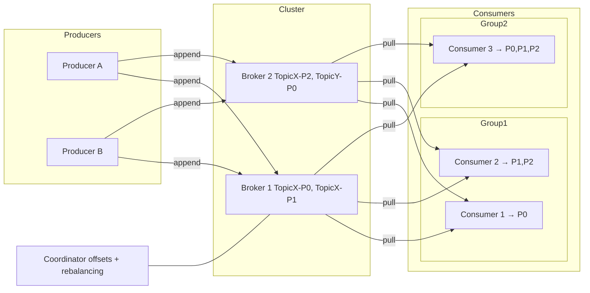
```mermaid
flowchart LR
 subgraph Producers
 P1["Producer A"]
 P2["Producer B"]
 end
 subgraph Cluster
 B1["Broker 1 TopicX-P0, TopicX-P1"] 
 B2["Broker 2 TopicX-P2, TopicY-P0"]
 end
 subgraph Consumers
 subgraph Group1
 C1["Consumer 1 → P0"]
 C2["Consumer 2 → P1,P2"]
 end
 subgraph Group2
 C3["Consumer 3 → P0,P1,P2"]
 end
 end
 P1 -->|append| B1
 P1 -->|append| B2
 P2 -->|append| B1
 P2 -->|append| B2
 B1 -->|pull| C1
 B1 -->|pull| C2
 B2 -->|pull| C1
 B2 -->|pull| C2
 B1 -->|pull| C3
 B2 -->|pull| C3
 CO["Coordinator offsets + rebalancing"] --- B1
```

### Sequence - produce → replicate acks → consume → commit

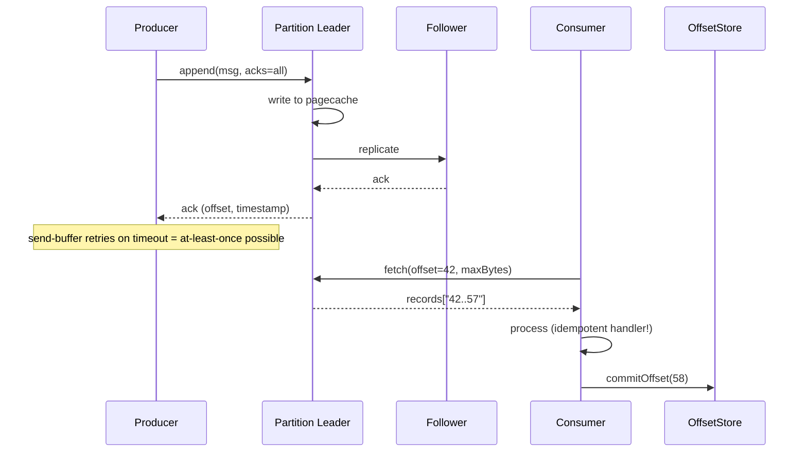
```mermaid
sequenceDiagram
 participant P as Producer
 participant L as Partition Leader
 participant F as Follower
 participant C as Consumer
 participant O as OffsetStore

 P->>L: append(msg, acks=all)
 L->>L: write to pagecache
 L->>F: replicate
 F-->>L: ack
 L-->>P: ack (offset, timestamp)
 Note over P: send-buffer retries on timeout = at-least-once possible
 C->>L: fetch(offset=42, maxBytes)
 L-->>C: records["42..57"]
 C->>C: process (idempotent handler!)
 C->>O: commitOffset(58)
```

### Delivery semantics table (memorize)

| Semantic | Mechanism | Loses? | Dupes? | Cost |
|---|---|---|---|---|
| At-most-once | fire & forget, commit offset BEFORE processing | ✅ can lose | none | cheapest |
| At-least-once | retry until ack, commit AFTER processing | none | ✅ possible | cheap |
| Exactly-once | idempotent producer (PID+seq) + transactions; consumer dedup | none | none (effectively) | expensive |

### Class diagram (interview scope: in-memory)

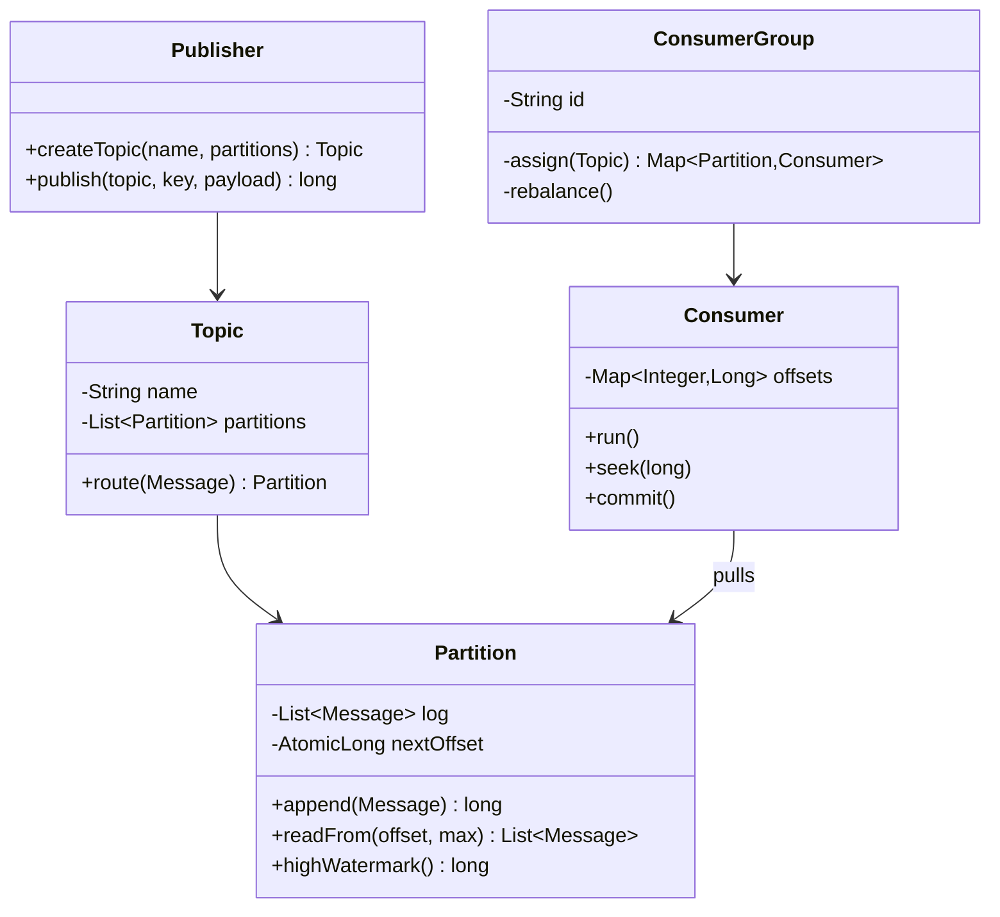
```mermaid
classDiagram
 class Publisher {
 +createTopic(name, partitions) Topic
 +publish(topic, key, payload) long
 }
 class Topic {
 -String name
 -List~Partition~ partitions
 +route(Message) Partition
 }
 class Partition {
 -List~Message~ log
 -AtomicLong nextOffset
 +append(Message) long
 +readFrom(offset, max) List~Message~
 +highWatermark() long
 }
 class Consumer {
 -Map~Integer,Long~ offsets
 +run()
 +seek(long)
 +commit()
 }
 class ConsumerGroup {
 -String id
 -assign(Topic) Map~Partition,Consumer~
 -rebalance()
 }
 Publisher --> Topic
 Topic --> Partition
 ConsumerGroup --> Consumer
 Consumer --> Partition : pulls
```

### Key design decisions

1. **Pull vs Push** (guaranteed question): **Pull** (Kafka) - consumer controls rate, enables batching & replay, natural backpressure (lag = debt). **Push** (classic broker) - low latency, but broker must handle slow consumers (need, queue per consumer, flow control). Know both; defend pull for throughput systems.
2. **Partition = unit of ordering + parallelism**: per-key routing gives key-ordered streams; max consumer parallelism per group = partition count.
3. **Offsets are the cursor of truth**: replay = reset offset; DLQ = a separate topic + redirect after N retries.
4. **Log retention** decouples consumers' speeds: slow consumer just reads older segments; retention bounds disk.
5. **Consumer group rebalancing**: on join/leave/fail, coordinator reassigns partitions (eager = stop-the-world; cooperative = incremental). Mention the word "rebalance storm".
6. **Single-writer per partition** appends → ordering for free; `ConcurrentHashMap<Topic, Partition[]>` in-memory.

---

## 12. PubSub System - Code

```java
record Message(String id, String key, byte[] payload, Instant timestamp) {
    static Message of(String key, byte[] p){
        return new Message(UUID.randomUUID().toString(), key, p, Instant.now()); }
}

// ---------- Partition: single-writer append log ----------
class Partition {
    private final List<Message> log = new ArrayList<>(); // single writer thread
    private final AtomicLong nextOffset = new AtomicLong();
    private volatile long committedWatermark; // for followers/acks demo

    synchronized long append(Message m) {
        log.add(m);
        return nextOffset.getAndIncrement();
    }
    synchronized List<Message> readFrom(long offset, int max) {
        if (offset >= log.size()) return List.of();
        return List.copyOf(log.subList((int) offset, Math.min(log.size(), (int) offset + max)));
    }
    synchronized long highWatermark(){ return nextOffset.get(); }
}

// ---------- Topic with key routing ----------
class Topic {
    private final String name;
    private final List<Partition> partitions;
    Topic(String name, int n) {
        this.name = name;
        this.partitions = IntStream.range(0, n).mapToObj(i -> new Partition()).toList();
    }
    Partition route(Message m) {
        int idx = (m.key() == null)
            ? ThreadLocalRandom.current().nextInt(partitions.size())
            : Math.floorMod(m.key().hashCode(), partitions.size());
        return partitions.get(idx);
    }
    List<Partition> partitions(){ return partitions; }
}

// ---------- Publisher with ack level ----------
enum Acks { NONE, LEADER, ALL }

class Publisher {
    private final Map<String, Topic> topics = new ConcurrentHashMap<>();
    Topic createTopic(String name, int partitions){ 
        return topics.compute(name, (k, v) -> v != null ? v : new Topic(name, partitions)); }
    long publish(String topicName, Message m, Acks acks) {
        Topic t = topics.get(topicName);
        if (t == null) throw new NoSuchElementException(topicName);
        long offset = t.route(m).append(m); // single-writer per partition
        // acks simulation: NONE → return immediately; ALL → would wait for follower acks
        return offset;
    }
}

// ---------- Consumer: pull loop with manual offset + idempotent handler ----------
interface MessageHandler { void onMessage(Message m); }

class Consumer implements Runnable {
    private final Topic topic;
    private final MessageHandler handler;
    private final Map<Integer, Long> offsets = new ConcurrentHashMap<>();
    private final Set<String> processedIds = ConcurrentHashMap.newKeySet(); // idempotency window
    private volatile boolean running = true;

    Consumer(Topic topic, MessageHandler h) {
        this.topic = topic; this.handler = h;
        for (int i = 0; i < topic.partitions().size(); i++) offsets.put(i, 0L);
    }

    public void run() {
        while (running) {
            boolean gotAny = false;
            for (int i = 0; i < topic.partitions().size(); i++) {
                Partition p = topic.partitions().get(i);
                long offset = offsets.get(i);
                List<Message> batch = p.readFrom(offset, 200);
                for (Message m : batch) {
                    if (processedIds.add(m.id())) { // dedup guard (at-least-once reality)
                        handler.onMessage(m); // business processing
                    }
                }
                if (!batch.isEmpty()) { offsets.put(i, offset + batch.size()); gotAny = true; }
            }
            if (!gotAny) LockSupport.parkNanos(10_000_000); // idle backoff
        }
    }
    public void seekToBeginning(){ offsets.replaceAll((k, v) -> 0L); }
    public void stop(){ running = false; }
}

// ---------- Consumer group assignment (static, interview scope) ----------
class ConsumerGroup {
    private final String groupId;
    private final List<Consumer> members = new CopyOnWriteArrayList<>();
    ConsumerGroup(String id){ groupId = id; }

    /** Each partition assigned to exactly ONE member - invariant of a group. */
    synchronized Map<Integer, Consumer> assign(Topic topic) {
        List<Partition> parts = topic.partitions();
        Map<Integer, Consumer> assignment = new HashMap<>();
        for (int i = 0; i < parts.size(); i++)
            assignment.put(i, members.get(i % members.size()));
        return assignment;
    }
    void join(Consumer c){ members.add(c); /* trigger rebalance */ }
    void leave(Consumer c){ members.remove(c); }
}
```

**Key talking points**: single-writer per partition (synchronized method, one appender thread per partition in production) gives ordering without locks elsewhere; `processedIds` set = idempotent consumer for at-least-once reality; group assignment invariant "each partition → one member" is the whole correctness story of consumer groups.

---

## 13. ATM Machine - Design

### Requirements

**Actors:** Card holder, Bank (authoritative), Cash servicing agent, (extendable) deposit operations.

**Functional Requirements**
- FR-1: Insert card → PIN auth (max 3 attempts, retain on failure) → menu → eject on demand or timeout.
- FR-2: Withdrawal: validate limits → debit account → dispense exact denominations → return change/receipt.
- FR-3: Deposit (extendable): provisional credit, confirmed after verification.
- FR-4: Balance inquiry, mini-statement (extendable).
- FR-5: Session timeout on inactivity (30s).

**Non-Functional Requirements**
- NFR-1: Money never created or destroyed by the ATM: debit-then-dispense with compensating reversal on failure.
- NFR-2: Every transaction idempotent under network retry (idempotency key).
- NFR-3: PIN never logged or stored in clear.

**Key Edge Cases**
- Dispenser jam after debit → auto-reversal via reconciliation job.
- Timeout between debit and dispense → query by idempotency key; never re-debit.
- ATM out of requested denomination mix → offer alternatives or decline cleanly.
- Card retained while session active → force-eject + session close.

---


### State machine

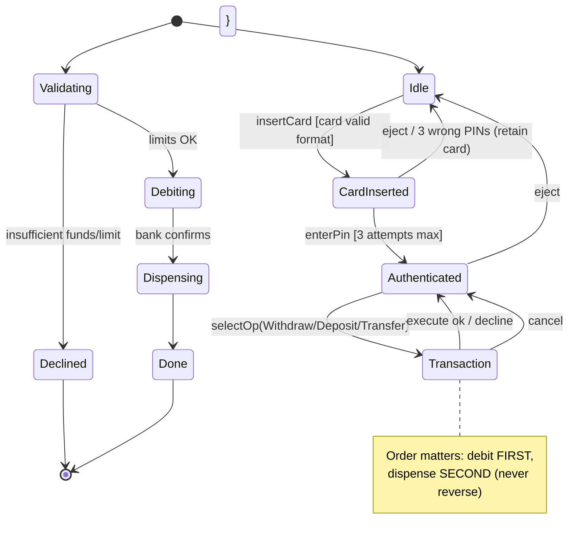
```mermaid
stateDiagram-v2
 [*] --> Idle
 Idle --> CardInserted : insertCard [card valid format]
 CardInserted --> Authenticated : enterPin [3 attempts max]
 CardInserted --> Idle : eject / 3 wrong PINs (retain card)
 Authenticated --> Transaction : selectOp(Withdraw/Deposit/Transfer)
 Transaction --> Authenticated : execute ok / decline
 Transaction --> Authenticated : cancel
 Authenticated --> Idle : eject
 state Transaction (
 [*] --> Validating
 Validating --> Debiting : limits OK
 Validating --> Declined : insufficient funds/limit
 Debiting --> Dispensing : bank confirms
 Dispensing --> Done
 Declined --> [*]
 Done --> [*]
 }
 note right of Transaction
 Order matters: debit FIRST,
 dispense SECOND (never reverse)
 end note
```

### Dispenser chain

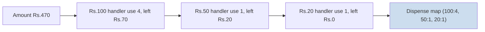
```mermaid
flowchart LR
 A["Amount Rs.470"] --> H100["Rs.100 handler use 4, left Rs.70"]
 H100 --> H50["Rs.50 handler use 1, left Rs.20"]
 H50 --> H20["Rs.20 handler use 1, left Rs.0"]
 H20 --> DONE["Dispense map (100:4, 50:1, 20:1)"]
 style DONE fill:#cde
```

### Class diagram

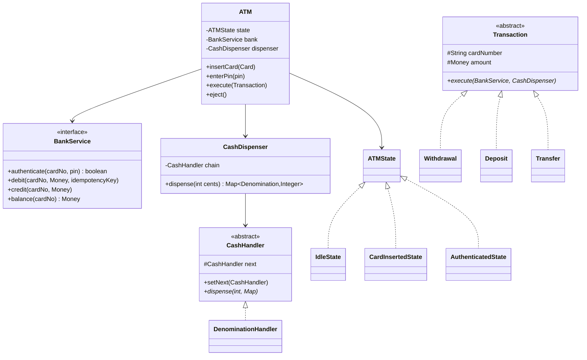
```mermaid
classDiagram
 class ATM {
 -ATMState state
 -BankService bank
 -CashDispenser dispenser
 +insertCard(Card)
 +enterPin(pin)
 +execute(Transaction)
 +eject()
 }
 class BankService {
 <<interface>>
 +authenticate(cardNo, pin) boolean
 +debit(cardNo, Money, idempotencyKey)
 +credit(cardNo, Money)
 +balance(cardNo) Money
 }
 class Transaction {
 <<abstract>>
 #String cardNumber
 #Money amount
 +execute(BankService, CashDispenser)*
 }
 class CashDispenser {
 -CashHandler chain
 +dispense(int cents) Map~Denomination,Integer~
 }
 class CashHandler {
 <<abstract>>
 #CashHandler next
 +setNext(CashHandler)
 +dispense(int, Map)*
 }
 ATM --> BankService
 ATM --> CashDispenser
 ATM --> ATMState
 ATMState <|.. IdleState
 ATMState <|.. CardInsertedState
 ATMState <|.. AuthenticatedState
 Transaction <|.. Withdrawal
 Transaction <|.. Deposit
 Transaction <|.. Transfer
 CashDispenser --> CashHandler
 CashHandler <|.. DenominationHandler
```

### Sequence - withdrawal (the order-of-operations diagram)

```mermaid
sequenceDiagram
 actor U as User
 participant A as ATM
 participant B as BankService
 participant D as CashDispenser

 U->>A: withdraw Rs.470
 A->>B: debit(card, Rs.470, key=uuid-7)
 alt sufficient funds & under daily limit
 B-->>A: OK
 A->>D: dispense(470)
 D-->>A: (100x4, 50x1, 20x1)
 A-->>U: cash + receipt
 else insufficient
 B-->>A: INSUFFICIENT
 A-->>U: declined (no cash moved)
 end
 Note over A,D: If ATM jams AFTER debit: bank records pending dispense → auto-reversal job reconciles
```

### Key design decisions

1. **ATM is a thin client** - all balance truth lives at the bank. The ATM holds *no* account state. This boundary is the first thing to defend.
2. **Order: authorize → debit → dispense → (failure → reversal)**. Dispensing before debit invites "free money on network outage". Reversal = compensating credit with same idempotency key.
3. **Idempotency key per transaction** (UUID shown on receipt) - retries from the ATM (timeouts) must not double-debit. Bank dedups on the key.
4. **PIN handling**: never log PIN; hash at the PIN pad (HSM), 3-strikes card retention, exponential backoff between attempts.
5. **Denomination chain**: Chain of Responsibility; each handler consumes what it can, passes remainder. Add ₹200 note = new handler class. Fallback: if chain can't compose the amount (float low), decline gracefully - never dispense partial without user consent.
6. **Session timeout**: inactivity > 30s → eject card, return to Idle. `ScheduledExecutorService` with cancel-on-activity.
7. **Daily limits**: enforced at the BANK (authoritative), cached at ATM only as UX pre-check.

---

## 14. ATM Machine - Code

```java
enum Denomination { HUNDRED(100), FIFTY(50), TWENTY(20), TEN(10);
    final int value; Denomination(int v){ value = v; } }

// ---------- Cash dispenser: Chain of Responsibility ----------
abstract class CashHandler {
    protected CashHandler next;
    CashHandler setNext(CashHandler n){ this.next = n; return n; }
    abstract void dispense(int amount, Map<Denomination,Integer> out);
}
final class DenominationHandler extends CashHandler {
    private final Denomination denom; private final AtomicInteger count;
    DenominationHandler(Denomination d, int stock){ denom = d; count = new AtomicInteger(stock); }

    void dispense(int amount, Map<Denomination,Integer> out) {
        int use = Math.min(amount / denom.value, count.get());
        if (use > 0 && count.compareAndSet(count.get(), count.get() - use)) {
            out.merge(denom, use, Integer::sum);
            amount -= use * denom.value;
        }
        if (amount > 0) {
            if (next != null) next.dispense(amount, out);
            else throw new CannotDispenseException(amount);
        }
    }
    void load(int n){ count.addAndGet(n); }
}
class CannotDispenseException extends RuntimeException { CannotDispenseException(int a){ super("leftover " + a); } }

class CashDispenser {
    private final CashHandler chain;
    CashDispenser(CashHandler chain){ this.chain = chain; }
    Map<Denomination,Integer> dispense(int cents) {
        Map<Denomination,Integer> out = new EnumMap<>(Denomination.class);
        chain.dispense(cents, out);
        return out;
    }
}

// ---------- Bank side ----------
record Money(BigDecimal amount) { Money { if (amount.signum() < 0) throw new IllegalArgumentException(); } }

class BankAccount {
    private final String id;
    private BigDecimal balance = BigDecimal.ZERO;
    private BigDecimal dailyWithdrawn = BigDecimal.ZERO;
    private LocalDate withdrawnOn = LocalDate.MIN;

    public synchronized void debit(BigDecimal amt, LocalDate today, BigDecimal dailyLimit) {
        if (today.isAfter(withdrawnOn)) { dailyWithdrawn = BigDecimal.ZERO; withdrawnOn = today; }
        if (balance.compareTo(amt) < 0) throw new IllegalStateException("INSUFFICIENT_FUNDS");
        if (dailyWithdrawn.add(amt).compareTo(dailyLimit) > 0) throw new IllegalStateException("DAILY_LIMIT");
        balance = balance.subtract(amt);
        dailyWithdrawn = dailyWithdrawn.add(amt);
    }
    public synchronized void credit(BigDecimal amt){ balance = balance.add(amt); }
    public synchronized BigDecimal balance(){ return balance; }
}

interface BankService {
    boolean authenticate(String cardNumber, String hashedPin);
    void debit(String cardNumber, Money amount, String idempotencyKey); // throws on decline
    void credit(String cardNumber, Money amount, String idempotencyKey);
}

// ---------- Transactions: Command pattern ----------
abstract sealed class Transaction permits Withdrawal, Deposit, Transfer {
    protected final String cardNumber; protected final Money amount; protected final String idempotencyKey;
    Transaction(String card, Money amt){ cardNumber = card; amount = amt;
        idempotencyKey = UUID.randomUUID().toString(); }
    abstract void execute(BankService bank, CashDispenser dispenser);
}

final class Withdrawal extends Transaction {
    Withdrawal(String card, Money amt){ super(card, amt); }
    void execute(BankService bank, CashDispenser dispenser) {
        bank.debit(cardNumber, amount, idempotencyKey); // 1) bank first
        try {
            dispenser.dispense(amount.amount().intValueExact()); // denominations in ₹
        } catch (RuntimeException e) {
            bank.credit(cardNumber, amount, idempotencyKey); // 2) compensate on jam
            throw e;
        }
    }
}
final class Deposit extends Transaction {
    Deposit(String card, Money amt){ super(card, amt); }
    void execute(BankService bank, CashDispenser d){ /* accept envelope → verify → */ bank.credit(cardNumber, amount, idempotencyKey); }
}
final class Transfer extends Transaction {
    private final String toCard;
    Transfer(String from, String to, Money amt){ super(from, amt); toCard = to; }
    void execute(BankService bank, CashDispenser d){
        bank.debit(cardNumber, amount, idempotencyKey);
        try { bank.credit(toCard, amount, idempotencyKey + ":leg2"); }
        catch (RuntimeException e) { bank.credit(cardNumber, amount, idempotencyKey); throw e; }
    }
}

// ---------- Session state machine ----------
interface ATMState {
    default void insertCard(Card c){ reject("insert card"); }
    default void enterPin(String pin){ reject("enter PIN"); }
    default void execute(Transaction t){ reject("execute transaction"); }
    default void eject(){ reject("eject"); }
    private void reject(String a){ throw new IllegalStateException("Cannot " + a + " in " + getClass().getSimpleName()); }
}

record Card(String number, String hashedPin) {}

class ATM {
    private ATMState state = new IdleState(this);
    private final BankService bank;
    private final CashDispenser dispenser;
    private Card currentCard;
    private int pinAttempts;
    private ScheduledFuture<?> sessionTimeout;

    ATM(BankService b, CashDispenser d){ bank = b; dispenser = d; }

    void setState(ATMState s){ state = s; }
    BankService bank(){ return bank; }
    Card card(){ return currentCard; }
    void holdCard(Card c){ currentCard = c; }
    void releaseCard(){ currentCard = null; pinAttempts = 0; }

    void armSessionTimeout(){
        if (sessionTimeout != null) sessionTimeout.cancel(false);
        sessionTimeout = /* scheduler */ null; // schedule eject in 30s
    }

    public void insertCard(Card c){ state.insertCard(c); }
    public void enterPin(String pin){ state.enterPin(pin); }
    public void execute(Transaction t){ state.execute(t); }
    public void eject(){ state.eject(); }

    void incrementPinAttempt(){ if (++pinAttempts >= 3) retainCard(); }
    private void retainCard(){ System.out.println("Card retained - too many attempts"); releaseCard(); setState(new IdleState(this)); }
}

final class IdleState implements ATMState {
    private final ATM atm; IdleState(ATM atm){ this.atm = atm; }
    public void insertCard(Card c){ atm.holdCard(c); atm.setState(new CardInsertedState(atm)); }
}
final class CardInsertedState implements ATMState {
    private final ATM atm; CardInsertedState(ATM atm){ this.atm = atm; }
    public void enterPin(String pin) {
        if (atm.bank().authenticate(atm.card().number(), pin)) {
            atm.setState(new AuthenticatedState(atm));
            atm.armSessionTimeout();
        } else {
            atm.incrementPinAttempt(); // may retain card and reset to Idle
        }
    }
    public void eject(){ atm.releaseCard(); atm.setState(new IdleState(atm)); }
}
final class AuthenticatedState implements ATMState {
    private final ATM atm; AuthenticatedState(ATM atm){ this.atm = atm; }
    public void execute(Transaction t) {
        try { t.execute(atm.bank(), atm.dispenser); atm.armSessionTimeout(); } // stay logged in
        catch (IllegalStateException decline) { System.out.println("Declined: " + decline.getMessage()); }
    }
    public void eject(){ atm.releaseCard(); atm.setState(new IdleState(atm)); }
}
```

**Key talking points**: compensation (credit-back) on dispense failure - sagas in miniature; idempotency key generated per transaction and printed on receipt; chain-of-responsibility dispensing with CAS decrement of float; PIN attempts and session timeout as explicit state responsibilities.

---

## 15. Hotel Management System - Design

### Requirements

**Actors:** Guest, Front desk agent, Housekeeping, Revenue manager (pricing), System (no-show job, payments).

**Functional Requirements**
- FR-1: Search availability by hotel, room type, date range (half-open ranges).
- FR-2: Book (hold inventory with TTL during payment) → confirm; cancel per policy (tiered penalty).
- FR-3: Check-in assigns a *specific available room*; check-out releases it to CLEANING.
- FR-4: Invoice: room charges + extras − prepayment + cancellation penalty.
- FR-5: Housekeeping transitions rooms; only housekeeping marks a room sellable.

**Non-Functional Requirements**
- NFR-1: The last room cannot be double-booked (atomic inventory claim).
- NFR-2: Availability query fast (<200ms) at catalog scale via denormalized inventory.

**Key Edge Cases**
- Payment timeout after booking → TTL hold expires, inventory released.
- No-show → charge first night per policy; room released for walk-ins.
- Early check-in / late checkout → pricing rules apply.
- Overbooking (allowed per policy) → walk-guest compensation flow.

---


### Domain model

```mermaid
classDiagram
 class Hotel {
 -String id
 -String city
 -List~Room~ rooms
 -PricingStrategy pricing
 +availability(RoomType, DateRange) boolean
 +book(Guest, RoomType, DateRange) Booking
 }
 class Room {
 -int number
 -RoomType type
 -RoomStatus status
 +assign()
 +releaseToCleaning()
 +markReady()
 }
 class Booking {
 <<aggregate>>
 -String id
 -Guest guest
 -RoomType roomType
 -Room assignedRoom
 -DateRange dates
 -BookingStatus status
 -Money total
 +confirm()
 +checkIn(Room)
 +checkOut(List~Charge~) Invoice
 +cancel(now) Money
 }
 class PricingStrategy {
 <<interface>>
 +price(RoomType, DateRange) Money
 }
 class HousekeepingService {
 +scheduleCleaning(Room)
 +markOutOfOrder(Room, reason)
 }
 Hotel --> Room
 Hotel --> PricingStrategy
 Hotel --> Booking
 Booking --> Room
 Booking --> Guest
 Booking --> Invoice
```

### Booking lifecycle state diagram

```mermaid
stateDiagram-v2
 [*] --> PENDING : book() [inventory decremented]
 PENDING --> CONFIRMED : payment captured
 PENDING --> CANCELLED : payment failed / guest cancels
 CONFIRMED --> CHECKED_IN : checkIn(room) [room AVAILABLE]
 CONFIRMED --> CANCELLED : cancel() [free-cancellation window]
 CONFIRMED --> NO_SHOW : no-show job [charge first night]
 CHECKED_IN --> COMPLETED : checkOut() [room → CLEANING]
 COMPLETED --> [*]
 note right of CHECKED_IN
 concrete room assigned HERE,
 not at booking time
 end note
```

### Sequence - booking the last available room (concurrency story)

```mermaid
sequenceDiagram
 actor G1 as Guest-1 (tab A)
 actor G2 as Guest-2 (tab B)
 participant H as Hotel
 participant INV as Inventory
 participant PAY as Payment

 par race for last DELUXE
 G1->>H: book(DELUXE, 12-14)
 G2->>H: book(DELUXE, 12-14)
 end
 H->>INV: reserve(DELUXE) - atomic decrement
 alt only 1 slot
 INV-->>H(G1): slot granted
 INV-->>H(G2): InventoryExhausted
 end
 H->>PAY: capture(G1)
 PAY-->>H: ok → CONFIRMED
 H-->>G2: sorry, sold out
```

### Key design decisions

1. **Book type, assign room at check-in**: decouples inventory (count per type) from physical rooms → enables upgrades, maintenance swaps, overbooking control. Say this clearly - it's the hallmark design decision.
2. **Inventory = capacity − overlapping confirmed bookings**: an **overlap predicate** on `DateRange` (half-open intervals) is the entire availability engine. In SQL: exclusion constraint `tstzrange &&` for correctness.
3. **Hold-with-TTL pattern**: reservation first decrements inventory for 15 min while payment completes; timeout releases (payment gateway slowness must not burn inventory).
4. **Cancellation policy as Strategy**: full refund 48h+, 50% within 48h, no-show = first night. `CancellationPolicy` interface on Booking.
5. **Housekeeping is a separate bounded context**: checkout → room CLEANING; cleaning → AVAILABLE. Front desk never sets AVAILABLE directly (invariant: only housekeeping marks a room sellable again).
6. **Overbooking** (airline-style): allow `capacity + k%` for cancellable types; compensation flow when walked. Discuss only if asked - but have it ready.

---

## 16. Hotel Management System - Code

```java
enum RoomType { SINGLE, DOUBLE, DELUXE, SUITE }

record DateRange(LocalDate checkIn, LocalDate checkOut) {
    DateRange {
        if (!checkIn.isBefore(checkOut)) throw new IllegalArgumentException("range");
    }
    long nights(){ return ChronoUnit.DAYS.between(checkIn, checkOut); }
    boolean overlaps(DateRange o){ return checkIn.isBefore(o.checkOut()) && o.checkIn().isBefore(checkOut); }
        // half-open [in, out): checkout day is sellable - industry convention
}

class Guest { private final String id, name, email; /* ctor, getters */ }

// ---------- Pricing ----------
interface PricingStrategy { Money price(RoomType type, DateRange range); }
class DynamicPricing implements PricingStrategy {
    private static final Map<RoomType, BigDecimal> BASE = Map.of(
        RoomType.SINGLE, BigDecimal.valueOf(100), RoomType.DOUBLE, BigDecimal.valueOf(150),
        RoomType.DELUXE, BigDecimal.valueOf(250), RoomType.SUITE, BigDecimal.valueOf(400));
    private final double occupancy; // 0..1 demand signal
    DynamicPricing(double occupancy){ this.occupancy = occupancy; }

    public Money price(RoomType type, DateRange range) {
        double weekendBoost = isWeekendHeavy(range) ? 1.25 : 1.0;
        double demandBoost = 1 + Math.max(0, occupancy - 0.8) * 1.5; // surge past 80% occ
        BigDecimal nightly = BASE.get(type)
            .multiply(BigDecimal.valueOf(weekendBoost * demandBoost));
        return new Money(nightly.multiply(BigDecimal.valueOf(range.nights())));
    }
    private boolean isWeekendHeavy(DateRange r){
        return r.checkIn().plusDays(1).getDayOfWeek().getValue() >= 5;
    }
}

// ---------- Booking aggregate ----------
enum BookingStatus { PENDING, CONFIRMED, CHECKED_IN, COMPLETED, CANCELLED, NO_SHOW }

class Booking {
    private final String id;
    private final Guest guest;
    private final RoomType roomType;
    private final DateRange dates;
    private BookingStatus status = BookingStatus.PENDING;
    private Room assignedRoom;
    private Money cancellationPenalty = Money.ZERO;

    Booking(Guest g, RoomType t, DateRange d){ id = UUID.randomUUID().toString();
        guest = g; roomType = t; dates = d; }

    public synchronized void confirm(){ 
        if (status != BookingStatus.PENDING) throw new IllegalStateException();
        status = BookingStatus.CONFIRMED; }
    public synchronized void markPaymentFailed(){ 
        if (status == BookingStatus.PENDING) status = BookingStatus.CANCELLED; }

    public synchronized void checkIn(Room room) {
        if (status != BookingStatus.CONFIRMED) throw new IllegalStateException("Not confirmed");
        if (room.getType() != roomType) throw new IllegalArgumentException("Wrong type");
        room.assign(); // AVAILABLE → OCCUPIED
        assignedRoom = room;
        status = BookingStatus.CHECKED_IN;
    }
    public synchronized Invoice checkOut(List<Charge> extras, PricingStrategy pricing) {
        if (status != BookingStatus.CHECKED_IN) throw new IllegalStateException();
        Money roomCharge = pricing.price(roomType, dates);
        assignedRoom.releaseToCleaning(); // OCCUPIED → CLEANING
        status = BookingStatus.COMPLETED;
        return new Invoice(id, guest, roomCharge, extras, cancellationPenalty);
    }
    public synchronized Money cancel(LocalDate now, CancellationPolicy policy) {
        if (status == BookingStatus.CHECKED_IN || status == BookingStatus.COMPLETED)
            throw new IllegalStateException("Too late");
        if (status != BookingStatus.PENDING && status != BookingStatus.CONFIRMED)
            throw new IllegalStateException("Already " + status);
        cancellationPenalty = policy.penalty(dates, now);
        status = BookingStatus.CANCELLED;
        return cancellationPenalty;
    }
    public boolean isActive(){ return status == BookingStatus.CONFIRMED || status == BookingStatus.CHECKED_IN; }
    public RoomType roomType(){ return roomType; }
    public DateRange dates(){ return dates; }
}

interface CancellationPolicy { Money penalty(DateRange dates, LocalDate cancelAt); }
class TieredCancellation implements CancellationPolicy {
    public Money penalty(DateRange dates, LocalDate now) {
        long hoursLeft = Duration.between(now.atStartOfDay(),
            dates.checkIn().atStartOfDay()).toHours();
        if (hoursLeft >= 48) return Money.ZERO;
        if (hoursLeft >= 24) return new Money(BigDecimal.valueOf(50));
        return new Money(BigDecimal.valueOf(100)); // first-night proxy
    }
}

// ---------- Room with guarded status ----------
class Room {
    enum RoomStatus { AVAILABLE, OCCUPIED, CLEANING, OUT_OF_ORDER }
    private final int number; private final RoomType type;
    private RoomStatus status = RoomStatus.AVAILABLE;
    Room(int n, RoomType t){ number = n; type = t; }
    RoomType getType(){ return type; }

    public synchronized void assign(){ transition(RoomStatus.AVAILABLE, RoomStatus.OCCUPIED); }
    public synchronized void releaseToCleaning(){ transition(RoomStatus.OCCUPIED, RoomStatus.CLEANING); }
    public synchronized void markReady(){ transition(RoomStatus.CLEANING, RoomStatus.AVAILABLE); }
    public synchronized void outOfOrder(){ status = RoomStatus.OUT_OF_ORDER; }
    public synchronized boolean isAvailable(){ return status == RoomStatus.AVAILABLE; }
    private void transition(RoomStatus from, RoomStatus to){
        if (status != from) throw new IllegalStateException("Room " + number + " is " + status);
        status = to;
    }
}

// ---------- Hotel ----------
record Charge(String description, Money amount) {}
class Invoice {
    Invoice(String bookingId, Guest g, Money room, List<Charge> extras, Money penalty) {
        Money total = room.add(extras.stream().map(Charge::amount)
            .reduce(Money.ZERO, Money::add)).add(penalty);
        // render/persist bill...
    }
}

class Hotel {
    private final String id, city;
    private final List<Room> rooms = new CopyOnWriteArrayList<>();
    private final List<Booking> bookings = new CopyOnWriteArrayList<>();
    private final PricingStrategy pricing;
    private final CancellationPolicy cancelPolicy = new TieredCancellation();

    Hotel(String id, String city, PricingStrategy p){ this.id = id; this.city = city; pricing = p; }

    public boolean isAvailable(RoomType type, DateRange range) {
        long capacity = rooms.stream().filter(r -> r.getType() == type).count();
        long taken = bookings.stream()
            .filter(b -> b.roomType() == type && b.isActive() && b.dates().overlaps(range))
            .count();
        return taken < capacity;
    }

    /** Atomic claim of inventory: synchronized on hotel = single booker at a time (interview scope).
        Production: SELECT ... FOR UPDATE on inventory row / unique exclusion constraint. */
    public synchronized Booking book(Guest g, RoomType type, DateRange range) {
        if (!isAvailable(type, range)) throw new NoAvailabilityException(type);
        Booking b = new Booking(g, type, range);
        bookings.add(b);
        return b; // PENDING → payment → confirm
    }

    public Invoice checkOut(Booking b, List<Charge> extras) {
        return b.checkOut(extras, pricing);
    }
    public Money cancel(Booking b, LocalDate now) {
        Money penalty = b.cancel(now, cancelPolicy);
        return penalty;
    }
    public List<Room> roomsReadyFor(RoomType type) {
        return rooms.stream().filter(r -> r.getType() == type && r.isAvailable()).toList();
    }
}
class NoAvailabilityException extends RuntimeException { NoAvailabilityException(Object t){ super("No " + t); } }

// Money value object reused (same as wallet section)
record Money(BigDecimal amount) {
    static final Money ZERO = new Money(BigDecimal.ZERO);
    Money { if (amount.signum() < 0) throw new IllegalArgumentException(); }
    Money add(Money o){ return new Money(amount.add(o.amount())); }
}
```

**Key talking points**: half-open date ranges make checkout-day resellable and overlap checks trivial; `Room` transitions guarded by expected-state check - front desk cannot skip cleaning; inventory claim synchronized at Hotel level (single-JVM correctness) with a named production upgrade path (DB exclusion constraint); cancellation policy injected, not hardcoded.

---

# PART 3

---

## 17. Elevator System - Design

### Requirements

**Actors:** Passengers (hall calls + car calls), Building operator (dispatch config, maintenance), Fire service (recall mode).

**Functional Requirements**
- FR-1: Hall call (floor + direction) → dispatch algorithm picks a car → car adds stop.
- FR-2: Car calls (destination) go directly to that car's stop list.
- FR-3: Car serves stops using SCAN/LOOK (serve current direction fully, then reverse).
- FR-4: Door interlock: doors closed before moving; overload blocks door close.
- FR-5: Maintenance/fire modes: car removed from dispatch (fire recall to ground).

**Non-Functional Requirements**
- NFR-1: No starvation: every request eventually served (LOOK is starvation-free).
- NFR-2: Dispatch decision <50ms with a large fleet (geo/dispatch efficiency).
- NFR-3: Deterministic behavior under concurrent calls (no two cars both commit to same optimal plan - acceptable race, but no safety issue).

**Key Edge Cases**
- Power failure mid-travel → brake to nearest floor, open doors, alarm.
- Overload sensor → doors hold open, buzzer, request stays queued.
- Fire alarm → recall all cars to ground floor, open doors, manual firefighter mode.
- Passenger presses door-open while moving → ignored (interlock).

---


### SCAN/LOOK algorithm walkthrough (draw this table in the interview)

Elevator at floor **3**, going UP, stops requested: {1, 2, 4, 5, 7, 9}

```
UP sweep: 3 → 4 → 5 → 7 → 9 (service all UP-path stops, keep direction)
reverse: direction = DOWN
DOWN sweep: (next requests arriving...) 9 → 7 → 5 → 4 → 2 → 1
```
LOOK variant: don't go to the extreme floor unless a stop exists there. Real elevators use destination-dispatch (enter destination in lobby, system assigns a car) - mention as the modern optimization.

### Dispatch decision matrix

| Strategy | Rule | When best |
|---|---|---|
| NearestCar | min \|floor − current\|, must be going same dir or idle | default |
| Zoning | bank of cars per floor range | tall buildings |
| Estimated Time of Arrival (ETA) | predicted arrival incl. stops in between | destination-dispatch systems |
| Round-robin | distribute load evenly | freight / predictable traffic |

### Class diagram

```mermaid
classDiagram
 class ElevatorController {
 <<singleton>>
 -List~Elevator~ fleet
 -DispatchStrategy dispatch
 +requestHall(int floor, Direction)
 +requestCar(Elevator, int dest)
 }
 class Elevator {
 -int id
 -int currentFloor
 -Direction direction
 -NavigableSet~Integer~ upStops
 -NavigableSet~Integer~ downStops
 -Queue~Request~ hallCalls
 +addStop(int)
 +canServe(Request) boolean
 +run()
 -nextStop() Integer
 }
 class DispatchStrategy {
 <<interface>>
 +pick(List~Elevator~, Request) Elevator
 }
 class ElevatorState {
 <<interface>>
 +onEnter()
 }
 ElevatorController --> Elevator
 ElevatorController --> DispatchStrategy
 Elevator --> ElevatorState
 ElevatorState <|.. IdleState
 ElevatorState <|.. MovingState
 ElevatorState <|.. DoorOpenState
 ElevatorState <|.. MaintenanceState
 DispatchStrategy <|.. NearestCarStrategy
 DispatchStrategy <|.. ZonedStrategy
```

### Sequence - hall call dispatch

```mermaid
sequenceDiagram
 actor U as User at floor 7
 participant C as Controller
 participant S as NearestCarStrategy
 participant E1 as Elevator-1 (floor 3, UP)
 participant E2 as Elevator-2 (floor 9, DOWN)

 U->>C: requestHall(7, UP)
 C->>S: pick(fleet, req)
 S->>E1: canServe? floor≥3, dir UP ✓
 S->>E2: canServe? going DOWN ✗
 S-->>C: Elevator-1 (distance 4)
 C->>E1: addStop(7)
 E1->>E1: upStops.add(7)
 Note over E1: main loop picks it up during UP sweep
```

### Key design decisions

1. **Two sorted stop sets** (`upStops` ascending, `downStops` descending) → next stop is always O(1) poll; SCAN/LOOK falls out naturally when a set empties (flip direction).
2. **Direction-matching acceptance rule** (`canServe`): an UP car only picks UP calls at/above current floor; a DOWN car only DOWN calls at/below. This is why riders sometimes wait - it's the cost of throughput. Being able to articulate this trade-off is the point.
3. **Hall calls vs car calls**: hall calls enter a controller-owned queue and are *assigned* (dispatch strategy); car calls go straight into the car's stop set.
4. **One thread per elevator**: each car is an independent agent; controller is stateless except fleet registry → no shared mutable state, no locks between cars.
5. **Safety overrides**: overload sensor → door stays open + alarm; fire mode → recall to ground + firefighter controls; maintenance → reject assignments (`canServe=false`).

---

## 18. Elevator System - Code

```java
enum Direction { UP, DOWN, NONE }
record Request(int floor, Direction direction) {}

// ---------- Dispatch strategies ----------
interface DispatchStrategy {
    Elevator pick(List<Elevator> fleet, Request r);
}
class NearestCarStrategy implements DispatchStrategy {
    public Elevator pick(List<Elevator> fleet, Request r) {
        return fleet.stream()
            .filter(e -> e.canServe(r))
            .filter(e -> !(e.getState() instanceof MaintenanceState))
            .min(Comparator.comparingInt(e -> e.etaTo(r.floor())))
            .orElseThrow(() -> new IllegalStateException("No elevator available"));
    }
}

// ---------- Elevator states ----------
interface ElevatorState { default void onEnter(Elevator e){} }
class IdleState implements ElevatorState {}
class MovingState implements ElevatorState {}
class DoorOpenState implements ElevatorState {
    public void onEnter(Elevator e){ e.startDoorTimer(); }
}
class MaintenanceState implements ElevatorState {}

// ---------- Elevator ----------
class Elevator {
    private final int id;
    private int currentFloor = 0;
    private Direction direction = Direction.NONE;
    private ElevatorState state = new IdleState();

    private final NavigableSet<Integer> upStops = new ConcurrentSkipListSet<>();
    private final NavigableSet<Integer> downStops = new ConcurrentSkipListSet<>(Collections.reverseOrder());

    // per-elevator single thread
    private final Thread loop = Thread.ofPlatform().daemon().name("elevator-" + id).start(this::runLoop);

    ElevatorState getState(){ return state; }
    Direction getDirection(){ return direction; }
    int getCurrentFloor(){ return currentFloor; }

    boolean canServe(Request r) {
        if (state instanceof MaintenanceState) return false;
        return switch (direction) {
            case UP -> r.floor() >= currentFloor && r.direction() != Direction.DOWN;
            case DOWN -> r.floor() <= currentFloor && r.direction() != Direction.UP;
            case NONE -> true;
        };
    }
    int etaTo(int floor){ return Math.abs(floor - currentFloor) + upStops.size() + downStops.size(); }

    void addStop(int floor) {
        if (direction == Direction.DOWN || (direction == Direction.NONE && floor < currentFloor))
            downStops.add(floor);
        else upStops.add(floor);
        wakeUp();
    }

    private void setState(ElevatorState s){ state = s; s.onEnter(this); }

    // ---------- LOOK algorithm ----------
    private void runLoop() {
        while (true) {
            Integer next = nextStop();
            if (next == null) { setState(new IdleState()); parkAndWait(); continue; }
            moveTo(next);
            setState(new DoorOpenState(this)); // open, dwell, close
        }
    }
    private Integer nextStop() {
        if (direction == Direction.UP) {
            Integer n = upStops.pollFirst();
            if (n != null) return n;
            direction = Direction.DOWN; // flip at end of sweep
            return downStops.pollFirst();
        }
        if (direction == Direction.DOWN) {
            Integer n = downStops.pollFirst();
            if (n != null) return n;
            direction = Direction.UP;
            return upStops.pollFirst();
        }
        direction = Direction.NONE;
        return null;
    }
    private void moveTo(int target) {
        setState(new MovingState());
        direction = target > currentFloor ? Direction.UP : Direction.DOWN;
        while (currentFloor != target) {
            step(); // currentFloor += dir
            // opportunistic pickup: intermediate stop in current direction
            if (direction == Direction.UP && upStops.contains(currentFloor)) { upStops.remove(currentFloor); dwell(); }
            if (direction == Direction.DOWN && downStops.contains(currentFloor)) { downStops.remove(currentFloor); dwell(); }
        }
        direction = Direction.NONE; // arrived; nextStop() re-decides
    }
    private void dwell(){ setState(new DoorOpenState(this)); }
    void startDoorTimer(){ /* open doors, wait N sec or door-close btn, resume */ }
    private synchronized void parkAndWait(){
        while (upStops.isEmpty() && downStops.isEmpty()) { // re-check: guards spurious wakeups
            try { wait(); } catch (InterruptedException e) { Thread.currentThread().interrupt(); return; }
        }
    }
    private synchronized void wakeUp(){ notifyAll(); }
    private synchronized void step(){ currentFloor += (direction == Direction.UP ? 1 : -1); }
}

// ---------- Controller ----------
class ElevatorController {
    private static ElevatorController instance;
    static synchronized ElevatorController getInstance(){
        return instance == null ? instance = new ElevatorController() : instance; }

    private final List<Elevator> fleet = new CopyOnWriteArrayList<>();
    private volatile DispatchStrategy dispatch = new NearestCarStrategy();

    public void requestHall(int floor, Direction dir) {
        Elevator e = dispatch.pick(fleet, new Request(floor, dir));
        e.addStop(floor);
    }
    public void requestCar(Elevator e, int destination) { e.addStop(destination); }
    public void setDispatchStrategy(DispatchStrategy s){ this.dispatch = s; } // hot-swap
}
```

**Key talking points**: `etaTo` includes pending stops (better than raw distance); direction flip happens lazily inside `nextStop()` (LOOK, not SCAN - no run to extremes); `parkAndWait/wakeUp` = condition-variable idling instead of busy loop; dispatch strategy is `volatile`-swappable at runtime.

---

## 19. Digital Wallet - Design

### Requirements

**Actors:** Wallet owner, Counterparty (P2P), Bank/PSP (funding source), Compliance/Audit (read-only), System (reconciliation).

**Functional Requirements**
- FR-1: Top-up from bank/card; withdraw to bank.
- FR-2: P2P transfer: debit sender, credit receiver, atomic with ledger entry.
- FR-3: Transaction history with status; balance inquiry.
- FR-4: Every money movement recorded in double-entry ledger (entries sum to zero).
- FR-5: Reversal/compensation for failed or disputed transfers.

**Non-Functional Requirements**
- NFR-1: Strong consistency on balances; overdraft impossible under concurrency.
- NFR-2: Transfers idempotent under client retries (idempotency key).
- NFR-3: Ledger append-only, auditable, reconcilable (derived balance == cached balance).

**Key Edge Cases**
- Concurrent opposite-direction transfers A→B and B→A → ordered locking prevents deadlock.
- Insufficient funds → atomic reject, no partial state.
- Crash after debit, before credit → PENDING sweeper auto-reverses.
- Duplicate retry of the same transfer → idempotency store returns original result.

---


### Architecture with ledger + outbox

```mermaid
flowchart LR
 subgraph App
 WS["WalletService"]
 LED["Ledger double-entry"]
 IDEM["IdempotencyStore"]
 OB["Outbox"]
 end
 subgraph Infra
 DB["(Wallet DB)"]
 MQ["Message Broker"]
 BANK["Bank/Card PSP"]
 end
 WS --> LED
 WS --> IDEM
 WS -->|txn| DB
 WS -->|event rows, same txn| OB
 OB -.->|CDC / relay| MQ
 MQ -.->|notifications, analytics| CONS["Consumers"]
 WS --> BANK
```

### Sequence - transfer with failure compensation

```mermaid
sequenceDiagram
 participant A as Alice Wallet
 participant S as WalletService
 participant B as Bob Wallet
 participant L as Ledger

 S->>S: idempotency check (key → result)
 S->>A: lock (ordered)
 S->>B: lock (ordered)
 S->>A: debit(Rs.500) [sufficient?]
 alt insufficient
 S-->>S: FAILED (no state changed)
 else ok
 S->>B: credit(Rs.500)
 S->>L: post(txId, -500/+500)
 S-->>S: COMPLETED
 end
 Note over S,L: crash between debit & credit? reconciliation job: PENDING > 60s → auto-reverse credit to Alice
```

### Double-entry invariants (state these)

1. Every transfer = ≥2 ledger lines summing to **zero** (conservation of money).
2. Ledger is **append-only** - balances are *derived* (or cached with reconciliation), never updated in place without a corresponding entry.
3. Sum of all wallet balances == sum of external settlement balances (reconciliation report).

### Class diagram

```mermaid
classDiagram
 class Wallet {
 -String walletId
 -BigDecimal balance
 -long version
 -String currency
 +debit(Money)
 +credit(Money)
 }
 class Ledger {
 +post(String txId, LedgerLine... lines)
 +balanceOf(String walletId) Money
 }
 class LedgerLine {
 <<record>>
 +String walletId
 +BigDecimal signedAmount
 }
 class TransferService {
 -IdempotencyStore idem
 -Ledger ledger
 +transfer(key, from, to, Money) TxResult
 }
 class IdempotencyStore {
 -Map~String,TxResult~ seen
 +computeIfAbsent(key, fn)
 }
 TransferService --> Wallet
 TransferService --> Ledger
 TransferService --> IdempotencyStore
 Ledger --> LedgerLine
```

### Key design decisions

1. **Saga pattern** for cross-service transfer: local tx (debit A + intent row) → message → local tx (credit B). Failure → compensating credit. The "outbox pattern" makes the event and the state change atomic (same DB transaction).
2. **Ordered locking** (lock wallets in id order) prevents deadlock when transfers run in opposite directions concurrently.
3. **Idempotency keys** at the API boundary: store key → result BEFORE executing (or unique constraint) so retries are reads, not re-executions.
4. **Optimistic vs pessimistic for wallets**: pessimistic (row lock / synchronized) when contention is high or overdraft must be impossible; optimistic (version) for mostly-read wallets with retry. Know the trade-off cold.
5. **Pending-state + reconciliation**: transfers in PENDING > timeout are auto-reversed by a sweeper job - this is how you get "effectively exactly-once" without distributed transactions.

---

## 20. Types of Locking Mechanisms (Deep Dive)

### Decision flowchart

```mermaid
flowchart TD
 Q1(Same JVM?) -->|yes| Q2(High contention on write?)
 Q1 -->|no| Q3(Distributed lock needed?)
 Q2 -->|yes| PESS["Pessimistic: ReentrantLock / SELECT FOR UPDATE"]
 Q2 -->|no| OPT["Optimistic: version + CAS retry"]
 Q3 -->|yes| Q4(Hold time vs TTL risk?)
 Q3 -->|no| DBLOCK["DB row lock"]
 Q4 -->|short, safe| REDIS["Redis SET NX PX + fencing token"]
 Q4 -->|needs strong consistency| ZK["ZooKeeper / etcd lease"]
```

### Java lock comparison (know the table)

| Mechanism | Fair | Reentrant | Try/timeout | Read perf | Notes |
|---|---|---|---|---|---|
| `synchronized` | no | yes | no | moderate | monitor; biased→lightweight→heavyweight escalation |
| `ReentrantLock` | optional | yes | yes (`tryLock`, `lockInterruptibly`) | moderate | explicit `unlock()` in finally |
| `ReentrantReadWriteLock` | no | yes | yes | high (shared) | writer starvation possible |
| `StampedLock` | no | yes | yes | very high (optimistic read) | optimistic `tryOptimisticRead()` validates stamp; NOT reentrant-safe |
| `AtomicInteger`/CAS | - | - | - | highest | ABA problem; retry storms under contention |

### Deadlock - the four conditions + breaking each

| Condition | Break it with |
|---|---|
| Mutual exclusion | lock striping; copy-on-write; immutability |
| Hold-and-wait | `tryLock` both-or-none (lock ordering) |
| No preemption | `lockInterruptibly`; timed locks |
| Circular wait | **global lock ordering** (e.g., by resource id) - the practical one |

### Distributed locks - the honest truth

1. **Redis single instance**: `SET lockKey uniqueToken NX PX ttl`. Release via Lua: `if get==token then del`. Failure modes: GC pause > TTL → another client acquires → two holders. Mitigate: TTL ≫ p99 pause, and **fencing tokens** (monotonic counter) so stale holders' writes are rejected.
2. **Redlock** (N/2+1 independent masters, quorum acquire): better, still debated (Martin Kleppmann's analysis - know it exists).
3. **ZooKeeper/etcd**: ephemeral sequential nodes + watches; lease-based sessions; safer revocation on client death.
4. **DB**: `pg_try_advisory_lock` / unique constraint insertion as the lock - simplest when you already have a strong DB.

**Rule of thumb to say out loud**: "A distributed lock protects against *accidental* concurrency, not *adversarial* correctness - the real safety net is the DB constraint or fencing token."

---

## 21. Digital Wallet - Code

```java
enum TxStatus { INITIATED, COMPLETED, FAILED, REVERSED, PENDING }

record Money(BigDecimal amount) {
    static final Money ZERO = new Money(BigDecimal.ZERO);
    Money { Objects.requireNonNull(amount); if (amount.signum() < 0) throw new IllegalArgumentException(); }
    Money add(Money o){ return new Money(amount.add(o.amount())); }
    Money negate(){ return new Money(amount.negate()); }
    boolean isGreaterThan(Money o){ return amount.compareTo(o.amount()) > 0; }
}

// ---------- Append-only ledger ----------
record LedgerLine(String txId, String walletId, BigDecimal signedAmount, Instant at) {}
class Ledger {
    private final List<LedgerLine> lines = new CopyOnWriteArrayList<>();
    void post(String txId, String fromWallet, String toWallet, Money amount) {
        lines.add(new LedgerLine(txId, fromWallet, amount.amount().negate(), Instant.now()));
        lines.add(new LedgerLine(txId, toWallet, amount.amount(), Instant.now()));
        assert conservationHolds();
    }
    private boolean conservationHolds(){
        return lines.stream().collect(Collectors.groupingBy(LedgerLine::txId,
            Collectors.reducing(BigDecimal.ZERO, LedgerLine::signedAmount, BigDecimal::add)))
            .values().stream().allMatch(v -> v.compareTo(BigDecimal.ZERO) == 0);
    }
    Money balanceOf(String walletId){
        return new Money(lines.stream().filter(l -> l.walletId().equals(walletId))
            .map(LedgerLine::signedAmount).reduce(BigDecimal.ZERO, BigDecimal::add));
    }
}

// ---------- Wallet ----------
class Wallet {
    private final String walletId;
    private final String currency;
    private BigDecimal balance = BigDecimal.ZERO; // cached projection of ledger
    private long version;

    Wallet(String id, String ccy){ walletId = id; currency = ccy; }

    public synchronized void debit(Money amount) { // caller holds ordered lock
        if (balance.compareTo(amount.amount()) < 0)
            throw new InsufficientFundsException();
        balance = balance.subtract(amount.amount());
        version++;
    }
    public synchronized void credit(Money amount) {
        balance = balance.add(amount.amount());
        version++;
    }
    public synchronized Money balance(){ return new Money(balance); }
    public String id(){ return walletId; }
}
class InsufficientFundsException extends RuntimeException {}

// ---------- Idempotency ----------
record TransferResult(String txId, TxStatus status, String message) {}
class IdempotencyStore {
    private final ConcurrentMap<String, TransferResult> seen = new ConcurrentHashMap<>();
    TransferResult computeIfAbsent(String key, Function<String, TransferResult> work) {
        return seen.computeIfAbsent(key, work); // atomic: only one thread executes work
    }
}

// ---------- Transfer service ----------
class WalletService {
    private final ConcurrentMap<String, Wallet> wallets = new ConcurrentHashMap<>();
    private final Ledger ledger = new Ledger();
    private final IdempotencyStore idempotency = new IdempotencyStore();
    private final ConcurrentMap<String, TxStatus> inflight = new ConcurrentHashMap<>();

    public String transfer(String idempotencyKey, String fromId, String toId, Money amount) {
        TransferResult result = idempotency.computeIfAbsent(idempotencyKey,
            k -> doTransfer(k, fromId, toId, amount));
        return result.txId();
    }

    private TransferResult doTransfer(String key, String fromId, String toId, Money amount) {
        if (fromId.equals(toId)) throw new IllegalArgumentException("self-transfer");
        Wallet from = wallets.get(fromId), to = wallets.get(toId);
        if (from == null || to == null) throw new NoSuchElementException("wallet");

        // ordered locking → no deadlock across opposite-direction concurrent transfers
        Wallet first = fromId.compareTo(toId) < 0 ? from : to;
        Wallet second = (first == from) ? to : from;

        String txId = UUID.randomUUID().toString();
        try {
            synchronized (first) {
                synchronized (second) {
                    from.debit(amount); // may throw InsufficientFunds
                    to.credit(amount);
                    ledger.post(txId, fromId, toId, amount); // double-entry, same critical section
                }
            }
            return new TransferResult(txId, TxStatus.COMPLETED, "ok");
        } catch (InsufficientFundsException e) {
            return new TransferResult(txId, TxStatus.FAILED, e.getMessage()); // nothing moved
        }
    }

    public Money balance(String walletId){ return wallets.get(walletId).balance(); }
    public Money ledgerBalance(String walletId){ return ledger.balanceOf(walletId); } // audit view
}
```

**Key talking points**: debit-then-credit inside ONE critical section + ledger post in the same section = atomicity without transactions; `computeIfAbsent` on the idempotency store is the concurrency-safe "exactly-once execution" primitive; cached balance and ledger-derived balance both exposed → reconciliation story.

---

## 22. Ride Booking App - Design

### Requirements

**Actors:** Rider, Driver, Pricing engine (surge), Payments, System (matching, fraud).

**Functional Requirements**
- FR-1: Rider requests (pickup, drop) → system finds nearby available drivers → offers sequentially → match on accept.
- FR-2: Trip lifecycle: REQUESTED→MATCHED→ONGOING→COMPLETED/CANCELLED.
- FR-3: Fare = base + distance + time, × surge locked at request time; receipt + payment split (commission).
- FR-4: Driver states: OFFLINE/AVAILABLE/OFFERED/ON_TRIP with atomic claim.
- FR-5: Ratings post-trip (extendable); cancellation policy with fee.

**Non-Functional Requirements**
- NFR-1: A driver is never offered to two riders simultaneously (atomic claim).
- NFR-2: Matching decision fast (<300ms) with 100k+ online drivers (geo-index).
- NFR-3: Location updates high-throughput (separate stream from request path).

**Key Edge Cases**
- All nearby drivers decline → widen radius / raise surge / notify rider honestly.
- Driver cancels en route → re-match rider with priority; penalize driver.
- Rider no-show at pickup → driver cancels with fee to rider.
- GPS drift at pickup → match within geofence radius, not exact point.

---


### System context

```mermaid
flowchart LR
 R["Rider App"] -->|request ride| RS["RideService"]
 D["Driver App"] -->|location heartbeat, accept/decline| RS
 RS --> DM["DriverManager geo-index"]
 RS --> FS["FareStrategy surge engine"]
 RS --> PAY["Payments"]
 RS -->|events| MQ["Event Bus"]
 MQ --> NF["Notifications"]
 MQ --> AN["Analytics"]
 MQ --> PR["Price history"]
```

### Matching flow (sequence - the money diagram)

```mermaid
sequenceDiagram
 actor R as Rider
 participant RS as RideService
 participant DM as DriverManager
 participant D as Driver(nearby)
 participant FS as FareService

 R->>RS: request(pickup, drop)
 RS->>DM: nearestAvailable(pickup, k=5)
 DM-->>RS: [D1..D5] (geo-index scan)
 loop sequential offer, 15s each
 RS->>D: offer(ride) 
 D-->>RS: accept?
 end
 alt accepted by D2
 RS->>D2: tryOffer() CAS AVAILABLE→OFFERED ✓
 RS-->>R: matched, ETA 4 min
 else all declined/timeout
 RS->>FS: surge bump (cell demand↑)
 RS-->>R: retrying / surge fare notice
 end
```

### Driver lifecycle

```mermaid
stateDiagram-v2
 [*] --> OFFLINE
 OFFLINE --> AVAILABLE : goOnline [bg check ok]
 AVAILABLE --> OFFERED : offer() [CAS claim]
 OFFERED --> ON_TRIP : accept()
 OFFERED --> AVAILABLE : decline / timeout
 ON_TRIP --> AVAILABLE : finishTrip()
 ON_TRIP --> OFFLINE : goOffline
 AVAILABLE --> OFFLINE : goOffline
```

### Class diagram

```mermaid
classDiagram
 class RideService {
 +requestRide(Rider, Location, Location) Ride
 +endTrip(Ride, double surge) Money
 }
 class DriverManager {
 -Map~String,Set~Driver~~ grid
 +goAvailable(Driver)
 +remove(Driver)
 +findNearest(Location, int) List~Driver~
 }
 class Ride {
 -RideStatus status
 -Driver driver
 +assign(Driver)
 +start()
 +complete()
 }
 class FareStrategy {
 <<interface>>
 +compute(Ride, double surge) Money
 }
 class SurgeEngine {
 +multiplier(GridCell) double
 }
 class PaymentService {
 +charge(Rider, Money)
 +payout(Driver, Money)
 }
 RideService --> DriverManager
 RideService --> FareStrategy
 RideService --> SurgeEngine
 RideService --> PaymentService
 Ride --> RideStatus
 Ride --> Driver
```

### Key design decisions

1. **Geo-index**: grid hash `cell = (int)(lat/cellKm) : (int)(lng/cellKm)` with neighbor-cell spiral search; production = Redis GEO / S2 / H3 / QuadTree. Know the names and why (Redis GEO = geohash-based sorted sets, radius queries O(log N)).
2. **Sequential offer vs broadcast**: broadcast causes thundering herd + awkward multi-accept races; sequential with timeout degrades gracefully and feeds the surge signal. (Uber actually does batch/ETA-ranked matching - mention as the scaled-up evolution.)
3. **Atomic claim**: `AVAILABLE → OFFERED` must be atomic (CAS or per-cell lock) - this is the correctness core of matching. Never "check then set".
4. **Surge**: multiplier from demand/supply ratio per geo-cell over a sliding window; computed by a separate pricing service reading the event stream; the ride service only consumes multipliers.
5. **Fare at trip end**: base + distance×rate + time×rate + tolls − promos, × surge locked at request time (riders hate post-hoc surge).
6. **Trip events as stream**: REQUESTED/MATCHED/STARTED/COMPLETED/CANCELLED → Kafka → analytics, ETA ML, invoices. Event-driven from day one in your narrative.

## 23. Ride Booking App - Code

```java
record Location(double lat, double lng) {
    static final double R = 6371.0;
    double distanceKmTo(Location o) {
        double dLat = Math.toRadians(o.lat - lat), dLng = Math.toRadians(o.lng - lng);
        double a = Math.sin(dLat/2)*Math.sin(dLat/2)
                 + Math.cos(Math.toRadians(lat)) * Math.cos(Math.toRadians(o.lat))
                 * Math.sin(dLng/2)*Math.sin(dLng/2);
        return 2 * R * Math.asin(Math.sqrt(a));
    }
}

enum DriverStatus { OFFLINE, AVAILABLE, OFFERED, ON_TRIP }
enum RideStatus { REQUESTED, MATCHED, ONGOING, COMPLETED, CANCELLED }

// ---------- Driver with atomic claim ----------
class Driver {
    private final String id; private final String name;
    private volatile Location location;
    private volatile DriverStatus status = DriverStatus.OFFLINE;
    private double rating;

    public boolean goOnline(){ return cas(DriverStatus.OFFLINE, DriverStatus.AVAILABLE); }
    public boolean tryOffer() { return cas(DriverStatus.AVAILABLE, DriverStatus.OFFERED); } // THE critical claim
    public void accept() { status = DriverStatus.ON_TRIP; }
    public void decline() { status = DriverStatus.AVAILABLE; }
    public void finishTrip(){ status = DriverStatus.AVAILABLE; }

    private synchronized boolean cas(DriverStatus expect, DriverStatus next) {
        if (status != expect) return false;
        status = next; return true;
    }
    public DriverStatus status(){ return status; }
    public Location location(){ return location; }
    public void updateLocation(Location l){ location = l; }
    public double rating(){ return rating; }
}

class Rider { private final String id, name; /* ... */ }

// ---------- Fare ----------
interface FareStrategy { Money compute(Ride ride, double surge); }
class StandardFare implements FareStrategy {
    private static final Money BASE = new Money(BigDecimal.valueOf(40));
    public Money compute(Ride ride, double surge) {
        double km = ride.pickup().distanceKmTo(ride.drop());
        long mins = Duration.between(ride.startTime(), ride.endTime()).toMinutes();
        BigDecimal raw = BASE.amount()
            .add(BigDecimal.valueOf(12 * km))
            .add(BigDecimal.valueOf(2 * mins));
        return new Money(raw.multiply(BigDecimal.valueOf(surge)));
    }
}

// ---------- Ride ----------
class Ride {
    private final String id; private final Rider rider;
    private Driver driver; private RideStatus status = RideStatus.REQUESTED;
    private final Location pickup, drop;
    private Instant startTime, endTime;
    private final double lockedSurge; // surge locked at request

    Ride(Rider r, Location p, Location d, double surge){ id = UUID.randomUUID().toString();
        rider = r; pickup = p; drop = d; lockedSurge = surge; }

    public synchronized void assign(Driver d){
        if (status != RideStatus.REQUESTED) throw new IllegalStateException();
        driver = d; status = RideStatus.MATCHED; }
    public synchronized void start(){
        if (status != RideStatus.MATCHED) throw new IllegalStateException();
        status = RideStatus.ONGOING; startTime = Instant.now(); }
    public synchronized void complete(){
        if (status != RideStatus.ONGOING) throw new IllegalStateException();
        status = RideStatus.COMPLETED; endTime = Instant.now(); }

    public Driver driver(){ return driver; }
    public Location pickup(){ return pickup; } public Location drop(){ return drop; }
    public Instant startTime(){ return startTime; } public Instant endTime(){ return endTime; }
    public double lockedSurge(){ return lockedSurge; }
    public RideStatus status(){ return status; }
}

// ---------- Geo-indexed driver pool ----------
class DriverManager {
    private static final double CELL_KM = 2.0;
    private final Map<String, Set<Driver>> grid = new ConcurrentHashMap<>();

    private static String cellKey(Location l){ return (int)(l.lat()/CELL_KM) + ":" + (int)(l.lng()/CELL_KM); }

    public void goAvailable(Driver d){
        grid.computeIfAbsent(cellKey(d.location()), k -> ConcurrentHashMap.newKeySet()).add(d);
    }
    public void remove(Driver d){
        Set<Driver> s = grid.get(cellKey(d.location()));
        if (s != null) s.remove(d);
    }

    /** Nearest k AVAILABLE drivers - spiral out from pickup cell (interview simplification: flat scan). */
    public List<Driver> findNearest(Location pickup, int k) {
        return grid.values().stream().flatMap(Set::stream)
            .filter(d -> d.status() == DriverStatus.AVAILABLE)
            .sorted(Comparator.comparingDouble(d -> d.location().distanceKmTo(pickup)))
            .limit(k).toList();
    }
}

// ---------- Surge (simplified) ----------
class SurgeEngine {
    private final Map<String, Double> cellMultiplier = new ConcurrentHashMap<>();
    double multiplier(Location l){
        return cellMultiplier.getOrDefault(cellKey(l), 1.0); // 1.0x normal
    }
    private static String cellKey(Location l){ return (int)(l.lat()/2.0)+":"+(int)(l.lng()/2.0); }
    void setSurge(Location l, double m){ cellMultiplier.put(cellKey(l), m); }
}

// ---------- Ride service ----------
class RideService {
    private final DriverManager driverManager = new DriverManager();
    private final SurgeEngine surge = new SurgeEngine();
    private final FareStrategy fareStrategy = new StandardFare();

    public Ride requestRide(Rider rider, Location pickup, Location drop) throws NoDriversException {
        double m = surge.multiplier(pickup);
        Ride ride = new Ride(rider, pickup, drop, m);

        List<Driver> candidates = driverManager.findNearest(pickup, 5);
        for (Driver d : candidates) { // sequential offer
            if (d.tryOffer()) { // atomic claim
                boolean accepted = notifyAndWait(d, ride, Duration.ofSeconds(15));
                if (accepted) { ride.assign(d); return ride; }
                d.decline(); // back to AVAILABLE pool
            }
        }
        throw new NoDriversException();
    }

    public Money endTrip(Ride ride) {
        ride.complete();
        Driver d = ride.driver();
        Money fare = fareStrategy.compute(ride, ride.lockedSurge());
        processPayment(ride, d, fare); // rider pays, driver gets 75%
        d.finishTrip();
        driverManager.goAvailable(d);
        emit(new RideCompletedEvent(ride.id(), fare));
        return fare;
    }

    private boolean notifyAndWait(Driver d, Ride ride, Duration timeout) { /* push + latch await */ return true; }
    private void processPayment(Ride r, Driver d, Money fare) { /* PSP charge + ledger */ }
    private void emit(Object evt) { /* outbox / broker */ }
}
class NoDriversException extends RuntimeException {}
record RideCompletedEvent(String rideId, Money fare) {}
```

**Talking points**: CAS claim (`tryOffer`) is the single point where double-assignment is prevented; surge locked at request time (fare fairness); sequential offer with decline-returns-to-pool; geo grid hash with neighbor spiral (described) - and name-drop Redis GEO/S2 for production.

---

## 24. Music Streaming Platform - Design

### Requirements

**Actors:** Listener, Artist/Label (content), Licensing/royalty system (read events), System (transcoding, CDN).

**Functional Requirements**
- FR-1: Catalog: artists, albums, tracks with multi-bitrate variants (segment manifests).
- FR-2: Play with seek; ABR variant switching by measured bandwidth; gapless next-track buffering.
- FR-3: Playlists (collaborative), search, recommendations (strategy).
- FR-4: Play events emitted per play (idempotent) for royalties/analytics.
- FR-5: (Extended) Offline downloads with expiring licenses (DRM).

**Non-Functional Requirements**
- NFR-1: Start playback <1s (CDN + short first segments); seek <200ms.
- NFR-2: Streaming must not require server session state (dumb HTTP + cache).
- NFR-3: Play-count accuracy for royalties (idempotent, auditable events).

**Key Edge Cases**
- Network drop mid-track → resume from last buffered segment with downswitch.
- Seek beyond duration → clamp to last segment.
- Concurrent playlist edits → version-based optimistic control.
- Track removed by label mid-playlist → graceful skip + notice.

### Playback data model (the streaming-specific part)

```mermaid
classDiagram
 class Track {
 -String id
 -String title
 -Duration durationMs
 -List~BitrateVariant~ variants
 -Lyrics lyrics
 +variantFor(int kbps) BitrateVariant
 }
 class BitrateVariant {
 -int kbps
 -List~AudioSegment~ segments
 +segmentAt(long tsMs) AudioSegment
 }
 class AudioSegment {
 <<record>>
 +int index
 +long startMs
 +long durationMs
 +String cdnUrl
 }
 class Playlist {
 -String id
 -User owner
 -List~Track~ tracks
 -Set~User~ collaborators
 }
 class Player {
 -PlayerState state
 -List~Integer~ playOrder
 +playNext(bandwidth)
 +seek(long tsMs, bandwidth)
 }
 Track --> BitrateVariant
 BitrateVariant --> AudioSegment
 Player --> Track : current
 Playlist --> Track
```

### Streaming flow (sequence)

```mermaid
sequenceDiagram
 participant U as Client Player
 participant API as Catalog/Streaming API
 participant CDN as CDN
 U->>API: getStream(trackId, bandwidth=auto)
 API-->>U: manifest (variants:[128k,256k,320k], segments:[...])
 loop playback
 U->>CDN: GET segment["i"] (adaptive: pick variant by measured throughput)
 CDN-->>U: 4s audio chunk
 U->>U: buffer (target 2 segments ahead)
 end
 U->>API: POST progress (offsetMs, playId)
 Note over U,CDN: seek = offsetMs → segment index → byte-range GET
```

### Key design decisions

1. **Segment references, never bytes**: Track/Variant/Segment are metadata; audio lives in object storage behind CDN. Model the manifest - that IS the domain model of streaming.
2. **Seek = timestamp → segment index → (range) fetch**: `segmentAt()` does this mapping; clients buffer 1-2 segments ahead for gapless playback.
3. **Adaptive bitrate**: server encodes N variants; player measures throughput per segment fetch and switches variant (up/down) at segment boundaries - no server-side state.
4. **Play-count & royalties**: `PlayEvent` stream (Kafka) → aggregation per track/artist/territory → royalty ledgers. This is a revenue system - idempotent play events (client-generated playId).
5. **DRM**: license server + encrypted segments (AES-128 / Widevine / FairPlay); offline downloads = encrypted cached segments with expiring licenses.
6. **Collaborative playlists**: versioning per edit (version vector or LWW with server sequence) - mention, don't over-engineer.

### Follow-up deep-dives
- *How does seek work mid-track?* → byte-range request / segment index from timestamp.
- *Royalties per play?* → event stream (Kafka) aggregated per track/artist.
- *Gapless playback / crossfade?* → player pre-buffers next segment (mention).

---

## 25. Streaming Protocols (Deep Dive)

### Comparison matrix

| Protocol | Transport | Latency | Adaptive | Native support | Typical use |
|---|---|---|---|---|---|
| **HLS** | HTTP (TCP) | 6-30s default (LL-HLS: ~3s) | ✅ variant playlists | Universal (incl. Safari/iOS) | Live + VOD everywhere |
| **DASH** (MPEG-DASH) | HTTP (TCP) | similar; LL-DASH ~3s | ✅ MPD representations | Chrome/Android/FF; patchy Safari | VOD, Android TV |
| **WebRTC** | UDP (RTP/SRTP) | <1s | (simulcast/SVC variants) | browsers | video calls, auctions, betting |
| **RTMP** | TCP (long-lived) | 1-3s | ❌ | ingest only now | encoder → media server ingest |
| **progressive download** | HTTP | n/a | ❌ | universal | legacy, podcasts |

### How HLS actually works (be able to draw)

```
master.m3u8 variant_256.m3u8
├─ #EXT-X-STREAM-INF:BANDWIDTH=128000 → variant_128.m3u8 ├─ #EXTINF:4.0, seg_0.ts
├─ #EXT-X-STREAM-INF:BANDWIDTH=256000 → variant_256.m3u8 ├─ #EXTINF:4.0, seg_1.ts
└─ #EXT-X-STREAM-INF:BANDWIDTH=512000 → variant_512.m3u8 └─ #EXTINF:4.0, seg_2.ts
```
Client: fetch master → pick variant (measured bandwidth) → fetch segments in order → switch variant at segment boundary. Server is a dumb HTTP file server → trivially CDN-cacheable, horizontally scalable.

### ABR switching logic (pseudo - clients do this)

```
every segment download:
    throughput = segmentBytes / downloadTime
    if throughput > 1.3 * currentVariant.bitrate and buffer > 10s → upgrade variant
    if throughput < 0.8 * currentVariant.bitrate or buffer < 5s → downgrade variant
```
Buffer-based + throughput-based hysteresis prevents oscillation.

### Interview answer template (60 seconds)

"For a music streaming service, I'd package audio as ~4s segments in multiple bitrates and serve HLS or DASH manifests through a CDN - HTTP only, so it caches and scales trivially. The player adaptively picks bitrate per segment based on measured throughput and buffer depth. Seek maps timestamp → segment index → range request. Live radio uses longer windows; interactive use-cases would need WebRTC. Ingest is RTMP/WebRTC → transcode → package → origin storage."

---

## 26. Music Streaming Platform - Code

```java
record AudioSegment(int index, long startMs, long durationMs, String cdnUrl) {}

// ---------- Bitrate variant = one adaptive rung ----------
class BitrateVariant {
    private final int kbps;
    private final List<AudioSegment> segments;
    BitrateVariant(int kbps, List<AudioSegment> segments){ this.kbps = kbps; this.segments = segments; }
    int kbps(){ return kbps; }

    /** Seek support: timestamp → segment. Binary search in production. */
    AudioSegment segmentAt(long tsMs) {
        return segments.stream()
            .filter(s -> tsMs >= s.startMs() && tsMs < s.startMs() + s.durationMs())
            .findFirst().orElseThrow(() -> new IllegalArgumentException("ts out of range"));
    }
    List<AudioSegment> segments(){ return segments; }
}

class Track {
    private final String id, title;
    private final Artist artist;
    private final long durationMs;
    private final List<BitrateVariant> variants; // 128, 256, 320 kbps

    public BitrateVariant variantFor(int targetKbps) {
        return variants.stream()
            .min(Comparator.comparingInt(v -> Math.abs(v.kbps() - targetKbps)))
            .orElseThrow();
    }
    public List<BitrateVariant> variants(){ return variants; }
}

// ---------- Playlist (collaborative, guarded) ----------
class Playlist {
    private final String id; private final User owner;
    private final List<Track> tracks = new CopyOnWriteArrayList<>();
    private final Set<String> collaboratorIds = ConcurrentHashMap.newKeySet();
    private final AtomicLong version = new AtomicLong();

    public void addCollaborator(User u){ collaboratorIds.add(u.id()); }
    public void addTrack(User actor, Track t) {
        if (!actor.id().equals(owner.id()) && !collaboratorIds.contains(actor.id()))
            throw new SecurityException("Not a collaborator");
        tracks.add(t);
        version.incrementAndGet();
    }
    public List<Track> snapshot(){ return List.copyOf(tracks); }
    public long version(){ return version.get(); }
}

// ---------- Player: state machine + play-order strategy ----------
enum PlayerState { PLAYING, PAUSED, BUFFERING, STOPPED }
enum PlayMode { SEQUENTIAL, SHUFFLE, REPEAT_ONE, REPEAT_ALL }

class Player {
    private volatile PlayerState state = PlayerState.STOPPED;
    private List<Track> queue = List.of();
    private List<Integer> order = List.of(); // indices into queue
    private int position = -1;
    private long positionMs = 0;

    public void load(List<Track> tracks, PlayMode mode) {
        this.queue = List.copyOf(tracks);
        this.order = new ArrayList<>();
        for (int i = 0; i < queue.size(); i++) order.add(i);
        if (mode == PlayMode.SHUFFLE) Collections.shuffle(order);
        if (mode == PlayMode.REPEAT_ONE && !order.isEmpty()) order = List.of(order.get(0));
        this.position = -1;
        this.positionMs = 0;
    }

    /** Returns the segment to start fetching; client then walks the variant's segment list. */
    public AudioSegment playNext(int bandwidthKbps) {
        if (queue.isEmpty()) throw new IllegalStateException("empty queue");
        position = (position + 1) % order.size();
        positionMs = 0;
        state = PlayerState.PLAYING;
        return currentTrack().variantFor(bandwidthKbps).segmentAt(0);
    }

    /** Seek: timestamp → segment. */
    public AudioSegment seek(long tsMs, int bandwidthKbps) {
        if (state == PlayerState.STOPPED) throw new IllegalStateException("not loaded");
        positionMs = tsMs;
        return currentTrack().variantFor(bandwidthKbps).segmentAt(tsMs); // seek = jump to segment
    }

    /** ABR: called by client after measuring throughput of last fetch. */
    public AudioSegment switchBitrate(int measuredKbps, long bufferHealthMs) {
        Track t = currentTrack();
        int target = (bufferHealthMs > 10_000) ? (int)(measuredKbps * 0.9)
                                               : (int)(measuredKbps * 0.7); // conservative when low
        return t.variantFor(target).segmentAt(positionMs);
    }

    public void pause(){ if (state == PlayerState.PLAYING) state = PlayerState.PAUSED; }
    public void resume(){ if (state == PlayerState.PAUSED) state = PlayerState.PLAYING; }

    private Track currentTrack(){ return queue.get(order.get(position)); }
}

// ---------- Catalog + play events ----------
class MusicCatalog {
    private final Map<String, Track> byId = new ConcurrentHashMap<>();
    private final Map<String, List<Track>> byArtist = new ConcurrentHashMap<>();
    private final Map<String, List<Track>> titleIndex = new ConcurrentHashMap<>(); // lowercased token → tracks

    public List<Track> search(String query) {
        return titleIndex.getOrDefault(query.trim().toLowerCase(), List.of());
    }
    public Track get(String id) {
        return byId.computeIfAbsent(id, k -> { throw new NoSuchElementException(k); });
    }
}

record PlayEvent(String playId, String trackId, String userId, long offsetMs, Instant at) {}

interface RecommendationStrategy { List<Track> recommend(User u, int limit); }
class TrendingRecommendation implements RecommendationStrategy {
    // reads PlayEvent aggregation: top tracks per territory in last 7d
    public List<Track> recommend(User u, int limit) { return List.of(); }
}
```

**Talking points**: player never holds audio bytes - it holds cursors (position, positionMs) and returns segment references; ABR switching is a pure function of throughput + buffer health; shuffle permutes the *index list* so the original queue stays intact (and repeat semantics stay sane); play events carry client-generated `playId` for idempotent counting.

---

---

## Appendix E - Compile Notes & Common Imports

The code is written for readability under interview conditions. To compile any snippet standalone, add:

```java
import java.math.BigDecimal;
import java.time.*; // Instant, Duration, LocalDate, LocalDateTime, ZoneOffset
import java.util.*;
import java.util.concurrent.*;
import java.util.concurrent.atomic.*;
import java.util.concurrent.locks.LockSupport;
import java.util.function.*;
import java.util.stream.*;
import java.util.concurrent.atomic.AtomicReferenceFieldUpdater;
```

Known simplifications (say them if asked - interviewers respect it):
1. **Imports & boilerplate elided** - getters, constructors, equals/hashCode marked as "standard."
2. **Persistence is faked** - repositories are in-memory maps; production swap is the point of the interface.
3. **Time sources** - `Instant.now()` used directly; production code injects a `Clock` (see `OverdueSpec` for the pattern).
4. **Random IDs** - `UUID.randomUUID()`; production systems use snowflake/ULID for index friendliness.
5. **Money** - several snippets use `record Money(BigDecimal)`; unify into one shared value object in a real codebase (currency + rounding mode included).
6. **Error handling** - one exception type reused per snippet; production uses a small hierarchy + error codes.
7. **Blocking calls** (PSP, bank, notifications) shown as comments/void - production wraps in timeouts + circuit breakers.

---

## Appendix F - The 12-Point Pre-Submission Self-Review (use before presenting any design)

1. Did I state scope & assumptions in the first 3 minutes?
2. Is there exactly one class that owns each invariant?
3. Did I use composition over inheritance - and say so?
4. Are lifecycle fields (status, state, balance) mutated only through guarded methods?
5. Is every collection returned defensively copied or unmodifiable?
6. Did I name the race condition(s) and the exact mechanism preventing them?
7. Is there an idempotency story for every retry-able operation?
8. Did I put behavior in enums where the set is closed?
9. Can I add the interviewer's next feature in < 3 minutes via an existing seam?
10. Did I name one honest limitation and its upgrade path?
11. Is the hardest flow coded, not just diagrammed?
12. Did I ask the interviewer at least one clarifying question and one closing question?
