# Low-Level Design (LLD) Interview Notes - Complete Interview Edition

> Each topic: **Requirements → Architecture Diagram → Class Diagram (Mermaid) → Sequence/State Diagrams → Key Design Decisions → Production-Grade Code → Concurrency & Scaling → Follow-up Deep-Dives**.
> Diagrams use **Mermaid** (`classDiagram`, `stateDiagram-v2`, `sequenceDiagram`, `flowchart`) - render in GitHub/VS Code/Typora/Obsidian.
> Language: Java 17+. All code is interview-compilable in structure (minor imports elided for brevity).

---

## Table of Contents

**[THE INTERVIEW FRAMEWORK (9 steps - run every problem through these)](#the-interview-framework-9-steps---run-every-problem-through-these)**

- [How your topic sections map to the 9 steps](#how-your-topic-sections-map-to-the-9-steps)

**[PART 0 - FOUNDATIONS](#part-0---foundations)**

- [F1. OOP - The Four Pillars](#f1-oop---the-four-pillars)
- [F2. SOLID - Principle by Principle](#f2-solid---principle-by-principle)
- [F3. Design Patterns - The Working Catalog](#f3-design-patterns---the-working-catalog)
- [F4. UML and Diagrams - How to Draw Each One](#f4-uml-and-diagrams---how-to-draw-each-one)
- [F5. Multithreading and Concurrency - The Concepts](#f5-multithreading-and-concurrency---the-concepts)
- [F6. Exception and Error Handling](#f6-exception-and-error-handling)
- [F7. Java Essentials for LLD Rounds](#f7-java-essentials-for-lld-rounds)

**[PART 1](#part-1)**

- [1. Parking Lot - Design](#1-parking-lot---design)
- [2. Parking Lot - Code](#2-parking-lot---code)
- [3. Logging Framework - Design](#3-logging-framework---design)
- [4. Logging Framework - Code](#4-logging-framework---code)
- [5. Traffic Signal System - Design](#5-traffic-signal-system---design)
- [6. Traffic Signal System - Code](#6-traffic-signal-system---code)
- [7. Vending Machine - Design](#7-vending-machine---design)
- [8. Vending Machine - Code](#8-vending-machine---code)
- [9. Task Management System - Design](#9-task-management-system---design)
- [10. Task Management System - Code](#10-task-management-system---code)

**[PART 2](#part-2)**

- [11. PubSub System - Design](#11-pubsub-system---design)
- [12. PubSub System - Code](#12-pubsub-system---code)
- [13. ATM Machine - Design](#13-atm-machine---design)
- [14. ATM Machine - Code](#14-atm-machine---code)
- [15. Hotel Management System - Design](#15-hotel-management-system---design)
- [16. Hotel Management System - Code](#16-hotel-management-system---code)

**[PART 3](#part-3)**

- [17. Elevator System - Design](#17-elevator-system---design)
- [18. Elevator System - Code](#18-elevator-system---code)
- [19. Digital Wallet - Design](#19-digital-wallet---design)
- [20. Types of Locking Mechanisms (Deep Dive)](#20-types-of-locking-mechanisms-deep-dive)
- [21. Digital Wallet - Code](#21-digital-wallet---code)
- [22. Ride Booking App - Design](#22-ride-booking-app---design)
- [23. Ride Booking App - Code](#23-ride-booking-app---code)
- [24. Music Streaming Platform - Design](#24-music-streaming-platform---design)
- [25. Streaming Protocols (Deep Dive)](#25-streaming-protocols-deep-dive)
- [26. Music Streaming Platform - Code](#26-music-streaming-platform---code)

**[PART 4 - Additional Interview Problems](#part-4---additional-interview-problems)**

- [27. LRU Cache](#27-lru-cache)
- [28. Rate Limiter](#28-rate-limiter)
- [29. Snake & Ladder](#29-snake--ladder)
- [30. Tic-Tac-Toe](#30-tic-tac-toe)
- [31. Splitwise](#31-splitwise)
- [32. BookMyShow](#32-bookmyshow)
- [33. Food Delivery (Zomato-style)](#33-food-delivery-zomato-style)
- [34. Library Management](#34-library-management)
- [35. URL Shortener (LLD view)](#35-url-shortener-lld-view)
- [36. Stock Exchange](#36-stock-exchange)
- [37. Meeting Platform (Zoom-style)](#37-meeting-platform-zoom-style)
- [38. Distributed Cache](#38-distributed-cache)
- [39. Git (Version Control)](#39-git-version-control)
- [40. Thread-Safe Singleton](#40-thread-safe-singleton)
- [41. Custom Thread Pool](#41-custom-thread-pool)
- [42. Blocking Queue](#42-blocking-queue)
- [43. Producer-Consumer](#43-producer-consumer)
- [44. Web Crawler](#44-web-crawler)
- [45. Immutable Class](#45-immutable-class)
- [46. Custom Read-Write Lock](#46-custom-read-write-lock)
- [Appendix E - Compile Notes & Common Imports](#appendix-e---compile-notes--common-imports)
- [Appendix F - The 12-Point Pre-Submission Self-Review (use before presenting any design)](#appendix-f---the-12-point-pre-submission-self-review-use-before-presenting-any-design)

---

# THE INTERVIEW FRAMEWORK (9 steps - run every problem through these)

The 9 steps interviewers expect, in order. Do not skip Step 1; skipping it is the most common reject.

## Step 1: Clarify Requirements
- **Functional**: list flows per actor (entry / exit / admin for a parking lot; place / match / ride-end for Uber). Number them FR-1, FR-2...
- **Non-functional**: scalability, availability (what works when payment fails), consistency (slot/seat/balance never wrong), extensibility (new vehicle type, new gateway), security (role-based admin), latency target.
- **Edge cases**: payment failure, lost ticket, clock skew, double submit - ask the interviewer which ones matter.
- Interview tip: confirm scope out loud before writing a single class.

## Step 2: Identify Core Entities
- Nouns from requirements become classes. Write a table: Entity | Key attributes.
- Closed sets become enums (VehicleType, SlotType, OrderStatus). Enums carry behavior when they vary.

## Step 3: Visual Interaction Flows
- For each use case write the ordered step list (vehicle arrives -> slot allocated -> ticket generated -> slot occupied). Draw a sequence diagram when on a whiteboard.

## Step 4: Class Structures and Relationships (layered)
- Layers, top to bottom: **Client -> Controller -> Service -> Repository -> Domain**.
- Controller: thin, takes requests, delegates to one service, returns a Result object.
- Service: all business logic (fee calc, matching, state transitions).
- Repository: data access behind an interface (CRUD + queries); in-memory impl for the interview, swappable for a DB.
- Domain: entities with behavior, not dumb data bags.
- **Adapters**: external systems (payment gateways, banks, SMS) sit behind an interface in their own package - swap Razorpay for Stripe by adding one class.
- Dependency rule: a layer only knows the layer below it, through interfaces (DIP).

## Step 5: Implement Core Use Cases
- Map each use case to concrete calls: enterVehicle() -> SlotService.allocateSlot() -> TicketService.generateTicket() -> TicketRepository.save() -> return EntryResult. Say this mapping out loud before coding.

## Step 6: OOP Principles and Design Patterns
- Name each pattern with one line of justification (Strategy: fee rules vary per vehicle type).
- Tie decisions to SOLID: one class one job (SRP), depend on interfaces (DIP), open for extension (OCP), role-specific interfaces (ISP).

## Step 7: Handle Edge Cases
- Table format: Edge case | Strategy. Payment failure -> retry through the gateway adapter; lost ticket -> admin override; clock skew -> centralized clock.

## Step 8: Package Structure and Class Diagram
- Show packages (controller / service / repository / domain / adapter / dto) and one class diagram per major flow.

## Step 9: Code (Java)
- Code the hardest use case end to end first (usually the money flow), then entities. Interfaces for anything external; say "standard getters elided" for boilerplate.

## How your topic sections map to the 9 steps
| Your notes | Step |
|---|---|
| `### Step 1: Clarify Requirements` (FR / NFR) | 1 |
| `### Step 2: Core Entities and Relationships` | 2 |
| `### Step 3: Interaction Flows` + mermaid diagrams | 3 + 8 |
| `### Step 4: Class Structure and Layers` | 4 |
| `### Step 5: Core Use Cases` | 5 |
| `### Step 6: Design Decisions, Patterns and SOLID` | 6 |
| `### Step 7: Edge Cases` | 7 |
| `### Step 8: Package Structure and Class Diagram` | 8 |
| `### Step 9: Code (Java)` | 9 |

Parking Lot (sections 1-2) is rebuilt below as the reference exemplar of this structure; apply the same shape to any topic in Parts 2-4 when asked to do a full round.

---
# PART 0 - FOUNDATIONS

> Everything an interviewer assumes you know before any system design. Each section ends with how the topic shows up in the 46 problems.

---

## F1. OOP - The Four Pillars (Complete Notes)

### 0. Why OOP at all
Object-oriented design decomposes a system into objects that combine state (fields) and behavior (methods), communicating through messages (method calls). The goal in LLD: model the domain faithfully, keep each unit small and replaceable, and make invalid states unrepresentable. The four pillars are means, not ends - interviewers probe whether you know *when not to* use each one.

### 1. Abstraction - hide the how, expose the what
Show callers only the contract; hide implementation and state.

```java
interface PaymentGateway { boolean charge(double amount); }   // what: a capability
class StripeGateway implements PaymentGateway {                // how: one realization
    public boolean charge(double amount) { /* Stripe API */ return true; }
}
```
- Achieved via interfaces and abstract classes.
- Test benefit: mock the interface. Extensibility benefit: swap realizations.
- Interview line: "Callers depend on the abstraction, so the implementation can change or be mocked in tests."

### 2. Encapsulation - the invariant lives behind the wall
Bundle data with the behavior that guards it; never expose mutable state directly.

```java
class Account {
    private BigDecimal balance;                       // hidden
    public void debit(BigDecimal amt) {               // behavior is the only door
        if (balance.compareTo(amt) < 0) throw new IllegalStateException("insufficient");
        balance = balance.subtract(amt);
    }
}
```
- Public getters that expose mutable internals (returning the List itself) break encapsulation just as setters do - return copies or unmodifiable views.
- The real test: can any sequence of external calls put the object in an invalid state? If yes, encapsulation is broken. Every `debit/credit/complete()` guard in this book is encapsulation enforced.

### 3. Inheritance (is-a) - powerful, dangerous
A subclass inherits fields and methods of its parent and may override behavior.

When it is right:
- True is-a relationship that will stay stable.
- Shared state + shared implementation (abstract base with concrete helpers).

When it is wrong (the classic traps):
- **Inheritance for reuse only**: `Stack extends ArrayList` - a stack is NOT an array list; you inherit 20+ methods that can corrupt the stack (`add(index, e)`). Prefer composition:

```java
class Stack<T> {
    private final List<T> items = new ArrayList<>();   // has-a
    public void push(T t) { items.add(t); }
    public T pop() { return items.remove(items.size() - 1); }
}
```
- **Fragile base class problem**: the base evolves, subclasses break silently. You depend on internals you do not control.
- **LSP violations** (see F2): overriding that weakens the contract.

The compromise that works: **template method** - inheritance with the skeleton fixed by the base and hooks overridden by design:

```java
abstract class Expense {                       // from section 31
    abstract Map<User, Money> shares();        // hook
    protected void validateTotal(Map<User, Money> split) { /* shared */ }  // skeleton
}
```

### 4. Polymorphism - one call site, many behaviors
- **Compile-time (static)**: method overloading - resolved by the compiler from argument types.
- **Runtime (dynamic)**: overriding - resolved from the actual object's class at runtime.

```java
FeeStrategy s = rules.get(type);   // type unknown at compile time
double fee = s.compute(entry, exit, type);   // Strategy/State/every polymorphic seam
```
Every Strategy and State in this book is runtime polymorphism doing the heavy lifting - new behavior without touching call sites (OCP).

### 5. Coupling and cohesion (the qualities the pillars serve)
- **Cohesion**: how focused a class is. High = one clear responsibility (SRP is cohesion enforced).
- **Coupling**: how much classes depend on each other. Low = change one, break none (DIP targets this).
Interview framing: "Good OOP raises cohesion and lowers coupling." Any design decision can be judged with these two words.

### 6. Association vs aggregation vs composition - in code terms
All three are "has-a"; they differ in lifetime and ownership:
- **Association**: plain reference, both live independently. `Teacher --> Student`.
- **Aggregation** (hollow diamond): the whole groups parts; parts outlive it. `Department o-- Professor`.
- **Composition** (filled diamond): the whole owns the parts; parts are created/destroyed with it. `Order *-- OrderLine` - lines are constructed by the order and meaningless alone.

The one-line test: **delete the owner - does the part still make sense?** Yes = aggregation, no = composition. (Full notation rules in F4.)

### 7. Abstract class vs interface (decision table)

| | Interface | Abstract class |
|---|---|---|
| Instance state (fields) | only constants | yes |
| Method bodies | default/static (Java 8+) | yes, mixed freely |
| Multiple inheritance | yes | no |
| Constructor | none | yes |
| Use when | a capability across unrelated types ("can pay") | a family sharing state and implementation ("is a shape") |

Java 8+ blurs the line: default methods let interfaces evolve without breaking implementors (e.g., `forEach` added to `Collection`). Rule: reach for interfaces first; use abstract classes when you genuinely need shared mutable state or non-trivial shared implementation.

### 8. The contracts you must recite: equals, hashCode, compareTo

**equals contract** (reflexive, symmetric, transitive, consistent, null-returns-false). Template:
```java
@Override public boolean equals(Object o) {
    if (this == o) return true;
    if (!(o instanceof Money m)) return false;          // Java 16 pattern matching
    return amount.compareTo(m.amount) == 0;             // compareTo, not ==, for BigDecimal
}
@Override public int hashCode() { return Objects.hash(amount); }
```
Why both: `HashMap` finds the bucket by `hashCode`, then confirms with `equals`. Override one without the other and keys "disappear" from maps. Use `Objects.hash` (note: allocates; for hot paths hand-roll). Never mutate fields that participate in equals/hashCode while the object is a map key.

**Comparable vs Comparator**: natural order (`a.compareTo(b)`, implement when the type has one obvious order) vs external strategies (`Comparator.comparing(Person::getAge).reversed()`). `BigDecimal.equals` considers scale (1.0 != 1.00) but `compareTo` does not - a favorite trap.

### 9. final, static, and friends
- `final` class: no subclassing (immutability helper). `final` method: no override. `final` field: assign once (constructor) - safe publication for free.
- `static`: belongs to the class, not instances. No `this`, no overriding (hiding instead - a trap).
- `final` + immutable object + no setters = the simplest thread-safe class (see F5 and section 45).

### 10. Common interview questions on OOP
1. Composition vs inheritance? (composition - plus when inheritance is genuinely right)
2. Why is String immutable? (security, cache hash, thread-safety, string pool sharing)
3. Can you override a constructor? (no; constructors aren't inherited or overridden - they chain via `this()`/`super()`)
4. What happens if a subclass constructor doesn't call super? (compiler inserts a no-arg super call; fails if the parent lacks one)
5. Difference between abstraction and encapsulation? (abstraction = what you expose; encapsulation = what you forbid)
6. Dynamic dispatch - how does the JVM pick the method? (vtable lookup on the runtime class)

---

---

## F2. SOLID - Principle by Principle (Complete Notes)

### Why SOLID is scored so heavily
LLD rounds are graded on whether your design survives change. SOLID is the checklist interviewers use to predict that. Know each principle as: definition, code smell, violation, fix, and one sentence you can say in the room.

### S - Single Responsibility Principle
**One class, one reason to change.** A "reason to change" = an actor (who asks for the change).

Violation: `OrderService` that validates orders, prices them, emails customers, and prints reports. Four actors, four reasons to change, one class to break.

```java
class OrderService {                                  // fixed: split by actor
    private final PricingService pricing;
    private final NotificationService notifications;
    public void place(Order o) {
        pricing.price(o); orderRepository.save(o); notifications.send(o);
    }
}
```
Room line: "I split by actor - whoever asks for a change should touch exactly one class."

### O - Open/Closed Principle
**Open for extension, closed for modification.** New behavior without editing existing, tested code.

Violation: the growing if-chain.
```java
double fee = switch (type) {                          // fixed: polymorphism
    case CAR  -> carStrategy.compute(t);
    case BIKE -> bikeStrategy.compute(t);
};
```
```java
interface FeeStrategy { double compute(Ticket t); }   // new vehicle type = new class
```
Room line: "New behavior arrives as a new class, never as an edit to this one - that's what makes the old tests stay green."
Watch for: switch-on-type is the canonical OCP smell. Enums with behavior are the middle ground (closed set + polymorphism).

### L - Liskov Substitution Principle
**Subtypes must be substitutable for their base without breaking callers.** If it quacks like a substitute but the caller breaks, the hierarchy is wrong.

The canonical violation:
```java
class Rectangle { void setWidth(int w){...} void setHeight(int h){...} }
class Square extends Rectangle {                       // setWidth also sets height
    void setWidth(int w) { super.setWidth(w); super.setHeight(w); }
}
// caller expects: r.setWidth(5); r.setHeight(4); -> area 20. With Square: area 16. Broken.
```
Fix: no inheritance between them; both implement `Shape { double area(); }`.

Another flavor - strengthened preconditions: a subclass that throws for inputs the base accepted also violates LSP (callers of the base can't rely on the contract). Room line: "If substituting the subtype changes what callers can rely on, LSP is broken - restructure to composition or a shared interface."

### I - Interface Segregation Principle
**Clients shouldn't depend on methods they don't use.** Many small interfaces over one fat interface.

```java
interface Worker { void work(); void eat(); }        // violation: a Robot must "eat"
interface Workable { void work(); }
interface Eatable { void eat(); }
class Robot implements Workable { public void work() { } }
```
Symptom to name: implementors that throw `UnsupportedOperationException` or leave methods empty - the interface is forcing a contract they can't honor. In this book: `ATMState` gives every state only the operations it can honor, with default no-ops - ISP applied.

### D - Dependency Inversion Principle
**Depend on abstractions, not concretions.** High-level policy shouldn't import low-level details.

```java
class PricingService {                                 // violation
    private final InMemoryRuleRepository repo = new InMemoryRuleRepository();
}
// fixed: inject the interface; wire the concrete class at the composition root (main/Factory)
class PricingService {
    private final PricingRuleRepository repo;
    PricingService(PricingRuleRepository repo) { this.repo = repo; }
}
```
The full pattern: interfaces owned by the high-level layer, implemented by the low-level layer, wired at the edge (`main`). That is what Repository + Adapter in every topic of this book does.
Room line: "The service depends on the interface it would design for itself; the database adapter depends on it from below. Swapping storage is a wiring change, not a service change."

### SOLID at a glance

| Principle | Smell | Fix | One-liner |
|---|---|---|---|
| SRP | class touched by many actors | split by responsibility | one reason to change |
| OCP | switch/if on type | strategy polymorphism | new behavior = new class |
| LSP | subclass weakens contract | shared interface/composition | substitutable everywhere |
| ISP | empty/throwing implementations | role interfaces | use only what you need |
| DIP | `new` of concrete in high-level code | constructor injection of interfaces | depend on abstractions |

### Beyond SOLID - the principles interviewers also accept as answers
- **DRY**: don't repeat knowledge - but beware dedupling things that change for different reasons (SRP beats DRY).
- **KISS / YAGNI**: simplest design that meets known requirements; every seam you build "just in case" is code you must maintain. State the seam, build it when needed.
- **Law of Demeter**: talk only to immediate friends - no `a.getB().getC().do()` chains (train wrecks); it leaks structure and couples callers to navigation.
- **Composition over inheritance**: F1 has the full treatment.
- **Program to an interface**: declare variables/params as the interface type.
- **Encapsulate what varies**: find the change axis and isolate it - this single habit generates most "patterns" naturally.

### How SOLID maps to this book
Every topic's Step 6 table names the principle behind each decision - parking lot's is the reference. In the room: when the interviewer asks "why did you do X", answer with the principle name and the smell it prevents.

---

---

## F3. Design Patterns - The Working Catalog (Complete Notes)

### How to talk about patterns in an interview
Name the pattern, the problem it solves, and the trigger condition - in one sentence: "Strategy: the algorithm varies per type, so I extract an interface and inject it." A pattern name without the problem is a negative signal; the trigger condition ("when the if-chain grows") is what proves you recognize it in the wild.

### Creational - how objects come into being

**Singleton** - exactly one instance, global access point.
Triggers: config, connection pool, controllers/registries. Full treatment (enum vs holder vs DCL vs eager) in section 40 - that file is the answer.
Pitfall: singletons hide dependencies (static access defeats DIP) and hurt testability - prefer injected singleton-scoped beans in real apps.

**Factory** - hide construction logic; callers ask for the product by kind.
```java
class VehicleFactory {
    static Vehicle create(String plate, VehicleType t) {
        return switch (t) { case CAR -> new Car(plate); case BIKE -> new Bike(plate); default -> throw new IllegalArgumentException(); };
    }
}
```
Trigger: `new` scattered with logic around it. Escalation: when products come in families (UI toolkit: Button + Checkbox per OS), use Abstract Factory - a factory per family.

**Builder** - step-by-step construction when constructors would explode (telescoping) or when the object must be complete before use.
```java
HttpRequest req = new HttpRequest.Builder()
        .url("...").method("POST").header("Auth", "...").body(json).build();
```
Trigger: 4+ optional constructor params. In LLD: complex config objects, test fixtures.

**Prototype** - clone instead of rebuild (expensive construction, many similar objects). Java: copy constructor preferred over `clone()` (Cloneable is broken design - no public `clone`, checked exception, shallow by default). Mention; rarely coded in interviews.

### Structural - how classes compose

**Adapter** - bridge two incompatible interfaces; the class you need doesn't speak your interface.
```java
interface PaymentGatewayAdapter { boolean charge(UUID id, double amt); }
class RazorpayAdapter implements PaymentGatewayAdapter { /* translate to Razorpay SDK */ }
```
Trigger: third-party SDK, legacy system. This book: every gateway/bank/PSP boundary.

**Decorator** - add behavior at runtime without subclassing; objects wrap objects sharing one interface.
```java
interface Coffee { double cost(); }
class SimpleCoffee implements Coffee { public double cost() { return 2; } }
abstract class CoffeeDecorator implements Coffee { protected final Coffee inner; CoffeeDecorator(Coffee c) { inner = c; } }
class Milk extends CoffeeDecorator { Milk(Coffee c) { super(c); } public double cost() { return inner.cost() + 0.5; } }
// new Milk(new SimpleCoffee()).cost() == 2.5 - stacking behaviors
```
Trigger: combinations explode by subclassing. Java IO (`new BufferedReader(new FileReader(...))`) is the stdlib example.

**Facade** - one simple entry over a complex subsystem.
Trigger: "do the thing" spans 5 classes (fleet dispatch, report generation). This book: `ElevatorController` hides the fleet. Benefit: subsystem changes don't leak to clients.

**Proxy** - same interface, controlled access: remote (network stub), virtual (lazy load), protection (permission check).
```java
class LazyImage implements Image {                       // virtual proxy
    private RealImage real; private final String path;
    public void render() { if (real == null) real = new RealImage(path); real.render(); }
}
```
This book: `BankService` at the ATM is a proxy for the real bank. Proxy vs decorator: decorator adds behavior, proxy controls access - same shape, different intent.

**Composite** - tree and leaf share an interface; clients treat them uniformly.
Trigger: file/folder, UI component trees, album/track. Often just "a collection that contains items or sub-collections."

**Flyweight** - share intrinsic state to support huge numbers of fine-grained objects.
Trigger: text editor characters (glyph shared, position extrinsic), game particles. Mention with the intrinsic/extrinsic vocabulary; rarely coded.

### Behavioral - how objects interact

**Strategy** - family of interchangeable algorithms behind one interface; chosen at runtime.
```java
interface FareStrategy { double compute(Ride r, double surge); }
// StandardFare, PremiumFare... injected where the fare is needed
```
The single most-used pattern in this book (fees, pricing, matching, dispatch, change-making). Trigger: switch on type, algorithm varies per instance/context.

**State** - an object's behavior changes with its lifecycle; each state object owns its transitions.
Trigger: "it depends what state it's in" logic multiplying. This book: vending machine, traffic signal, elevator, booking, driver, ride. Default no-op methods on the state interface make illegal operations structurally impossible - name that trick.

**Observer** - one subject, many listeners, push on change.
```java
interface TaskEventListener { void onAssigned(TaskAssignedEvent e); }
class TaskService {
    private final List<TaskEventListener> listeners = new CopyOnWriteArrayList<>();
    void assign(...) { repo.save(t); listeners.forEach(l -> l.onAssigned(evt)); }
}
```
Trigger: events fan out to unknown consumers (email, slack, analytics). Rules: listeners fire after the state change commits; events carry snapshots, not live references.

**Command** - a request as an object: queue it, log it, retry it, undo it.
```java
interface Command { void execute(); void undo(); }
class WithdrawalCmd implements Command { /* target + params + execute/undo bodies */ }
```
This book: ATM transactions (execute + compensating credit = undo). Trigger: requests need scheduling/history/undo.

**Chain of Responsibility** - pass a request along handlers; each handles what it can or forwards.
```java
abstract class CashHandler {
    protected CashHandler next;
    abstract void dispense(int amount, Map<Denomination, Integer> out);
}
```
This book: ATM denomination chain, logging filter chain. Trigger: handlers vary, order composes, sender shouldn't know who handles it.

**Template Method** - skeleton in the base (final), steps overridable (hooks).
```java
abstract class DataExporter {
    final void export() { open(); writeHeader(); writeRows(); close(); }   // skeleton
    abstract void writeRows();                                              // hook
}
```
Trigger: same sequence, different steps. This book: Expense base validation. Contrast Strategy: template fixes the flow, strategy swaps a piece.

**Iterator** - traverse a collection without exposing its internals.
This book: playlist order (shuffle permutes an index list, queue untouched), pub-sub offsets are an iterator cursor. Java: `Iterator`, enhanced for-loop.

**Mediator** - objects talk through a central hub instead of to each other.
Trigger: many-to-many wiring (chat room, air-traffic control). This book: ElevatorController mediates hall calls and cars.

**Memento** - snapshot and restore state without exposing internals (undo stacks; Git's commits are memento-like). Mention; rarely coded in interviews.

### Pattern selection guide (the 10-second version)

| You hear... | Reach for |
|---|---|
| "algorithm varies by type/context" | Strategy |
| "behavior depends on the current state" | State |
| "notify whoever cares when X happens" | Observer |
| "third-party/legacy API doesn't fit" | Adapter |
| "add optional behavior in combinations" | Decorator |
| "one call spans a big subsystem" | Facade |
| "expensive object, lazy/remote/permissioned access" | Proxy |
| "requests need queue/log/undo" | Command |
| "handlers chain, order composable" | Chain of Responsibility |
| "same steps, different implementations" | Template Method |
| "need exactly one" | Singleton (enum) |
| "construction is messy" | Builder/Factory |

### Anti-patterns to name (senior signal)
- Pattern for pattern's sake: a Strategy with one implementation is an interface tax.
- Singleton abuse: static global state hiding dependencies - inject instead.
- God object / blob: the class that knows everything (SRP's opposite).
- Spaghetti coupling via concrete `new` everywhere (DIP's opposite).

---
## F4. UML and Diagrams - The Complete Guide

### Why UML matters in LLD interviews

A class diagram is how you communicate a design before writing code. The interviewer must be able to read your diagram and predict the code you are about to write. So the rule is: notation must be precise, complete enough to be unambiguous, and no more. Sloppy arrows and missing multiplicities read as sloppy thinking; a diagram that takes 10 minutes to draw reads as poor time management.

UML covers many diagram types; LLD interviews need four: **class**, **sequence**, **state**, and occasionally **activity**. This section teaches each one properly.

---

### Class diagram - notation rules

#### 1. The class box (three compartments)

```
 -------------------------
 |        Student        |     <- name (bold, centered)
 -------------------------
 | - id: int             |     <- attributes
 | - name: String        |
 -------------------------
 | + enroll(course: int) |     <- operations
 | + getName(): String   |
 -------------------------
```

Top: class name. Middle: attributes. Bottom: operations. If a compartment has nothing, it can be omitted.

#### 2. Visibility markers (memorize)

| Marker | Meaning | Java equivalent |
|---|---|---|
| `+` | public | `public` |
| `-` | private | `private` |
| `#` | protected | `protected` |
| `~` | package-private | no keyword |

Visibility markers are not decoration - they are how you show encapsulation on paper. Private fields with public behavior-only methods = good design, visible at a glance.

#### 3. Attribute syntax

```
visibility name: Type [multiplicity] = defaultValue
```

Convert Java to diagram mechanically:

```java
public int age = 21;
private List<Ticket> tickets = new ArrayList<>();
```
becomes:
```
+ age: int = 21
- tickets: Ticket [0..*]
```

Multiplicity `[0..1]` = Optional, `[1]` = exactly one, `[0..*]` = list, `[1..*]` = non-empty list. Show it only where the count is a design decision.

#### 4. Method syntax

```
visibility name(param1: Type1, param2: Type2): ReturnType
```

```java
class Person {
    private boolean isAdult(int age) { return age >= 18; }
    public String greet(String name, int times) { /* ... */ }
}
```
becomes:
```
- isAdult(age: int): boolean
+ greet(name: String, times: int): String
```
`void` return = omit the return type or write `: void`. Static members get the `<<static>>` stereotype or an underline (Mermaid: append `$`).

#### 5. Stereotypes: interface, abstract class, enum

| Kind | Stereotype | Extra rule |
|---|---|---|
| Interface | `<<interface>>` above name | only operations (plus constants if any) |
| Abstract class | `<<abstract>>` above name | name in italics |
| Enum | `<<enumeration>>` | literals listed in a compartment |
| Utility | `<<utility>>` | static-only class (Mermaid uses `$` on methods) |

```java
interface Payable { double calculatePay(); }
```
```
 ---------------------------
 |      <<interface>>       |
 |        Payable           |
 ---------------------------
 | + calculatePay(): double |
 ---------------------------
```

#### 6. The three perspectives (and which one to draw in an interview)

| Perspective | Shows | Audience | Draw when |
|---|---|---|---|
| Conceptual | concepts + business relationships only, no members | stakeholders | first 2 minutes of scoping |
| Specification | interfaces, abstract classes, key public methods, no fields | architects | discussing the design contract |
| Implementation | full fields, visibility, types, constructors | developers | the diagram you code from |

Interview rule of thumb: sketch conceptual while clarifying requirements (Step 1), then draw the **implementation perspective** for the flow you will code (Step 9). That is the diagram the interviewer checks your code against.

---

### Relationships - all six, with where each appears in this book

#### 1. Association (uses-a) - solid line

One class interacts with another. Add multiplicity and a role label when it removes ambiguity.

```
Teacher "1" --> "many" Student : teaches
```
In this book: `ParkingService --> FeeStrategy`, `RideService --> DriverManager`. In Mermaid: `-->`.

#### 2. Aggregation (has-a, parts outlive the whole) - hollow diamond on the whole

```
Department o-- Professor
```
"A department has professors; close the department, professors remain." If you never draw this one in an interview, that is fine - it is the weakest relationship and often argued about. Mermaid: `o--`.

#### 3. Composition (has-a, parts die with the whole) - filled diamond on the whole

```
House *-- Room
Order *-- OrderLine
```
"A house owns its rooms; delete the house, the rooms go with it." The test: does the part make sense without the whole? No = composition.
In this book: `ParkingFloor *-- ParkingSlot`, `Playlist *-- Track` (deleting the playlist does not delete the song file, but the entry does not outlive the list - composition of the entry), `OrderBook`'s price levels. Mermaid: `*--`.

Aggregation vs composition - the one-line rule: **same lifetime as the owner = filled diamond; independent lifetime = hollow diamond.** When unsure, say your assumption out loud.

#### 4. Inheritance (is-a) - solid line, hollow triangle to the parent

```
Animal <|-- Dog
```
Use sparingly (see F1: prefer composition). Legitimate uses in this book: `Expense <|-- EqualExpense/ExactExpense/PercentExpense`, `Transaction <|-- Withdrawal/Deposit`, `VendingMachineState` implementations. Mermaid: `<|--`.

#### 5. Realization (implements) - dashed line, hollow triangle to the interface

```
Shape <|.. Circle
```
The most common arrow in LLD design: every Strategy, State, Adapter, Repository interface. In this book: `RateLimiter <|.. TokenBucketRateLimiter`, `PaymentGatewayAdapter <|.. RazorpayAdapter`. Mermaid: `<|..`.

#### 6. Dependency (uses temporarily) - dashed open arrow

```
OrderService ..> PaymentService
```
Weaker than association: the class does not keep a reference; it uses the other in a method signature or locally. If the field is held long-term, upgrade the arrow to association. Mermaid: `..>`.

#### Summary table (screenshot this)

| Relationship | Meaning | Notation | Mermaid |
|---|---|---|---|
| Association | uses / has reference | solid line | `-->` |
| Aggregation | has parts, parts outlive | hollow diamond on whole | `o--` |
| Composition | owns parts, parts die with whole | filled diamond on whole | `*--` |
| Inheritance | is-a | solid + hollow triangle to parent | `<\|--` |
| Realization | implements | dashed + hollow triangle to interface | `<\|..` |
| Dependency | temporary use | dashed open arrow | `..>` |

---

### Worked example: Java to class diagram

Given:

```java
enum OrderStatus { PLACED, PAID, SHIPPED }

interface Payable {
    boolean pay(double amount);
}

class Order {
    private final String id;
    private final List<OrderLine> lines;
    private Payable gateway;
    private OrderStatus status = OrderStatus.PLACED;

    public boolean checkout() { return gateway.pay(total()); }
    private double total() { /* sum lines */ return 0; }
}
```

Draw it in five steps:

1. **Boxes**: `Order` (class), `OrderLine` (class), `Payable` (interface with stereotype), `OrderStatus` (enum with literals).
2. **Fields** with visibility and multiplicity: `- id: String`, `- lines: OrderLine [0..*]`, `- gateway: Payable [1]`, `- status: OrderStatus`.
3. **Methods**: `+ checkout(): boolean`, `- total(): double`.
4. **Relationship 1**: Order holds OrderLine references that die with the order -> `Order *-- OrderLine` (composition).
5. **Relationship 2**: Order promises to pay through Payable -> `Order ..> Payable` (dependency through the field - association is also defensible; dependency is the safer call for an interface reference you might replace).

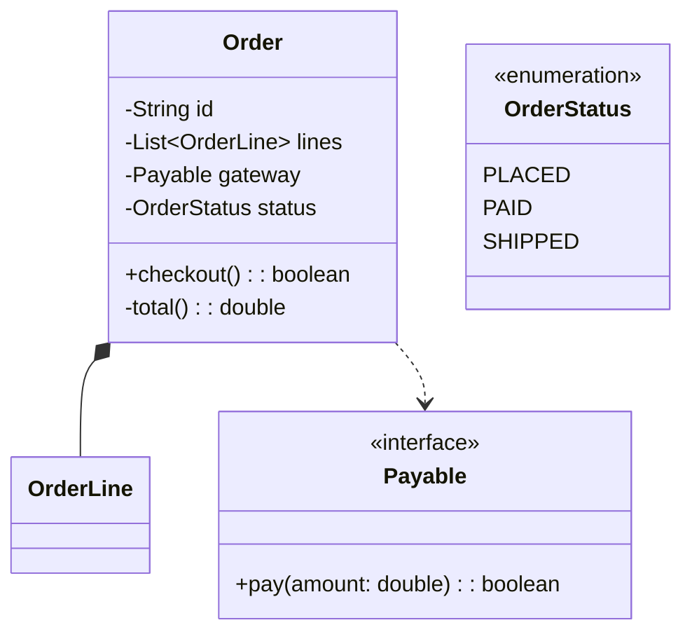
```mermaid
classDiagram
    class Order {
        -String id
        -List~OrderLine~ lines
        -Payable gateway
        -OrderStatus status
        +checkout(): boolean
        -total(): double
    }
    class OrderLine {
    }
    class Payable {
        <<interface>>
        +pay(amount: double): boolean
    }
    class OrderStatus {
        <<enumeration>>
        PLACED
        PAID
        SHIPPED
    }
    Order *-- OrderLine
    Order ..> Payable
```

---

### Sequence diagram - notation rules

The class diagram shows structure; the sequence diagram shows one conversation. Draw it for the hardest flow only (Step 3).

**Lifelines** (vertical dashed lines): actor, controller, services, repositories, external systems - in call order, left to right.

**Messages**:
- Solid arrow, filled head `->>`: synchronous call - caller waits.
- Dashed arrow `-->>`: return. Label it only when the value matters (fee, slot id).
- Stick arrow head `->>` in Mermaid is standard; `->` is also accepted.

**Frames**:
- `alt / else`: branches (payment approved / declined).
- `opt`: optional step.
- `loop`: retries, polling.
- `par`: parallel independent actions (fan-out to listeners).

**Notes**: yellow boxes for invariants - "debit BEFORE dispense". This is where the interviewer sees you think in guarantees, not just steps.

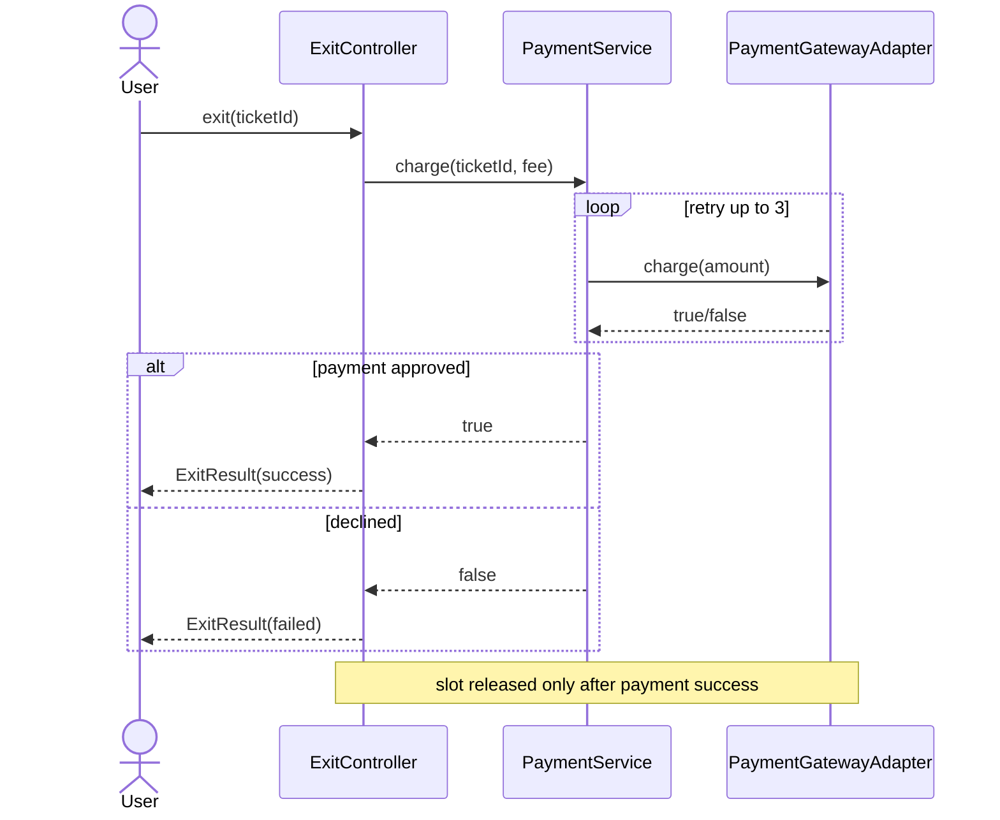
```mermaid
sequenceDiagram
    actor U as User
    participant C as ExitController
    participant P as PaymentService
    participant G as PaymentGatewayAdapter
    U->>C: exit(ticketId)
    C->>P: charge(ticketId, fee)
    loop retry up to 3
        P->>G: charge(amount)
        G-->>P: true/false
    end
    alt payment approved
        P-->>C: true
        C-->>U: ExitResult(success)
    else declined
        P-->>C: false
        C-->>U: ExitResult(failed)
    end
    Note over C,G: slot released only after payment success
```

### State diagram - notation rules

For any object with a lifecycle (order, ticket, signal, ride, driver).

- Rounded rectangles = states; ` [*] ` = initial, ` [*] ` after arrow = final.
- Arrow label = `event [guard] / action` - all three parts optional, but the guard is where correctness lives.
- A **note** stating the global invariant ("at most one green") is the highest-value thing on this diagram.

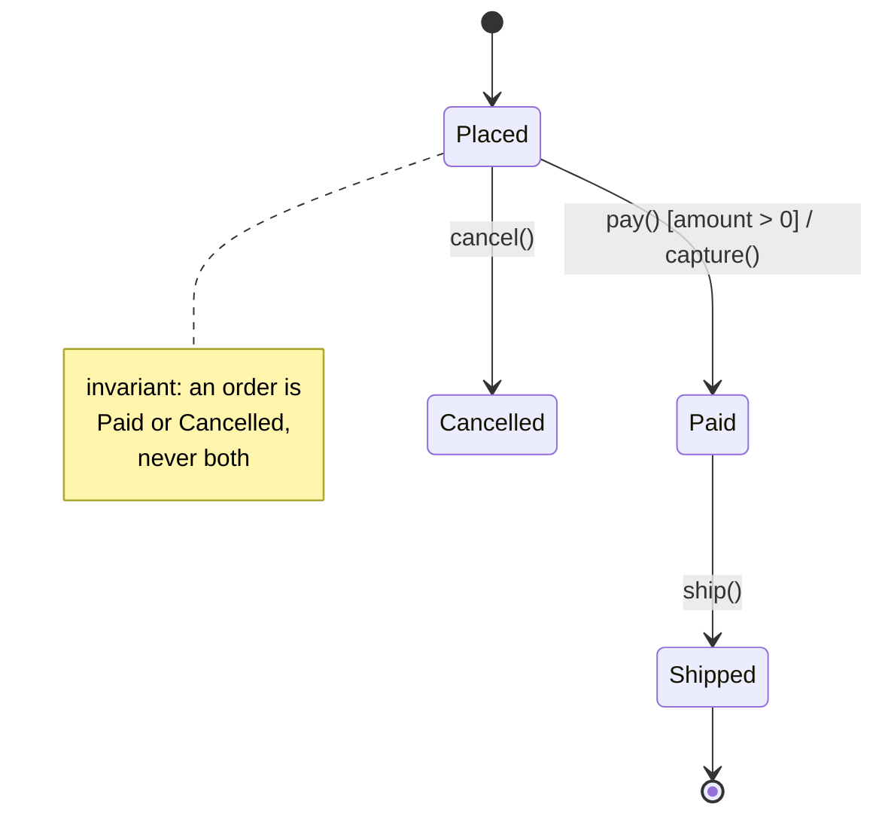
```mermaid
stateDiagram-v2
    [*] --> Placed
    Placed --> Paid : pay() [amount > 0] / capture()
    Placed --> Cancelled : cancel()
    Paid --> Shipped : ship()
    Shipped --> [*]
    note right of Placed
        invariant: an order is
        Paid or Cancelled,
        never both
    end note
```

### Activity diagram (the rare one)

A flowchart with decision diamonds - for multi-step processes spanning actors (refund flow, escalations). Mermaid: `flowchart TD` with `{decision}` rhombus nodes. Reach for it only if the interviewer asks "how does this process work end to end".

---

### Mermaid cheat sheet (UML -> Mermaid)

| UML element | Mermaid |
|---|---|
| class with compartments | `class Name { -field: Type +method(): T }` |
| interface / abstract / enum | `<<interface>>`, `<<abstract>>`, `<<enumeration>>` |
| inheritance | `Parent <\|-- Child` |
| realization | `Interface <\|.. Impl` |
| composition | `Whole *-- Part` |
| aggregation | `Whole o-- Part` |
| association | `A --> B` (add label with `A --> B : label`) |
| dependency | `A ..> B` |
| multiplicity | `A "1" --> "many" B` |
| sync call / return | `A->>B: call` / `B-->>A: value` |
| frame (alt/loop/opt) | `alt`, `else`, `loop`, `opt`, `par` blocks |
| note | `Note over A,B: text` |
| state | `stateDiagram-v2` with `state` and transitions |
| static method | append `$` in classDiagram members |
| generics | `Map~String, Ticket~` |

---

### How to draw under interview pressure

1. **Two minutes, conceptual**: boxes + relationships only, while talking through entities (Step 2).
2. **Pick the money flow**: one sequence diagram with alt/loop frames (Step 3). Label invariants in notes.
3. **One lifecycle object**: state diagram with guards and an invariant note (if the problem has a lifecycle - most do).
4. **Code time**: implementation-perspective class diagram of only the classes you will actually type. Erase everything else.

**Common mistakes that get dinged**
- Drawing all 15 classes before writing any code (time management).
- Arrows with no meaning: every arrow should be one of the six relationships - name which.
- Missing multiplicities where they matter (1 ticket -> exactly 1 slot).
- Public fields on domain classes (breaks encapsulation on paper).
- Sequence diagrams with no frames - branches and retries are where the design lives.

### Five-minute practice

Take `VendingMachine` (section 7) and draw from memory: (a) class diagram with composition `VendingMachine *-- Inventory` and realization `VendingMachineState <|.. HasMoneyState`, (b) sequence diagram of selectItem with an `alt` on sufficient vs insufficient funds, (c) state diagram with guards. Compare against section 7. Repeat with BookMyShow until the six relationships come out without thinking.

---
## F5. Multithreading and Concurrency - Complete Notes

### 1. The vocabulary (define crisply, in this order)
- **Race condition**: the outcome depends on the interleaving of unsynchronized accesses. Fix: make the critical section atomic.
- **Critical section**: code that touches shared mutable state; guard it end-to-end.
- **Thread-safe**: correct under any possible thread interleaving - say "any", it shows you mean it.
- The three things concurrency breaks: **atomicity** (interleaved writes lost), **visibility** (a thread sees a stale value), **ordering** (instructions reordered by JIT/CPU). `synchronized` fixes all three; `volatile` fixes visibility + ordering only.

### 2. Creating and running threads
```java
// Way 1: implements Runnable - preferred (decouples task from Thread machinery)
new Thread(() -> work()).start();
// Way 2: extends Thread - binds task to a thread, harder to pool later
// Way 3 (production): never new Thread - hand tasks to an ExecutorService (section 41)
```
`start()` creates a real OS thread and calls `run()` on it; calling `run()` directly is just a normal call on the current thread - a classic trick question.

**Lifecycle**: NEW -> RUNNABLE -> (BLOCKED on monitor | WAITING | TIMED_WAITING) -> TERMINATED.
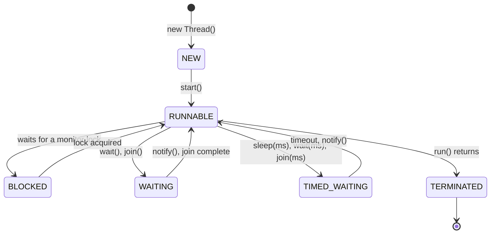
```mermaid
stateDiagram-v2
    [*] --> NEW : new Thread()
    NEW --> RUNNABLE : start()
    RUNNABLE --> BLOCKED : waits for a monitor lock
    RUNNABLE --> WAITING : wait(), join()
    RUNNABLE --> TIMED_WAITING : sleep(ms), wait(ms), join(ms)
    BLOCKED --> RUNNABLE : lock acquired
    WAITING --> RUNNABLE : notify(), join complete
    TIMED_WAITING --> RUNNABLE : timeout, notify()
    RUNNABLE --> TERMINATED : run() returns
    TERMINATED --> [*]
```
- `sleep(ms)`: holds the lock, just pauses. `wait()`: releases the lock and waits to be notified. Confusing these deadlocks your system.
- `join()`: caller blocks until the thread finishes (establishes happens-before with the joined thread's work).

### 3. The race, demonstrated
```java
class Counter {
    private int count = 0;
    void increment() { count++; }              // NOT atomic: read, add, write
}
// 2 threads x 10k increments -> result < 20k. Lost updates.
```
Fixes, weakest to strongest: `AtomicInteger.incrementAndGet()` -> `synchronized` method -> explicit `ReentrantLock`. Explain *why* each works in vocabulary terms (atomicity).

### 4. synchronized - the baseline
- Every object has a monitor; `synchronized(obj)` acquires it. Only one thread holds it; others block.
- `synchronized` method = monitor on `this`; `static synchronized` = monitor on the Class object (different locks - mixing them doesn't exclude each other).
- Reentrant: the same thread can re-acquire (nested synchronized on the same lock).
- JVM optimization path: biased -> lightweight -> heavyweight lock; contended locks get expensive (cache-line ping-pong), which is why lock-free and striped structures exist.

### 5. The Lock API - when synchronized is not enough
```java
Lock lock = new ReentrantLock();
lock.lock();
try { /* critical section */ } finally { lock.unlock(); }   // unlock MUST be in finally
```
`ReentrantLock` adds: `tryLock()`/`tryLock(timeout)` (never deadlock - back off instead), `lockInterruptibly()`, optional **fairness** (FIFO acquisition - costs throughput).
`ReadWriteLock` / `StampedLock`: parallel readers, exclusive writer - section 46 has the full internals and the starvation problem it solves.
Condition variables (`lock.newCondition()`): the notEmpty/notFull pair in section 42 - `await/signal` are the Lock-API twins of `wait/notify`.

### 6. volatile - the one-keyword trap
`volatile int x` = every read goes to main memory, every write is flushed. That fixes visibility, nothing else.
- `volatile` + compound action (`x++`) = still racy. Use `AtomicInteger` or a lock.
- Without volatile, the JIT may cache a field in a register forever (infinite-loop bugs that disappear under a debugger).
- Legit uses: shutdown flags, status markers, the reference half of DCL singletons.

### 7. Atomics and CAS - lock-free updates
`AtomicInteger/AtomicLong/AtomicReference/AtomicBoolean` expose CAS (compare-and-set): succeed only if the value is still what you expected, retry otherwise.
```java
while (true) {
    int cur = tokens.get();
    if (cur == 0) return false;
    if (tokens.compareAndSet(cur, cur - 1)) return true;   // no lock held; losers retry
}
```
- Pros: no blocking, no context switches. Cons: retry storms under heavy contention; ABA.
- **ABA**: value goes A -> B -> A; CAS succeeds though history changed. Harmless for counters; matters for pointer-style structures. Fix: `AtomicStampedReference` (attach a version).
- `AtomicReferenceFieldUpdater`: CAS on an existing field without a wrapper object - used in the parking lot's slot claim (section 1).

### 8. Concurrent collections - know what to reach for

| Collection | Guarantees | Use when |
|---|---|---|
| `ConcurrentHashMap` | atomic putIfAbsent/compute, lock-striped reads/writes | shared maps; the default choice |
| `CopyOnWriteArrayList` | reads lock-free, writes copy the array | read-mostly, small (listeners, routing tables) |
| `BlockingQueue` (Array/Linked, Priority, Delay) | blocking put/take, bounded option | every handoff: pools, crawlers, pipelines |
| `ConcurrentLinkedQueue` | lock-free queue | unbounded, non-blocking producers |

`ConcurrentHashMap.compute()` is the atomic read-modify-write you must use for claims (seat holds, idempotency stores) - get-then-put is still a race.

### 9. Deadlock - the four conditions, the practical fixes
Four Coffman conditions: mutual exclusion, hold-and-wait, no preemption, circular wait. All four must hold; break any one.
```java
// classic: two locks, opposite order -> circular wait
synchronized (walletA) { synchronized (walletB) { transfer(); } }   // thread 1
synchronized (walletB) { synchronized (walletA) { transfer(); } }   // thread 2 -> deadlock
```
Fixes, in order of preference:
1. **Global lock ordering** (always lock the smaller id first - section 19 does exactly this).
2. `tryLock` with timeout on both, releasing on failure (breaks hold-and-wait).
3. Coarser single lock (breaks circularity by collapsing the pair).
Detection in production: thread dumps (`jstack`), `ThreadMXBean.findDeadlockedThreads()`.

### 10. wait / notify - the discipline
- Must be inside `synchronized` on the same monitor; must be in a `while` loop (spurious wakeups + stolen signals); always pair `wait` with a state predicate.
- Prefer `BlockingQueue` and `Condition` over hand-rolled wait/notify in 2026 codebases - but know the discipline; interviews ask you to implement it (section 42).

### 11. Thread pools and the Executor framework
Never manage raw threads; manage tasks:
```java
ExecutorService pool = Executors.newFixedThreadPool(8);        // bounded, fixed
// or explicit: ThreadPoolExecutor(core, max, keepAlive, unit, queue, rejectionPolicy)
Future<Result> f = pool.submit(callable);                       // async result handle
Result r = f.get();                                             // blocks
pool.shutdown();                                                // drain then stop; never shutdownNow casually
```
- ThreadPoolExecutor params: core size, max size, keep-alive, work queue, rejection policy (Abort/CallerRuns/Discard). When the queue is full, the policy decides - backpressure lives here.
- `Callable` returns + throws; `Runnable` doesn't. `Future.get()` blocks; `isDone/cancel` for control.
- `CompletableFuture` (Java 8+): composing async stages (`thenApply/thenCompose/allOf`), non-blocking callbacks - mention as the modern tool; the interview depth target is still the pool + queue mechanics (sections 41-43).

### 12. ThreadLocal and its pitfalls
Thread-scoped variable: each thread sees its own copy (`MDC` in the logging framework is one).
- Pitfall 1: thread pools reuse threads - stale values leak into the next task. Always `try { ... } finally { MDC.clear(); }`.
- Pitfall 2: with `ExecutorService`, the task may run on a different thread - ThreadLocal doesn't propagate (use `InheritableThreadLocal` sparingly or explicit context passing).

### 13. Java Memory Model - happens-before in one breath
JMM defines when a write is guaranteed visible to another thread, via **happens-before** edges:
1. Monitor unlock -> subsequent lock on the same monitor.
2. volatile write -> subsequent volatile read of the same variable.
3. Thread start -> actions in the started thread. Thread completion -> `join` returning.
4. Task submission to an Executor -> the task's execution; task completion -> `Future.get` returning.
5. `final` field correctly-constructed object -> any thread that sees the reference sees the finals.
Safe publication = placing the object into shared state via one of these edges (concurrent collections, volatile, locks, static init). If your synchronization establishes happens-before, shared state is safe - say exactly that.

### 14. Design habits that remove concurrency bugs
- Favor immutability (section 45) - immutable objects need no synchronization.
- Keep critical sections tiny; prefer atomic single operations (`putIfAbsent`, `compute`) over compound ones.
- One owner per invariant (single matcher thread, single scheduler thread, one claim site) - then you barely need locks.
- Defensive copying over shared mutable state when the cost allows.
- Document the thread-safety policy of every class you write ("thread-confined", "immutable", "synchronized", " guarded by X").

### 15. Quick-fire questions
1. sleep vs wait? (holds lock vs releases it; static Thread method vs Object method)
2. Why is StringBuffer "synchronized" and StringBuilder not? (same API, different thread-safety; prefer Builder + local scope)
3. How do you stop a thread? (cooperative: interrupt + check flag; never Thread.stop())
4. What does double-checked locking need to be correct? (volatile; otherwise half-published object)
5. yield()? (hint to scheduler; same thread state, may be ignored)
6. How many threads? (CPU-bound: ~ cores; IO-bound: more; measure - Little's Law if you want to impress)

---

---

## F6. Exception and Error Handling - Complete Notes

### 1. The hierarchy (draw this from memory)
```
Throwable
 |-- Error                  (JVM-level, do NOT catch)
 |     |-- OutOfMemoryError
 |     |-- StackOverflowError
 |     +-- AssertionError
 +-- Exception
       |-- RuntimeException            (unchecked)
       |     |-- NullPointerException
       |     |-- IllegalArgumentException
       |     |-- IllegalStateException
       |     +-- ConcurrentModificationException
       +-- checked
             |-- IOException
             +-- SQLException
```
- **Checked**: compile-time enforced; for recoverable external conditions (file missing, DB down).
- **Unchecked (RuntimeException)**: programming errors; fix the code, don't catch broadly.
- **Error**: the JVM is broken; catching it buys nothing. (One nuance: catch ThreadDeath/OOSE only at the very top with logging, then re-exit.)

### 2. try-catch-finally semantics and the traps
```java
try { risky(); }
catch (SpecificException e) { handle(e); }
catch (IOException | SQLException e) { handle(e); }        // multi-catch
finally { cleanup(); }                                       // always runs (almost)
```
- finally runs whether or not an exception was thrown - except `System.exit()`, JVM crash, or the thread being killed.
- **Trap: return in finally overrides the return/exception from try** - never return from finally.
- **Trap: swallowing** - `catch (Exception e) {}` loses the signal; auto-ding. Minimum: log + context, or rethrow.
- **try-with-resources** (AutoCloseable) - the correct close idiom; handles exceptions in close, suppresses them properly:
```java
try (PrintWriter w = new PrintWriter(Files.newBufferedWriter(path))) {
    w.println(line);
}   // close called automatically; close() exceptions attached as suppressed
```
- Precise rethrow (Java 7+): `catch (IOException | SQLException e) { throw e; }` rethrows with the precise type, no `throws Exception` widening.

### 3. Throwing discipline - which exception, when

| Situation | Throw |
|---|---|
| Bad argument value | `IllegalArgumentException` |
| Method called in an invalid state | `IllegalStateException` |
| Required reference is null | `Objects.requireNonNull(x, "name")` (throws NPE with message) |
| Unsupported operation | `UnsupportedOperationException` |
| Business rule violated | a custom domain exception |
| External call failed transiently | wrap with context, let retry policy decide |

Custom exceptions (guidelines): extend RuntimeException for domain errors; carry typed context, not just a message; name them as events (`PaymentDeclinedException`, `SeatUnavailableException`).
```java
class PaymentDeclinedException extends RuntimeException {
    private final String reasonCode;
    PaymentDeclinedException(String reasonCode) { super("payment declined: " + reasonCode); this.reasonCode = reasonCode; }
    public String reasonCode() { return reasonCode; }
}
```

### 4. Exceptions vs Results - the LLD-level decision
Expected outcomes are not exceptions. Rule of thumb:
- **Result object** for business outcomes the caller must handle: payment declined, seat taken, no drivers. The flow continues meaningfully.
- **Exception** for broken assumptions: null ticket, corrupt state, invariant violated - someone must fix code or the world is on fire.

```java
ExitResult exit = controller.exitVehicle(ticketId);
if (!exit.success()) { routeToOverrideLane(exit); }      // business path
// vs
Ticket t = repo.findById(id).orElseThrow(() -> new TicketNotFoundException(id));  // broken assumption
```
Returning `null` or magic values (0, -1, "") is the rejected third option - say so explicitly.

### 5. Error-handling architecture (what you say in Step 7)
1. **Validate at the boundary** (controller/gateway): fail fast with domain exceptions before touching state.
2. **Guarded mutations**: every state transition checks preconditions (every `complete()/start()` in this book).
3. **Retry, bounded, with backoff + jitter**, only for transient failures, only for idempotent operations (or with an idempotency key):
```java
for (int attempt = 1; attempt <= MAX; attempt++) {
    try { return gateway.charge(id, amt); }
    catch (TransientPaymentException e) { sleep(backoff(attempt) + jitter()); }
}
throw new PaymentDeclinedException("RETRIES_EXHAUSTED");
```
4. **Circuit breaker** when a dependency is down: CLOSED (normal) -> OPEN (fail fast, skip the call) -> after cooldown HALF-OPEN (probe); recovery closes it. Stops retry storms from burning threads. Name it; implementing one is a bonus.
5. **Global handler at the edge**: web apps - `@ControllerAdvice` mapping exceptions to status codes; every layer below throws domain exceptions and stays clean.
6. **Log once, at the boundary, with the cause chain**: `log.error("exit failed for ticket {}", id, e)` - include the throwable, never log-and-rethrow (double logging).

### 6. Anti-patterns (name them when you see them)
- Swallowing (empty catch).
- Catching `Throwable`/`Exception` around code that can't throw it.
- Control flow via exceptions (loop termination with exceptions - use return/Optional).
- Over-using checked exceptions (every layer re-declares or wraps - fatigue; prefer unchecked for app code).
- Losing the cause: `throw new ServiceException("failed")` without the original exception chained - always `new X(msg, cause)`.

---

---

## F7. Java Essentials for LLD Rounds - Complete Notes

### 1. Records (Java 16+) - immutable data carriers
```java
record Money(BigDecimal amount, String currency) {
    Money {                                  // compact constructor - validation, no assignment syntax
        Objects.requireNonNull(amount);
        if (amount.signum() < 0) throw new IllegalArgumentException("negative");
    }
    Money add(Money o) { return new Money(amount.add(o.amount), currency); }   // new instance, always
}
```
- Free: constructor, accessors (`amount()` not `getAmount()`), equals/hashCode/toString.
- Caveat 1: **shallow immutability** - if a component is mutable (List, Date), the record is not deeply immutable - defensive-copy in the compact constructor (section 45).
- Caveat 2: serialization is field-based - renaming components breaks serialized forms.

### 2. Sealed classes + pattern-matching switch (Java 17+)
```java
sealed abstract class Transaction permits Withdrawal, Deposit, Transfer {}
// exhaustive switch with no default:
return switch (txn) {
    case Withdrawal w -> handleWithdrawal(w);
    case Deposit d    -> handleDeposit(d);
    case Transfer t   -> handleTransfer(t);
};
```
- Sealed hierarchies: closed sets with compiler-checked exhaustiveness - perfect for transactions, states, node types.
- Pattern matching in switch + `instanceof` (`if (o instanceof Money m)`) removes ceremony; when clauses add guards.

### 3. Optional - the rules
```java
public Optional<Ticket> findById(UUID id) { ... }          // as a RETURN type for may-absent
ticketOpt.orElseThrow(() -> new TicketNotFoundException(id));
ticketOpt.ifPresentOrElse(this::notify, this::noop);
```
- DO: return type, `orElse/orElseGet/orElseThrow`, `ifPresent`, `map/filter`.
- DON'T: fields, parameters, collections of Optionals; `opt.get()` without `isPresent` (use orElseThrow); `Optional.of(null)` (use `ofNullable`).
- `orElse(x)` always evaluates x; `orElseGet(() -> x)` is lazy - pass suppliers for expensive defaults.

### 4. Streams - transformations, not loops
- Intermediate ops (lazy): `filter, map, sorted, distinct, limit`.
- Terminal ops (eager): `collect, forEach, reduce, count, anyMatch`.
```java
List<String> names = orders.stream()
    .filter(o -> o.status() == PAID)
    .sorted(comparing(Order::total).reversed())
    .map(Order::customerName)
    .toList();                              // Java 16+ unmodifiable
```
- Side effects belong outside streams; `forEach` is for actions, not mutation of shared state (concurrency bug generator).
- `parallelStream()`: shared ForkJoinPool, only for CPU-heavy stateless work on big data - usually a mistake in app code.

### 5. Lambdas and functional interfaces
Four interfaces cover most cases: `Function<T,R>`, `Predicate<T>`, `Supplier<T>`, `Consumer<T>` (+ primitive variants). Lambdas capture only effectively-final variables (a closure over a changing loop variable won't compile - that's the point).
Method references as shorthand: `o -> o.getName()` -> `Order::getName`; `() -> new ArrayList<>()` -> `ArrayList::new`.

### 6. Generics and PECS
Type erasure: generics exist at compile time only (`List<String>` and `List<Integer>` share one class file) - no `new T()`, no `instanceof T`.
Wildcards: **PECS - Producer Extends, Consumer Super**.
```java
void copy(List<? extends Number> src, List<? super Number> dst) {   // read from src, write to dst
    for (Number n : src) dst.add(n);
}
```
`<? extends T>` = read T, can't add (producer). `<? super T>` = add T, reads as Object (consumer). Bounded type param when you need both: `<T extends Comparable<? super T>>`.

### 7. equals / hashCode / Comparable (recite + code)
```java
@Override public boolean equals(Object o) {
    if (this == o) return true;
    if (!(o instanceof Money m)) return false;
    return amount.compareTo(m.amount) == 0 && currency.equals(m.currency);
}
@Override public int hashCode() { return Objects.hash(amount, currency); }
```
Contract recap (F1): reflexive, symmetric, transitive, consistent; equal objects -> equal hash codes. Use the same fields in both. `Objects.hash` allocates an array - fine for entities, hand-roll in hot paths.
`Comparator` chains: `Comparator.comparing(Person::age).thenComparing(Person::name).reversed()`.

### 8. Date/Time API (java.time) - use it, not Date/Calendar
`Instant` (machine timestamp, UTC), `LocalDate/LocalTime/LocalDateTime` (human, no zone), `ZonedDateTime`, `Duration/Period` between them. All immutable and thread-safe.
Inject a `java.time.Clock` so tests and fee calculations control time (used in section 9's OverdueSpec).

### 9. Small but asked
- **String immutability + pool**: string literals are interned and shared; immutability makes sharing safe and hashing cacheable. `new String("x")` defeats the pool.
- **StringBuilder vs StringBuffer**: same API, Builder is not synchronized - prefer it (local scope needs no locking).
- **var** (Java 10+): local type inference; keeps types honest when obvious (`var map = new HashMap<String, Ticket>()`), avoid when it hides the type's meaning.
- **Text blocks** (Java 15+): `""" ... """` for multi-line SQL/JSON - cleaner, keeps indentation rules.
- **enum with behavior**: constants that carry methods (parking lot's `fits()` alternative: put fit logic on the enum) - the OCP-friendly middle ground.

### 10. The Java-8-to-21 toolbelt, mapped to this book

| Feature | Where it earns its place in LLD |
|---|---|
| Records | Money, Location, Trade, LogRecord - every value object |
| Sealed + switch | Transaction/Command/Node hierarchies with exhaustive handling |
| Optional | Repository lookups, config reads |
| Streams + collectors | filtering (Specification), aggregation (balances, royalties) |
| Lambdas/method refs | Strategy one-liners, listeners, comparators |
| java.time + Clock | fees, due dates, TTLs - testable time |
| ExecutorService | every "who runs this" question |
| ConcurrentHashMap.compute | every atomic claim in the book |

---
*Foundations feed every topic: OOP/SOLID -> Step 6 tables, patterns -> Step 6 decisions, UML -> Steps 2-4 and 8, concurrency -> every atomic claim and lock in Part 3-4, exception strategy -> Step 7 tables.*

---
# PART 1

---

## 1. Parking Lot - Design

### Step 1: Clarify Requirements

**Functional (confirm with interviewer)**
- FR-1 Entry: vehicle arrives -> assign smallest-sufficient free slot by type -> generate ticket (id, plate, slot, entryTime) -> mark slot occupied.
- FR-2 Exit: scan ticket -> compute fee (hourly per vehicle type with daily cap) -> process payment with retry -> release slot -> deactivate ticket -> return receipt.
- FR-3 Admin: add/edit floors and slots, update pricing rules, view live status, override lost-ticket exits.

**Non-functional**
- Consistency first: two gates never double-book a slot (correctness over throughput).
- Availability: entry/exit must work when the payment gateway is down (defer payment, don't block the gate).
- Extensibility: new vehicle type or new payment gateway = new class, no edits to core flow.
- Latency: entry decision < 100ms; fee calc pure and testable.

**Edge cases (Step 7 owns the full table)**: payment failure, lost ticket, clock skew, vehicle type incompatible with assigned slot.

### Step 2: Core Entities and Relationships (class diagram below)

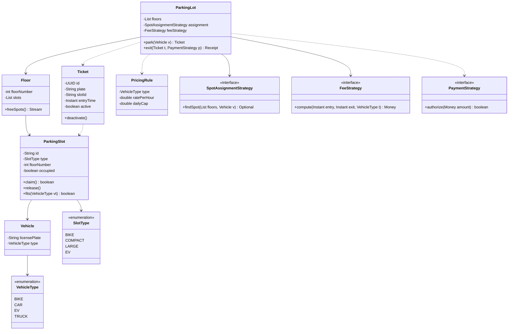
```mermaid
classDiagram
    class Vehicle {
        -String licensePlate
        -VehicleType type
    }
    class VehicleType {
        <<enumeration>>
        BIKE
        CAR
        EV
        TRUCK
    }
    class ParkingSlot {
        -String id
        -SlotType type
        -int floorNumber
        -boolean occupied
        +claim() boolean
        +release()
        +fits(VehicleType vt) boolean
    }
    class SlotType {
        <<enumeration>>
        BIKE
        COMPACT
        LARGE
        EV
    }
    class Floor {
        -int floorNumber
        -List slots
        +freeSpots() Stream
    }
    class Ticket {
        -UUID id
        -String plate
        -String slotId
        -Instant entryTime
        -boolean active
        +deactivate()
    }
    class PricingRule {
        -VehicleType type
        -double ratePerHour
        -double dailyCap
    }
    class ParkingLot {
        -List floors
        -SpotAssignmentStrategy assignment
        -FeeStrategy feeStrategy
        +park(Vehicle v) Ticket
        +exit(Ticket t, PaymentStrategy p) Receipt
    }
    class SpotAssignmentStrategy {
        <<interface>>
        +findSpot(List floors, Vehicle v) Optional
    }
    class FeeStrategy {
        <<interface>>
        +compute(Instant entry, Instant exit, VehicleType t) Money
    }
    class PaymentStrategy {
        <<interface>>
        +authorize(Money amount) boolean
    }
    ParkingLot --> Floor
    ParkingLot --> SpotAssignmentStrategy
    ParkingLot --> FeeStrategy
    Floor --> ParkingSlot
    ParkingSlot --> Vehicle
    ParkingLot ..> Ticket
    ParkingLot ..> PricingRule
    Ticket ..> ParkingSlot
    ParkingLot ..> PaymentStrategy
    Vehicle --> VehicleType
    ParkingSlot --> SlotType
```

| Entity | Key attributes |
|---|---|
| Vehicle | id, licensePlate, vehicleType (enum) |
| ParkingSlot | id, slotType (enum), occupied, floorNumber |
| Floor | id, floorNumber, slots |
| Ticket | id, vehicleId, slotId, entryTime, active |
| Receipt | id, ticketId, exitTime, totalFee, paymentStatus |
| PricingRule | vehicleType, ratePerHour, dailyCap |
| Payment | ticketId, amount, gateway, status |

### Step 3: Interaction Flows

Entry: vehicle arrives -> SlotService finds smallest-sufficient free slot (atomic claim) -> TicketService generates ticket -> slot marked occupied -> EntryResult returned.
Exit: ticket scanned -> PricingService computes fee -> PaymentService charges via gateway adapter (bounded retry) -> SlotService releases slot -> TicketService deactivates -> ReceiptService builds receipt -> ExitResult returned.

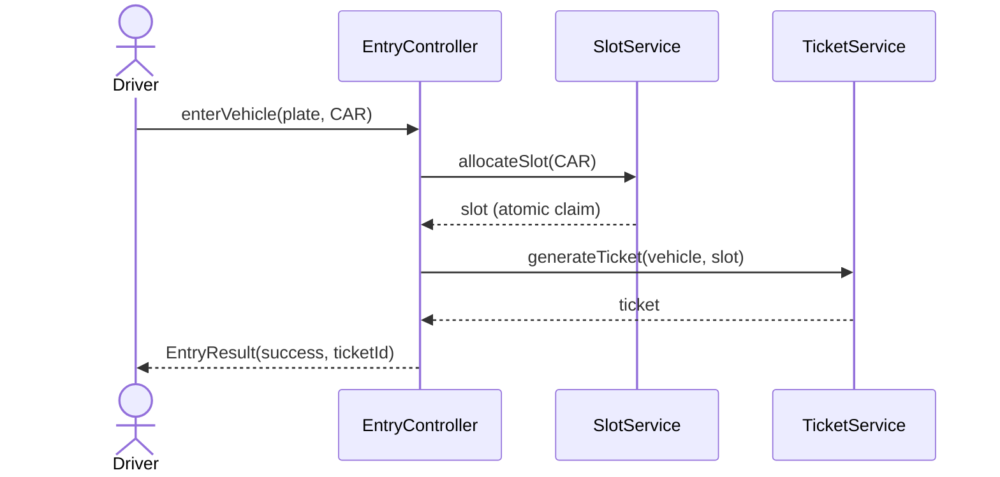
```mermaid
sequenceDiagram
    actor D as Driver
    participant EC as EntryController
    participant SS as SlotService
    participant TS as TicketService
    D->>EC: enterVehicle(plate, CAR)
    EC->>SS: allocateSlot(CAR)
    SS-->>EC: slot (atomic claim)
    EC->>TS: generateTicket(vehicle, slot)
    TS-->>EC: ticket
    EC-->>D: EntryResult(success, ticketId)
```

### Step 4: Class Structure and Layers

Client -> Controller -> Service -> Repository -> Domain, with an `adapter` package for payment gateways.

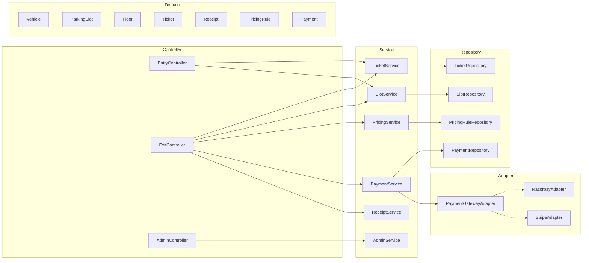
```mermaid
flowchart LR
    subgraph Controller
        EC["EntryController"]
        XC["ExitController"]
        AC["AdminController"]
    end
    subgraph Service
        TS["TicketService"]
        SS["SlotService"]
        PS["PricingService"]
        PAYS["PaymentService"]
        RS["ReceiptService"]
        ADS["AdminService"]
    end
    subgraph Repository
        TR["TicketRepository"]
        SR["SlotRepository"]
        PR["PricingRuleRepository"]
        PAYR["PaymentRepository"]
    end
    subgraph Domain
        V["Vehicle"]
        SL["ParkingSlot"]
        F["Floor"]
        T["Ticket"]
        R["Receipt"]
        PRU["PricingRule"]
        PAY["Payment"]
    end
    subgraph Adapter
        GA["PaymentGatewayAdapter"]
        RZ["RazorpayAdapter"]
        ST["StripeAdapter"]
    end
    EC --> TS
    EC --> SS
    XC --> TS
    XC --> SS
    XC --> PS
    XC --> PAYS
    XC --> RS
    AC --> ADS
    TS --> TR
    SS --> SR
    PS --> PR
    PAYS --> PAYR
    PAYS --> GA
    GA -.-> RZ
    GA -.-> ST
```

**Key design decisions** (Steps 4 + 6):
1. **Strategy for pricing**: `PricingStrategy` per vehicle type (hourly-with-cap, flat). PricingService delegates; new rule = new class (OCP).
2. **Adapter for payment**: `PaymentGatewayAdapter` interface; Razorpay/Stripe plug in without touching PaymentService (DIP + OCP).
3. **Repository interfaces**: services never see a Map - swapping in a DB changes zero service code (DIP, Repository pattern).
4. **Atomic slot claim** lives in SlotService, the one place a slot flips free->occupied (SRP - the race has exactly one owner).
5. **Result DTOs**: EntryResult/ExitResult keep controllers honest about what the client gets back.

### Step 5: Core Use Cases (call mapping)

- enterVehicle(): EntryController -> SlotService.allocateSlot() -> TicketService.generateTicket() -> TicketRepository.save() -> return EntryResult.
- exitVehicle(): ExitController -> TicketService.getTicket() -> PricingService.calculateFee() -> PaymentService.processPaymentWithRetry() -> SlotService.releaseSlot() -> TicketService.deactivate() -> return ExitResult.
- admin: addFloor/addSlot/updatePricingRule -> AdminService -> respective repositories.

### Step 6: Patterns and SOLID

| Decision | Pattern | SOLID |
|---|---|---|
| Fee rules vary per type | Strategy | OCP |
| Payment gateways swappable | Adapter | DIP, OCP |
| Data access hidden behind interfaces | Repository | DIP |
| Slot claim in one place | - | SRP |
| Gateway interface kept role-only | - | ISP |

### Step 7: Edge Cases

| Edge case | Strategy |
|---|---|
| Payment failure | Bounded retry (3 tries + backoff) through the adapter; on final failure, route to admin override lane and mark payment PENDING - availability beats blocking the gate |
| Lost ticket | Admin override: find active ticket by plate, charge from entry time or daily max |
| Clock skew | Inject a Clock; one time source for entry/exit timestamps |
| Slot state mismatch | Reconciliation job: sweep occupied slots with no active ticket |
| Double entry (same plate) | Reject: one active ticket per plate |

### Step 8: Package Structure and Class Diagram

```
com.parkinglot
  controller/  EntryController, ExitController, AdminController
  service/     TicketService, SlotService, PricingService, PaymentService, ReceiptService, AdminService
  repository/  TicketRepository, SlotRepository, PricingRuleRepository, PaymentRepository (+ in-memory impls)
  domain/      Vehicle, ParkingSlot, Floor, Ticket, Receipt, PricingRule, Payment + enums
  adapter/     PaymentGatewayAdapter, RazorpayAdapter, StripeAdapter
  dto/         EntryResult, ExitResult
```

---

## 2. Parking Lot - Code

### Step 9: Code (Java)

> Class diagram, interaction flows, and edge cases: see the **Design** section above. This section is the Step 9 code.

```java
// ============================ domain ============================
enum VehicleType { BIKE, CAR, EV, TRUCK }
enum SlotType { BIKE, COMPACT, LARGE, EV }
enum PaymentStatus { PENDING, SUCCESS, FAILED }

class Vehicle {
    private final String licensePlate; private final VehicleType type;
    Vehicle(String p, VehicleType t) { licensePlate = p; type = t; }
    public VehicleType getType() { return type; }
}

class ParkingSlot {
    private final String id; private final SlotType type; private final int floorNumber;
    private volatile boolean occupied;
    ParkingSlot(String id, SlotType t, int floor) { this.id = id; type = t; floorNumber = floor; }
    public boolean claim() { return !occupied && OCCUPIED.compareAndSet(this, false, true); }
    public void release() { OCCUPIED.set(this, false); }
    public boolean fits(VehicleType vt) {
        return switch (vt) {
            case BIKE -> true;
            case CAR  -> type == SlotType.COMPACT || type == SlotType.LARGE;
            case EV   -> type == SlotType.EV || type == SlotType.LARGE;
            case TRUCK-> type == SlotType.LARGE;
        };
    }
    private static final AtomicReferenceFieldUpdater<ParkingSlot, Boolean> OCCUPIED =
        AtomicReferenceFieldUpdater.newUpdater(ParkingSlot.class, Boolean.class, "occupied");
}

class Ticket {
    private final UUID id; private final String plate; private final String slotId;
    private final Instant entryTime; private boolean active = true;
    Ticket(String plate, String slotId) { id = UUID.randomUUID(); this.plate = plate; this.slotId = slotId; entryTime = Instant.now(); }
    public UUID getId() { return id; }
    public boolean isActive() { return active; }
    public void deactivate() { active = false; }
    public Instant getEntryTime() { return entryTime; }
    public String getSlotId() { return slotId; }
}

class PricingRule {
    private final VehicleType type; private final double ratePerHour; private final double dailyCap;
    PricingRule(VehicleType t, double hourly, double cap) { type = t; ratePerHour = hourly; dailyCap = cap; }
    public VehicleType getType() { return type; }
    public double perHour() { return ratePerHour; }
    public double cap() { return dailyCap; }
}

// ============================ repository ============================
interface TicketRepository {
    Ticket save(Ticket t); Optional<Ticket> findById(UUID id); List<Ticket> findActiveByPlate(String plate);
}
interface SlotRepository {
    ParkingSlot save(ParkingSlot s); List<ParkingSlot> findAll(); Optional<ParkingSlot> findById(String id);
}
interface PricingRuleRepository { Optional<PricingRule> findByVehicleType(VehicleType t); PricingRule save(PricingRule r); }

class InMemoryTicketRepository implements TicketRepository {
    private final Map<UUID, Ticket> store = new ConcurrentHashMap<>();
    public Ticket save(Ticket t) { store.put(t.getId(), t); return t; }
    public Optional<Ticket> findById(UUID id) { return Optional.ofNullable(store.get(id)); }
    public List<Ticket> findActiveByPlate(String plate) {
        return store.values().stream().filter(t -> t.isActive()).toList();
    }
}
class InMemorySlotRepository implements SlotRepository {
    private final Map<String, ParkingSlot> slots = new ConcurrentHashMap<>();
    public ParkingSlot save(ParkingSlot s) { slots.put(s.toString(), s); return s; }
    public List<ParkingSlot> findAll() { return List.copyOf(slots.values()); }
    public Optional<ParkingSlot> findById(String id) { return Optional.ofNullable(slots.get(id)); }
}
class InMemoryPricingRuleRepository implements PricingRuleRepository {
    private final Map<VehicleType, PricingRule> rules = new ConcurrentHashMap<>();
    public Optional<PricingRule> findByVehicleType(VehicleType t) { return Optional.ofNullable(rules.get(t)); }
    public PricingRule save(PricingRule r) { rules.put(r.getType(), r); return r; }
}

// ============================ adapter ============================
interface PaymentGatewayAdapter { boolean charge(UUID ticketId, double amount); }
class RazorpayAdapter implements PaymentGatewayAdapter {
    public boolean charge(UUID ticketId, double amount) { return true; }
}
class StripeAdapter implements PaymentGatewayAdapter {
    public boolean charge(UUID ticketId, double amount) { return true; }
}

// ============================ service ============================
class SlotService {
    private final SlotRepository slotRepository;
    SlotService(SlotRepository r) { slotRepository = r; }

    /** Smallest-sufficient free slot, claimed atomically. The race has ONE owner: here. */
    public Optional<ParkingSlot> allocateSlot(VehicleType type) {
        return slotRepository.findAll().stream()
            .filter(s -> s.fits(type))
            .sorted(Comparator.comparing(s -> s.fits(type)))
            .filter(ParkingSlot::claim)
            .findFirst();
    }
    public void releaseSlot(String slotId) {
        slotRepository.findById(slotId).ifPresent(ParkingSlot::release);
    }
}

class TicketService {
    private final TicketRepository ticketRepository;
    TicketService(TicketRepository r) { ticketRepository = r; }
    public Ticket generateTicket(String plate, ParkingSlot slot) {
        return ticketRepository.save(new Ticket(plate, slot.toString()));
    }
    public Ticket getTicket(UUID id) { return ticketRepository.findById(id).orElseThrow(); }
    public void deactivate(UUID id) { ticketRepository.findById(id).ifPresent(Ticket::deactivate); }
}

class PricingService {
    private final PricingRuleRepository ruleRepository;
    PricingService(PricingRuleRepository r) { ruleRepository = r; }

    public double calculateFee(Ticket ticket, VehicleType type, Instant now) {
        PricingRule rule = ruleRepository.findByVehicleType(type).orElseThrow();
        long hours = Math.max(1, Duration.between(ticket.getEntryTime(), now).toHours());
        return Math.min(hours * rule.perHour(), rule.cap());
    }
}

class PaymentService {
    private final PaymentGatewayAdapter gateway;
    PaymentService(PaymentGatewayAdapter g) { gateway = g; }

    public boolean processPaymentWithRetry(UUID ticketId, double amount, int maxRetries) {
        for (int attempt = 1; attempt <= maxRetries; attempt++) {
            if (gateway.charge(ticketId, amount)) return true;
            sleepBackoff(attempt);
        }
        return false;
    }
    private void sleepBackoff(int attempt) { try { Thread.sleep(100L * attempt); } catch (InterruptedException ignored) {} }
}

// ============================ dto ============================
record EntryResult(boolean success, UUID ticketId, String message) {}
record ExitResult(boolean success, UUID ticketId, double fee, String message) {}

// ============================ controller ============================
class EntryController {
    private final TicketService ticketService; private final SlotService slotService;
    EntryController(TicketService ts, SlotService ss) { ticketService = ts; slotService = ss; }

    public EntryResult enterVehicle(String licensePlate, VehicleType type) {
        Optional<ParkingSlot> slot = slotService.allocateSlot(type);
        if (slot.isEmpty()) return new EntryResult(false, null, "Lot full for " + type);
        Ticket ticket = ticketService.generateTicket(licensePlate, slot.get());
        return new EntryResult(true, ticket.getId(), "Proceed to " + slot);
    }
}

class ExitController {
    private final TicketService ticketService; private final SlotService slotService;
    private final PricingService pricingService; private final PaymentService paymentService;
    ExitController(TicketService ts, SlotService ss, PricingService ps, PaymentService pays) {
        ticketService = ts; slotService = ss; pricingService = ps; paymentService = pays;
    }

    public ExitResult exitVehicle(UUID ticketId) {
        Ticket ticket = ticketService.getTicket(ticketId);
        if (!ticket.isActive()) return new ExitResult(false, ticketId, 0, "Ticket already used");
        double fee = pricingService.calculateFee(ticket, VehicleType.CAR, Instant.now());
        if (!paymentService.processPaymentWithRetry(ticketId, fee, 3))
            return new ExitResult(false, ticketId, fee, "Payment failed - use admin override lane");
        slotService.releaseSlot(ticket.getSlotId());
        ticketService.deactivate(ticketId);
        return new ExitResult(true, ticketId, fee, "Paid, gate open");
    }
}
```

**Key talking points**: controllers are ~10 lines each because every decision lives in a service (SRP); payment failure returns a business result, not an exception - the gate flow stays available; repositories are interfaces so the file runs in-memory today and against a database tomorrow with zero service changes.

---
## 3. Logging Framework - Design

### Step 1: Clarify Requirements

**Actors:** Application threads (producers), Ops/Admin (config), Log consumers (files, Kafka, dashboards).

**Functional Requirements**
- FR-1: `logger.info/warn/error(...)` with levels TRACE→FATAL; message below threshold is discarded cheaply.
- FR-2: Multiple appenders (console, rolling file, remote); each appender has its own layout + filters.
- FR-3: Async path: app thread never blocks on I/O; ordering preserved per appender.
- FR-4: Contextual data (request-id, user) travels with the record (MDC).
- FR-5: Graceful shutdown flushes queued records.

**Non-Functional Requirements**
- NFR-1: Hot-path cost near-zero when level disabled; allocation only on enabled path.
- NFR-2: Bounded memory regardless of downstream slowness (queue cap + drop policy).
- NFR-3: Throughput: 100k+ records/sec on one node (async pipeline).

*Edge-case strategies: table in Step 7 below.*

### Step 3: Interaction Flows

App thread calls logger.info() -> level check -> LogRecord built with MDC snapshot -> offered to the bounded queue (non-blocking) -> worker takes, runs filter chain, formats, appends.

### Step 4: Class Structure and Layers

A framework, not an app: Logger/LogManager form the client-facing entry, Appender is the SPI (console/file/async) with per-appender Layout and filters. No controllers or repositories.

### Step 5: Core Use Cases

log(): Logger -> filters -> AsyncAppender.offer -> worker -> delegate append. close(): shutdown flag -> interrupt -> drain -> close appenders.

### Architecture

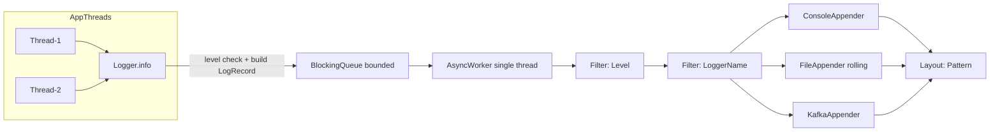
```mermaid
flowchart LR
 subgraph AppThreads
 T1["Thread-1"] --> L1["Logger.info"]
 T2["Thread-2"] --> L1
 end
 L1 -->|level check + build LogRecord| Q["BlockingQueue bounded"]
 Q --> W["AsyncWorker single thread"]
 W --> F1["Filter: Level"]
 F1 --> F2["Filter: LoggerName"]
 F2 --> A1["ConsoleAppender"]
 F2 --> A2["FileAppender rolling"]
 F2 --> A3["KafkaAppender"]
 A1 --> LY["Layout: Pattern"]
 A2 --> LY["Layout: Pattern"]
 A3 --> LY["Layout: Pattern"]
```

### Step 2: Core Entities and Relationships (Class diagram)

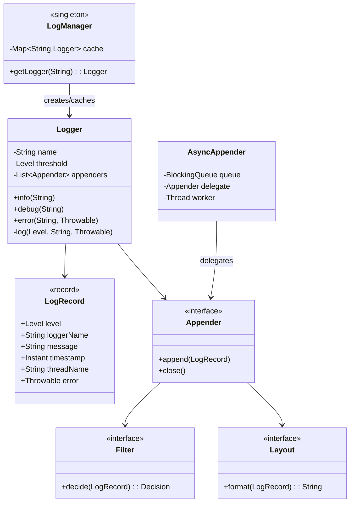
```mermaid
classDiagram
 class Logger {
 -String name
 -Level threshold
 -List~Appender~ appenders
 +info(String)
 +debug(String)
 +error(String, Throwable)
 -log(Level, String, Throwable)
 }
 class LogManager {
 <<singleton>>
 -Map~String,Logger~ cache
 +getLogger(String): Logger
 }
 class LogRecord {
 <<record>>
 +Level level
 +String loggerName
 +String message
 +Instant timestamp
 +String threadName
 +Throwable error
 }
 class Appender {
 <<interface>>
 +append(LogRecord)
 +close()
 }
 class AsyncAppender {
 -BlockingQueue queue
 -Appender delegate
 -Thread worker
 }
 class Filter {
 <<interface>>
 +decide(LogRecord): Decision
 }
 class Layout {
 <<interface>>
 +format(LogRecord): String
 }
 Logger --> LogRecord
 Logger --> Appender
 AsyncAppender --> Appender : delegates
 Appender --> Filter
 Appender --> Layout
 LogManager --> Logger : creates/caches
```

### Sequence - the async handoff (THE diagram to draw)

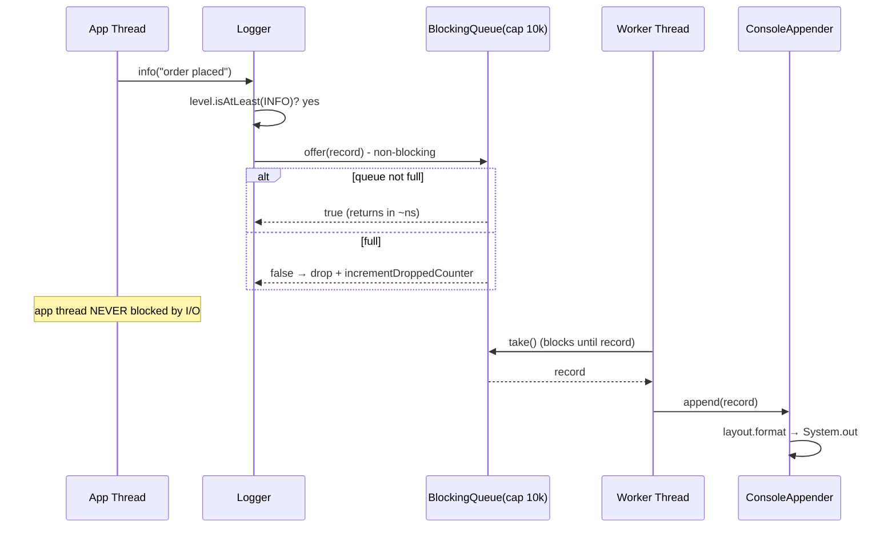
```mermaid
sequenceDiagram
 participant T as App Thread
 participant LG as Logger
 participant Q as BlockingQueue(cap 10k)
 participant W as Worker Thread
 participant C as ConsoleAppender

 T->>LG: info("order placed")
 LG->>LG: level.isAtLeast(INFO)? yes
 LG->>Q: offer(record) - non-blocking
 alt queue not full
 Q-->>LG: true (returns in ~ns)
 else full
 Q-->>LG: false → drop + incrementDroppedCounter
 end
 Note over T: app thread NEVER blocked by I/O
 W->>Q: take() (blocks until record)
 Q-->>W: record
 W->>C: append(record)
 C->>C: layout.format → System.out
```

### Step 6: Design Decisions, Patterns and SOLID

1. **Level check BEFORE object allocation** - the hot path must allocate nothing on disabled levels. (Modern JVMs scalar-replace anyway, but the intent matters.)
2. **Immutability end-to-end**: `LogRecord` is a Java `record`; passed across the queue without defensive copies.
3. **Bounded queue + offer() = explicit backpressure policy**. Alternatives: blocking put (app stalls - dangerous), unbounded (OOM risk), drop-oldest (better for metrics than drop-newest). Know all three and their trade-offs.
4. **Appender chain ordering**: layout/filter per appender (console wants color, file wants ISO timestamps) - don't share mutable formatters across appenders.
5. **Rolling file appender**: size-based (`>100MB`) or time-based (daily); rollover must be atomic w.r.t. writers → single-writer thread guarantees this.
6. **MDC (Mapped Diagnostic Context)**: `ThreadLocal<Map<String,String>>` carrying request-id/user-id; copied into record at capture time (never read later - thread reuse!). Mentioning MDC is a strong signal.

### Step 8: Package Structure and Class Diagram

Packages: `domain/` (entities and enums), `service/` (business logic and state machines), `repository/` (persistence interfaces, in-memory impls for the interview), `adapter/` (external systems - only where the topic has any), `dto/` (result objects). Include only what the topic uses. Class diagram: see the diagram blocks above.

### Step 7: Edge Cases

- Queue full → drop with counter (or block/oldest-drop per policy); never OOM.
- Exception attached → stack trace captured at call site (throwable reference), rendered by layout.
- Thread pool reuse → MDC must be snapshotted at capture, not read at write time.
- Rollover mid-write → single-writer thread makes rollover atomic for readers.
- Config reload at runtime → no restart, no lost records.

---

### Follow-up deep-dives
- *How does log4j2 get 10x throughput?* - LMAX Disruptor ring buffer: lock-free, cache-line padded, single consumer; sequence counters instead of locks.
- *Exactly-once to Kafka?* - idempotent producer + transactional appender; at-least-once + dedup key (record id) otherwise.
- *Sampling*: at DEBUG in prod, sample 1/1000 via probabilistic filter to bound volume.

---

## 4. Logging Framework - Code

### Step 9: Code (Java)

> Class diagram, interaction flows, and edge cases: see the **Design** section above. This section is the Step 9 code.

```java
enum Level { TRACE(0), DEBUG(1), INFO(2), WARN(3), ERROR(4), FATAL(5);
    final int priority; Level(int p){ priority = p; }
    boolean isAtLeast(Level o){ return priority >= o.priority; } }

record LogRecord(Level level, String loggerName, String message,
                 Instant timestamp, String threadName, long threadId,
                 Map<String,String> mdc, Throwable error) {
    static LogRecord capture(Level lvl, String name, String msg, Throwable t) {
        Map<String,String> mdcCopy = Map.copyOf(MDC.get()); // snapshot NOW
        Thread th = Thread.currentThread();
        return new LogRecord(lvl, name, msg, Instant.now(), th.getName(), th.threadId(), mdcCopy, t);
    }
}

// MDC - ThreadLocal diagnostic context
final class MDC {
    private static final ThreadLocal<Map<String,String>> CTX = ThreadLocal.withInitial(HashMap::new);
    static void put(String k, String v){ CTX.get().put(k, v); }
    static void clear(){ CTX.remove(); }
    static Map<String,String> get(){ return CTX.get(); }
}

// ---------- Filter chain (Chain of Responsibility) ----------
enum Decision { ACCEPT, NEUTRAL, DENY }
interface Filter { Decision decide(LogRecord r); }
class LevelFilter implements Filter {
    private final Level min;
    LevelFilter(Level min){ this.min = min; }
    public Decision decide(LogRecord r){ return r.level().isAtLeast(min) ? Decision.NEUTRAL : Decision.DENY; }
}
class ThresholdFilter implements Filter { // allows AND-composition
    private final List<Filter> chain;
    ThresholdFilter(List<Filter> chain){ this.chain = chain; }
    public Decision decide(LogRecord r) {
        for (Filter f : chain) if (f.decide(r) == Decision.DENY) return Decision.DENY;
        return Decision.NEUTRAL;
    }
}

// ---------- Layout ----------
interface Layout { String format(LogRecord r); }
class PatternLayout implements Layout {
    public String format(LogRecord r) {
        String mdc = r.mdc().isEmpty() ? "" : " " + r.mdc();
        String err = r.error() == null ? "" : "\n" + stackTrace(r.error());
        return r.timestamp() + " " + r.level() + " [" + r.threadName() + "] "
             + r.loggerName() + " - " + r.message() + mdc + err;
    }
    private String stackTrace(Throwable t){ /* StringWriter + printStackTrace */ return t.toString(); }
}

// ---------- Appenders ----------
interface Appender extends AutoCloseable {
    void append(LogRecord r);
    default void close() {}
}

class ConsoleAppender implements Appender {
    private final Layout layout;
    ConsoleAppender(Layout l){ layout = l; }
    public void append(LogRecord r){ System.out.println(layout.format(r)); }
}

class RollingFileAppender implements Appender {
    private final Layout layout;
    private final Path baseFile;
    private final long maxBytes;
    private volatile PrintWriter out;
    private final AtomicLong written = new AtomicLong();

    RollingFileAppender(Layout l, Path f, long max){ layout = l; baseFile = f; maxBytes = max; open(); }

    public void append(LogRecord r) {
        String line = layout.format(r);
        PrintWriter w = out;
        w.println(line); w.flush(); // durability vs perf: configurable
        if (written.addAndGet(line.length()) > maxBytes) rollover();
    }
    private synchronized void rollover() {
        out.close();
        Path rolled = baseFile.resolveSibling(baseFile.getFileName() + "." + Instant.now().toEpochMilli());
        try { Files.move(baseFile, rolled, StandardCopyOption.REPLACE_EXISTING); } catch (IOException ignored) {}
        written.set(0); open();
    }
    private void open(){ try { out = new PrintWriter(Files.newBufferedWriter(baseFile,
        StandardOpenOption.CREATE, StandardOpenOption.APPEND)); } catch (IOException e){ throw new UncheckedIOException(e);} }
}

// ---------- Async appender: bounded + drop policy ----------
interface OverflowPolicy { boolean onOverflow(LogRecord dropped); }
class DropNewest implements OverflowPolicy {
    private final LongAdder dropped = new LongAdder();
    public boolean onOverflow(LogRecord r){ dropped.increment(); return false; } // false = don't block
    long droppedCount(){ return dropped.sum(); }
}

class AsyncAppender implements Appender {
    private final BlockingQueue<LogRecord> queue;
    private final Appender delegate;
    private final OverflowPolicy overflow;
    private final Thread worker;
    private volatile boolean running = true;

    AsyncAppender(Appender delegate, int capacity, OverflowPolicy policy) {
        this.delegate = delegate; this.overflow = policy;
        this.queue = new LinkedBlockingQueue<>(capacity);
        this.worker = Thread.ofPlatform().daemon().name("log-worker").start(this::drain);
    }
    public void append(LogRecord r) {
        if (!queue.offer(r)) overflow.onOverflow(r); // never blocks app thread
    }
    private void drain() {
        while (running || !queue.isEmpty()) {
            try { delegate.append(queue.poll(100, TimeUnit.MILLISECONDS)); }
            catch (InterruptedException e) { Thread.currentThread().interrupt(); }
        }
        delegate.close();
    }
    public void close(){ running = false; worker.interrupt(); }
}

// ---------- Logger + Manager ----------
class Logger {
    private final String name;
    private final Level threshold;
    private final List<Appender> appenders;
    Logger(String n, Level t, List<Appender> a){ name = n; threshold = t; appenders = List.copyOf(a); }

    public boolean isInfoEnabled(){ return Level.INFO.isAtLeast(threshold); }
    public void info(String msg){ if (isInfoEnabled()) log(Level.INFO, msg, null); }
    public void error(String msg, Throwable t){ log(Level.ERROR, msg, t); }

    private void log(Level level, String msg, Throwable t) {
        if (!level.isAtLeast(threshold)) return; // cheap reject first
        LogRecord r = LogRecord.capture(level, name, msg, t); // allocate only when enabled
        for (Appender a : appenders) a.append(r);
    }
}

final class LogManager {
    private static final LogManager INSTANCE = new LogManager();
    private final ConcurrentMap<String, Logger> cache = new ConcurrentHashMap<>();
    private volatile Level rootLevel = Level.INFO;
    private volatile List<Appender> rootAppenders = defaultAppenders();

    static LogManager get(){ return INSTANCE; }
    Logger getLogger(String name) {
        return cache.computeIfAbsent(name, n -> new Logger(n, rootLevel, rootAppenders));
    }
    void setRootLevel(Level l){ this.rootLevel = l; } // affects NEW loggers;
                                                                 // existing ones need cache invalidation in production
    private static List<Appender> defaultAppenders() {
        return List.of(new AsyncAppender(
            new ConsoleAppender(new PatternLayout()), 10_000, new DropNewest()));
    }
}
```

**Key talking points**: `offer()` + drop policy = app latency isolated from disk latency; rollover synchronized but appends are not (single worker thread owns the file - no lock on hot path); `MDC` snapshot at capture (ThreadLocal unsafe across pooled threads); config reload is `volatile` swap → no restart.

---

## 5. Traffic Signal System - Design

### Step 1: Clarify Requirements

**Actors:** Vehicles (implicit), Pedestrians, Traffic Authority (timing config), Emergency services (preemption).

**Functional Requirements**
- FR-1: Cycle Red→Green→Yellow→Red per direction with configurable durations; configurable rotation order.
- FR-2: **Invariant: at most one conflicting green at any instant; all-red buffer between phases.**
- FR-3: Pedestrian signals derive from vehicle phases (walk during parallel green).
- FR-4: Emergency preemption request overrides the cycle (within TTL).
- FR-5: Manual override mode for authorities.

**Non-Functional Requirements**
- NFR-1: Safety-critical correctness: the mutual-exclusion invariant must hold under any sequence of faults.
- NFR-2: Deterministic timing (real-time); recovery to a known-safe state after restart (fail-safe = all-red flashing).

*Edge-case strategies: table in Step 7 below.*

### Step 3: Interaction Flows

Scheduler advances the phase: all-red -> green(current) -> [green duration] -> yellow -> [3s] -> red -> all-red buffer -> next direction. Preemption checked before every green grant.

### Step 4: Class Structure and Layers

TrafficController is the single state writer; TrafficSignal holds State objects; TimingPolicy supplies durations. Readers get immutable snapshots. No repositories.

### Step 5: Core Use Cases

start()/advancePhase(): controller -> signal.transition(). preempt(): command queued, applied at next transition. snapshotAll(): read-only views.

### The safety invariants (state these FIRST - this is what separates seniors)

1. **Mutual exclusion**: at most ONE green in the junction (per conflicting movement group).
2. **Transition guard**: Green → Yellow → Red. Never Green → Red directly, never Red → Green skipping buffer.
3. **All-red clearance interval**: configurable (1-3s) between losing green and next gaining green - handles cars already in the box.
4. **Fail-safe**: on controller failure or sensor fault → all-red + blinking mode.

### State machine (the diagram interviewers want)

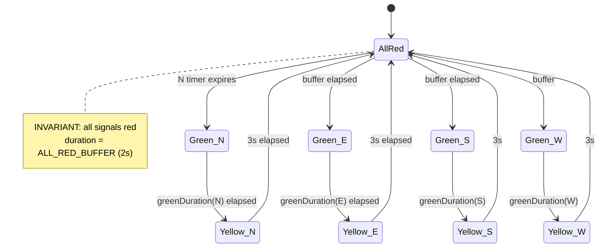
```mermaid
stateDiagram-v2
 [*] --> AllRed
 AllRed --> Green_N : N timer expires
 Green_N --> Yellow_N : greenDuration(N) elapsed
 Yellow_N --> AllRed : 3s elapsed
 AllRed --> Green_E : buffer elapsed
 Green_E --> Yellow_E : greenDuration(E) elapsed
 Yellow_E --> AllRed : 3s elapsed
 AllRed --> Green_S : buffer elapsed
 Green_S --> Yellow_S : greenDuration(S)
 Yellow_S --> AllRed : 3s
 AllRed --> Green_W : buffer
 Green_W --> Yellow_W : greenDuration(W)
 Yellow_W --> AllRed : 3s
 note right of AllRed
 INVARIANT: all signals red
 duration = ALL_RED_BUFFER (2s)
 end note
```

### Step 2: Core Entities and Relationships (Class diagram)

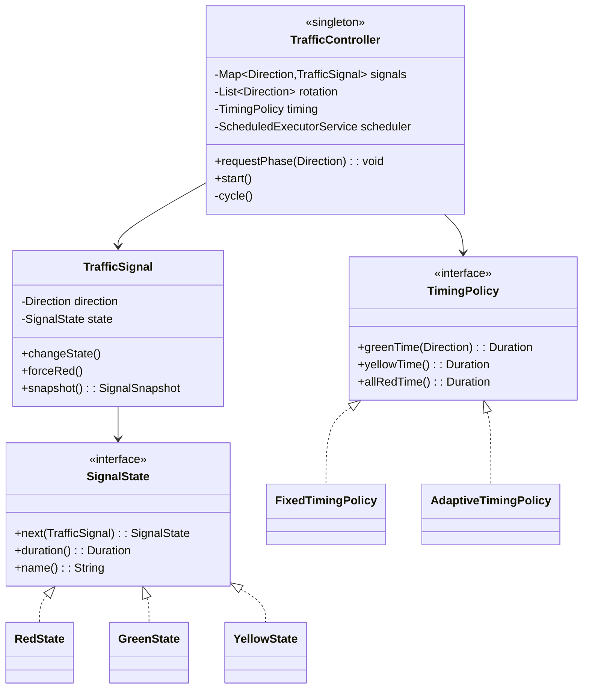
```mermaid
classDiagram
 class TrafficController {
 <<singleton>>
 -Map~Direction,TrafficSignal~ signals
 -List~Direction~ rotation
 -TimingPolicy timing
 -ScheduledExecutorService scheduler
 +requestPhase(Direction): void
 +start()
 -cycle()
 }
 class TrafficSignal {
 -Direction direction
 -SignalState state
 +changeState()
 +forceRed()
 +snapshot(): SignalSnapshot
 }
 class SignalState {
 <<interface>>
 +next(TrafficSignal): SignalState
 +duration(): Duration
 +name(): String
 }
 class TimingPolicy {
 <<interface>>
 +greenTime(Direction): Duration
 +yellowTime(): Duration
 +allRedTime(): Duration
 }
 TrafficController --> TrafficSignal
 TrafficController --> TimingPolicy
 TrafficSignal --> SignalState
 SignalState <|.. RedState
 SignalState <|.. GreenState
 SignalState <|.. YellowState
 TimingPolicy <|.. FixedTimingPolicy
 TimingPolicy <|.. AdaptiveTimingPolicy
```

### Step 6: Design Decisions, Patterns and SOLID

1. **State pattern carries duration + successor** - controller never switches on enums; adding a state (e.g., flashing-amber maintenance mode) = new class, no if-chains.
2. **Single-threaded scheduler owns all transitions** → no locks needed on state; signals expose immutable `SignalSnapshot` for read APIs (UI, traffic feed).
3. **Rotation vs demand-driven**: fixed rotation (simple) vs vehicle-actuated (loops/cameras report queue length → TimingPolicy adapts green). Model both behind `TimingPolicy`.
4. **Pedestrian signals** derive from the same phase: WALK during parallel green, clearance countdown ≥ yellow + all-red.
5. **Emergency preemption**: `PreemptionRequest` interrupts the cycle: force all-red → green the emergency corridor → resume. Implemented as a command queue checked by the scheduler before each transition.
6. **Crash recovery**: controller persists `{phase, state, elapsed}` every transition (small WAL); restart replays to resume mid-cycle.

### Step 8: Package Structure and Class Diagram

Packages: `domain/` (entities and enums), `service/` (business logic and state machines), `repository/` (persistence interfaces, in-memory impls for the interview), `adapter/` (external systems - only where the topic has any), `dto/` (result objects). Include only what the topic uses. Class diagram: see the diagram blocks above.

### Step 7: Edge Cases

- Power loss mid-phase → fail-safe all-red; on reboot, resume from persisted phase or restart cycle.
- Preemption arrives during yellow → finish transition to all-red, then serve preemption (never green directly from green).
- Sensor fault (stuck "queue detected") → clamp/degrade to fixed timing; watchdog.
- Two emergency requests conflict → priority order (fire > ambulance > police) or first-expiry-first; authority decides.

---

### Follow-up deep-dives
- *Multi-junction coordination (green wave)*: a `CorridorController` offsets phase clocks of adjacent junctions along an arterial; mathematically it's a cyclic scheduling problem.
- *How to prove safety?* State the invariant and show it's enforced in exactly one place (the controller's transition function) - "single writer of truth" argument.
- *Deadlock between junctions?* Occurs when two adjacent junctions green opposing flows into a saturated link → use occupancy feedback to cap entry (like ramp metering).

---

## 6. Traffic Signal System - Code

### Step 9: Code (Java)

> Class diagram, interaction flows, and edge cases: see the **Design** section above. This section is the Step 9 code.

```java
enum Direction { NORTH, SOUTH, EAST, WEST }

record SignalSnapshot(Direction direction, String stateName, Duration remaining) {}

// ---------- States (each knows successor + duration via policy) ----------
interface SignalState {
    SignalState next(TrafficSignal ctx);
    Duration duration(TimingPolicy policy, Direction d);
    String name();
}

final class RedState implements SignalState {
    public SignalState next(TrafficSignal ctx) { return new GreenState(); }
    public Duration duration(TimingPolicy p, Direction d){ return p.allRedTime(); }
    public String name(){ return "RED"; }
}
final class GreenState implements SignalState {
    public SignalState next(TrafficSignal ctx) { return new YellowState(); }
    public Duration duration(TimingPolicy p, Direction d){ return p.greenTime(d); }
    public String name(){ return "GREEN"; }
}
final class YellowState implements SignalState {
    public SignalState next(TrafficSignal ctx) { return new RedState(); }
    public Duration duration(TimingPolicy p, Direction d){ return p.yellowTime(); }
    public String name(){ return "YELLOW"; }
}

// ---------- Timing policies ----------
interface TimingPolicy {
    Duration greenTime(Direction d);
    Duration yellowTime();
    Duration allRedTime();
}
class FixedTimingPolicy implements TimingPolicy {
    public Duration greenTime(Direction d){ return Duration.ofSeconds(30); }
    public Duration yellowTime(){ return Duration.ofSeconds(3); }
    public Duration allRedTime(){ return Duration.ofSeconds(2); }
}
class AdaptiveTimingPolicy implements TimingPolicy { // sensor-driven
    private final Map<Direction, AtomicInteger> queueLengths = new EnumMap<>(Direction.class);
    public Duration greenTime(Direction d) {
        int q = queueLengths.getOrDefault(d, new AtomicInteger(5)).get();
        return Duration.ofSeconds(Math.min(60, 15 + 5L * q)); // 15s + 5s/car, cap 60
    }
    public Duration yellowTime(){ return Duration.ofSeconds(3); }
    public Duration allRedTime(){ return Duration.ofSeconds(2); }
    void reportQueue(Direction d, int vehicles){ queueLengths.computeIfAbsent(d, k -> new AtomicInteger()).set(vehicles); }
}

// ---------- Signal ----------
class TrafficSignal {
    private final Direction direction;
    private SignalState state = new RedState();
    TrafficSignal(Direction d){ direction = d; }

    synchronized void transition(TimingPolicy policy) { // only controller calls this
        state = state.next(this);
    }
    synchronized void forceRed(){ state = new RedState(); }
    synchronized SignalSnapshot snapshot(TimingPolicy policy, Instant stateEnteredAt) {
        Duration elapsed = Duration.between(stateEnteredAt, Instant.now());
        Duration remaining = state.duration(policy, direction).minus(elapsed);
        return new SignalSnapshot(direction, state.name(), remaining.isNegative() ? Duration.ZERO : remaining);
    }
    synchronized String stateName(){ return state.name(); }
    Direction getDirection(){ return direction; }
}

// ---------- Preemption ----------
record PreemptionRequest(Direction corridor, Instant expiresAt) {}
enum PreemptResult { GRANTED, QUEUED, EXPIRED }

// ---------- Controller: single writer of state ----------
class TrafficController {
    private static TrafficController instance;
    static synchronized TrafficController getInstance() {
        return instance == null ? instance = new TrafficController() : instance;
    }

    private final Map<Direction, TrafficSignal> signals = new EnumMap<>(Direction.class);
    private final List<Direction> rotation = List.of(Direction.NORTH, Direction.EAST, Direction.SOUTH, Direction.WEST);
    private final TimingPolicy policy = new FixedTimingPolicy();
    private final ScheduledExecutorService scheduler = Executors.newSingleThreadScheduledExecutor(r ->
        { Thread t = new Thread(r, "signal-controller"); t.setDaemon(true); return t; });
    private final Queue<PreemptionRequest> preemptions = new ConcurrentLinkedQueue<>();

    private int rotationIndex = 0;
    private volatile Instant stateEnteredAt = Instant.now();

    private TrafficController() {
        for (Direction d : Direction.values()) signals.put(d, new TrafficSignal(d));
    }

    public void start() {
        scheduler.submit(this::advancePhase); // boot into first green
    }

    /** The ONLY place state changes hands. Invariant enforced here. */
    private void advancePhase() {
        Direction current = rotation.get(rotationIndex);
        TrafficSignal signal = signals.get(current);

        // 1) force everyone red (fail-safe base state)
        signals.values().forEach(TrafficSignal::forceRed);

        // 2) check preemption before granting green
        PreemptionRequest pr = preemptions.peek();
        if (pr != null && pr.expiresAt().isAfter(Instant.now())) {
            current = pr.corridor();
            rotationIndex = rotation.indexOf(current);
            preemptions.poll();
        }

        // 3) green for chosen direction
        signals.get(current).transition(policy); // RED -> GREEN
        stateEnteredAt = Instant.now();
        Duration green = policy.greenTime(current);

        // schedule the rest of the phase
        scheduler.schedule(this::toYellow, green.toMillis(), MILLISECONDS);
    }

    private void toYellow() {
        Direction current = rotation.get(rotationIndex);
        signals.get(current).transition(policy); // GREEN -> YELLOW
        stateEnteredAt = Instant.now();
        scheduler.schedule(this::toRed, policy.yellowTime().toMillis(), MILLISECONDS);
    }

    private void toRed() {
        Direction current = rotation.get(rotationIndex);
        signals.get(current).transition(policy); // YELLOW -> RED
        stateEnteredAt = Instant.now();
        scheduler.schedule(this::nextRotation, policy.allRedTime().toMillis(), MILLISECONDS);
    }

    private void nextRotation() {
        rotationIndex = (rotationIndex + 1) % rotation.size();
        advancePhase();
    }

    public PreemptResult preempt(Direction corridor, Duration ttl) {
        preemptions.offer(new PreemptionRequest(corridor, Instant.now().plus(ttl)));
        return PreemptResult.QUEUED; // applied at next transition
    }

    public Map<Direction, SignalSnapshot> snapshotAll() {
        return signals.entrySet().stream().collect(Collectors.toMap(Map.Entry::getKey,
            e -> e.getValue().snapshot(policy, stateEnteredAt)));
    }
}
```

**Key talking points**: exactly one thread mutates signal states → invariant "at most one green" provable by code inspection; preemption is a *queued command* (no races with the phase clock); adaptive timing isolated behind `TimingPolicy` - swapping strategies changes no signal code.

---

## 7. Vending Machine - Design

### Step 1: Clarify Requirements

**Actors:** Customer, Operator (restock, price, collect cash), (extendable) Card network.

**Functional Requirements**
- FR-1: Accept coins (accumulate balance), select item, dispense + return change; cancel refunds full balance.
- FR-2: Out of stock → selection rejected, money returned (or held per config).
- FR-3: Insufficient funds → show amount needed; stay in money-collection state.
- FR-4: Operator restocks and prices items; machine reports sold-out state.
- FR-5: (Extended) Exact-change-only mode: reject selections the machine cannot make change for.

**Non-Functional Requirements**
- NFR-1: Every money movement is exact (integer cents or BigDecimal); inventory decrement atomic.
- NFR-2: Illegal operations in a state must be impossible by construction (not error-handled at runtime).

*Edge-case strategies: table in Step 7 below.*

### Step 3: Interaction Flows

insertMoney accumulates balance (HasMoneyState) -> selectItem validates stock, funds, change feasibility -> DispenseState takes item, collects money, returns change -> Idle or SoldOut.

### Step 4: Class Structure and Layers

VendingMachine context delegates to VendingMachineState implementations; Inventory and ChangeCalculator strategy are collaborators. Public API is a thin delegate.

### Step 5: Core Use Cases

insertMoney/selectItem/cancel delegate to current state. dispense(): inventory.take + change in exactly one place.

### Full lifecycle state diagram

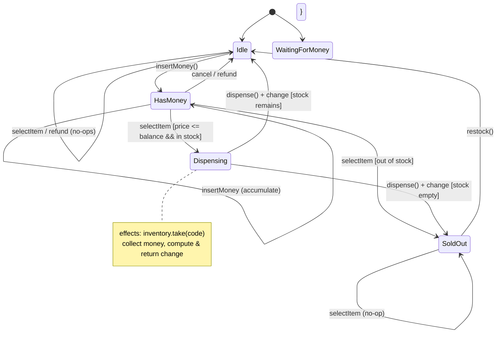
```mermaid
stateDiagram-v2
 [*] --> Idle
 Idle --> HasMoney : insertMoney()
 Idle --> Idle : selectItem / refund (no-ops)

 HasMoney --> HasMoney : insertMoney (accumulate)
 HasMoney --> Dispensing : selectItem [price <= balance && in stock]
 HasMoney --> SoldOut : selectItem [out of stock]
 HasMoney --> Idle : cancel / refund

 Dispensing --> Idle : dispense() + change [stock remains]
 Dispensing --> SoldOut : dispense() + change [stock empty]
 note right of Dispensing
 effects: inventory.take(code)
 collect money, compute & return change
 end note

 SoldOut --> Idle : restock()
 SoldOut --> SoldOut : selectItem (no-op)

 state Idle (
 [*] --> WaitingForMoney
 }
```

### Sequence - successful purchase with change

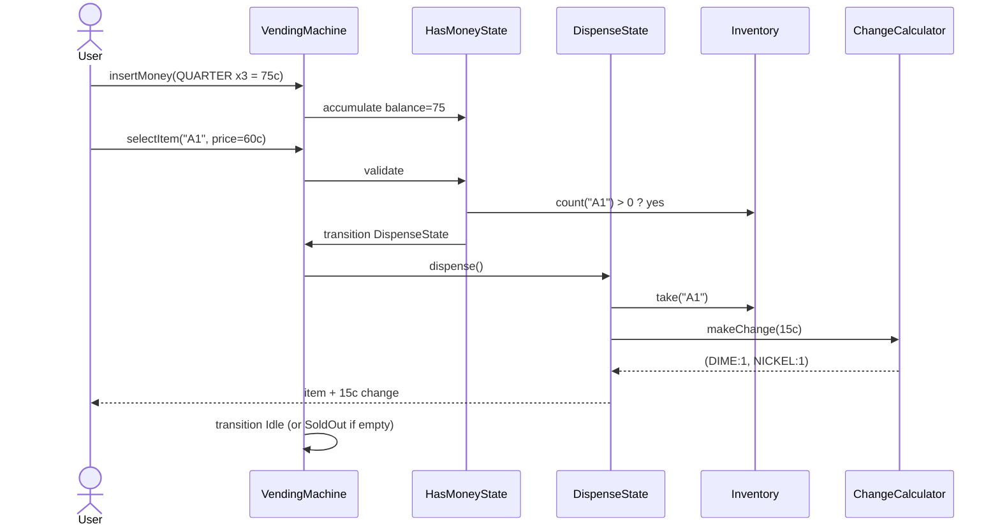
```mermaid
sequenceDiagram
 actor U as User
 participant VM as VendingMachine
 participant S as HasMoneyState
 participant D as DispenseState
 participant INV as Inventory
 participant CH as ChangeCalculator

 U->>VM: insertMoney(QUARTER x3 = 75c)
 VM->>S: accumulate balance=75
 U->>VM: selectItem("A1", price=60c)
 VM->>S: validate
 S->>INV: count("A1") > 0 ? yes
 S->>VM: transition DispenseState
 VM->>D: dispense()
 D->>INV: take("A1")
 D->>CH: makeChange(15c)
 CH-->>D: (DIME:1, NICKEL:1)
 D-->>U: item + 15c change
 VM->>VM: transition Idle (or SoldOut if empty)
```

### Step 2: Core Entities and Relationships (Class diagram)


```mermaid
classDiagram
 class VendingMachine {
 -VendingMachineState state
 -int balanceCents
 -Inventory inventory
 -ChangeCalculator changeCalculator
 +insertMoney(Coin)
 +selectItem(code: String)
 +cancel()
 +restock(code: String, qty: int)
 +setState(VendingMachineState)
 }
 class VendingMachineState {
 <<interface>>
 +insertMoney(Coin): *
 +selectItem(String): *
 +dispense(): *
 +refund(): *
 }
 class Inventory {
 -Map~String,Item~ items
 -Map~String,Integer~ counts
 +peek(code): Item
 +take(code): Item
 +count(code): int
 }
 class ChangeCalculator {
 <<interface>>
 +makeChange(int cents) Map~Coin,Integer~
 }
 VendingMachine --> VendingMachineState
 VendingMachine --> Inventory
 VendingMachine --> ChangeCalculator
 VendingMachineState <|.. IdleState
 VendingMachineState <|.. HasMoneyState
 VendingMachineState <|.. DispenseState
 VendingMachineState <|.. SoldOutState
```

### Step 6: Design Decisions, Patterns and SOLID

1. **State pattern with default no-ops on the interface** = illegal operations are structurally impossible, not runtime-checked. Say this sentence in the interview.
2. **Money as `int` cents** is acceptable for USD-like currencies (no fractions of a cent); otherwise use BigDecimal. Know both.
3. **Change-making**: greedy is optimal for canonical denominations (US coins: 1,5,10,25). For arbitrary denominations → DP (coin change) - mention both, implement greedy.
4. **Exact-change-only mode**: machine tracks its own float (coins inside). If it can't make change for the expected purchase, it should *reject selection early* (else you dispense and can't refund - a real-world failure). Model `canMakeChange(amount)` check in `HasMoneyState`.
5. **Idempotency of `dispense()`**: in a real machine, dispense is mechanical and can fail mid-way (jam). Production design: transaction log (`WAL`) - state + balance + inventory persisted each transition; recovery replays or compensates.
6. **Card payment extension**: `PaymentMethod` interface (Cash / Card); card path skips balance accumulation and change entirely - the state machine gets a `CardInsertedState`. Showing this seam = extensibility points.

---

### Step 8: Package Structure and Class Diagram

Packages: `domain/` (entities and enums), `service/` (business logic and state machines), `repository/` (persistence interfaces, in-memory impls for the interview), `adapter/` (external systems - only where the topic has any), `dto/` (result objects). Include only what the topic uses. Class diagram: see the diagram blocks above.

### Step 7: Edge Cases

- Race: last item taken between selection and dispense → refund and abort.
- Power loss mid-transaction → on restart, refund balance or complete pending dispense per persisted state.
- Coin jam / invalid coin → rejected at insertion, not counted.
- Machine has balance but all items sold out → refund path.

---

## 8. Vending Machine - Code

### Step 9: Code (Java)

> Class diagram, interaction flows, and edge cases: see the **Design** section above. This section is the Step 9 code.

```java
enum Coin { PENNY(1), NICKEL(5), DIME(10), QUARTER(25);
    final int cents; Coin(int c){ cents = c; } }

record Item(String sku, String name, int priceCents) {}

// ---------- Change calculator (greedy, with DP fallback discussion) ----------
interface ChangeCalculator { Map<Coin,Integer> makeChange(int cents); }
class GreedyChangeCalculator implements ChangeCalculator {
    public Map<Coin,Integer> makeChange(int cents) {
        Map<Coin,Integer> out = new LinkedHashMap<>();
        for (Coin c : List.of(Coin.QUARTER, Coin.DIME, Coin.NICKEL, Coin.PENNY)) {
            int n = cents / c.cents;
            if (n > 0) { out.put(c, n); cents -= n * c.cents; }
        }
        if (cents != 0) throw new IllegalStateException("Cannot make change for residual " + cents);
        return out;
    }
}

// ---------- Inventory with concurrency-safe decrement ----------
class Inventory {
    private record Slot(Item item, AtomicInteger count) {}
    private final Map<String, Slot> slots = new ConcurrentHashMap<>();

    void load(Item item, int qty){ slots.put(item.sku(), new Slot(item, new AtomicInteger(qty))); }
    Item peek(String code){ Slot s = slots.get(code); return s == null ? null : s.item(); }
    int count(String code){ Slot s = slots.get(code); return s == null ? 0 : s.count().get(); }

    /** Atomic take: decrement only if stock > 0. Returns null if raced out of stock. */
    Item take(String code) {
        Slot s = slots.get(code);
        if (s == null) return null;
        while (true) {
            int cur = s.count().get();
            if (cur <= 0) return null;
            if (s.count().compareAndSet(cur, cur - 1)) return s.item();
        }
    }
    boolean isEmpty(){ return slots.values().stream().allMatch(s -> s.count().get() == 0); }
}

// ---------- Context ----------
class VendingMachine {
    private VendingMachineState state;
    private int balanceCents;
    private final Inventory inventory = new Inventory();
    private final ChangeCalculator changeCalculator = new GreedyChangeCalculator();

    VendingMachine(){ this.state = new IdleState(this); }

    // guarded accessors - states never touch fields directly
    synchronized void setState(VendingMachineState s){ this.state = s; onTransition(); }
    synchronized void addMoney(int cents){ balanceCents += cents; }
    synchronized int balance(){ return balanceCents; }
    synchronized int collect(){ int b = balanceCents; balanceCents = 0; return b; }
    Inventory inventory(){ return inventory; }
    ChangeCalculator change(){ return changeCalculator; }

    // durability hook (WAL) - mention in interview
    private void onTransition(){ /* persist {state, balance, inventoryDigest} */ }

    // public API delegates to current state
    public void insertMoney(Coin c) { state.insertMoney(c); }
    public void selectItem(String sku){ state.selectItem(sku); }
    public void cancel() { state.refund(); }
    public void restock(String sku, int qty) {
        Item existing = inventory.peek(sku);
        if (existing == null) throw new NoSuchElementException("Unknown SKU " + sku);
        inventory.load(existing, qty);
        if (state instanceof SoldOutState) setState(new IdleState(this));
    }
}

// ---------- States ----------
interface VendingMachineState {
    default void insertMoney(Coin c) { invalid("insert money"); }
    default void selectItem(String sku) { invalid("select item"); }
    default void dispense() { invalid("dispense"); }
    default void refund() { /* no money held - silent */ }
    private void invalid(String a){ throw new IllegalStateException("Cannot " + a + " in state " + getClass().getSimpleName()); }
}

final class IdleState implements VendingMachineState {
    private final VendingMachine vm;
    IdleState(VendingMachine vm){ this.vm = vm; }
    public void insertMoney(Coin c) {
        vm.addMoney(c.cents);
        vm.setState(new HasMoneyState(vm));
    }
}

final class HasMoneyState implements VendingMachineState {
    private final VendingMachine vm;
    HasMoneyState(VendingMachine vm){ this.vm = vm; }

    public void insertMoney(Coin c) { vm.addMoney(c.cents); }

    public void selectItem(String sku) {
        Item item = vm.inventory().peek(sku);
        if (item == null) { System.out.println("Unknown item " + sku); return; }

        if (vm.inventory().count(sku) == 0) {
            System.out.println("Sold out: " + item.name());
            vm.setState(new SoldOutState(vm));
            return;
        }
        int balance = vm.balance();
        if (balance < item.priceCents()) {
            System.out.printf("Need %d more cents%n", item.priceCents() - balance);
            return; // stay in HasMoneyState
        }
        int changeDue = balance - item.priceCents();
        vm.setState(new DispenseState(vm, sku, changeDue));
    }

    public void refund() {
        System.out.println("Refunding " + vm.collect() + " cents");
        vm.setState(new IdleState(vm));
    }
}

final class DispenseState implements VendingMachineState {
    private final VendingMachine vm; private final String sku; private final int changeDue;
    DispenseState(VendingMachine vm, String sku, int changeDue){
        this.vm = vm; this.sku = sku; this.changeDue = changeDue;
    }
    public void dispense() {
        Item item = vm.inventory().take(sku); // atomic decrement
        if (item == null) { // lost race - refund and bail
            System.out.println("Race: item just ran out. Refunding " + vm.collect());
            vm.setState(new IdleState(vm));
            return;
        }
        vm.collect(); // consume payment
        if (changeDue > 0) System.out.println("Change: " + vm.change().makeChange(changeDue));
        System.out.println("Dispensed: " + item.name());
        vm.setState(vm.inventory().isEmpty() ? new SoldOutState(vm) : new IdleState(vm));
    }
}

final class SoldOutState implements VendingMachineState {
    private final VendingMachine vm;
    SoldOutState(VendingMachine vm){ this.vm = vm; }
    public void insertMoney(Coin c){ System.out.println("Sold out - coins returned");
                                     /* don't even accumulate */ }
    public void refund(){ System.out.println("Returning " + vm.collect() + " cents"); }
}
```

**Key talking points**: `Inventory.take` is CAS-based → selection flow and restock can run concurrently without locks; `DispenseState` handles the race where stock hits zero between `selectItem` and `dispense` (defensive design unprompted); state transition hook doubles as a WAL persistence point.

---

## 9. Task Management System - Design

### Step 1: Clarify Requirements

**Actors:** User (creator/assignee/viewer), Admin (permissions), System (scheduler, notifications).

**Functional Requirements**
- FR-1: CRUD tasks with title, description, priority, due date, assignee.
- FR-2: Lifecycle: TODO→IN_PROGRESS→(BLOCKED↔IN_PROGRESS)→DONE; CANCELLED from any pre-done state.
- FR-3: Subtasks; parent cannot complete until all subtasks done.
- FR-4: Search/filter by status, assignee, due date, priority - composable.
- FR-5: Notifications on assignment and approaching due date.

**Non-Functional Requirements**
- NFR-1: Concurrent edits never silently overwrite (optimistic concurrency).
- NFR-2: Filters composable without changing service code (open/closed).
- NFR-3: Audit trail of who changed what, when (extendable).

*Edge-case strategies: table in Step 7 below.*

### Step 3: Interaction Flows

create -> save -> notify listeners. assign -> version-checked save -> event fan-out. start/block/complete are guarded transitions. search composes Specification objects.

### Step 4: Class Structure and Layers

TaskService (application layer) depends on TaskRepository interface (in-memory now, database later); Task is the aggregate owning its lifecycle.

### Step 5: Core Use Cases

create(title) -> repo.save. assign(id,user) -> optimistic save -> listeners. search(spec) -> repo.findAll().stream().filter(spec).

### Step 2: Core Entities and Relationships (Domain model (DDD-flavored - mention "aggregate root" in the interview))

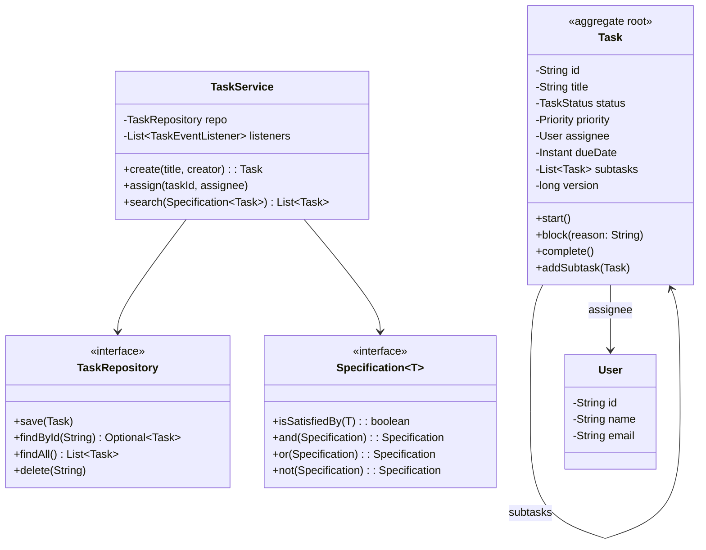
```mermaid
classDiagram
 class Task {
 <<aggregate root>>
 -String id
 -String title
 -TaskStatus status
 -Priority priority
 -User assignee
 -Instant dueDate
 -List~Task~ subtasks
 -long version
 +start()
 +block(reason: String)
 +complete()
 +addSubtask(Task)
 }
 class User {
 -String id
 -String name
 -String email
 }
 class TaskRepository {
 <<interface>>
 +save(Task)
 +findById(String) Optional~Task~
 +findAll() List~Task~
 +delete(String)
 }
 class TaskService {
 -TaskRepository repo
 -List~TaskEventListener~ listeners
 +create(title, creator): Task
 +assign(taskId, assignee)
 +search(Specification~Task~) List~Task~
 }
 class Specification~T~ {
 <<interface>>
 +isSatisfiedBy(T): boolean
 +and(Specification): Specification
 +or(Specification): Specification
 +not(Specification): Specification
 }
 TaskService --> TaskRepository
 TaskService --> Specification~Task~
 Task --> Task : subtasks
 Task --> User : assignee
```

### Task lifecycle

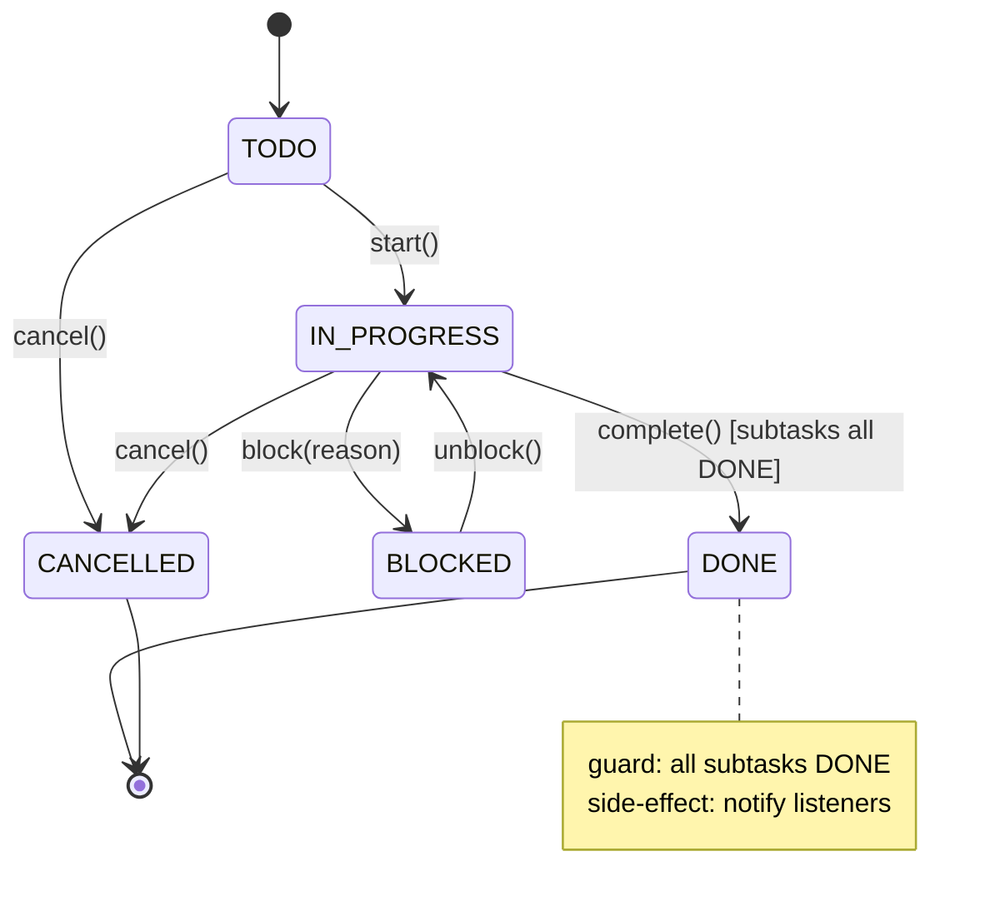
```mermaid
stateDiagram-v2
 [*] --> TODO
 TODO --> IN_PROGRESS : start()
 TODO --> CANCELLED : cancel()
 IN_PROGRESS --> BLOCKED : block(reason)
 BLOCKED --> IN_PROGRESS : unblock()
 IN_PROGRESS --> DONE : complete() [subtasks all DONE]
 IN_PROGRESS --> CANCELLED : cancel()
 DONE --> [*]
 CANCELLED --> [*]
 note right of DONE
 guard: all subtasks DONE
 side-effect: notify listeners
 end note
```

### Sequence - assignment with notification

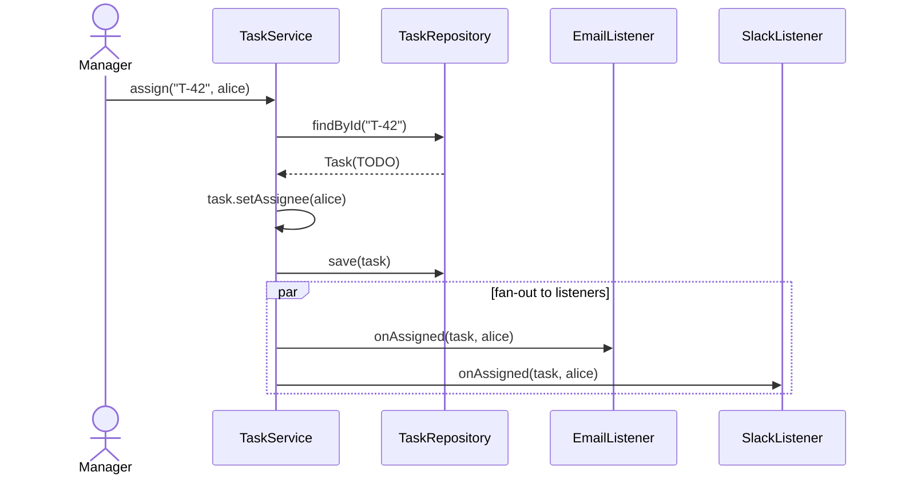
```mermaid
sequenceDiagram
 actor M as Manager
 participant S as TaskService
 participant R as TaskRepository
 participant EM as EmailListener
 participant SL as SlackListener

 M->>S: assign("T-42", alice)
 S->>R: findById("T-42")
 R-->>S: Task(TODO)
 S->>S: task.setAssignee(alice)
 S->>R: save(task)
 par fan-out to listeners
 S->>EM: onAssigned(task, alice)
 S->>SL: onAssigned(task, alice)
 end
```

### Step 6: Design Decisions, Patterns and SOLID

1. **Aggregate root + closure rule**: subtasks are reachable only via parent; complete() guards on subtasks - invariants live inside the aggregate, not the service ("domain model rich, application layer thin").
2. **Optimistic concurrency**: `long version` on Task; `save` does `UPDATE ... WHERE id=? AND version=?` (or CAS in-memory). Two editors → one wins, loser gets conflict exception → retry or merge UI. Mention: never trust "last write wins" silently for task tools.
3. **Specification pattern**: filter logic is composable AND/OR/NOT without a god-method `search(status, assignee, dueBefore, priority, text...)`.
4. **Events, not direct calls**: listeners = Email/Slack/Analytics. New channel = new listener, zero changes to service. Event carries snapshot of task at change time (immutable).
5. **Domain events vs integration events**: in-process listeners (this design) vs outbox pattern + message broker (production). Naming this distinction = senior signal.
6. **Due-date scheduling**: a `DueDateScheduler` polls/uses `ScheduledExecutorService` per task or a min-heap by due date; fires REMINDER events.

---

### Step 8: Package Structure and Class Diagram

Packages: `domain/` (entities and enums), `service/` (business logic and state machines), `repository/` (persistence interfaces, in-memory impls for the interview), `adapter/` (external systems - only where the topic has any), `dto/` (result objects). Include only what the topic uses. Class diagram: see the diagram blocks above.

### Step 7: Edge Cases

- Two users edit simultaneously → conflict error to the second; merge/retry UX.
- Completing parent with open subtasks → rejected with reason.
- Reassign mid-notification → no stale emails (events carry snapshot).
- Overdue recurring task → next instance spawned from due date, not completion date.

---

## 10. Task Management System - Code

### Step 9: Code (Java)

> Class diagram, interaction flows, and edge cases: see the **Design** section above. This section is the Step 9 code.

```java
enum TaskStatus { TODO, IN_PROGRESS, BLOCKED, DONE, CANCELLED }
enum Priority { LOW, MEDIUM, HIGH, URGENT }

// ---------- Specification ----------
interface Specification<T> {
    boolean isSatisfiedBy(T t);
    default Specification<T> and(Specification<T> o){ return x -> this.isSatisfiedBy(x) && o.isSatisfiedBy(x); }
    default Specification<T> or(Specification<T> o) { return x -> this.isSatisfiedBy(x) || o.isSatisfiedBy(x); }
    static <T> Specification<T> not(Specification<T> s){ return x -> !s.isSatisfiedBy(x); }
}
class StatusSpec implements Specification<Task> {
    private final TaskStatus s; StatusSpec(TaskStatus s){ this.s = s; }
    public boolean isSatisfiedBy(Task t){ return t.status() == s; }
}
class AssigneeSpec implements Specification<Task> {
    private final User u; AssigneeSpec(User u){ this.u = u; }
    public boolean isSatisfiedBy(Task t){ return t.assignee().map(a -> a.id().equals(u.id())).orElse(false); }
}
class OverdueSpec implements Specification<Task> {
    private final Clock clock; OverdueSpec(Clock c){ clock = c; }
    public boolean isSatisfiedBy(Task t){
        return t.dueDate().map(d -> d.isBefore(Instant.now(clock))).orElse(false)
            && t.status() != TaskStatus.DONE && t.status() != TaskStatus.CANCELLED;
    }
}

// ---------- Aggregate ----------
class Task {
    private final String id;
    private String title;
    private TaskStatus status = TaskStatus.TODO;
    private Priority priority = Priority.MEDIUM;
    private User assignee;
    private Instant dueDate;
    private final List<Task> subtasks = new ArrayList<>();
    private long version; // optimistic locking

    Task(String id, String title){ this.id = id; this.title = title; }
    public String id(){ return id; }
    public TaskStatus status(){ return status; }
    public Optional<User> assignee(){ return Optional.ofNullable(assignee); }
    public Optional<Instant> dueDate(){ return Optional.ofNullable(dueDate); }
    public long version(){ return version; }

    public void setAssignee(User u){ this.assignee = u; }
    public void setPriority(Priority p){ this.priority = p; }
    public void setDueDate(Instant d){ this.dueDate = d; }

    public void addSubtask(Task t){ if (t == this) throw new IllegalArgumentException("cycle");
                                    subtasks.add(t); }

    public void start() {
        if (status != TaskStatus.TODO && status != TaskStatus.BLOCKED)
            throw new IllegalStateException("Cannot start from " + status);
        status = TaskStatus.IN_PROGRESS;
    }
    public void complete() {
        if (status != TaskStatus.IN_PROGRESS) throw new IllegalStateException("Must be IN_PROGRESS");
        if (!subtasks.stream().allMatch(s -> s.status() == TaskStatus.DONE))
            throw new IllegalStateException("Subtasks incomplete");
        status = TaskStatus.DONE;
    }
    void bumpVersion(){ version++; }
}

// ---------- Domain events ----------
record TaskAssignedEvent(String taskId, String assigneeId, Instant at) {}
interface TaskEventListener { void onTaskAssigned(TaskAssignedEvent e); }

// ---------- Repository (with optimistic save) ----------
interface TaskRepository {
    Optional<Task> findById(String id);
    List<Task> findAll();
    /** @throws OptimisticLockException if version mismatch */
    void save(Task t);
    void delete(String id);
}
class OptimisticLockException extends RuntimeException {}

class InMemoryTaskRepository implements TaskRepository {
    private final Map<String, long[]> store = new ConcurrentHashMap<>(); // id -> [version]
    private final Map<String, Task> tasks = new ConcurrentHashMap<>();
    public Optional<Task> findById(String id){ return Optional.ofNullable(tasks.get(id)); }
    public List<Task> findAll(){ return List.copyOf(tasks.values()); }
    public void save(Task t) {
        tasks.compute(t.id(), (id, existing) -> {
            if (existing != null) {
                long[] v = store.get(id);
                if (v[0] != t.version()) throw new OptimisticLockException();
                v[0]++; t.bumpVersion();
            } else {
                store.put(id, new long[]{1}); t.bumpVersion();
            }
            return t;
        });
    }
    public void delete(String id){ tasks.remove(id); store.remove(id); }
}

// ---------- Service ----------
class TaskService {
    private final TaskRepository repo;
    private final List<TaskEventListener> listeners = new CopyOnWriteArrayList<>();
    TaskService(TaskRepository r){ repo = r; }

    public Task create(String title, User creator) {
        Task t = new Task(UUID.randomUUID().toString(), title);
        repo.save(t);
        return t;
    }

    public void assign(String taskId, User assignee) {
        Task t = repo.findById(taskId).orElseThrow();
        t.setAssignee(assignee);
        repo.save(t); // may throw OptimisticLockException
        var evt = new TaskAssignedEvent(t.id(), assignee.id(), Instant.now());
        listeners.forEach(l -> l.onTaskAssigned(evt)); // fan-out AFTER commit
    }

    public List<Task> search(Specification<Task> spec) {
        return repo.findAll().stream().filter(spec::isSatisfiedBy).toList();
    }

    // convenience composite: overdue AND not assigned to me
    public List<Task> myOverdueTasks(User me, Clock clock) {
        return search(new OverdueSpec(clock).and(Specification.not(new AssigneeSpec(me))));
    }

    public void addListener(TaskEventListener l){ listeners.add(l); }
}
```

**Key talking points**: Specification combinators make the filter layer closed for extension; optimistic locking via version check inside `save` - conflict surface is explicit; listeners fire after save (commit) - never before (event-before-commit = phantom notifications if save fails).

---

# PART 2

---

## 11. PubSub System - Design

### Step 1: Clarify Requirements

**Actors:** Producers, Consumers (in groups), Platform Admin (topics, retention, ACLs).

**Functional Requirements**
- FR-1: Create topic with N partitions; publish keyed/unkeyed messages; append-only ordered log per partition.
- FR-2: Consumers pull from assigned partitions using durable offsets; replay supported.
- FR-3: Consumer groups: each partition consumed by exactly one member per group; rebalance on membership change.
- FR-4: Retention window; expired segments deleted.
- FR-5: Delivery semantics configurable: at-most / at-least / effectively-once.

**Non-Functional Requirements**
- NFR-1: Ordering guaranteed within a partition; throughput scales with partitions.
- NFR-2: Producer never blocks unboundedly (bounded buffer + retry policy).
- NFR-3: Consumer lag observable; slow consumer must not affect others.

*Edge-case strategies: table in Step 7 below.*

### Step 3: Interaction Flows

producer publishes -> partition routed by key -> single-writer append -> ack. Consumer pulls a batch -> processes idempotently -> commits offset. Replay = reset the offset.

### Step 4: Class Structure and Layers

Publisher -> Topic -> Partition (the append log IS storage, no repository). Consumer carries an offset cursor; ConsumerGroup assigns partitions to members.

### Step 5: Core Use Cases

publish(topic,msg): route -> append -> return offset. consumer loop: readFrom(offset) -> handle -> commit. join/leave triggers rebalance.

### Architecture (Kafka-flavored)

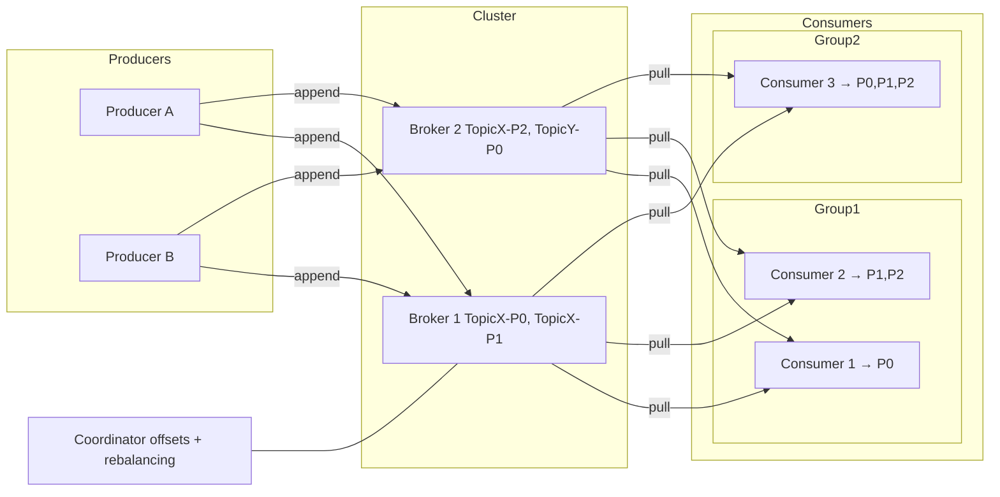
```mermaid
flowchart LR
 subgraph Producers
 P1["Producer A"]
 P2["Producer B"]
 end
 subgraph Cluster
 B1["Broker 1 TopicX-P0, TopicX-P1"] 
 B2["Broker 2 TopicX-P2, TopicY-P0"]
 end
 subgraph Consumers
 subgraph Group1
 C1["Consumer 1 → P0"]
 C2["Consumer 2 → P1,P2"]
 end
 subgraph Group2
 C3["Consumer 3 → P0,P1,P2"]
 end
 end
 P1 -->|append| B1
 P1 -->|append| B2
 P2 -->|append| B1
 P2 -->|append| B2
 B1 -->|pull| C1
 B1 -->|pull| C2
 B2 -->|pull| C1
 B2 -->|pull| C2
 B1 -->|pull| C3
 B2 -->|pull| C3
 CO["Coordinator offsets + rebalancing"] --- B1
```

### Sequence - produce → replicate acks → consume → commit

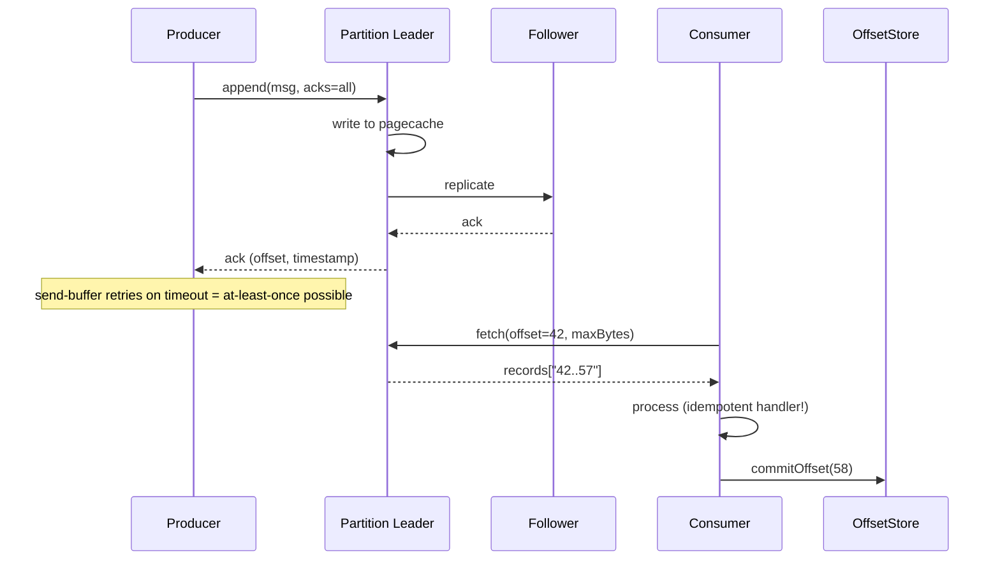
```mermaid
sequenceDiagram
 participant P as Producer
 participant L as Partition Leader
 participant F as Follower
 participant C as Consumer
 participant O as OffsetStore

 P->>L: append(msg, acks=all)
 L->>L: write to pagecache
 L->>F: replicate
 F-->>L: ack
 L-->>P: ack (offset, timestamp)
 Note over P: send-buffer retries on timeout = at-least-once possible
 C->>L: fetch(offset=42, maxBytes)
 L-->>C: records["42..57"]
 C->>C: process (idempotent handler!)
 C->>O: commitOffset(58)
```

### Delivery semantics table (memorize)

| Semantic | Mechanism | Loses? | Dupes? | Cost |
|---|---|---|---|---|
| At-most-once | fire & forget, commit offset BEFORE processing | ✅ can lose | none | cheapest |
| At-least-once | retry until ack, commit AFTER processing | none | ✅ possible | cheap |
| Exactly-once | idempotent producer (PID+seq) + transactions; consumer dedup | none | none (effectively) | expensive |

### Step 2: Core Entities and Relationships (Class diagram (interview scope: in-memory))

```mermaid
classDiagram
 class Publisher {
 +createTopic(name, partitions): Topic
 +publish(topic, key, payload): long
 }
 class Topic {
 -String name
 -List~Partition~ partitions
 +route(Message): Partition
 }
 class Partition {
 -List~Message~ log
 -AtomicLong nextOffset
 +append(Message): long
 +readFrom(offset, max) List~Message~
 +highWatermark(): long
 }
 class Consumer {
 -Map~Integer,Long~ offsets
 +run()
 +seek(long)
 +commit()
 }
 class ConsumerGroup {
 -String id
 -assign(Topic) Map~Partition,Consumer~
 -rebalance()
 }
 Publisher --> Topic
 Topic --> Partition
 ConsumerGroup --> Consumer
 Consumer --> Partition : pulls
```

### Step 6: Design Decisions, Patterns and SOLID

1. **Pull vs Push** (guaranteed question): **Pull** (Kafka) - consumer controls rate, enables batching & replay, natural backpressure (lag = debt). **Push** (classic broker) - low latency, but broker must handle slow consumers (need, queue per consumer, flow control). Know both; defend pull for throughput systems.
2. **Partition = unit of ordering + parallelism**: per-key routing gives key-ordered streams; max consumer parallelism per group = partition count.
3. **Offsets are the cursor of truth**: replay = reset offset; DLQ = a separate topic + redirect after N retries.
4. **Log retention** decouples consumers' speeds: slow consumer just reads older segments; retention bounds disk.
5. **Consumer group rebalancing**: on join/leave/fail, coordinator reassigns partitions (eager = stop-the-world; cooperative = incremental). Mention the word "rebalance storm".
6. **Single-writer per partition** appends → ordering for free; `ConcurrentHashMap<Topic, Partition[]>` in-memory.

---

### Step 8: Package Structure and Class Diagram

Packages: `domain/` (entities and enums), `service/` (business logic and state machines), `repository/` (persistence interfaces, in-memory impls for the interview), `adapter/` (external systems - only where the topic has any), `dto/` (result objects). Include only what the topic uses. Class diagram: see the diagram blocks above.

### Step 7: Edge Cases

- Poison message → retries + backoff → DLQ after N attempts.
- Consumer dies mid-batch → at-least-once redelivery → consumer must be idempotent.
- All consumers in a group die → partitions idle, offsets retained, resume on restart.
- Key skew (one hot key) → single hot partition; mitigation: salting (mention).

---

## 12. PubSub System - Code

### Step 9: Code (Java)

> Class diagram, interaction flows, and edge cases: see the **Design** section above. This section is the Step 9 code.

```java
record Message(String id, String key, byte[] payload, Instant timestamp) {
    static Message of(String key, byte[] p){
        return new Message(UUID.randomUUID().toString(), key, p, Instant.now()); }
}

// ---------- Partition: single-writer append log ----------
class Partition {
    private final List<Message> log = new ArrayList<>(); // single writer thread
    private final AtomicLong nextOffset = new AtomicLong();
    private volatile long committedWatermark; // for followers/acks demo

    synchronized long append(Message m) {
        log.add(m);
        return nextOffset.getAndIncrement();
    }
    synchronized List<Message> readFrom(long offset, int max) {
        if (offset >= log.size()) return List.of();
        return List.copyOf(log.subList((int) offset, Math.min(log.size(), (int) offset + max)));
    }
    synchronized long highWatermark(){ return nextOffset.get(); }
}

// ---------- Topic with key routing ----------
class Topic {
    private final String name;
    private final List<Partition> partitions;
    Topic(String name, int n) {
        this.name = name;
        this.partitions = IntStream.range(0, n).mapToObj(i -> new Partition()).toList();
    }
    Partition route(Message m) {
        int idx = (m.key() == null)
            ? ThreadLocalRandom.current().nextInt(partitions.size())
            : Math.floorMod(m.key().hashCode(), partitions.size());
        return partitions.get(idx);
    }
    List<Partition> partitions(){ return partitions; }
}

// ---------- Publisher with ack level ----------
enum Acks { NONE, LEADER, ALL }

class Publisher {
    private final Map<String, Topic> topics = new ConcurrentHashMap<>();
    Topic createTopic(String name, int partitions){ 
        return topics.compute(name, (k, v) -> v != null ? v : new Topic(name, partitions)); }
    long publish(String topicName, Message m, Acks acks) {
        Topic t = topics.get(topicName);
        if (t == null) throw new NoSuchElementException(topicName);
        long offset = t.route(m).append(m); // single-writer per partition
        // acks simulation: NONE → return immediately; ALL → would wait for follower acks
        return offset;
    }
}

// ---------- Consumer: pull loop with manual offset + idempotent handler ----------
interface MessageHandler { void onMessage(Message m); }

class Consumer implements Runnable {
    private final Topic topic;
    private final MessageHandler handler;
    private final Map<Integer, Long> offsets = new ConcurrentHashMap<>();
    private final Set<String> processedIds = ConcurrentHashMap.newKeySet(); // idempotency window
    private volatile boolean running = true;

    Consumer(Topic topic, MessageHandler h) {
        this.topic = topic; this.handler = h;
        for (int i = 0; i < topic.partitions().size(); i++) offsets.put(i, 0L);
    }

    public void run() {
        while (running) {
            boolean gotAny = false;
            for (int i = 0; i < topic.partitions().size(); i++) {
                Partition p = topic.partitions().get(i);
                long offset = offsets.get(i);
                List<Message> batch = p.readFrom(offset, 200);
                for (Message m : batch) {
                    if (processedIds.add(m.id())) { // dedup guard (at-least-once reality)
                        handler.onMessage(m); // business processing
                    }
                }
                if (!batch.isEmpty()) { offsets.put(i, offset + batch.size()); gotAny = true; }
            }
            if (!gotAny) LockSupport.parkNanos(10_000_000); // idle backoff
        }
    }
    public void seekToBeginning(){ offsets.replaceAll((k, v) -> 0L); }
    public void stop(){ running = false; }
}

// ---------- Consumer group assignment (static, interview scope) ----------
class ConsumerGroup {
    private final String groupId;
    private final List<Consumer> members = new CopyOnWriteArrayList<>();
    ConsumerGroup(String id){ groupId = id; }

    /** Each partition assigned to exactly ONE member - invariant of a group. */
    synchronized Map<Integer, Consumer> assign(Topic topic) {
        List<Partition> parts = topic.partitions();
        Map<Integer, Consumer> assignment = new HashMap<>();
        for (int i = 0; i < parts.size(); i++)
            assignment.put(i, members.get(i % members.size()));
        return assignment;
    }
    void join(Consumer c){ members.add(c); /* trigger rebalance */ }
    void leave(Consumer c){ members.remove(c); }
}
```

**Key talking points**: single-writer per partition (synchronized method, one appender thread per partition in production) gives ordering without locks elsewhere; `processedIds` set = idempotent consumer for at-least-once reality; group assignment invariant "each partition → one member" is the whole correctness story of consumer groups.

---

## 13. ATM Machine - Design

### Step 1: Clarify Requirements

**Actors:** Card holder, Bank (authoritative), Cash servicing agent, (extendable) deposit operations.

**Functional Requirements**
- FR-1: Insert card → PIN auth (max 3 attempts, retain on failure) → menu → eject on demand or timeout.
- FR-2: Withdrawal: validate limits → debit account → dispense exact denominations → return change/receipt.
- FR-3: Deposit (extendable): provisional credit, confirmed after verification.
- FR-4: Balance inquiry, mini-statement (extendable).
- FR-5: Session timeout on inactivity (30s).

**Non-Functional Requirements**
- NFR-1: Money never created or destroyed by the ATM: debit-then-dispense with compensating reversal on failure.
- NFR-2: Every transaction idempotent under network retry (idempotency key).
- NFR-3: PIN never logged or stored in clear.

*Edge-case strategies: table in Step 7 below.*

### Step 3: Interaction Flows

insertCard -> PIN auth (3 tries, then retain) -> select transaction -> bank debit -> dispense denominations -> receipt. Failure after debit triggers a compensating credit.

### Step 4: Class Structure and Layers

ATM session state machine delegates to BankService interface (remote proxy in production) and CashDispenser (handler chain). Transactions are command objects.

### Step 5: Core Use Cases

insertCard/enterPin/execute/eject delegate to ATMState. Withdrawal.execute(): bank.debit -> dispenser.dispense -> compensate on failure.

### State machine

```mermaid
stateDiagram-v2
 [*] --> Idle
 Idle --> CardInserted : insertCard [card valid format]
 CardInserted --> Authenticated : enterPin [3 attempts max]
 CardInserted --> Idle : eject / 3 wrong PINs (retain card)
 Authenticated --> Transaction : selectOp(Withdraw/Deposit/Transfer)
 Transaction --> Authenticated : execute ok / decline
 Transaction --> Authenticated : cancel
 Authenticated --> Idle : eject
 state Transaction (
 [*] --> Validating
 Validating --> Debiting : limits OK
 Validating --> Declined : insufficient funds/limit
 Debiting --> Dispensing : bank confirms
 Dispensing --> Done
 Declined --> [*]
 Done --> [*]
 }
 note right of Transaction
 Order matters: debit FIRST,
 dispense SECOND (never reverse)
 end note
```

### Dispenser chain

```mermaid
flowchart LR
 A["Amount Rs.470"] --> H100["Rs.100 handler use 4, left Rs.70"]
 H100 --> H50["Rs.50 handler use 1, left Rs.20"]
 H50 --> H20["Rs.20 handler use 1, left Rs.0"]
 H20 --> DONE["Dispense map (100:4, 50:1, 20:1)"]
 style DONE fill:#cde
```

### Step 2: Core Entities and Relationships (Class diagram)

```mermaid
classDiagram
 class ATM {
 -ATMState state
 -BankService bank
 -CashDispenser dispenser
 +insertCard(Card)
 +enterPin(pin)
 +execute(Transaction)
 +eject()
 }
 class BankService {
 <<interface>>
 +authenticate(cardNo, pin): boolean
 +debit(cardNo, Money, idempotencyKey)
 +credit(cardNo, Money)
 +balance(cardNo): Money
 }
 class Transaction {
 <<abstract>>
 #String cardNumber
 #Money amount
 +execute(BankService, CashDispenser): *
 }
 class CashDispenser {
 -CashHandler chain
 +dispense(int cents) Map~Denomination,Integer~
 }
 class CashHandler {
 <<abstract>>
 #CashHandler next
 +setNext(CashHandler)
 +dispense(int, Map): *
 }
 ATM --> BankService
 ATM --> CashDispenser
 ATM --> ATMState
 ATMState <|.. IdleState
 ATMState <|.. CardInsertedState
 ATMState <|.. AuthenticatedState
 Transaction <|.. Withdrawal
 Transaction <|.. Deposit
 Transaction <|.. Transfer
 CashDispenser --> CashHandler
 CashHandler <|.. DenominationHandler
```

### Sequence - withdrawal (the order-of-operations diagram)

```mermaid
sequenceDiagram
 actor U as User
 participant A as ATM
 participant B as BankService
 participant D as CashDispenser

 U->>A: withdraw Rs.470
 A->>B: debit(card, Rs.470, key=uuid-7)
 alt sufficient funds & under daily limit
 B-->>A: OK
 A->>D: dispense(470)
 D-->>A: (100x4, 50x1, 20x1)
 A-->>U: cash + receipt
 else insufficient
 B-->>A: INSUFFICIENT
 A-->>U: declined (no cash moved)
 end
 Note over A,D: If ATM jams AFTER debit: bank records pending dispense → auto-reversal job reconciles
```

### Step 6: Design Decisions, Patterns and SOLID

1. **ATM is a thin client** - all balance truth lives at the bank. The ATM holds *no* account state. This boundary is the first thing to defend.
2. **Order: authorize → debit → dispense → (failure → reversal)**. Dispensing before debit invites "free money on network outage". Reversal = compensating credit with same idempotency key.
3. **Idempotency key per transaction** (UUID shown on receipt) - retries from the ATM (timeouts) must not double-debit. Bank dedups on the key.
4. **PIN handling**: never log PIN; hash at the PIN pad (HSM), 3-strikes card retention, exponential backoff between attempts.
5. **Denomination chain**: Chain of Responsibility; each handler consumes what it can, passes remainder. Add ₹200 note = new handler class. Fallback: if chain can't compose the amount (float low), decline gracefully - never dispense partial without user consent.
6. **Session timeout**: inactivity > 30s → eject card, return to Idle. `ScheduledExecutorService` with cancel-on-activity.
7. **Daily limits**: enforced at the BANK (authoritative), cached at ATM only as UX pre-check.

---

### Step 8: Package Structure and Class Diagram

Packages: `domain/` (entities and enums), `service/` (business logic and state machines), `repository/` (persistence interfaces, in-memory impls for the interview), `adapter/` (external systems - only where the topic has any), `dto/` (result objects). Include only what the topic uses. Class diagram: see the diagram blocks above.

### Step 7: Edge Cases

- Dispenser jam after debit → auto-reversal via reconciliation job.
- Timeout between debit and dispense → query by idempotency key; never re-debit.
- ATM out of requested denomination mix → offer alternatives or decline cleanly.
- Card retained while session active → force-eject + session close.

---

## 14. ATM Machine - Code

### Step 9: Code (Java)

> Class diagram, interaction flows, and edge cases: see the **Design** section above. This section is the Step 9 code.

```java
enum Denomination { HUNDRED(100), FIFTY(50), TWENTY(20), TEN(10);
    final int value; Denomination(int v){ value = v; } }

// ---------- Cash dispenser: Chain of Responsibility ----------
abstract class CashHandler {
    protected CashHandler next;
    CashHandler setNext(CashHandler n){ this.next = n; return n; }
    abstract void dispense(int amount, Map<Denomination,Integer> out);
}
final class DenominationHandler extends CashHandler {
    private final Denomination denom; private final AtomicInteger count;
    DenominationHandler(Denomination d, int stock){ denom = d; count = new AtomicInteger(stock); }

    void dispense(int amount, Map<Denomination,Integer> out) {
        int use = Math.min(amount / denom.value, count.get());
        if (use > 0 && count.compareAndSet(count.get(), count.get() - use)) {
            out.merge(denom, use, Integer::sum);
            amount -= use * denom.value;
        }
        if (amount > 0) {
            if (next != null) next.dispense(amount, out);
            else throw new CannotDispenseException(amount);
        }
    }
    void load(int n){ count.addAndGet(n); }
}
class CannotDispenseException extends RuntimeException { CannotDispenseException(int a){ super("leftover " + a); } }

class CashDispenser {
    private final CashHandler chain;
    CashDispenser(CashHandler chain){ this.chain = chain; }
    Map<Denomination,Integer> dispense(int cents) {
        Map<Denomination,Integer> out = new EnumMap<>(Denomination.class);
        chain.dispense(cents, out);
        return out;
    }
}

// ---------- Bank side ----------
record Money(BigDecimal amount) { Money { if (amount.signum() < 0) throw new IllegalArgumentException(); } }

class BankAccount {
    private final String id;
    private BigDecimal balance = BigDecimal.ZERO;
    private BigDecimal dailyWithdrawn = BigDecimal.ZERO;
    private LocalDate withdrawnOn = LocalDate.MIN;

    public synchronized void debit(BigDecimal amt, LocalDate today, BigDecimal dailyLimit) {
        if (today.isAfter(withdrawnOn)) { dailyWithdrawn = BigDecimal.ZERO; withdrawnOn = today; }
        if (balance.compareTo(amt) < 0) throw new IllegalStateException("INSUFFICIENT_FUNDS");
        if (dailyWithdrawn.add(amt).compareTo(dailyLimit) > 0) throw new IllegalStateException("DAILY_LIMIT");
        balance = balance.subtract(amt);
        dailyWithdrawn = dailyWithdrawn.add(amt);
    }
    public synchronized void credit(BigDecimal amt){ balance = balance.add(amt); }
    public synchronized BigDecimal balance(){ return balance; }
}

interface BankService {
    boolean authenticate(String cardNumber, String hashedPin);
    void debit(String cardNumber, Money amount, String idempotencyKey); // throws on decline
    void credit(String cardNumber, Money amount, String idempotencyKey);
}

// ---------- Transactions: Command pattern ----------
abstract sealed class Transaction permits Withdrawal, Deposit, Transfer {
    protected final String cardNumber; protected final Money amount; protected final String idempotencyKey;
    Transaction(String card, Money amt){ cardNumber = card; amount = amt;
        idempotencyKey = UUID.randomUUID().toString(); }
    abstract void execute(BankService bank, CashDispenser dispenser);
}

final class Withdrawal extends Transaction {
    Withdrawal(String card, Money amt){ super(card, amt); }
    void execute(BankService bank, CashDispenser dispenser) {
        bank.debit(cardNumber, amount, idempotencyKey); // 1) bank first
        try {
            dispenser.dispense(amount.amount().intValueExact()); // denominations in ₹
        } catch (RuntimeException e) {
            bank.credit(cardNumber, amount, idempotencyKey); // 2) compensate on jam
            throw e;
        }
    }
}
final class Deposit extends Transaction {
    Deposit(String card, Money amt){ super(card, amt); }
    void execute(BankService bank, CashDispenser d){ /* accept envelope → verify → */ bank.credit(cardNumber, amount, idempotencyKey); }
}
final class Transfer extends Transaction {
    private final String toCard;
    Transfer(String from, String to, Money amt){ super(from, amt); toCard = to; }
    void execute(BankService bank, CashDispenser d){
        bank.debit(cardNumber, amount, idempotencyKey);
        try { bank.credit(toCard, amount, idempotencyKey + ":leg2"); }
        catch (RuntimeException e) { bank.credit(cardNumber, amount, idempotencyKey); throw e; }
    }
}

// ---------- Session state machine ----------
interface ATMState {
    default void insertCard(Card c){ reject("insert card"); }
    default void enterPin(String pin){ reject("enter PIN"); }
    default void execute(Transaction t){ reject("execute transaction"); }
    default void eject(){ reject("eject"); }
    private void reject(String a){ throw new IllegalStateException("Cannot " + a + " in " + getClass().getSimpleName()); }
}

record Card(String number, String hashedPin) {}

class ATM {
    private ATMState state = new IdleState(this);
    private final BankService bank;
    private final CashDispenser dispenser;
    private Card currentCard;
    private int pinAttempts;
    private ScheduledFuture<?> sessionTimeout;

    ATM(BankService b, CashDispenser d){ bank = b; dispenser = d; }

    void setState(ATMState s){ state = s; }
    BankService bank(){ return bank; }
    Card card(){ return currentCard; }
    void holdCard(Card c){ currentCard = c; }
    void releaseCard(){ currentCard = null; pinAttempts = 0; }

    void armSessionTimeout(){
        if (sessionTimeout != null) sessionTimeout.cancel(false);
        sessionTimeout = /* scheduler */ null; // schedule eject in 30s
    }

    public void insertCard(Card c){ state.insertCard(c); }
    public void enterPin(String pin){ state.enterPin(pin); }
    public void execute(Transaction t){ state.execute(t); }
    public void eject(){ state.eject(); }

    void incrementPinAttempt(){ if (++pinAttempts >= 3) retainCard(); }
    private void retainCard(){ System.out.println("Card retained - too many attempts"); releaseCard(); setState(new IdleState(this)); }
}

final class IdleState implements ATMState {
    private final ATM atm; IdleState(ATM atm){ this.atm = atm; }
    public void insertCard(Card c){ atm.holdCard(c); atm.setState(new CardInsertedState(atm)); }
}
final class CardInsertedState implements ATMState {
    private final ATM atm; CardInsertedState(ATM atm){ this.atm = atm; }
    public void enterPin(String pin) {
        if (atm.bank().authenticate(atm.card().number(), pin)) {
            atm.setState(new AuthenticatedState(atm));
            atm.armSessionTimeout();
        } else {
            atm.incrementPinAttempt(); // may retain card and reset to Idle
        }
    }
    public void eject(){ atm.releaseCard(); atm.setState(new IdleState(atm)); }
}
final class AuthenticatedState implements ATMState {
    private final ATM atm; AuthenticatedState(ATM atm){ this.atm = atm; }
    public void execute(Transaction t) {
        try { t.execute(atm.bank(), atm.dispenser); atm.armSessionTimeout(); } // stay logged in
        catch (IllegalStateException decline) { System.out.println("Declined: " + decline.getMessage()); }
    }
    public void eject(){ atm.releaseCard(); atm.setState(new IdleState(atm)); }
}
```

**Key talking points**: compensation (credit-back) on dispense failure - sagas in miniature; idempotency key generated per transaction and printed on receipt; chain-of-responsibility dispensing with CAS decrement of float; PIN attempts and session timeout as explicit state responsibilities.

---

## 15. Hotel Management System - Design

### Step 1: Clarify Requirements

**Actors:** Guest, Front desk agent, Housekeeping, Revenue manager (pricing), System (no-show job, payments).

**Functional Requirements**
- FR-1: Search availability by hotel, room type, date range (half-open ranges).
- FR-2: Book (hold inventory with TTL during payment) → confirm; cancel per policy (tiered penalty).
- FR-3: Check-in assigns a *specific available room*; check-out releases it to CLEANING.
- FR-4: Invoice: room charges + extras − prepayment + cancellation penalty.
- FR-5: Housekeeping transitions rooms; only housekeeping marks a room sellable.

**Non-Functional Requirements**
- NFR-1: The last room cannot be double-booked (atomic inventory claim).
- NFR-2: Availability query fast (<200ms) at catalog scale via denormalized inventory.

*Edge-case strategies: table in Step 7 below.*

### Step 3: Interaction Flows

search availability (type + date range) -> book claims inventory with payment hold TTL -> confirm. Check-in assigns a concrete room; check-out generates the invoice and moves the room to CLEANING.

### Step 4: Class Structure and Layers

Hotel owns Rooms (housekeeping state machine); Booking is the aggregate; PricingStrategy and CancellationPolicy are injected; repositories sit behind the service.

### Step 5: Core Use Cases

book(): availability check + atomic claim. checkIn(room): assign. checkOut(extras): invoice + release. cancel(): tiered penalty via policy.

### Step 2: Core Entities and Relationships (Domain model)

```mermaid
classDiagram
 class Hotel {
 -String id
 -String city
 -List~Room~ rooms
 -PricingStrategy pricing
 +availability(RoomType, DateRange): boolean
 +book(Guest, RoomType, DateRange): Booking
 }
 class Room {
 -int number
 -RoomType type
 -RoomStatus status
 +assign()
 +releaseToCleaning()
 +markReady()
 }
 class Booking {
 <<aggregate>>
 -String id
 -Guest guest
 -RoomType roomType
 -Room assignedRoom
 -DateRange dates
 -BookingStatus status
 -Money total
 +confirm()
 +checkIn(Room)
 +checkOut(List~Charge~) Invoice
 +cancel(now): Money
 }
 class PricingStrategy {
 <<interface>>
 +price(RoomType, DateRange): Money
 }
 class HousekeepingService {
 +scheduleCleaning(Room)
 +markOutOfOrder(Room, reason)
 }
 Hotel --> Room
 Hotel --> PricingStrategy
 Hotel --> Booking
 Booking --> Room
 Booking --> Guest
 Booking --> Invoice
```

### Booking lifecycle state diagram

```mermaid
stateDiagram-v2
 [*] --> PENDING : book() [inventory decremented]
 PENDING --> CONFIRMED : payment captured
 PENDING --> CANCELLED : payment failed / guest cancels
 CONFIRMED --> CHECKED_IN : checkIn(room) [room AVAILABLE]
 CONFIRMED --> CANCELLED : cancel() [free-cancellation window]
 CONFIRMED --> NO_SHOW : no-show job [charge first night]
 CHECKED_IN --> COMPLETED : checkOut() [room → CLEANING]
 COMPLETED --> [*]
 note right of CHECKED_IN
 concrete room assigned HERE,
 not at booking time
 end note
```

### Sequence - booking the last available room (concurrency story)

```mermaid
sequenceDiagram
 actor G1 as Guest-1 (tab A)
 actor G2 as Guest-2 (tab B)
 participant H as Hotel
 participant INV as Inventory
 participant PAY as Payment

 par race for last DELUXE
 G1->>H: book(DELUXE, 12-14)
 G2->>H: book(DELUXE, 12-14)
 end
 H->>INV: reserve(DELUXE) - atomic decrement
 alt only 1 slot
 INV-->>H(G1): slot granted
 INV-->>H(G2): InventoryExhausted
 end
 H->>PAY: capture(G1)
 PAY-->>H: ok → CONFIRMED
 H-->>G2: sorry, sold out
```

### Step 6: Design Decisions, Patterns and SOLID

1. **Book type, assign room at check-in**: decouples inventory (count per type) from physical rooms → enables upgrades, maintenance swaps, overbooking control. Say this clearly - it's the hallmark design decision.
2. **Inventory = capacity − overlapping confirmed bookings**: an **overlap predicate** on `DateRange` (half-open intervals) is the entire availability engine. In SQL: exclusion constraint `tstzrange &&` for correctness.
3. **Hold-with-TTL pattern**: reservation first decrements inventory for 15 min while payment completes; timeout releases (payment gateway slowness must not burn inventory).
4. **Cancellation policy as Strategy**: full refund 48h+, 50% within 48h, no-show = first night. `CancellationPolicy` interface on Booking.
5. **Housekeeping is a separate bounded context**: checkout → room CLEANING; cleaning → AVAILABLE. Front desk never sets AVAILABLE directly (invariant: only housekeeping marks a room sellable again).
6. **Overbooking** (airline-style): allow `capacity + k%` for cancellable types; compensation flow when walked. Discuss only if asked - but have it ready.

---

### Step 8: Package Structure and Class Diagram

Packages: `domain/` (entities and enums), `service/` (business logic and state machines), `repository/` (persistence interfaces, in-memory impls for the interview), `adapter/` (external systems - only where the topic has any), `dto/` (result objects). Include only what the topic uses. Class diagram: see the diagram blocks above.

### Step 7: Edge Cases

- Payment timeout after booking → TTL hold expires, inventory released.
- No-show → charge first night per policy; room released for walk-ins.
- Early check-in / late checkout → pricing rules apply.
- Overbooking (allowed per policy) → walk-guest compensation flow.

---

## 16. Hotel Management System - Code

### Step 9: Code (Java)

> Class diagram, interaction flows, and edge cases: see the **Design** section above. This section is the Step 9 code.

```java
enum RoomType { SINGLE, DOUBLE, DELUXE, SUITE }

record DateRange(LocalDate checkIn, LocalDate checkOut) {
    DateRange {
        if (!checkIn.isBefore(checkOut)) throw new IllegalArgumentException("range");
    }
    long nights(){ return ChronoUnit.DAYS.between(checkIn, checkOut); }
    boolean overlaps(DateRange o){ return checkIn.isBefore(o.checkOut()) && o.checkIn().isBefore(checkOut); }
        // half-open [in, out): checkout day is sellable - industry convention
}

class Guest { private final String id, name, email; /* ctor, getters */ }

// ---------- Pricing ----------
interface PricingStrategy { Money price(RoomType type, DateRange range); }
class DynamicPricing implements PricingStrategy {
    private static final Map<RoomType, BigDecimal> BASE = Map.of(
        RoomType.SINGLE, BigDecimal.valueOf(100), RoomType.DOUBLE, BigDecimal.valueOf(150),
        RoomType.DELUXE, BigDecimal.valueOf(250), RoomType.SUITE, BigDecimal.valueOf(400));
    private final double occupancy; // 0..1 demand signal
    DynamicPricing(double occupancy){ this.occupancy = occupancy; }

    public Money price(RoomType type, DateRange range) {
        double weekendBoost = isWeekendHeavy(range) ? 1.25 : 1.0;
        double demandBoost = 1 + Math.max(0, occupancy - 0.8) * 1.5; // surge past 80% occ
        BigDecimal nightly = BASE.get(type)
            .multiply(BigDecimal.valueOf(weekendBoost * demandBoost));
        return new Money(nightly.multiply(BigDecimal.valueOf(range.nights())));
    }
    private boolean isWeekendHeavy(DateRange r){
        return r.checkIn().plusDays(1).getDayOfWeek().getValue() >= 5;
    }
}

// ---------- Booking aggregate ----------
enum BookingStatus { PENDING, CONFIRMED, CHECKED_IN, COMPLETED, CANCELLED, NO_SHOW }

class Booking {
    private final String id;
    private final Guest guest;
    private final RoomType roomType;
    private final DateRange dates;
    private BookingStatus status = BookingStatus.PENDING;
    private Room assignedRoom;
    private Money cancellationPenalty = Money.ZERO;

    Booking(Guest g, RoomType t, DateRange d){ id = UUID.randomUUID().toString();
        guest = g; roomType = t; dates = d; }

    public synchronized void confirm(){ 
        if (status != BookingStatus.PENDING) throw new IllegalStateException();
        status = BookingStatus.CONFIRMED; }
    public synchronized void markPaymentFailed(){ 
        if (status == BookingStatus.PENDING) status = BookingStatus.CANCELLED; }

    public synchronized void checkIn(Room room) {
        if (status != BookingStatus.CONFIRMED) throw new IllegalStateException("Not confirmed");
        if (room.getType() != roomType) throw new IllegalArgumentException("Wrong type");
        room.assign(); // AVAILABLE → OCCUPIED
        assignedRoom = room;
        status = BookingStatus.CHECKED_IN;
    }
    public synchronized Invoice checkOut(List<Charge> extras, PricingStrategy pricing) {
        if (status != BookingStatus.CHECKED_IN) throw new IllegalStateException();
        Money roomCharge = pricing.price(roomType, dates);
        assignedRoom.releaseToCleaning(); // OCCUPIED → CLEANING
        status = BookingStatus.COMPLETED;
        return new Invoice(id, guest, roomCharge, extras, cancellationPenalty);
    }
    public synchronized Money cancel(LocalDate now, CancellationPolicy policy) {
        if (status == BookingStatus.CHECKED_IN || status == BookingStatus.COMPLETED)
            throw new IllegalStateException("Too late");
        if (status != BookingStatus.PENDING && status != BookingStatus.CONFIRMED)
            throw new IllegalStateException("Already " + status);
        cancellationPenalty = policy.penalty(dates, now);
        status = BookingStatus.CANCELLED;
        return cancellationPenalty;
    }
    public boolean isActive(){ return status == BookingStatus.CONFIRMED || status == BookingStatus.CHECKED_IN; }
    public RoomType roomType(){ return roomType; }
    public DateRange dates(){ return dates; }
}

interface CancellationPolicy { Money penalty(DateRange dates, LocalDate cancelAt); }
class TieredCancellation implements CancellationPolicy {
    public Money penalty(DateRange dates, LocalDate now) {
        long hoursLeft = Duration.between(now.atStartOfDay(),
            dates.checkIn().atStartOfDay()).toHours();
        if (hoursLeft >= 48) return Money.ZERO;
        if (hoursLeft >= 24) return new Money(BigDecimal.valueOf(50));
        return new Money(BigDecimal.valueOf(100)); // first-night proxy
    }
}

// ---------- Room with guarded status ----------
class Room {
    enum RoomStatus { AVAILABLE, OCCUPIED, CLEANING, OUT_OF_ORDER }
    private final int number; private final RoomType type;
    private RoomStatus status = RoomStatus.AVAILABLE;
    Room(int n, RoomType t){ number = n; type = t; }
    RoomType getType(){ return type; }

    public synchronized void assign(){ transition(RoomStatus.AVAILABLE, RoomStatus.OCCUPIED); }
    public synchronized void releaseToCleaning(){ transition(RoomStatus.OCCUPIED, RoomStatus.CLEANING); }
    public synchronized void markReady(){ transition(RoomStatus.CLEANING, RoomStatus.AVAILABLE); }
    public synchronized void outOfOrder(){ status = RoomStatus.OUT_OF_ORDER; }
    public synchronized boolean isAvailable(){ return status == RoomStatus.AVAILABLE; }
    private void transition(RoomStatus from, RoomStatus to){
        if (status != from) throw new IllegalStateException("Room " + number + " is " + status);
        status = to;
    }
}

// ---------- Hotel ----------
record Charge(String description, Money amount) {}
class Invoice {
    Invoice(String bookingId, Guest g, Money room, List<Charge> extras, Money penalty) {
        Money total = room.add(extras.stream().map(Charge::amount)
            .reduce(Money.ZERO, Money::add)).add(penalty);
        // render/persist bill...
    }
}

class Hotel {
    private final String id, city;
    private final List<Room> rooms = new CopyOnWriteArrayList<>();
    private final List<Booking> bookings = new CopyOnWriteArrayList<>();
    private final PricingStrategy pricing;
    private final CancellationPolicy cancelPolicy = new TieredCancellation();

    Hotel(String id, String city, PricingStrategy p){ this.id = id; this.city = city; pricing = p; }

    public boolean isAvailable(RoomType type, DateRange range) {
        long capacity = rooms.stream().filter(r -> r.getType() == type).count();
        long taken = bookings.stream()
            .filter(b -> b.roomType() == type && b.isActive() && b.dates().overlaps(range))
            .count();
        return taken < capacity;
    }

    /** Atomic claim of inventory: synchronized on hotel = single booker at a time (interview scope).
        Production: SELECT ... FOR UPDATE on inventory row / unique exclusion constraint. */
    public synchronized Booking book(Guest g, RoomType type, DateRange range) {
        if (!isAvailable(type, range)) throw new NoAvailabilityException(type);
        Booking b = new Booking(g, type, range);
        bookings.add(b);
        return b; // PENDING → payment → confirm
    }

    public Invoice checkOut(Booking b, List<Charge> extras) {
        return b.checkOut(extras, pricing);
    }
    public Money cancel(Booking b, LocalDate now) {
        Money penalty = b.cancel(now, cancelPolicy);
        return penalty;
    }
    public List<Room> roomsReadyFor(RoomType type) {
        return rooms.stream().filter(r -> r.getType() == type && r.isAvailable()).toList();
    }
}
class NoAvailabilityException extends RuntimeException { NoAvailabilityException(Object t){ super("No " + t); } }

// Money value object reused (same as wallet section)
record Money(BigDecimal amount) {
    static final Money ZERO = new Money(BigDecimal.ZERO);
    Money { if (amount.signum() < 0) throw new IllegalArgumentException(); }
    Money add(Money o){ return new Money(amount.add(o.amount())); }
}
```

**Key talking points**: half-open date ranges make checkout-day resellable and overlap checks trivial; `Room` transitions guarded by expected-state check - front desk cannot skip cleaning; inventory claim synchronized at Hotel level (single-JVM correctness) with a named production upgrade path (DB exclusion constraint); cancellation policy injected, not hardcoded.

---

# PART 3

---

## 17. Elevator System - Design

### Step 1: Clarify Requirements

**Actors:** Passengers (hall calls + car calls), Building operator (dispatch config, maintenance), Fire service (recall mode).

**Functional Requirements**
- FR-1: Hall call (floor + direction) → dispatch algorithm picks a car → car adds stop.
- FR-2: Car calls (destination) go directly to that car's stop list.
- FR-3: Car serves stops using SCAN/LOOK (serve current direction fully, then reverse).
- FR-4: Door interlock: doors closed before moving; overload blocks door close.
- FR-5: Maintenance/fire modes: car removed from dispatch (fire recall to ground).

**Non-Functional Requirements**
- NFR-1: No starvation: every request eventually served (LOOK is starvation-free).
- NFR-2: Dispatch decision <50ms with a large fleet (geo/dispatch efficiency).
- NFR-3: Deterministic behavior under concurrent calls (no two cars both commit to same optimal plan - acceptable race, but no safety issue).

*Edge-case strategies: table in Step 7 below.*

### Step 3: Interaction Flows

hall call -> dispatch strategy picks a car (canServe + ETA) -> stop added. Car main loop: nextStop via LOOK -> move -> dwell. Maintenance/fire modes remove cars from dispatch.

### Step 4: Class Structure and Layers

ElevatorController (registry + dispatch strategy) coordinates independent Elevator agents, one thread each, private stop sets; IDLE/MOVING/DOOR_OPEN/MAINTENANCE states.

### Step 5: Core Use Cases

requestHall(floor,dir): strategy.pick -> addStop. requestCar(elevator,floor): direct addStop. runLoop(): nextStop -> moveTo -> dwell.

### SCAN/LOOK algorithm walkthrough (draw this table in the interview)

Elevator at floor **3**, going UP, stops requested: {1, 2, 4, 5, 7, 9}

```
UP sweep: 3 → 4 → 5 → 7 → 9 (service all UP-path stops, keep direction)
reverse: direction = DOWN
DOWN sweep: (next requests arriving...) 9 → 7 → 5 → 4 → 2 → 1
```
LOOK variant: don't go to the extreme floor unless a stop exists there. Real elevators use destination-dispatch (enter destination in lobby, system assigns a car) - mention as the modern optimization.

### Dispatch decision matrix

| Strategy | Rule | When best |
|---|---|---|
| NearestCar | min \|floor − current\|, must be going same dir or idle | default |
| Zoning | bank of cars per floor range | tall buildings |
| Estimated Time of Arrival (ETA) | predicted arrival incl. stops in between | destination-dispatch systems |
| Round-robin | distribute load evenly | freight / predictable traffic |

### Step 2: Core Entities and Relationships (Class diagram)

```mermaid
classDiagram
 class ElevatorController {
 <<singleton>>
 -List~Elevator~ fleet
 -DispatchStrategy dispatch
 +requestHall(floor: int, Direction)
 +requestCar(Elevator, dest: int)
 }
 class Elevator {
 -int id
 -int currentFloor
 -Direction direction
 -NavigableSet~Integer~ upStops
 -NavigableSet~Integer~ downStops
 -Queue~Request~ hallCalls
 +addStop(int)
 +canServe(Request): boolean
 +run()
 -nextStop(): Integer
 }
 class DispatchStrategy {
 <<interface>>
 +pick(List~Elevator~, Request) Elevator
 }
 class ElevatorState {
 <<interface>>
 +onEnter()
 }
 ElevatorController --> Elevator
 ElevatorController --> DispatchStrategy
 Elevator --> ElevatorState
 ElevatorState <|.. IdleState
 ElevatorState <|.. MovingState
 ElevatorState <|.. DoorOpenState
 ElevatorState <|.. MaintenanceState
 DispatchStrategy <|.. NearestCarStrategy
 DispatchStrategy <|.. ZonedStrategy
```

### Sequence - hall call dispatch

```mermaid
sequenceDiagram
 actor U as User at floor 7
 participant C as Controller
 participant S as NearestCarStrategy
 participant E1 as Elevator-1 (floor 3, UP)
 participant E2 as Elevator-2 (floor 9, DOWN)

 U->>C: requestHall(7, UP)
 C->>S: pick(fleet, req)
 S->>E1: canServe? floor≥3, dir UP ✓
 S->>E2: canServe? going DOWN ✗
 S-->>C: Elevator-1 (distance 4)
 C->>E1: addStop(7)
 E1->>E1: upStops.add(7)
 Note over E1: main loop picks it up during UP sweep
```

### Step 6: Design Decisions, Patterns and SOLID

1. **Two sorted stop sets** (`upStops` ascending, `downStops` descending) → next stop is always O(1) poll; SCAN/LOOK falls out naturally when a set empties (flip direction).
2. **Direction-matching acceptance rule** (`canServe`): an UP car only picks UP calls at/above current floor; a DOWN car only DOWN calls at/below. This is why riders sometimes wait - it's the cost of throughput. Being able to articulate this trade-off is the point.
3. **Hall calls vs car calls**: hall calls enter a controller-owned queue and are *assigned* (dispatch strategy); car calls go straight into the car's stop set.
4. **One thread per elevator**: each car is an independent agent; controller is stateless except fleet registry → no shared mutable state, no locks between cars.
5. **Safety overrides**: overload sensor → door stays open + alarm; fire mode → recall to ground + firefighter controls; maintenance → reject assignments (`canServe=false`).

---

### Step 8: Package Structure and Class Diagram

Packages: `domain/` (entities and enums), `service/` (business logic and state machines), `repository/` (persistence interfaces, in-memory impls for the interview), `adapter/` (external systems - only where the topic has any), `dto/` (result objects). Include only what the topic uses. Class diagram: see the diagram blocks above.

### Step 7: Edge Cases

- Power failure mid-travel → brake to nearest floor, open doors, alarm.
- Overload sensor → doors hold open, buzzer, request stays queued.
- Fire alarm → recall all cars to ground floor, open doors, manual firefighter mode.
- Passenger presses door-open while moving → ignored (interlock).

---

## 18. Elevator System - Code

### Step 9: Code (Java)

> Class diagram, interaction flows, and edge cases: see the **Design** section above. This section is the Step 9 code.

```java
enum Direction { UP, DOWN, NONE }
record Request(int floor, Direction direction) {}

// ---------- Dispatch strategies ----------
interface DispatchStrategy {
    Elevator pick(List<Elevator> fleet, Request r);
}
class NearestCarStrategy implements DispatchStrategy {
    public Elevator pick(List<Elevator> fleet, Request r) {
        return fleet.stream()
            .filter(e -> e.canServe(r))
            .filter(e -> !(e.getState() instanceof MaintenanceState))
            .min(Comparator.comparingInt(e -> e.etaTo(r.floor())))
            .orElseThrow(() -> new IllegalStateException("No elevator available"));
    }
}

// ---------- Elevator states ----------
interface ElevatorState { default void onEnter(Elevator e){} }
class IdleState implements ElevatorState {}
class MovingState implements ElevatorState {}
class DoorOpenState implements ElevatorState {
    public void onEnter(Elevator e){ e.startDoorTimer(); }
}
class MaintenanceState implements ElevatorState {}

// ---------- Elevator ----------
class Elevator {
    private final int id;
    private int currentFloor = 0;
    private Direction direction = Direction.NONE;
    private ElevatorState state = new IdleState();

    private final NavigableSet<Integer> upStops = new ConcurrentSkipListSet<>();
    private final NavigableSet<Integer> downStops = new ConcurrentSkipListSet<>(Collections.reverseOrder());

    // per-elevator single thread
    private final Thread loop = Thread.ofPlatform().daemon().name("elevator-" + id).start(this::runLoop);

    ElevatorState getState(){ return state; }
    Direction getDirection(){ return direction; }
    int getCurrentFloor(){ return currentFloor; }

    boolean canServe(Request r) {
        if (state instanceof MaintenanceState) return false;
        return switch (direction) {
            case UP -> r.floor() >= currentFloor && r.direction() != Direction.DOWN;
            case DOWN -> r.floor() <= currentFloor && r.direction() != Direction.UP;
            case NONE -> true;
        };
    }
    int etaTo(int floor){ return Math.abs(floor - currentFloor) + upStops.size() + downStops.size(); }

    void addStop(int floor) {
        if (direction == Direction.DOWN || (direction == Direction.NONE && floor < currentFloor))
            downStops.add(floor);
        else upStops.add(floor);
        wakeUp();
    }

    private void setState(ElevatorState s){ state = s; s.onEnter(this); }

    // ---------- LOOK algorithm ----------
    private void runLoop() {
        while (true) {
            Integer next = nextStop();
            if (next == null) { setState(new IdleState()); parkAndWait(); continue; }
            moveTo(next);
            setState(new DoorOpenState(this)); // open, dwell, close
        }
    }
    private Integer nextStop() {
        if (direction == Direction.UP) {
            Integer n = upStops.pollFirst();
            if (n != null) return n;
            direction = Direction.DOWN; // flip at end of sweep
            return downStops.pollFirst();
        }
        if (direction == Direction.DOWN) {
            Integer n = downStops.pollFirst();
            if (n != null) return n;
            direction = Direction.UP;
            return upStops.pollFirst();
        }
        direction = Direction.NONE;
        return null;
    }
    private void moveTo(int target) {
        setState(new MovingState());
        direction = target > currentFloor ? Direction.UP : Direction.DOWN;
        while (currentFloor != target) {
            step(); // currentFloor += dir
            // opportunistic pickup: intermediate stop in current direction
            if (direction == Direction.UP && upStops.contains(currentFloor)) { upStops.remove(currentFloor); dwell(); }
            if (direction == Direction.DOWN && downStops.contains(currentFloor)) { downStops.remove(currentFloor); dwell(); }
        }
        direction = Direction.NONE; // arrived; nextStop() re-decides
    }
    private void dwell(){ setState(new DoorOpenState(this)); }
    void startDoorTimer(){ /* open doors, wait N sec or door-close btn, resume */ }
    private synchronized void parkAndWait(){
        while (upStops.isEmpty() && downStops.isEmpty()) { // re-check: guards spurious wakeups
            try { wait(); } catch (InterruptedException e) { Thread.currentThread().interrupt(); return; }
        }
    }
    private synchronized void wakeUp(){ notifyAll(); }
    private synchronized void step(){ currentFloor += (direction == Direction.UP ? 1 : -1); }
}

// ---------- Controller ----------
class ElevatorController {
    private static ElevatorController instance;
    static synchronized ElevatorController getInstance(){
        return instance == null ? instance = new ElevatorController() : instance; }

    private final List<Elevator> fleet = new CopyOnWriteArrayList<>();
    private volatile DispatchStrategy dispatch = new NearestCarStrategy();

    public void requestHall(int floor, Direction dir) {
        Elevator e = dispatch.pick(fleet, new Request(floor, dir));
        e.addStop(floor);
    }
    public void requestCar(Elevator e, int destination) { e.addStop(destination); }
    public void setDispatchStrategy(DispatchStrategy s){ this.dispatch = s; } // hot-swap
}
```

**Key talking points**: `etaTo` includes pending stops (better than raw distance); direction flip happens lazily inside `nextStop()` (LOOK, not SCAN - no run to extremes); `parkAndWait/wakeUp` = condition-variable idling instead of busy loop; dispatch strategy is `volatile`-swappable at runtime.

---

## 19. Digital Wallet - Design

### Step 1: Clarify Requirements

**Actors:** Wallet owner, Counterparty (P2P), Bank/PSP (funding source), Compliance/Audit (read-only), System (reconciliation).

**Functional Requirements**
- FR-1: Top-up from bank/card; withdraw to bank.
- FR-2: P2P transfer: debit sender, credit receiver, atomic with ledger entry.
- FR-3: Transaction history with status; balance inquiry.
- FR-4: Every money movement recorded in double-entry ledger (entries sum to zero).
- FR-5: Reversal/compensation for failed or disputed transfers.

**Non-Functional Requirements**
- NFR-1: Strong consistency on balances; overdraft impossible under concurrency.
- NFR-2: Transfers idempotent under client retries (idempotency key).
- NFR-3: Ledger append-only, auditable, reconcilable (derived balance == cached balance).

*Edge-case strategies: table in Step 7 below.*

### Step 3: Interaction Flows

transfer with idempotency key -> ordered locking of both wallets -> debit sender -> credit receiver -> ledger posts both lines. Crash between debit and credit -> PENDING sweeper auto-reverses.

### Step 4: Class Structure and Layers

WalletService coordinates Wallet (per-user lock), append-only double-entry Ledger, IdempotencyStore. Cross-service variant: saga + outbox.

### Step 5: Core Use Cases

transfer(key,from,to,amt): idempotency check -> ordered locks -> debit/credit -> ledger.post. balance(): cached; ledgerBalance(): derived, for reconciliation.

### Architecture with ledger + outbox

```mermaid
flowchart LR
 subgraph App
 WS["WalletService"]
 LED["Ledger double-entry"]
 IDEM["IdempotencyStore"]
 OB["Outbox"]
 end
 subgraph Infra
 DB["(Wallet DB)"]
 MQ["Message Broker"]
 BANK["Bank/Card PSP"]
 end
 WS --> LED
 WS --> IDEM
 WS -->|txn| DB
 WS -->|event rows, same txn| OB
 OB -.->|CDC / relay| MQ
 MQ -.->|notifications, analytics| CONS["Consumers"]
 WS --> BANK
```

### Sequence - transfer with failure compensation

```mermaid
sequenceDiagram
 participant A as Alice Wallet
 participant S as WalletService
 participant B as Bob Wallet
 participant L as Ledger

 S->>S: idempotency check (key → result)
 S->>A: lock (ordered)
 S->>B: lock (ordered)
 S->>A: debit(Rs.500) [sufficient?]
 alt insufficient
 S-->>S: FAILED (no state changed)
 else ok
 S->>B: credit(Rs.500)
 S->>L: post(txId, -500/+500)
 S-->>S: COMPLETED
 end
 Note over S,L: crash between debit & credit? reconciliation job: PENDING > 60s → auto-reverse credit to Alice
```

### Double-entry invariants (state these)

1. Every transfer = ≥2 ledger lines summing to **zero** (conservation of money).
2. Ledger is **append-only** - balances are *derived* (or cached with reconciliation), never updated in place without a corresponding entry.
3. Sum of all wallet balances == sum of external settlement balances (reconciliation report).

### Step 2: Core Entities and Relationships (Class diagram)

```mermaid
classDiagram
 class Wallet {
 -String walletId
 -BigDecimal balance
 -long version
 -String currency
 +debit(Money)
 +credit(Money)
 }
 class Ledger {
 +post(txId: String, lines: LedgerLine...)
 +balanceOf(walletId: String): Money
 }
 class LedgerLine {
 <<record>>
 +String walletId
 +BigDecimal signedAmount
 }
 class TransferService {
 -IdempotencyStore idem
 -Ledger ledger
 +transfer(key, from, to, Money): TxResult
 }
 class IdempotencyStore {
 -Map~String,TxResult~ seen
 +computeIfAbsent(key, fn)
 }
 TransferService --> Wallet
 TransferService --> Ledger
 TransferService --> IdempotencyStore
 Ledger --> LedgerLine
```

### Step 6: Design Decisions, Patterns and SOLID

1. **Saga pattern** for cross-service transfer: local tx (debit A + intent row) → message → local tx (credit B). Failure → compensating credit. The "outbox pattern" makes the event and the state change atomic (same DB transaction).
2. **Ordered locking** (lock wallets in id order) prevents deadlock when transfers run in opposite directions concurrently.
3. **Idempotency keys** at the API boundary: store key → result BEFORE executing (or unique constraint) so retries are reads, not re-executions.
4. **Optimistic vs pessimistic for wallets**: pessimistic (row lock / synchronized) when contention is high or overdraft must be impossible; optimistic (version) for mostly-read wallets with retry. Know the trade-off cold.
5. **Pending-state + reconciliation**: transfers in PENDING > timeout are auto-reversed by a sweeper job - this is how you get "effectively exactly-once" without distributed transactions.

---

### Step 8: Package Structure and Class Diagram

Packages: `domain/` (entities and enums), `service/` (business logic and state machines), `repository/` (persistence interfaces, in-memory impls for the interview), `adapter/` (external systems - only where the topic has any), `dto/` (result objects). Include only what the topic uses. Class diagram: see the diagram blocks above.

### Step 7: Edge Cases

- Concurrent opposite-direction transfers A→B and B→A → ordered locking prevents deadlock.
- Insufficient funds → atomic reject, no partial state.
- Crash after debit, before credit → PENDING sweeper auto-reverses.
- Duplicate retry of the same transfer → idempotency store returns original result.

---

## 20. Types of Locking Mechanisms (Deep Dive)

### Step 9: Code (Java)

### Decision flowchart

```mermaid
flowchart TD
 Q1(Same JVM?) -->|yes| Q2(High contention on write?)
 Q1 -->|no| Q3(Distributed lock needed?)
 Q2 -->|yes| PESS["Pessimistic: ReentrantLock / SELECT FOR UPDATE"]
 Q2 -->|no| OPT["Optimistic: version + CAS retry"]
 Q3 -->|yes| Q4(Hold time vs TTL risk?)
 Q3 -->|no| DBLOCK["DB row lock"]
 Q4 -->|short, safe| REDIS["Redis SET NX PX + fencing token"]
 Q4 -->|needs strong consistency| ZK["ZooKeeper / etcd lease"]
```

### Lock taxonomy (Java, one diagram)

```mermaid
classDiagram
    class Lock {
        <<interface>>
        +lock()
        +unlock()
        +tryLock() boolean
    }
    class ReentrantLock {
        -boolean fair
    }
    class ReadWriteLock {
        <<interface>>
        +readLock() Lock
        +writeLock() Lock
    }
    class ReentrantReadWriteLock
    class StampedLock {
        +tryOptimisticRead() long
        +validate(long stamp) boolean
    }
    Lock <|.. ReentrantLock
    ReadWriteLock <|.. ReentrantReadWriteLock
    note for Lock "synchronized keyword = implicit monitor lock, same guarantees"
```

### Java lock comparison (know the table)

| Mechanism | Fair | Reentrant | Try/timeout | Read perf | Notes |
|---|---|---|---|---|---|
| `synchronized` | no | yes | no | moderate | monitor; biased→lightweight→heavyweight escalation |
| `ReentrantLock` | optional | yes | yes (`tryLock`, `lockInterruptibly`) | moderate | explicit `unlock()` in finally |
| `ReentrantReadWriteLock` | no | yes | yes | high (shared) | writer starvation possible |
| `StampedLock` | no | yes | yes | very high (optimistic read) | optimistic `tryOptimisticRead()` validates stamp; NOT reentrant-safe |
| `AtomicInteger`/CAS | - | - | - | highest | ABA problem; retry storms under contention |

### Deadlock - the four conditions + breaking each

| Condition | Break it with |
|---|---|
| Mutual exclusion | lock striping; copy-on-write; immutability |
| Hold-and-wait | `tryLock` both-or-none (lock ordering) |
| No preemption | `lockInterruptibly`; timed locks |
| Circular wait | **global lock ordering** (e.g., by resource id) - the practical one |

### Distributed locks - the honest truth

1. **Redis single instance**: `SET lockKey uniqueToken NX PX ttl`. Release via Lua: `if get==token then del`. Failure modes: GC pause > TTL → another client acquires → two holders. Mitigate: TTL ≫ p99 pause, and **fencing tokens** (monotonic counter) so stale holders' writes are rejected.
2. **Redlock** (N/2+1 independent masters, quorum acquire): better, still debated (Martin Kleppmann's analysis - know it exists).
3. **ZooKeeper/etcd**: ephemeral sequential nodes + watches; lease-based sessions; safer revocation on client death.
4. **DB**: `pg_try_advisory_lock` / unique constraint insertion as the lock - simplest when you already have a strong DB.

**Rule of thumb to say out loud**: "A distributed lock protects against *accidental* concurrency, not *adversarial* correctness - the real safety net is the DB constraint or fencing token."

---

## 21. Digital Wallet - Code

### Step 9: Code (Java)

> Class diagram, interaction flows, and edge cases: see the **Design** section above. This section is the Step 9 code.


```java
enum TxStatus { INITIATED, COMPLETED, FAILED, REVERSED, PENDING }

record Money(BigDecimal amount) {
    static final Money ZERO = new Money(BigDecimal.ZERO);
    Money { Objects.requireNonNull(amount); if (amount.signum() < 0) throw new IllegalArgumentException(); }
    Money add(Money o){ return new Money(amount.add(o.amount())); }
    Money negate(){ return new Money(amount.negate()); }
    boolean isGreaterThan(Money o){ return amount.compareTo(o.amount()) > 0; }
}

// ---------- Append-only ledger ----------
record LedgerLine(String txId, String walletId, BigDecimal signedAmount, Instant at) {}
class Ledger {
    private final List<LedgerLine> lines = new CopyOnWriteArrayList<>();
    void post(String txId, String fromWallet, String toWallet, Money amount) {
        lines.add(new LedgerLine(txId, fromWallet, amount.amount().negate(), Instant.now()));
        lines.add(new LedgerLine(txId, toWallet, amount.amount(), Instant.now()));
        assert conservationHolds();
    }
    private boolean conservationHolds(){
        return lines.stream().collect(Collectors.groupingBy(LedgerLine::txId,
            Collectors.reducing(BigDecimal.ZERO, LedgerLine::signedAmount, BigDecimal::add)))
            .values().stream().allMatch(v -> v.compareTo(BigDecimal.ZERO) == 0);
    }
    Money balanceOf(String walletId){
        return new Money(lines.stream().filter(l -> l.walletId().equals(walletId))
            .map(LedgerLine::signedAmount).reduce(BigDecimal.ZERO, BigDecimal::add));
    }
}

// ---------- Wallet ----------
class Wallet {
    private final String walletId;
    private final String currency;
    private BigDecimal balance = BigDecimal.ZERO; // cached projection of ledger
    private long version;

    Wallet(String id, String ccy){ walletId = id; currency = ccy; }

    public synchronized void debit(Money amount) { // caller holds ordered lock
        if (balance.compareTo(amount.amount()) < 0)
            throw new InsufficientFundsException();
        balance = balance.subtract(amount.amount());
        version++;
    }
    public synchronized void credit(Money amount) {
        balance = balance.add(amount.amount());
        version++;
    }
    public synchronized Money balance(){ return new Money(balance); }
    public String id(){ return walletId; }
}
class InsufficientFundsException extends RuntimeException {}

// ---------- Idempotency ----------
record TransferResult(String txId, TxStatus status, String message) {}
class IdempotencyStore {
    private final ConcurrentMap<String, TransferResult> seen = new ConcurrentHashMap<>();
    TransferResult computeIfAbsent(String key, Function<String, TransferResult> work) {
        return seen.computeIfAbsent(key, work); // atomic: only one thread executes work
    }
}

// ---------- Transfer service ----------
class WalletService {
    private final ConcurrentMap<String, Wallet> wallets = new ConcurrentHashMap<>();
    private final Ledger ledger = new Ledger();
    private final IdempotencyStore idempotency = new IdempotencyStore();
    private final ConcurrentMap<String, TxStatus> inflight = new ConcurrentHashMap<>();

    public String transfer(String idempotencyKey, String fromId, String toId, Money amount) {
        TransferResult result = idempotency.computeIfAbsent(idempotencyKey,
            k -> doTransfer(k, fromId, toId, amount));
        return result.txId();
    }

    private TransferResult doTransfer(String key, String fromId, String toId, Money amount) {
        if (fromId.equals(toId)) throw new IllegalArgumentException("self-transfer");
        Wallet from = wallets.get(fromId), to = wallets.get(toId);
        if (from == null || to == null) throw new NoSuchElementException("wallet");

        // ordered locking → no deadlock across opposite-direction concurrent transfers
        Wallet first = fromId.compareTo(toId) < 0 ? from : to;
        Wallet second = (first == from) ? to : from;

        String txId = UUID.randomUUID().toString();
        try {
            synchronized (first) {
                synchronized (second) {
                    from.debit(amount); // may throw InsufficientFunds
                    to.credit(amount);
                    ledger.post(txId, fromId, toId, amount); // double-entry, same critical section
                }
            }
            return new TransferResult(txId, TxStatus.COMPLETED, "ok");
        } catch (InsufficientFundsException e) {
            return new TransferResult(txId, TxStatus.FAILED, e.getMessage()); // nothing moved
        }
    }

    public Money balance(String walletId){ return wallets.get(walletId).balance(); }
    public Money ledgerBalance(String walletId){ return ledger.balanceOf(walletId); } // audit view
}
```

**Key talking points**: debit-then-credit inside ONE critical section + ledger post in the same section = atomicity without transactions; `computeIfAbsent` on the idempotency store is the concurrency-safe "exactly-once execution" primitive; cached balance and ledger-derived balance both exposed → reconciliation story.

---

## 22. Ride Booking App - Design

### Step 1: Clarify Requirements

**Actors:** Rider, Driver, Pricing engine (surge), Payments, System (matching, fraud).

**Functional Requirements**
- FR-1: Rider requests (pickup, drop) → system finds nearby available drivers → offers sequentially → match on accept.
- FR-2: Trip lifecycle: REQUESTED→MATCHED→ONGOING→COMPLETED/CANCELLED.
- FR-3: Fare = base + distance + time, × surge locked at request time; receipt + payment split (commission).
- FR-4: Driver states: OFFLINE/AVAILABLE/OFFERED/ON_TRIP with atomic claim.
- FR-5: Ratings post-trip (extendable); cancellation policy with fee.

**Non-Functional Requirements**
- NFR-1: A driver is never offered to two riders simultaneously (atomic claim).
- NFR-2: Matching decision fast (<300ms) with 100k+ online drivers (geo-index).
- NFR-3: Location updates high-throughput (separate stream from request path).

*Edge-case strategies: table in Step 7 below.*

### Step 3: Interaction Flows

request -> surge locked -> geo-index nearest 5 -> sequential offers (15s each) -> CAS claim -> matched -> trip -> on end: fare + payment split + agent back to pool.

### Step 4: Class Structure and Layers

RideService coordinates DriverManager (geo-index), SurgeEngine, FareStrategy, payments; Driver and Ride are state machines; atomic claim is tryOffer().

### Step 5: Core Use Cases

requestRide(): multiplier -> findNearest -> offer loop. endTrip(): complete -> fare(lockedSurge) -> payment split -> agent available.

### System context

```mermaid
flowchart LR
 R["Rider App"] -->|request ride| RS["RideService"]
 D["Driver App"] -->|location heartbeat, accept/decline| RS
 RS --> DM["DriverManager geo-index"]
 RS --> FS["FareStrategy surge engine"]
 RS --> PAY["Payments"]
 RS -->|events| MQ["Event Bus"]
 MQ --> NF["Notifications"]
 MQ --> AN["Analytics"]
 MQ --> PR["Price history"]
```

### Matching flow (sequence - the money diagram)

```mermaid
sequenceDiagram
 actor R as Rider
 participant RS as RideService
 participant DM as DriverManager
 participant D as Driver(nearby)
 participant FS as FareService

 R->>RS: request(pickup, drop)
 RS->>DM: nearestAvailable(pickup, k=5)
 DM-->>RS: [D1..D5] (geo-index scan)
 loop sequential offer, 15s each
 RS->>D: offer(ride) 
 D-->>RS: accept?
 end
 alt accepted by D2
 RS->>D2: tryOffer() CAS AVAILABLE→OFFERED ✓
 RS-->>R: matched, ETA 4 min
 else all declined/timeout
 RS->>FS: surge bump (cell demand↑)
 RS-->>R: retrying / surge fare notice
 end
```

### Driver lifecycle

```mermaid
stateDiagram-v2
 [*] --> OFFLINE
 OFFLINE --> AVAILABLE : goOnline [bg check ok]
 AVAILABLE --> OFFERED : offer() [CAS claim]
 OFFERED --> ON_TRIP : accept()
 OFFERED --> AVAILABLE : decline / timeout
 ON_TRIP --> AVAILABLE : finishTrip()
 ON_TRIP --> OFFLINE : goOffline
 AVAILABLE --> OFFLINE : goOffline
```

### Step 2: Core Entities and Relationships (Class diagram)

```mermaid
classDiagram
 class RideService {
 +requestRide(Rider, Location, Location): Ride
 +endTrip(Ride, surge: double): Money
 }
 class DriverManager {
 -Map~String,Set~Driver~~ grid
 +goAvailable(Driver)
 +remove(Driver)
 +findNearest(Location, int) List~Driver~
 }
 class Ride {
 -RideStatus status
 -Driver driver
 +assign(Driver)
 +start()
 +complete()
 }
 class FareStrategy {
 <<interface>>
 +compute(Ride, surge: double): Money
 }
 class SurgeEngine {
 +multiplier(GridCell): double
 }
 class PaymentService {
 +charge(Rider, Money)
 +payout(Driver, Money)
 }
 RideService --> DriverManager
 RideService --> FareStrategy
 RideService --> SurgeEngine
 RideService --> PaymentService
 Ride --> RideStatus
 Ride --> Driver
```

### Step 6: Design Decisions, Patterns and SOLID

1. **Geo-index**: grid hash `cell = (int)(lat/cellKm) : (int)(lng/cellKm)` with neighbor-cell spiral search; production = Redis GEO / S2 / H3 / QuadTree. Know the names and why (Redis GEO = geohash-based sorted sets, radius queries O(log N)).
2. **Sequential offer vs broadcast**: broadcast causes thundering herd + awkward multi-accept races; sequential with timeout degrades gracefully and feeds the surge signal. (Uber actually does batch/ETA-ranked matching - mention as the scaled-up evolution.)
3. **Atomic claim**: `AVAILABLE → OFFERED` must be atomic (CAS or per-cell lock) - this is the correctness core of matching. Never "check then set".
4. **Surge**: multiplier from demand/supply ratio per geo-cell over a sliding window; computed by a separate pricing service reading the event stream; the ride service only consumes multipliers.
5. **Fare at trip end**: base + distance×rate + time×rate + tolls − promos, × surge locked at request time (riders hate post-hoc surge).
6. **Trip events as stream**: REQUESTED/MATCHED/STARTED/COMPLETED/CANCELLED → Kafka → analytics, ETA ML, invoices. Event-driven from day one in your narrative.

### Step 8: Package Structure and Class Diagram

Packages: `domain/` (entities and enums), `service/` (business logic and state machines), `repository/` (persistence interfaces, in-memory impls for the interview), `adapter/` (external systems - only where the topic has any), `dto/` (result objects). Include only what the topic uses. Class diagram: see the diagram blocks above.

### Step 7: Edge Cases

- All nearby drivers decline → widen radius / raise surge / notify rider honestly.
- Driver cancels en route → re-match rider with priority; penalize driver.
- Rider no-show at pickup → driver cancels with fee to rider.
- GPS drift at pickup → match within geofence radius, not exact point.

---

## 23. Ride Booking App - Code

### Step 9: Code (Java)

> Class diagram, interaction flows, and edge cases: see the **Design** section above. This section is the Step 9 code.

```java
record Location(double lat, double lng) {
    static final double R = 6371.0;
    double distanceKmTo(Location o) {
        double dLat = Math.toRadians(o.lat - lat), dLng = Math.toRadians(o.lng - lng);
        double a = Math.sin(dLat/2)*Math.sin(dLat/2)
                 + Math.cos(Math.toRadians(lat)) * Math.cos(Math.toRadians(o.lat))
                 * Math.sin(dLng/2)*Math.sin(dLng/2);
        return 2 * R * Math.asin(Math.sqrt(a));
    }
}

enum DriverStatus { OFFLINE, AVAILABLE, OFFERED, ON_TRIP }
enum RideStatus { REQUESTED, MATCHED, ONGOING, COMPLETED, CANCELLED }

// ---------- Driver with atomic claim ----------
class Driver {
    private final String id; private final String name;
    private volatile Location location;
    private volatile DriverStatus status = DriverStatus.OFFLINE;
    private double rating;

    public boolean goOnline(){ return cas(DriverStatus.OFFLINE, DriverStatus.AVAILABLE); }
    public boolean tryOffer() { return cas(DriverStatus.AVAILABLE, DriverStatus.OFFERED); } // THE critical claim
    public void accept() { status = DriverStatus.ON_TRIP; }
    public void decline() { status = DriverStatus.AVAILABLE; }
    public void finishTrip(){ status = DriverStatus.AVAILABLE; }

    private synchronized boolean cas(DriverStatus expect, DriverStatus next) {
        if (status != expect) return false;
        status = next; return true;
    }
    public DriverStatus status(){ return status; }
    public Location location(){ return location; }
    public void updateLocation(Location l){ location = l; }
    public double rating(){ return rating; }
}

class Rider { private final String id, name; /* ... */ }

// ---------- Fare ----------
interface FareStrategy { Money compute(Ride ride, double surge); }
class StandardFare implements FareStrategy {
    private static final Money BASE = new Money(BigDecimal.valueOf(40));
    public Money compute(Ride ride, double surge) {
        double km = ride.pickup().distanceKmTo(ride.drop());
        long mins = Duration.between(ride.startTime(), ride.endTime()).toMinutes();
        BigDecimal raw = BASE.amount()
            .add(BigDecimal.valueOf(12 * km))
            .add(BigDecimal.valueOf(2 * mins));
        return new Money(raw.multiply(BigDecimal.valueOf(surge)));
    }
}

// ---------- Ride ----------
class Ride {
    private final String id; private final Rider rider;
    private Driver driver; private RideStatus status = RideStatus.REQUESTED;
    private final Location pickup, drop;
    private Instant startTime, endTime;
    private final double lockedSurge; // surge locked at request

    Ride(Rider r, Location p, Location d, double surge){ id = UUID.randomUUID().toString();
        rider = r; pickup = p; drop = d; lockedSurge = surge; }

    public synchronized void assign(Driver d){
        if (status != RideStatus.REQUESTED) throw new IllegalStateException();
        driver = d; status = RideStatus.MATCHED; }
    public synchronized void start(){
        if (status != RideStatus.MATCHED) throw new IllegalStateException();
        status = RideStatus.ONGOING; startTime = Instant.now(); }
    public synchronized void complete(){
        if (status != RideStatus.ONGOING) throw new IllegalStateException();
        status = RideStatus.COMPLETED; endTime = Instant.now(); }

    public Driver driver(){ return driver; }
    public Location pickup(){ return pickup; } public Location drop(){ return drop; }
    public Instant startTime(){ return startTime; } public Instant endTime(){ return endTime; }
    public double lockedSurge(){ return lockedSurge; }
    public RideStatus status(){ return status; }
}

// ---------- Geo-indexed driver pool ----------
class DriverManager {
    private static final double CELL_KM = 2.0;
    private final Map<String, Set<Driver>> grid = new ConcurrentHashMap<>();

    private static String cellKey(Location l){ return (int)(l.lat()/CELL_KM) + ":" + (int)(l.lng()/CELL_KM); }

    public void goAvailable(Driver d){
        grid.computeIfAbsent(cellKey(d.location()), k -> ConcurrentHashMap.newKeySet()).add(d);
    }
    public void remove(Driver d){
        Set<Driver> s = grid.get(cellKey(d.location()));
        if (s != null) s.remove(d);
    }

    /** Nearest k AVAILABLE drivers - spiral out from pickup cell (interview simplification: flat scan). */
    public List<Driver> findNearest(Location pickup, int k) {
        return grid.values().stream().flatMap(Set::stream)
            .filter(d -> d.status() == DriverStatus.AVAILABLE)
            .sorted(Comparator.comparingDouble(d -> d.location().distanceKmTo(pickup)))
            .limit(k).toList();
    }
}

// ---------- Surge (simplified) ----------
class SurgeEngine {
    private final Map<String, Double> cellMultiplier = new ConcurrentHashMap<>();
    double multiplier(Location l){
        return cellMultiplier.getOrDefault(cellKey(l), 1.0); // 1.0x normal
    }
    private static String cellKey(Location l){ return (int)(l.lat()/2.0)+":"+(int)(l.lng()/2.0); }
    void setSurge(Location l, double m){ cellMultiplier.put(cellKey(l), m); }
}

// ---------- Ride service ----------
class RideService {
    private final DriverManager driverManager = new DriverManager();
    private final SurgeEngine surge = new SurgeEngine();
    private final FareStrategy fareStrategy = new StandardFare();

    public Ride requestRide(Rider rider, Location pickup, Location drop) throws NoDriversException {
        double m = surge.multiplier(pickup);
        Ride ride = new Ride(rider, pickup, drop, m);

        List<Driver> candidates = driverManager.findNearest(pickup, 5);
        for (Driver d : candidates) { // sequential offer
            if (d.tryOffer()) { // atomic claim
                boolean accepted = notifyAndWait(d, ride, Duration.ofSeconds(15));
                if (accepted) { ride.assign(d); return ride; }
                d.decline(); // back to AVAILABLE pool
            }
        }
        throw new NoDriversException();
    }

    public Money endTrip(Ride ride) {
        ride.complete();
        Driver d = ride.driver();
        Money fare = fareStrategy.compute(ride, ride.lockedSurge());
        processPayment(ride, d, fare); // rider pays, driver gets 75%
        d.finishTrip();
        driverManager.goAvailable(d);
        emit(new RideCompletedEvent(ride.id(), fare));
        return fare;
    }

    private boolean notifyAndWait(Driver d, Ride ride, Duration timeout) { /* push + latch await */ return true; }
    private void processPayment(Ride r, Driver d, Money fare) { /* PSP charge + ledger */ }
    private void emit(Object evt) { /* outbox / broker */ }
}
class NoDriversException extends RuntimeException {}
record RideCompletedEvent(String rideId, Money fare) {}
```

**Talking points**: CAS claim (`tryOffer`) is the single point where double-assignment is prevented; surge locked at request time (fare fairness); sequential offer with decline-returns-to-pool; geo grid hash with neighbor spiral (described) - and name-drop Redis GEO/S2 for production.

---

## 24. Music Streaming Platform - Design

### Step 1: Clarify Requirements

**Actors:** Listener, Artist/Label (content), Licensing/royalty system (read events), System (transcoding, CDN).

**Functional Requirements**
- FR-1: Catalog: artists, albums, tracks with multi-bitrate variants (segment manifests).
- FR-2: Play with seek; ABR variant switching by measured bandwidth; gapless next-track buffering.
- FR-3: Playlists (collaborative), search, recommendations (strategy).
- FR-4: Play events emitted per play (idempotent) for royalties/analytics.
- FR-5: (Extended) Offline downloads with expiring licenses (DRM).

**Non-Functional Requirements**
- NFR-1: Start playback <1s (CDN + short first segments); seek <200ms.
- NFR-2: Streaming must not require server session state (dumb HTTP + cache).
- NFR-3: Play-count accuracy for royalties (idempotent, auditable events).

*Edge-case strategies: table in Step 7 below.*

### Step 3: Interaction Flows

getStream returns a manifest (variants + segments) -> client fetches segments adaptively by throughput and buffer -> progress events. Seek maps timestamp to a segment index.

### Step 4: Class Structure and Layers

MusicCatalog for search; Track -> BitrateVariant -> AudioSegment (CDN references); Player holds cursors and play-order strategy; PlayEvent goes to an outbox for royalties.

### Step 5: Core Use Cases

getStream(trackId): resolve variants. playNext/seek/switchBitrate: move cursor, return segment references. PlayEvent -> broker.

### Step 2: Core Entities and Relationships (Playback data model (the streaming-specific part))

```mermaid
classDiagram
 class Track {
 -String id
 -String title
 -Duration durationMs
 -List~BitrateVariant~ variants
 -Lyrics lyrics
 +variantFor(kbps: int): BitrateVariant
 }
 class BitrateVariant {
 -int kbps
 -List~AudioSegment~ segments
 +segmentAt(tsMs: long): AudioSegment
 }
 class AudioSegment {
 <<record>>
 +int index
 +long startMs
 +long durationMs
 +String cdnUrl
 }
 class Playlist {
 -String id
 -User owner
 -List~Track~ tracks
 -Set~User~ collaborators
 }
 class Player {
 -PlayerState state
 -List~Integer~ playOrder
 +playNext(bandwidth)
 +seek(tsMs: long, bandwidth)
 }
 Track --> BitrateVariant
 BitrateVariant --> AudioSegment
 Player --> Track : current
 Playlist --> Track
```

### Streaming flow (sequence)

```mermaid
sequenceDiagram
 participant U as Client Player
 participant API as Catalog/Streaming API
 participant CDN as CDN
 U->>API: getStream(trackId, bandwidth=auto)
 API-->>U: manifest (variants:[128k,256k,320k], segments:[...])
 loop playback
 U->>CDN: GET segment["i"] (adaptive: pick variant by measured throughput)
 CDN-->>U: 4s audio chunk
 U->>U: buffer (target 2 segments ahead)
 end
 U->>API: POST progress (offsetMs, playId)
 Note over U,CDN: seek = offsetMs → segment index → byte-range GET
```

### Step 6: Design Decisions, Patterns and SOLID

1. **Segment references, never bytes**: Track/Variant/Segment are metadata; audio lives in object storage behind CDN. Model the manifest - that IS the domain model of streaming.
2. **Seek = timestamp → segment index → (range) fetch**: `segmentAt()` does this mapping; clients buffer 1-2 segments ahead for gapless playback.
3. **Adaptive bitrate**: server encodes N variants; player measures throughput per segment fetch and switches variant (up/down) at segment boundaries - no server-side state.
4. **Play-count & royalties**: `PlayEvent` stream (Kafka) → aggregation per track/artist/territory → royalty ledgers. This is a revenue system - idempotent play events (client-generated playId).
5. **DRM**: license server + encrypted segments (AES-128 / Widevine / FairPlay); offline downloads = encrypted cached segments with expiring licenses.
6. **Collaborative playlists**: versioning per edit (version vector or LWW with server sequence) - mention, don't over-engineer.

### Step 8: Package Structure and Class Diagram

Packages: `domain/` (entities and enums), `service/` (business logic and state machines), `repository/` (persistence interfaces, in-memory impls for the interview), `adapter/` (external systems - only where the topic has any), `dto/` (result objects). Include only what the topic uses. Class diagram: see the diagram blocks above.

### Step 7: Edge Cases

- Network drop mid-track → resume from last buffered segment with downswitch.
- Seek beyond duration → clamp to last segment.
- Concurrent playlist edits → version-based optimistic control.
- Track removed by label mid-playlist → graceful skip + notice.

### Follow-up deep-dives
- *How does seek work mid-track?* → byte-range request / segment index from timestamp.
- *Royalties per play?* → event stream (Kafka) aggregated per track/artist.
- *Gapless playback / crossfade?* → player pre-buffers next segment (mention).

---

## 25. Streaming Protocols (Deep Dive)

### Step 9: Code (Java)

### The manifest model (what the protocols describe)

```mermaid
classDiagram
    class MasterPlaylist {
        -List variants
    }
    class VariantPlaylist {
        -int bandwidthKbps
        -List segments
    }
    class Segment {
        -int index
        -long startMs
        -String cdnUrl
    }
    class DashMpd {
        -List representations
    }
    MasterPlaylist --> VariantPlaylist
    VariantPlaylist --> Segment
    DashMpd --> Segment
    note for MasterPlaylist "HLS: m3u8 - DASH: MPD - both = renditions plus segments"
```

### Comparison matrix

| Protocol | Transport | Latency | Adaptive | Native support | Typical use |
|---|---|---|---|---|---|
| **HLS** | HTTP (TCP) | 6-30s default (LL-HLS: ~3s) | ✅ variant playlists | Universal (incl. Safari/iOS) | Live + VOD everywhere |
| **DASH** (MPEG-DASH) | HTTP (TCP) | similar; LL-DASH ~3s | ✅ MPD representations | Chrome/Android/FF; patchy Safari | VOD, Android TV |
| **WebRTC** | UDP (RTP/SRTP) | <1s | (simulcast/SVC variants) | browsers | video calls, auctions, betting |
| **RTMP** | TCP (long-lived) | 1-3s | ❌ | ingest only now | encoder → media server ingest |
| **progressive download** | HTTP | n/a | ❌ | universal | legacy, podcasts |

### How HLS actually works (be able to draw)

```
master.m3u8 variant_256.m3u8
├─ #EXT-X-STREAM-INF:BANDWIDTH=128000 → variant_128.m3u8 ├─ #EXTINF:4.0, seg_0.ts
├─ #EXT-X-STREAM-INF:BANDWIDTH=256000 → variant_256.m3u8 ├─ #EXTINF:4.0, seg_1.ts
└─ #EXT-X-STREAM-INF:BANDWIDTH=512000 → variant_512.m3u8 └─ #EXTINF:4.0, seg_2.ts
```
Client: fetch master → pick variant (measured bandwidth) → fetch segments in order → switch variant at segment boundary. Server is a dumb HTTP file server → trivially CDN-cacheable, horizontally scalable.

### ABR switching logic (pseudo - clients do this)

```
every segment download:
    throughput = segmentBytes / downloadTime
    if throughput > 1.3 * currentVariant.bitrate and buffer > 10s → upgrade variant
    if throughput < 0.8 * currentVariant.bitrate or buffer < 5s → downgrade variant
```
Buffer-based + throughput-based hysteresis prevents oscillation.

### Interview answer template (60 seconds)

"For a music streaming service, I'd package audio as ~4s segments in multiple bitrates and serve HLS or DASH manifests through a CDN - HTTP only, so it caches and scales trivially. The player adaptively picks bitrate per segment based on measured throughput and buffer depth. Seek maps timestamp → segment index → range request. Live radio uses longer windows; interactive use-cases would need WebRTC. Ingest is RTMP/WebRTC → transcode → package → origin storage."

---

## 26. Music Streaming Platform - Code

### Step 9: Code (Java)

> Class diagram, interaction flows, and edge cases: see the **Design** section above. This section is the Step 9 code.


```java
record AudioSegment(int index, long startMs, long durationMs, String cdnUrl) {}

// ---------- Bitrate variant = one adaptive rung ----------
class BitrateVariant {
    private final int kbps;
    private final List<AudioSegment> segments;
    BitrateVariant(int kbps, List<AudioSegment> segments){ this.kbps = kbps; this.segments = segments; }
    int kbps(){ return kbps; }

    /** Seek support: timestamp → segment. Binary search in production. */
    AudioSegment segmentAt(long tsMs) {
        return segments.stream()
            .filter(s -> tsMs >= s.startMs() && tsMs < s.startMs() + s.durationMs())
            .findFirst().orElseThrow(() -> new IllegalArgumentException("ts out of range"));
    }
    List<AudioSegment> segments(){ return segments; }
}

class Track {
    private final String id, title;
    private final Artist artist;
    private final long durationMs;
    private final List<BitrateVariant> variants; // 128, 256, 320 kbps

    public BitrateVariant variantFor(int targetKbps) {
        return variants.stream()
            .min(Comparator.comparingInt(v -> Math.abs(v.kbps() - targetKbps)))
            .orElseThrow();
    }
    public List<BitrateVariant> variants(){ return variants; }
}

// ---------- Playlist (collaborative, guarded) ----------
class Playlist {
    private final String id; private final User owner;
    private final List<Track> tracks = new CopyOnWriteArrayList<>();
    private final Set<String> collaboratorIds = ConcurrentHashMap.newKeySet();
    private final AtomicLong version = new AtomicLong();

    public void addCollaborator(User u){ collaboratorIds.add(u.id()); }
    public void addTrack(User actor, Track t) {
        if (!actor.id().equals(owner.id()) && !collaboratorIds.contains(actor.id()))
            throw new SecurityException("Not a collaborator");
        tracks.add(t);
        version.incrementAndGet();
    }
    public List<Track> snapshot(){ return List.copyOf(tracks); }
    public long version(){ return version.get(); }
}

// ---------- Player: state machine + play-order strategy ----------
enum PlayerState { PLAYING, PAUSED, BUFFERING, STOPPED }
enum PlayMode { SEQUENTIAL, SHUFFLE, REPEAT_ONE, REPEAT_ALL }

class Player {
    private volatile PlayerState state = PlayerState.STOPPED;
    private List<Track> queue = List.of();
    private List<Integer> order = List.of(); // indices into queue
    private int position = -1;
    private long positionMs = 0;

    public void load(List<Track> tracks, PlayMode mode) {
        this.queue = List.copyOf(tracks);
        this.order = new ArrayList<>();
        for (int i = 0; i < queue.size(); i++) order.add(i);
        if (mode == PlayMode.SHUFFLE) Collections.shuffle(order);
        if (mode == PlayMode.REPEAT_ONE && !order.isEmpty()) order = List.of(order.get(0));
        this.position = -1;
        this.positionMs = 0;
    }

    /** Returns the segment to start fetching; client then walks the variant's segment list. */
    public AudioSegment playNext(int bandwidthKbps) {
        if (queue.isEmpty()) throw new IllegalStateException("empty queue");
        position = (position + 1) % order.size();
        positionMs = 0;
        state = PlayerState.PLAYING;
        return currentTrack().variantFor(bandwidthKbps).segmentAt(0);
    }

    /** Seek: timestamp → segment. */
    public AudioSegment seek(long tsMs, int bandwidthKbps) {
        if (state == PlayerState.STOPPED) throw new IllegalStateException("not loaded");
        positionMs = tsMs;
        return currentTrack().variantFor(bandwidthKbps).segmentAt(tsMs); // seek = jump to segment
    }

    /** ABR: called by client after measuring throughput of last fetch. */
    public AudioSegment switchBitrate(int measuredKbps, long bufferHealthMs) {
        Track t = currentTrack();
        int target = (bufferHealthMs > 10_000) ? (int)(measuredKbps * 0.9)
                                               : (int)(measuredKbps * 0.7); // conservative when low
        return t.variantFor(target).segmentAt(positionMs);
    }

    public void pause(){ if (state == PlayerState.PLAYING) state = PlayerState.PAUSED; }
    public void resume(){ if (state == PlayerState.PAUSED) state = PlayerState.PLAYING; }

    private Track currentTrack(){ return queue.get(order.get(position)); }
}

// ---------- Catalog + play events ----------
class MusicCatalog {
    private final Map<String, Track> byId = new ConcurrentHashMap<>();
    private final Map<String, List<Track>> byArtist = new ConcurrentHashMap<>();
    private final Map<String, List<Track>> titleIndex = new ConcurrentHashMap<>(); // lowercased token → tracks

    public List<Track> search(String query) {
        return titleIndex.getOrDefault(query.trim().toLowerCase(), List.of());
    }
    public Track get(String id) {
        return byId.computeIfAbsent(id, k -> { throw new NoSuchElementException(k); });
    }
}

record PlayEvent(String playId, String trackId, String userId, long offsetMs, Instant at) {}

interface RecommendationStrategy { List<Track> recommend(User u, int limit); }
class TrendingRecommendation implements RecommendationStrategy {
    // reads PlayEvent aggregation: top tracks per territory in last 7d
    public List<Track> recommend(User u, int limit) { return List.of(); }
}
```

**Talking points**: player never holds audio bytes - it holds cursors (position, positionMs) and returns segment references; ABR switching is a pure function of throughput + buffer health; shuffle permutes the *index list* so the original queue stays intact (and repeat semantics stay sane); play events carry client-generated `playId` for idempotent counting.

---

---

# PART 4 - Additional Interview Problems

---

## 27. LRU Cache

### Step 1: Clarify Requirements
- get(key) and put(key, value) in O(1); fixed capacity; on eviction remove least-recently-used.
- Thread-safe under concurrent get/put (state assumption: single JVM first).
- Edge cases: get of missing key; put of existing key updates value + recency; capacity=1.

```mermaid
classDiagram
    class LRUCache {
        -int capacity
        -HashMap map
        -Node head
        -Node tail
        +get(key: K): V
        +put(key: K, value: V)
    }
    class Node {
        -K key
        -V value
        -Node prev
        -Node next
    }
    LRUCache --> Node
```

### Step 3: Interaction Flows

get/put -> hash map lookup -> move node to front -> evict from the tail when full.

### Step 4: Class Structure and Layers

Single class plus a private Node type; at this size explicit layering is overhead - note where it would split (cache API vs eviction policy).

### Step 5: Core Use Cases

get(k): map lookup + touch. put(k,v): update-in-place or evict-then-insert.

### Step 2: Core Entities and Relationships

Core classes: `LRUCache` (orchestrator, owns eviction + lookup), `Node` (doubly-linked entry: key, value, prev, next), `HashMap<K, Node>` (the index that makes lookup O(1)). Cache holds sentinels head/tail so insert/evict never hit null. Eviction policy is hardcoded here; if a second policy (LFU, TTL) appears, extract `EvictionPolicy<K>` and pass it in - until then, YAGNI.

### Step 6: Design Decisions, Patterns and SOLID
1. **HashMap + doubly-linked list**: map gives O(1) lookup; list maintains usage order; sentinel head/tail nodes remove null-check corner cases.
2. Every `get` is a write to the recency structure (move-to-front) - so even reads need mutation; a single `synchronized` on the cache is the simple correct answer; then discuss lock striping (ConcurrentHashMap of stripes) for scale.
3. Follow-ups to volunteer: LFU (freq map + recency within freq), TTL expiry (lazy on access + sweeper), size-based eviction (weighted).

### Step 8: Package Structure and Class Diagram

Packages: `domain/` (entities and enums), `service/` (business logic and state machines), `repository/` (persistence interfaces, in-memory impls for the interview), `adapter/` (external systems - only where the topic has any), `dto/` (result objects). Include only what the topic uses. Class diagram: see the diagram blocks above.

### Code


### Step 9: Code (Java)

```java
class LRUCache<K, V> {
    private final int capacity;
    private final HashMap<K, Node<K, V>> map = new HashMap<>();
    private final Node<K, V> head = new Node<>(null, null);   // sentinels
    private final Node<K, V> tail = new Node<>(null, null);

    public LRUCache(int capacity) {
        this.capacity = capacity;
        head.next = tail; tail.prev = head;
    }

    public synchronized V get(K key) {
        Node<K, V> n = map.get(key);
        if (n == null) return null;
        detach(n); addFront(n);          // touch = move to MRU
        return n.value;
    }

    public synchronized void put(K key, V value) {
        Node<K, V> n = map.get(key);
        if (n != null) {                 // update existing
            n.value = value; detach(n); addFront(n); return;
        }
        if (map.size() == capacity) {    // evict LRU (just before tail)
            Node<K, V> lru = tail.prev;
            detach(lru); map.remove(lru.key);
        }
        n = new Node<>(key, value); addFront(n); map.put(key, n);
    }

    private void detach(Node<K, V> n)  { n.prev.next = n.next; n.next.prev = n.prev; }
    private void addFront(Node<K, V> n) {
        n.next = head.next; n.prev = head;
        head.next.prev = n; head.next = n;
    }

    private static final class Node<K, V> {
        final K key; V value; Node<K, V> prev, next;
        Node(K k, V v) { key = k; value = v; }
    }
}
```

**Key talking points**: sentinels kill the empty-list edge cases; eviction and insert in one pass; if asked to scale, shard by key hash into N striped LRU caches (each with its own lock) - loses global LRU strictness, say that trade-off.

### Follow-up deep-dives

- LFU hybrid: two maps + a doubly-linked list per frequency gives O(1) get/put with eviction by least-frequently-then-least-recently used - a classic hard follow-up.
- TTL layer: lazy expiry on access plus a sweeper thread for proactive removal.
- At scale: shard by key hash into N striped LRU caches; you lose global LRU strictness - state that trade-off before being asked.

---

## 28. Rate Limiter

### Step 1: Clarify Requirements
- Decide allow/deny per user/API key in O(1) per request; configurable limit (e.g., 100 req/min).
- Smooth traffic (token bucket) vs strict window (sliding window) - both behind one interface.
- Edge cases: burst at window boundary; clock skew across nodes (distributed case).

```mermaid
classDiagram
    class RateLimiter {
        <<interface>>
        +allow(userId: String): boolean
    }
    class TokenBucketRateLimiter {
        -int capacity
        -double refillPerSec
        +allow(userId: String): boolean
    }
    class SlidingWindowRateLimiter {
        -int maxRequests
        -long windowMillis
        +allow(userId: String): boolean
    }
    class Bucket {
        -AtomicInteger tokens
        -long lastRefillNanos
    }
    RateLimiter <|.. TokenBucketRateLimiter
    RateLimiter <|.. SlidingWindowRateLimiter
    TokenBucketRateLimiter --> Bucket
```

### Step 3: Interaction Flows

allow(userId) -> find bucket -> lazy refill from elapsed time -> CAS decrement -> verdict.

### Step 4: Class Structure and Layers

RateLimiter interface with strategy implementations; per-user Bucket state in a ConcurrentHashMap.

### Step 5: Core Use Cases

allow(): computeIfAbsent bucket -> refill() -> tokens CAS loop.

### Step 2: Core Entities and Relationships

Core classes: `RateLimiter` (interface - the only thing callers see), `TokenBucketRateLimiter` / `SlidingWindowRateLimiter` (strategies), `Bucket` (per-user mutable state: tokens + lastRefill). A `Map<userId, Bucket>` lives inside each strategy; no shared state between strategies. The strategy choice is per-endpoint config, decided at startup and injected.

### Step 6: Design Decisions, Patterns and SOLID
1. **Strategy interface**: token bucket (smooth, memory O(1)), sliding window log (exact, memory O(window)), sliding window counter (approximate, O(1)). Pick per endpoint.
2. Lazy refill: don't run a timer per user - compute tokens-on-arrival from elapsed time.
3. Distributed version: Redis + Lua script (atomic refill-check-decrement), because read-then-write races across instances.

### Step 8: Package Structure and Class Diagram

Packages: `domain/` (entities and enums), `service/` (business logic and state machines), `repository/` (persistence interfaces, in-memory impls for the interview), `adapter/` (external systems - only where the topic has any), `dto/` (result objects). Include only what the topic uses. Class diagram: see the diagram blocks above.

### Code


### Step 9: Code (Java)

```java
interface RateLimiter { boolean allow(String userId); }

// ---------- Token bucket: smooth, O(1) memory ----------
class TokenBucketRateLimiter implements RateLimiter {
    private final int capacity;
    private final double refillPerSec;
    private final Map<String, Bucket> buckets = new ConcurrentHashMap<>();

    private static final class Bucket {
        final AtomicInteger tokens; volatile long lastRefillNanos;
        Bucket(int t, long now) { tokens = new AtomicInteger(t); lastRefillNanos = now; }
    }

    TokenBucketRateLimiter(int capacity, double refillPerSec) {
        this.capacity = capacity; this.refillPerSec = refillPerSec;
    }

    public boolean allow(String userId) {
        long now = System.nanoTime();
        Bucket b = buckets.computeIfAbsent(userId, k -> new Bucket(capacity, now));
        refill(b, now);
        while (true) {
            int t = b.tokens.get();
            if (t == 0) return false;
            if (b.tokens.compareAndSet(t, t - 1)) return true;
        }
    }

    private void refill(Bucket b, long now) {
        long elapsed = now - b.lastRefillNanos;
        int earned = (int) (elapsed / 1_000_000_000.0 * refillPerSec);
        if (earned > 0) {
            b.lastRefillNanos = now;
            b.tokens.updateAndGet(cur -> Math.min(capacity, cur + earned));
        }
    }
}

// ---------- Sliding window log: exact, memory = window size ----------
class SlidingWindowRateLimiter implements RateLimiter {
    private final int maxRequests; private final long windowMillis;
    private final Map<String, Deque<Long>> hits = new ConcurrentHashMap<>();

    SlidingWindowRateLimiter(int max, long windowMillis) {
        this.maxRequests = max; this.windowMillis = windowMillis;
    }

    public boolean allow(String userId) {
        long now = System.currentTimeMillis();
        Deque<Long> q = hits.computeIfAbsent(userId, k -> new ArrayDeque<>());
        synchronized (q) {
            while (!q.isEmpty() && now - q.peekFirst() > windowMillis) q.pollFirst();
            if (q.size() >= maxRequests) return false;
            q.addLast(now); return true;
        }
    }
}
```

**Key talking points**: lazy refill means zero background threads; sliding window log is exact but memory-hungry (use approximations at scale); Redis+Lua for multi-instance because check-and-decrement must be atomic.

### Follow-up deep-dives

- Distributed: Redis + Lua script so refill-check-decrement is atomic across instances; a plain GET-then-DECR races.
- Sliding-window counter approximation (current window count weighted by overlap) when the log's memory cost matters.
- Priority lanes: premium users get a bigger burst bucket - just a second TokenBucketRateLimiter config injected per tier.

---

## 29. Snake & Ladder

### Step 1: Clarify Requirements
- N players, standard board 100 cells, snakes (head>tail) and ladders (bottom<top), single six-sided die; turn-based; first to exactly 100 (or >= 100) wins.
- Edge cases: snake head at cell with another snake? (usually not allowed - validate board); landing on ladder chains (validate or apply iteratively per rules); player at 94 rolling 6 -> bounce or stay (clarify!).

```mermaid
classDiagram
    class Game {
        -Board board
        -List players
        -Dice dice
        -int turn
        +playTurn(): Player
    }
    class Board {
        -int size
        -Map jumps
        +applyJump(cell: int): int
        +isWin(cell: int): boolean
    }
    class Dice {
        <<interface>>
        +roll(): int
    }
    class FairDice {
    }
    class Player {
        -String name
        -int position
    }
    Game --> Board
    Game --> Player
    Game --> Dice
    Dice <|.. FairDice
```

### Step 3: Interaction Flows

playTurn -> roll dice -> advance -> applyJump (snake or ladder) -> win check -> pass turn.

### Step 4: Class Structure and Layers

Game orchestrates Board (jump map), Players, swappable Dice strategy.

### Step 5: Core Use Cases

playTurn(): roll -> move -> jump -> winner check -> rotate turn.

### Step 2: Core Entities and Relationships

Core classes: `Game` (orchestrates turns, owns win state), `Board` (jump map from->to for snakes and ladders, win check), `Player` (name + position), `Dice` (interface so the dice is swappable). Game -> Board, Game -> * Player, Game -> Dice. Everything except the turn loop is immutable-friendly - Board can be shared across games.

### Step 6: Design Decisions, Patterns and SOLID
1. **Dice as Strategy** (normal/crooked loaded die) - classic interview hook.
2. Board holds jump map (cell -> destination) for O(1) lookup; normal cells map to themselves.
3. `Game.move()` handles one full turn: roll -> compute -> apply jump once -> check win; game loop in service.

### Step 8: Package Structure and Class Diagram

Packages: `domain/` (entities and enums), `service/` (business logic and state machines), `repository/` (persistence interfaces, in-memory impls for the interview), `adapter/` (external systems - only where the topic has any), `dto/` (result objects). Include only what the topic uses. Class diagram: see the diagram blocks above.

### Code


### Step 9: Code (Java)

```java
interface Dice { int roll(); }
class FairDice implements Dice {
    private final Random r = new Random();
    public int roll() { return 1 + r.nextInt(6); }
}

class Board {
    private final int size;                       // 100
    private final Map<Integer, Integer> jumps = new HashMap<>();  // from -> to (snake or ladder)
    Board(int size, Map<Integer, Integer> snakesAndLadders) {
        this.size = size; jumps.putAll(snakesAndLadders);
    }
    int applyJump(int cell) { return jumps.getOrDefault(cell, cell); }
    boolean isWin(int cell) { return cell == size; }
}

class Player {
    final String name; int position = 0;
    Player(String n) { name = n; }
}

class Game {
    private final Board board; private final List<Player> players;
    private final Dice dice; private int turn = 0;
    private Player winner = null;

    Game(Board b, List<Player> p, Dice d) { board = b; players = p; dice = d; }

    /** Plays one full turn; returns the player who moved (or null if game over). */
    public synchronized Player playTurn() {
        if (winner != null) return null;
        Player cur = players.get(turn);
        int roll = dice.roll();
        int next = Math.min(cur.position + roll, board.size());  // standard: stop at 100
        next = board.applyJump(next);                            // snake or ladder, applied once
        cur.position = next;
        if (board.isWin(next)) { winner = cur; return null; }
        turn = (turn + 1) % players.size();
        return cur;
    }

    public Player winner() { return winner; }
}
```

**Key talking points**: jump map keeps the engine dumb; exact-100 vs overshoot-bounce is a requirements question - ask it; extend: multiple dice, crooked dice (returns user-chosen value, used in test).

### Follow-up deep-dives

- Crooked dice for testing: an implementation that returns a chosen value - this is why Dice is an interface.
- Board builder validation: reject two jumps on one cell, a snake head at 100, or a ladder past the board.
- Extensions that cost nothing: multiple dice summed, largest-roll-wins turns, move undo via a history stack.

---

## 30. Tic-Tac-Toe

### Step 1: Clarify Requirements
- 3x3 board, 2 players (X and O), alternate turns, win = 3 in a row/col/diag; draw when full; invalid move rejected.
- Edge cases: move on occupied cell; play after game over; NxN generalization.

```mermaid
classDiagram
    class Game {
        -Board board
        -Piece current
        -boolean over
        +move(r: int, c: int): boolean
    }
    class Board {
        -Piece[][] grid
        +place(r: int, c: int, p: Piece): boolean
        +hasWon(r: int, c: int, p: Piece): boolean
        +isFull(): boolean
    }
    class Piece {
        <<enumeration>>
        X
        O
        EMPTY
    }
    Game --> Board
    Board --> Piece
```

### Step 3: Interaction Flows

move(r,c) -> validate and place -> last-move win check -> full-board draw check -> switch turn.

### Step 4: Class Structure and Layers

Game guards turns and termination; Board owns the grid and win evaluation; Piece enum keeps nulls off the board.

### Step 5: Core Use Cases

move(): guards, place, evaluate, rotate current piece.

### Step 2: Core Entities and Relationships

Core classes: `Game` (turn order, game-over flag), `Board` (grid + last-move win check), `Piece` (enum: X, O, EMPTY - no nulls on the grid). Game -> Board. The win check lives in Board (it owns the grid); the turn/termination rules live in Game. Extending to Connect4 means a gravity-aware Board - Game doesn't change.

### Step 6: Design Decisions, Patterns and SOLID
1. Win check after each move from the last placed piece only (row, col, 2 diagonals) - O(N) instead of rescanning the board.
2. Piece as enum; no null checks on board - use Optional or EMPTY symbol.
3. Game class enforces turn order and game-over state.

### Step 8: Package Structure and Class Diagram

Packages: `domain/` (entities and enums), `service/` (business logic and state machines), `repository/` (persistence interfaces, in-memory impls for the interview), `adapter/` (external systems - only where the topic has any), `dto/` (result objects). Include only what the topic uses. Class diagram: see the diagram blocks above.

### Code


### Step 9: Code (Java)

```java
enum Piece { X, O, EMPTY }

class Board {
    private final int n; private final Piece[][] grid;
    Board(int n) { this.n = n; grid = new Piece[n][n];
        for (Piece[] row : grid) Arrays.fill(row, Piece.EMPTY); }

    boolean place(int r, int c, Piece p) {
        if (r < 0 || c < 0 || r >= n || c >= n || grid[r][c] != Piece.EMPTY) return false;
        grid[r][c] = p; return true;
    }

    /** Win check starting from the last move. */
    boolean hasWon(int r, int c, Piece p) {
        boolean rowWin = true, colWin = true, diag1 = true, diag2 = true;
        for (int i = 0; i < n; i++) {
            if (grid[r][i] != p) rowWin = false;
            if (grid[i][c] != p) colWin = false;
            if (grid[i][i] != p) diag1 = false;
            if (grid[i][n - 1 - i] != p) diag2 = false;
        }
        return rowWin || colWin || (r == c && diag1) || (r + c == n - 1 && diag2);
    }

    boolean isFull() { return Arrays.stream(grid).flatMap(Arrays::stream).noneMatch(p -> p == Piece.EMPTY); }
}

class Game {
    private final Board board = new Board(3);
    private Piece current = Piece.X;
    private boolean over = false; private Piece winner = Piece.EMPTY;

    public synchronized boolean move(int r, int c) {
        if (over) return false;
        if (!board.place(r, c, current)) return false;
        if (board.hasWon(r, c, current)) { over = true; winner = current; }
        else if (board.isFull()) { over = true; }
        else current = (current == Piece.X) ? Piece.O : Piece.X;
        return true;
    }
    public boolean isOver() { return over; }
    public Optional<Piece> winner() { return winner == Piece.EMPTY ? Optional.empty() : Optional.of(winner); }
}
```

**Key talking points**: last-move win check is the optimization that matters; NxN is free with the loop; follow-up: Connect4 (check k-in-line from last piece, gravity column), or unbeatable AI via minimax.

### Follow-up deep-dives

- NxN falls out of the loop-based win check; Connect4 adds gravity columns and k-in-a-row from the last piece.
- Unbeatable AI: minimax with alpha-beta pruning on a 3x3 is trivial to sketch - depth-limited evaluation on larger boards.
- Online multiplayer: one lock or Actor per game instance; server validates every move, client rendering is untrusted.

---

## 31. Splitwise

### Step 1: Clarify Requirements
- Users add expenses in a group (or pairwise): amount + payer + splits (equal / exact / percent); show net balances; simplify debts to minimize transfers.
- Edge cases: splits must sum to amount (validate); percent rounding (largest remainder); a user with zero net should not appear.

```mermaid
classDiagram
    class Expense {
        <<abstract>>
        -User paidBy
        -Money total
        +shares(): Map
    }
    class EqualExpense {
    }
    class ExactExpense {
    }
    class PercentExpense {
    }
    class BalanceService {
        +netBalances(expenses: List): Map
        +simplify(net: Map): List
    }
    Expense <|-- EqualExpense
    Expense <|-- ExactExpense
    Expense <|-- PercentExpense
    BalanceService --> Expense
```

### Step 3: Interaction Flows

addExpense -> subclass computes shares -> validate they sum to the total -> store -> balances derived; simplify matches largest creditor with largest debtor.

### Step 4: Class Structure and Layers

Expense hierarchy (Equal/Exact/Percent) with shared validation in the base; BalanceService derives nets and simplifies.

### Step 5: Core Use Cases

addExpense(): subtype shares -> validate. netBalances(): sum signed lines. simplify(): greedy matching.

### Step 2: Core Entities and Relationships

Core classes: `Expense` (abstract - holds payer, total, participants; declares `shares()`), `EqualExpense`, `ExactExpense`, `PercentExpense` (subclasses implement the split), `User`, `Group` (optional aggregate of expenses), `BalanceService` (derives net positions and simplifies debts). Pattern: polymorphism over split type with shared validation in the base - adding a "shares by ratio" expense is a new subclass, zero changes elsewhere.

### Step 6: Design Decisions, Patterns and SOLID
1. **Expense type hierarchy**: abstract `Expense` with `abstract Map<User, Money> shares()`; Equal / Exact / Percent subclasses (Template-ish: shared validation in base).
2. Store ledger lines per expense (double-entry style: payer credited, each participant debited) - balances are derived by summing.
3. **Simplify debts** = graph problem: compute net per user, greedy match largest creditor with largest debtor (classic min-cash-flow greedy works well in practice; exact optimum is NP-hard - mention it).

### Step 8: Package Structure and Class Diagram

Packages: `domain/` (entities and enums), `service/` (business logic and state machines), `repository/` (persistence interfaces, in-memory impls for the interview), `adapter/` (external systems - only where the topic has any), `dto/` (result objects). Include only what the topic uses. Class diagram: see the diagram blocks above.

### Code


### Step 9: Code (Java)

```java
record Money(BigDecimal amount) {
    Money { if (amount.signum() < 0) throw new IllegalArgumentException(); }
    static final Money ZERO = new Money(BigDecimal.ZERO);
    Money add(Money o) { return new Money(amount.add(o.amount())); }
    Money negate() { return new Money(amount.negate()); }
}

abstract class Expense {
    protected final User paidBy; protected final Money total; protected final List<User> participants;
    Expense(User payer, Money total, List<User> parts) { paidBy = payer; this.total = total; participants = parts; }

    /** Each participant's share (including the payer). */
    abstract Map<User, Money> shares();

    protected void validateTotal(Map<User, Money> split) {
        Money sum = split.values().stream().reduce(Money.ZERO, Money::add);
        if (sum.amount().compareTo(total.amount()) != 0) throw new IllegalArgumentException("shares != total");
    }
}

class EqualExpense extends Expense {
    EqualExpense(User payer, Money total, List<User> parts) { super(payer, total, parts); }
    public Map<User, Money> shares() {
        int n = participants.size();
        BigDecimal each = total.amount().divide(BigDecimal.valueOf(n), 2, RoundingMode.DOWN);
        BigDecimal remainder = total.amount().subtract(each.multiply(BigDecimal.valueOf(n)));
        Map<User, Money> m = new LinkedHashMap<>();
        for (int i = 0; i < n; i++) {
            // first participant absorbs the cent-rounding remainder so shares still sum to total
            BigDecimal amt = (i == 0) ? each.add(remainder) : each;
            m.put(participants.get(i), new Money(amt));
        }
        validateTotal(m);
        return m;
    }
}

class ExactExpense extends Expense {
    private final Map<User, Money> exact;
    ExactExpense(User payer, Money total, Map<User, Money> exact) { super(payer, total, List.copyOf(exact.keySet())); this.exact = exact; }
    public Map<User, Money> shares() { validateTotal(exact); return exact; }
}

class BalanceService {
    /** Net position per user: + means others owe them. */
    public Map<User, Money> netBalances(List<Expense> expenses) {
        Map<User, Money> net = new HashMap<>();
        for (Expense e : expenses) {
            net.merge(e.paidBy, e.total, Money::add);                 // payer covered everything
            e.shares().forEach((u, share) -> net.merge(u, share.negate(), Money::add));
        }
        net.values().removeIf(m -> m.amount().compareTo(BigDecimal.ZERO) == 0);
        return net;
    }

    /** Greedy simplify: match largest creditor with largest debtor. */
    public List<String> simplify(Map<User, Money> net) {
        List<Map.Entry<User, Money>> cred = new ArrayList<>(net.entrySet().stream()
                .filter(e -> e.getValue().amount().signum() > 0)
                .sorted((a, b) -> b.getValue().amount().compareTo(a.getValue().amount())).toList());
        List<Map.Entry<User, Money>> debt = new ArrayList<>(net.entrySet().stream()
                .filter(e -> e.getValue().amount().signum() < 0)
                .sorted((a, b) -> a.getValue().amount().compareTo(b.getValue().amount())).toList());
        List<String> transfers = new ArrayList<>();
        int i = 0, j = 0;
        while (i < cred.size() && j < debt.size()) {   // two-pointer: largest creditor vs largest debtor
            BigDecimal pay = cred.get(i).getValue().amount()
                    .min(debt.get(j).getValue().amount().negate());
            transfers.add(debt.get(j).getKey().name() + " pays " + cred.get(i).getKey().name() + " " + pay);
            cred.get(i).setValue(new Money(cred.get(i).getValue().amount().subtract(pay)));
            debt.get(j).setValue(new Money(debt.get(j).getValue().amount().add(pay)));
            if (cred.get(i).getValue().amount().signum() == 0) i++;
            if (debt.get(j).getValue().amount().signum() == 0) j++;
        }
        return transfers;
    }
}
```

**Key talking points**: always validate split sums (the first bug interviewers probe); percent rounding -> allocate remainder to the largest share; simplify-debts greedy is fine - say optimal is NP-hard and this is what Splitwise actually does.

### Follow-up deep-dives

- Multi-currency: store amounts per currency, convert at the expense-date rate, simplify within each currency separately.
- Group settle vs pairwise net: netPositions within a group collapses O(n^2) pairwise debts into n balances.
- Optimal simplify is NP-hard; the greedy is what production apps ship - say both sentences.

---

## 32. BookMyShow

### Step 1: Clarify Requirements
- Cinemas have screens; screens run shows (movie + time); each show has seats; users hold seats (TTL) then pay to confirm; one seat sold exactly once.
- Edge cases: two users hold the same seat (hold is exclusive or first-come); payment timeout releases hold; user cancels a confirmed booking (refund policy).

```mermaid
classDiagram
    class Show {
        -String id
        -Map seats
        -Map holdExpiry
        +hold(seatId: String, ttl: long): Optional
        +confirm(seatId: String, token: String): boolean
        +releaseExpiredHolds(): int
    }
    class Movie {
    }
    class Screen {
    }
    class Booking {
        -String id
        -Show show
    }
    Show --> Movie
    Show --> Screen
    Booking --> Show
```

### Step 3: Interaction Flows

hold seat (atomic claim with TTL) -> pay -> confirm. Sweeper releases expired holds back to AVAILABLE.

### Step 4: Class Structure and Layers

Show is the aggregate: seat map plus hold expiries; repositories behind the service; payment behind an adapter.

### Step 5: Core Use Cases

hold(): compute claim. confirm(): expiry check then BOOKED. releaseExpiredHolds(): sweeper reclaim.

### Step 2: Core Entities and Relationships

Core classes: `Show` (aggregate root: seatId -> SeatStatus map, hold expiries), `Movie`, `Screen`, `Seat` (physical, referenced by id), `Booking` (confirmed seat). Same architecture as Hotel inventory: holds are claims with TTL, sweeper reclaims, confirm converts hold to booking. The contention boundary is one show - two shows never block each other.

### Step 6: Design Decisions, Patterns and SOLID
1. **Show is the aggregate**: seats live per show (same physical seat exists independently in each show). Contention boundary = one show's seat.
2. **Hold with TTL** (like hotel inventory): `hold(seat)` returns a token valid 10 min; sweeper releases expired holds; confirm converts hold to booking; pay-then-confirm ordering.
3. Concurrency: per-show lock OR per-seat `AtomicBoolean`/compare-and-set; at scale, the DB unique constraint (show_id, seat_id) in the booking table is the real guarantee.

### Step 8: Package Structure and Class Diagram

Packages: `domain/` (entities and enums), `service/` (business logic and state machines), `repository/` (persistence interfaces, in-memory impls for the interview), `adapter/` (external systems - only where the topic has any), `dto/` (result objects). Include only what the topic uses. Class diagram: see the diagram blocks above.

### Code


### Step 9: Code (Java)

```java
enum SeatStatus { AVAILABLE, HELD, BOOKED }

class Show {
    private final String id; private final Movie movie; private final Screen screen;
    private final Instant startTime;
    private final Map<String, SeatStatus> seats = new ConcurrentHashMap<>();  // seatId -> status
    private final Map<String, Long> holdExpiry = new ConcurrentHashMap<>();   // seatId -> hold expiry epochMs
    Show(String id, Movie m, Screen s, Instant t, List<String> seatIds) {
        this.id = id; movie = m; screen = s; startTime = t;
        seatIds.forEach(sid -> seats.put(sid, SeatStatus.AVAILABLE));
    }

    /** Atomic claim: only one user can hold a seat. */
    public Optional<String> hold(String seatId, long ttlMillis) {
        AtomicBoolean ok = new AtomicBoolean(false);
        seats.compute(seatId, (sid, cur) -> {
            if (cur == SeatStatus.AVAILABLE) { ok.set(true); return SeatStatus.HELD; }
            return cur;                                   // HELD/BOOKED -> unchanged
        });
        if (ok.get()) {
            holdExpiry.put(seatId, System.currentTimeMillis() + ttlMillis);
            return Optional.of(UUID.randomUUID().toString());   // hold token
        }
        return Optional.empty();
    }

    public synchronized boolean confirm(String seatId, String holdToken) {
        Long exp = holdExpiry.get(seatId);
        if (exp == null || exp < System.currentTimeMillis()) return false;   // hold expired
        if (seats.get(seatId) == SeatStatus.HELD) {
            seats.put(seatId, SeatStatus.BOOKED);
            holdExpiry.remove(seatId);
            return true;
        }
        return false;
    }

    /** Sweeper job: release expired holds back to AVAILABLE. */
    public int releaseExpiredHolds() {
        long now = System.currentTimeMillis(); int released = 0;
        for (var e : holdExpiry.entrySet()) {
            if (e.getValue() < now && seats.replace(e.getKey(), SeatStatus.HELD, SeatStatus.AVAILABLE)) {
                holdExpiry.remove(e.getKey()); released++;
            }
        }
        return released;
    }
}
```

**Key talking points**: `ConcurrentHashMap.compute` makes hold atomic (no check-then-act); sweeper converts abandoned holds back; same model powers concert/sports ticketing - mention waiting lists and dynamic pricing as extensions.

### Follow-up deep-dives

- Dynamic pricing: demand curve per show (seats sold vs time) behind a PricingStrategy - same seam as surge in section 22.
- Waiting list: Observer per sold-out show; released seats notify the queue head with a claim window.
- Multi-seat holds: claim a set atomically (all or nothing) - hold each seat only if every seat in the set is free.

---

## 33. Food Delivery (Zomato-style)

### Step 1: Clarify Requirements
- Customer browses restaurant menus, places order (items + quantities), pays; restaurant accepts/rejects; delivery agent assigned; order delivered; ratings.
- Edge cases: item unavailable after order placed (refund line item); restaurant rejects (auto-refund); no delivery agent (retry / expand radius, same as ride matching); order cancellation window.

```mermaid
classDiagram
    class Order {
        -OrderStatus status
        -Customer customer
        -Restaurant restaurant
        -DeliveryAgent agent
        +accept()
        +advance()
        +reject()
    }
    class Customer {
    }
    class Restaurant {
    }
    class DeliveryAgent {
    }
    class OrderStatus {
        <<enumeration>>
        PLACED
        ACCEPTED
        DELIVERED
        REJECTED
    }
    Order --> Customer
    Order --> Restaurant
    Order --> DeliveryAgent
    Order --> OrderStatus
```

### Step 3: Interaction Flows

place order (menu-version snapshot) -> payment authorized -> restaurant accepts -> prep states -> agent matched -> delivered -> payment captured; rejection or timeout auto-releases.

### Step 4: Class Structure and Layers

Order is the aggregate state machine; Restaurant/MenuItem for catalog; agent matching reuses the ride-booking atomic claim; payments mirror the order lifecycle.

### Step 5: Core Use Cases

accept()/advance()/reject(): guarded transitions. assignAgent(): allowed from PREPARING/READY_FOR_PICKUP.

### Step 2: Core Entities and Relationships

Core classes: `Order` (aggregate root + state machine), `Customer`, `Restaurant` (menu + prep time), `MenuItem`, `DeliveryAgent`, `Payment` (lifecycle mirrors the order). Last-leg agent matching reuses the ride-booking design: geo-index of available agents + atomic claim. The service layer is thin; every invariant (can only advance from ACCEPTED, etc.) lives inside Order.

### Step 6: Design Decisions, Patterns and SOLID
1. **Order is an aggregate with a state machine**: PLACED -> ACCEPTED -> PREPARING -> READY_FOR_PICKUP -> PICKED_UP -> DELIVERED (+ REJECTED / CANCELLED). Every transition guards its precondition.
2. **Reuse the ride-matching machinery** for the last leg (nearest available agent); prep time from restaurant feeds ETA.
3. Pricing as strategy; restaurant menu cached but order validates against live menu version (price change race - accept the version at order time).
4. Payments: hold at PLACED, capture at ACCEPTED, auto-release on REJECTED/CANCEL timeout (payment state machine mirroring order state machine).

### Step 8: Package Structure and Class Diagram

Packages: `domain/` (entities and enums), `service/` (business logic and state machines), `repository/` (persistence interfaces, in-memory impls for the interview), `adapter/` (external systems - only where the topic has any), `dto/` (result objects). Include only what the topic uses. Class diagram: see the diagram blocks above.

### Code


### Step 9: Code (Java)

```java
enum OrderStatus { PLACED, ACCEPTED, PREPARING, READY_FOR_PICKUP, PICKED_UP, DELIVERED, REJECTED, CANCELLED }

class Order {
    private final String id; private final Customer customer; private final Restaurant restaurant;
    private final Map<MenuItem, Integer> items; private final Money total;
    private final int menuVersion;                 // snapshot of prices at order time
    private OrderStatus status = OrderStatus.PLACED;
    private DeliveryAgent agent;

    public synchronized void accept() {
        if (status != OrderStatus.PLACED) throw new IllegalStateException();
        status = OrderStatus.ACCEPTED;               // triggers payment capture + prep
    }
    public synchronized void advance() {             // PREPARING -> READY -> PICKED -> DELIVERED
        status = switch (status) {
            case ACCEPTED -> OrderStatus.PREPARING;
            case PREPARING -> OrderStatus.READY_FOR_PICKUP;
            case READY_FOR_PICKUP -> OrderStatus.PICKED_UP;
            case PICKED_UP -> OrderStatus.DELIVERED;
            default -> throw new IllegalStateException("Cannot advance from " + status);
        };
    }
    public synchronized void reject() {
        if (status != OrderStatus.PLACED) throw new IllegalStateException();
        status = OrderStatus.REJECTED;               // auto-refund, release held payment
    }
    public synchronized void assignAgent(DeliveryAgent a) {
        if (status != OrderStatus.READY_FOR_PICKUP && status != OrderStatus.PREPARING)
            throw new IllegalStateException();
        agent = a;
    }
    public OrderStatus status() { return status; }
}
```

**Key talking points**: menu-version snapshot resolves the "price changed between browse and checkout" race; payment lifecycle mirrors order lifecycle (authorize -> capture -> refund); matching agents is the same atomic-claim problem as Uber - say so and the interviewer sees pattern transfer.

### Follow-up deep-dives

- Order batching: one agent, two pickups - route optimization (nearest-insertion is fine to name) before accepting the second order.
- Promised delivery time: prep time + travel time + buffer, computed at order time; breaches feed the SLA report.
- Restaurant-side sync: the tablet app and the backend share the same Order state machine - the event stream is the source of truth.

---

## 34. Library Management

### Step 1: Clarify Requirements
- Catalog of books with multiple copies; members borrow/return; due date + fine; reserve a book that's fully checked out; librarian manages catalog.
- Edge cases: return overdue (fine calc); reserving member gets priority when copy returns; member with unpaid fines blocked from new loans (policy).

```mermaid
classDiagram
    class Title {
        -String isbn
        -String name
    }
    class Copy {
        -String barcode
        -Loan currentLoan
    }
    class Member {
        -BigDecimal fineBalance
        +canBorrow(): boolean
    }
    class Loan {
        -LocalDate issueDate
        -LocalDate dueDate
        +fine(policy: FinePolicy): Money
    }
    class FinePolicy {
        <<interface>>
        +compute(due: LocalDate, returned: LocalDate): Money
    }
    Title --> Copy
    Copy --> Loan
    Loan --> Member
    Loan --> FinePolicy
```

### Step 3: Interaction Flows

issue a Copy -> due date -> return -> fine from the policy -> reservation queue for the Title drained, first reserver notified.

### Step 4: Class Structure and Layers

Title vs Copy split (reserve the title, loan the copy); Loan carries dates; FinePolicy is a strategy; reservation queue is an Observer consumer.

### Step 5: Core Use Cases

issue()/return(): copy state transitions. fine(policy): computed on late return.

### Step 2: Core Entities and Relationships

Core classes: `Title` (what gets reserved), `Copy` (what gets loaned - barcode, current loan), `Member`, `Loan` (issue/due/return dates, fine calc), `FinePolicy` (interface), `Reservation` (queue per title). Mirrors Hotel's type-vs-concrete split: reservations queue on Title, loans attach to Copy. Return flow: Copy -> available -> drain reservation queue -> notify first reserver (Observer).

### Step 6: Design Decisions, Patterns and SOLID
1. **Title vs Copy** (same book-type vs concrete-room idea): Loan is against a Copy; reservation is against a Title.
2. Return workflow: copy -> available -> check reservation queue for that title -> auto-assign to first reserver (notify, 48h pickup window).
3. Fine as policy object (per-day rate, grace days, cap) - strategy.

### Step 8: Package Structure and Class Diagram

Packages: `domain/` (entities and enums), `service/` (business logic and state machines), `repository/` (persistence interfaces, in-memory impls for the interview), `adapter/` (external systems - only where the topic has any), `dto/` (result objects). Include only what the topic uses. Class diagram: see the diagram blocks above.

### Code


### Step 9: Code (Java)

```java
class Title { private final String isbn; private final String name; }
class Copy { private final String barcode; private final Title title; private Loan currentLoan; }

class Member {
    private final String id; private final String name;
    private BigDecimal fineBalance = BigDecimal.ZERO;
    boolean canBorrow() { return fineBalance.compareTo(new BigDecimal(500)) < 0; }  // policy
}

class Loan {
    private final Copy copy; private final Member member;
    private final LocalDate issueDate; private final LocalDate dueDate;
    private LocalDate returnDate;
    Loan(Copy c, Member m, int loanDays) { copy = c; member = m;
        issueDate = LocalDate.now(); dueDate = issueDate.plusDays(loanDays); }

    synchronized void markReturned() { if (returnDate == null) returnDate = LocalDate.now(); }
    boolean isOverdue(LocalDate today) { return returnDate == null && today.isAfter(dueDate); }

    Money fine(FinePolicy policy) {
        if (returnDate == null || !returnDate.isAfter(dueDate)) return Money.ZERO;
        return policy.compute(dueDate, returnDate);
    }
}

interface FinePolicy { Money compute(LocalDate due, LocalDate returned); }
class PerDayFine implements FinePolicy {
    private final Money perDay; private final int graceDays; private final Money cap;
    public Money compute(LocalDate due, LocalDate returned) {
        long days = Math.max(0, ChronoUnit.DAYS.between(due, returned) - graceDays);
        Money fine = new Money(perDay.amount().multiply(BigDecimal.valueOf(days)));
        return fine.amount().compareTo(cap.amount()) > 0 ? cap : fine;   // enforce the cap
    }
}
```

**Key talking points**: Title/Copy split mirrors Hotel's type-vs-room - say that explicitly, it shows transfer; reservation queue consumed on return is an Observer (library event -> notify reserver); fine policy injected for different member tiers.

### Follow-up deep-dives

- E-book licenses: digital loans with automatic expiry (a license server revokes access at due date).
- Inter-library loans: a copy can belong to a branch; reservations queue across the network with transfer costs.
- Tiered policies: inject different FinePolicy per membership tier - zero changes to Loan.

---

## 35. URL Shortener (LLD view)

### Step 1: Clarify Requirements
- longURL -> short code (6-8 chars); redirect code -> longURL fast; same longURL may map to same code (optional); codes must not be guessable if private.
- Edge cases: collision on code generation (retry); expired/invalid code (404); custom aliases (uniqueness constraint).

```mermaid
classDiagram
    class UrlShortener {
        -Map byCode
        -Map byLongUrl
        +shorten(longUrl: String): String
        +resolve(code: String): String
    }
    class UrlEntry {
        -String code
        -String longUrl
    }
    class Base62 {
        <<utility>>
        +encode(value: long): String
    }
    UrlShortener --> UrlEntry
    UrlShortener --> Base62
```

### Step 3: Interaction Flows

shorten: dedup check -> generate code -> putIfAbsent (retry on collision) -> store. resolve: lookup -> 404 on miss.

### Step 4: Class Structure and Layers

UrlShortener service over a UrlStore interface; Base62 codec; id source is a strategy (counter vs random).

### Step 5: Core Use Cases

shorten(): dedup -> generate -> atomic put. resolve(): lookup or 404. Custom alias = unique constraint.

### Step 2: Core Entities and Relationships

Core classes: `UrlShortener` (service: shorten/resolve), `UrlEntry` (code, longUrl, createdAt), `Base62` (stateless codec), id source (counter or random - two strategies, pick one per deployment). Store behind `UrlStore` interface (Map today, KV/DB in production) so the service never touches storage directly.

### Step 6: Design Decisions, Patterns and SOLID
1. **Two ID strategies**: (a) base62 of a monotonic counter (simple, semi-sequential = somewhat guessable), (b) base62 of a random 64-bit (collision retry with DB unique constraint). Base62 alphabet [0-9a-zA-Z].
2. Store is `Map<code, UrlEntry>` / KV DB; redirect is a pure read (cache hot entries).
3. Guessability vs collision-rate trade-off: longer code = safer random picks (birthday paradox - 6 chars base62 is plenty for billions).

### Step 8: Package Structure and Class Diagram

Packages: `domain/` (entities and enums), `service/` (business logic and state machines), `repository/` (persistence interfaces, in-memory impls for the interview), `adapter/` (external systems - only where the topic has any), `dto/` (result objects). Include only what the topic uses. Class diagram: see the diagram blocks above.

### Code


### Step 9: Code (Java)

```java
class Base62 {
    private static final String ALPHABET = "0123456789abcdefghijklmnopqrstuvwxyzABCDEFGHIJKLMNOPQRSTUVWXYZ";
    static String encode(long value) {
        StringBuilder sb = new StringBuilder();
        while (value > 0) { sb.append(ALPHABET.charAt((int) (value % 62))); value /= 62; }
        return sb.reverse().toString();
    }
}

class UrlEntry { final String code; final String longUrl; final Instant createdAt; }

class UrlShortener {
    private final Map<String, UrlEntry> byCode = new ConcurrentHashMap<>();
    private final Map<String, String> byLongUrl = new ConcurrentHashMap<>();   // optional dedup
    private final AtomicLong counter = new AtomicLong(1000000);
    private static final int CODE_LEN = 7;

    public String shorten(String longUrl) {
        String existing = byLongUrl.get(longUrl);              // optional: reuse code
        if (existing != null) return existing;
        while (true) {
            String code = nextCode();
            UrlEntry entry = new UrlEntry(code, longUrl, Instant.now());
            if (byCode.putIfAbsent(code, entry) == null) {     // atomic claim, collision-safe
                byLongUrl.putIfAbsent(longUrl, code);
                return code;
            }
        }
    }

    public String resolve(String code) {
        UrlEntry e = byCode.get(code);
        if (e == null) throw new NoSuchElementException("code");   // -> 404
        return e.longUrl;
    }

    private String nextCode() {
        long v = ThreadLocalRandom.current().nextLong(1, (long) Math.pow(62, CODE_LEN));
        return pad(Base62.encode(v));
    }
    private String pad(String s) { return "0".repeat(CODE_LEN - s.length()) + s; }
}
```

**Key talking points**: `putIfAbsent` loop = collision retry, no synchronized needed; counter vs random - random for privacy, counter if you want shorter codes and don't care about enumeration; this is the LLD half - the HLD half (routing, caching, DB sharding) is where follow-ups go.

### Follow-up deep-dives

- Key pre-generation: generate code ranges ahead of time so the hot path never contends on a counter or random source.
- Click analytics: redirect through a logging hop (or async event) feeding a stream for per-link stats.
- Custom domains: (tenant, code) composite uniqueness instead of global code uniqueness.

---

## 36. Stock Exchange

### Step 1: Clarify Requirements
- Traders place BUY/SELL orders (symbol, qty, price, type LIMIT/MARKET); engine matches orders by price-time priority; executed trades update positions; cancel open order.
- Edge cases: partial fills (remaining qty stays in book); MARKET order fills against best available; two orders arriving simultaneously (single matching thread = serializable).

```mermaid
classDiagram
    class MatchingEngine {
        +match(incoming: Order): List
    }
    class OrderBook {
        -TreeMap bids
        -TreeMap asks
        +match(incoming: Order): List
    }
    class Order {
        -Side side
        -int price
        -int qty
        -int remaining
    }
    class Trade {
        <<record>>
        +String buyOrderId
        +int price
        +int qty
    }
    MatchingEngine --> OrderBook
    OrderBook --> Order
    OrderBook --> Trade
```

### Step 3: Interaction Flows

order lands in the matcher queue -> matched against the opposite book at best price, FIFO per level -> partial fills stay -> trades emitted.

### Step 4: Class Structure and Layers

OrderBook per symbol (TreeMaps for best price, deques for time priority); one matcher thread per symbol; Trade is an immutable record.

### Step 5: Core Use Cases

match(incoming): walk the book -> fill -> addResting if unfilled (unfilled MARKET is cancelled).

### Step 2: Core Entities and Relationships

Core classes: `Order` (id, side, price, qty, remaining - remaining is the mutable part), `OrderBook` (per symbol: bids TreeMap desc, asks TreeMap asc, each price level a FIFO deque), `Trade` (immutable record of a fill), `MatchingEngine` (single thread per symbol, pulls from an inbound queue). Single-writer design: no locks on the book itself; serializability comes from one matcher thread per symbol - same trick as the traffic controller.

### Step 6: Design Decisions, Patterns and SOLID
1. **Order book per symbol**: bids = max-heap (TreeMap desc), asks = min-heap; each price level holds a FIFO queue (time priority). TreeMap gives O(log N) best-price access.
2. **Single matcher thread per symbol** (or global): takes from order queues, runs matching loop, emits trades - serializability without locks.
3. Partial fills: order holds remainingQty; trade records qty + price; positions updated in the same "transaction".

### Step 8: Package Structure and Class Diagram

Packages: `domain/` (entities and enums), `service/` (business logic and state machines), `repository/` (persistence interfaces, in-memory impls for the interview), `adapter/` (external systems - only where the topic has any), `dto/` (result objects). Include only what the topic uses. Class diagram: see the diagram blocks above.

### Code


### Step 9: Code (Java)

```java
enum Side { BUY, SELL }

class Order {
    final String id; final String symbol; final Side side;
    final int price;              // 0 = MARKET (fills at opposite best)
    final int qty; int remaining;
    final Instant ts = Instant.now();
    Order(String id, String sym, Side s, int price, int qty) {
        this.id = id; symbol = sym; side = s; this.price = price; this.qty = remaining = qty;
    }
    boolean isFilled() { return remaining == 0; }
}

record Trade(String buyOrderId, String sellOrderId, String symbol, int price, int qty, Instant ts) {}

class OrderBook {
    private final TreeMap<Integer, Deque<Order>> bids = new TreeMap<>(Comparator.reverseOrder());
    private final TreeMap<Integer, Deque<Order>> asks = new TreeMap<>();

    /** Returns list of trades produced by matching this incoming order. */
    List<Trade> match(Order incoming) {
        List<Trade> trades = new ArrayList<>();
        TreeMap<Integer, Deque<Order>> book = incoming.side == Side.BUY ? asks : bids;
        while (!incoming.isFilled() && !book.isEmpty()) {
            int best = book.firstKey();
            boolean priceOk = incoming.price == 0                     // MARKET always takes best
                || (incoming.side == Side.BUY ? incoming.price >= best : incoming.price <= best);
            if (!priceOk) break;
            Deque<Order> level = book.get(best);
            Order resting = level.peekFirst();
            int qty = Math.min(incoming.remaining, resting.remaining);
            resting.remaining -= qty; incoming.remaining -= qty;
            trades.add(new Trade(incoming.side == Side.BUY ? incoming.id : resting.id,
                                 incoming.side == Side.BUY ? resting.id : incoming.id,
                                 incoming.symbol, best, qty, Instant.now()));
            if (resting.isFilled()) level.pollFirst();
            if (level.isEmpty()) book.remove(best);
        }
        if (!incoming.isFilled()) addResting(incoming);
        return trades;
    }

    private void addResting(Order o) {
        TreeMap<Integer, Deque<Order>> book = o.side == Side.BUY ? bids : asks;
        if (o.price == 0) return;                    // unfilled MARKET order is cancelled
        book.computeIfAbsent(o.price, k -> new ArrayDeque<>()).addLast(o);
    }
}
```

**Key talking points**: price-time priority falls out of TreeMap + FIFO deque; partial fill leaves the resting order in the book; matcher single-threaded per symbol = free serializability (same trick as the traffic controller); follow-ups: market/limit/stop orders, circuit breakers, position limits.

### Follow-up deep-dives

- Stop orders and market-on-open: trigger conditions evaluated against the last trade price by the same matcher loop.
- Market depth feed (L2 data): publish the first K price levels on every book change - the book already holds them.
- Circuit breakers: halt matching when price moves beyond X% - a policy object consulted between matches.
- Positions and margin: derived from trades, checked before order acceptance - never stored on the order itself.

---

## 37. Meeting Platform (Zoom-style)

### Step 1: Clarify Requirements
- Host creates meeting (id, password, settings); participants join/leave; roles HOST/COHOST/PARTICIPANT; mute/unmute self; host can mute anyone; screen share one at a time; meeting ends for all when host leaves (or reassign).
- Edge cases: join after meeting locked; duplicate join same user (kick old session); capacity limit.

```mermaid
classDiagram
    class Meeting {
        -String id
        -Map participants
        -String activeSharer
        -boolean locked
        +join(p: Participant)
        +muteOther(actor: String, target: String)
        +startShare(userId: String)
    }
    class Participant {
        -String userId
        -Role role
    }
    class Role {
        <<enumeration>>
        HOST
        COHOST
        PARTICIPANT
    }
    Meeting --> Participant
    Participant --> Role
```

### Step 3: Interaction Flows

create meeting -> join (lock and capacity checks) -> mute/share guarded by role -> host leaving ends the meeting or promotes a cohost.

### Step 4: Class Structure and Layers

Meeting aggregate holds participants and the single-sharer invariant; Participant carries Role; media plane is WebRTC, out of scope.

### Step 5: Core Use Cases

join()/leave()/muteOther()/startShare(): every guard lives inside Meeting.

### Step 2: Core Entities and Relationships

Core classes: `Meeting` (aggregate root: participants, lock flag, active sharer, capacity), `Participant` (userId, role, mute flags), `Role` enum (HOST, COHOST, PARTICIPANT - permission source). Media transport (WebRTC/SFU) is explicitly out of scope - this is the control plane. The one invariant worth stating aloud: at most one active screen share, enforced only in `startShare()`.

### Step 6: Design Decisions, Patterns and SOLID
1. **Meeting is the aggregate** holding participants + a single `sharer` reference (invariant: at most one active share - enforce in `startShare()`).
2. Role checks on privileged actions (mute-others, lock, end) - a `Role` enum + guard in Meeting, not scattered ifs.
3. Media itself is out of LLD scope: model `MediaStream` as a participant's audio/video state (muted flags), actual transport is WebRTC (tie back to the streaming-protocols section).

### Step 8: Package Structure and Class Diagram

Packages: `domain/` (entities and enums), `service/` (business logic and state machines), `repository/` (persistence interfaces, in-memory impls for the interview), `adapter/` (external systems - only where the topic has any), `dto/` (result objects). Include only what the topic uses. Class diagram: see the diagram blocks above.

### Code


### Step 9: Code (Java)

```java
enum Role { HOST, COHOST, PARTICIPANT }

class Participant {
    final String userId; Role role;
    boolean audioMuted = true, videoMuted = true;
    Participant(String id, Role r) { userId = id; role = r; }
    boolean canModerate() { return role == Role.HOST || role == Role.COHOST; }
}

class Meeting {
    private final String id; private final Participant host;
    private final Map<String, Participant> participants = new ConcurrentHashMap<>();
    private final int capacity;
    private volatile boolean locked = false;
    private volatile String activeSharer = null;      // invariant: one sharer at a time

    Meeting(String id, Participant host, int capacity) {
        this.id = id; this.host = host; this.capacity = capacity;
        participants.put(host.userId, host);
    }

    public synchronized void join(Participant p) {
        if (locked) throw new IllegalStateException("Meeting is locked");
        if (participants.size() >= capacity) throw new IllegalStateException("Full");
        participants.put(p.userId, p);                // replaces stale duplicate session
    }

    public synchronized void leave(String userId) {
        Participant p = participants.remove(userId);
        if (p == null) return;
        if (userId.equals(host.userId)) end();        // policy: host leaving ends meeting
        if (userId.equals(activeSharer)) activeSharer = null;
    }

    public synchronized void muteOther(String actorId, String targetId) {
        Participant actor = participants.get(actorId);
        if (actor == null || !actor.canModerate()) throw new SecurityException("Not allowed");
        Participant target = participants.get(targetId);
        if (target != null) target.audioMuted = true;   // host can force-mute
    }

    public synchronized void startShare(String userId) {
        if (!participants.containsKey(userId)) throw new IllegalStateException("Not in meeting");
        if (activeSharer != null && !activeSharer.equals(userId))
            throw new IllegalStateException("Someone is already sharing");
        activeSharer = userId;
    }

    public synchronized void end() { participants.clear(); activeSharer = null; }
    public int participantCount() { return participants.size(); }
}
```

**Key talking points**: single-sharer invariant enforced in exactly one place; role object keeps permission logic out of the meeting flow; "host leaves -> end or promote" is a policy decision - ask the interviewer; media plane = WebRTC SFU, this is the control plane.

### Follow-up deep-dives

- Breakout rooms: Meeting owns child Meetings; broadcast control events down the tree.
- Recording: a recorder participant subscribes to media and muxes to storage - no special-casing in Meeting.
- Scaling media: SFU (selective forwarding) over mesh; 50 participants is the mesh ceiling, thousands need an SFU/CDN.

---

## 38. Distributed Cache

### Step 1: Clarify Requirements
- get/put/delete with O(1)-ish latency; capacity per node with LRU eviction; cluster scales by adding nodes; minimal key remapping on node add/remove.
- Edge cases: node dies mid-operation (replication or miss); hot key on one node (replication of hot keys); concurrent put same key (last-write-wins is acceptable - say it).

```mermaid
classDiagram
    class DistributedCache {
        +get(key: String): byte[]
        +put(key: String, value: byte[])
    }
    class ConsistentHashRing {
        -TreeMap ring
        +route(key: String): CacheNode
    }
    class CacheNode {
        -String id
        -LRUCache store
    }
    DistributedCache --> ConsistentHashRing
    ConsistentHashRing --> CacheNode
```

### Step 3: Interaction Flows

get/put -> route the key around the consistent-hash ring -> local LRU on the owning node -> replicate to the R clockwise successors.

### Step 4: Class Structure and Layers

DistributedCache facade -> ConsistentHashRing -> CacheNode (wrapping the section-27 LRU). Membership changes remap only about 1/N keys.

### Step 5: Core Use Cases

route(): ceilingEntry walk (wrap-around). put(): node.put + fire-and-forget replica writes.

### Step 2: Core Entities and Relationships

Core classes: `DistributedCache` (client facade: get/put), `ConsistentHashRing` (routes keys to nodes, TreeMap of hash -> node, virtual nodes for balance), `CacheNode` (wraps a local LRU cache from section 27). Key->node mapping is pure computation, so routing needs no coordination; cluster membership changes (add/remove node) are the only writes to the ring. Replication: put also writes the next R clockwise nodes (fire-and-forget, repair on read).

### Step 6: Design Decisions, Patterns and SOLID
1. **Consistent hashing ring** (TreeMap of hash->node): add/remove node remaps only ~1/N of keys (vs modulo hashing remapping almost all).
2. Each node = an LRU cache (reuse section 27) + optional async replication to next R nodes on the ring.
3. Client/router computes node by walking the ring clockwise; virtual nodes (replicas of each physical node on the ring) smooth distribution.

### Step 8: Package Structure and Class Diagram

Packages: `domain/` (entities and enums), `service/` (business logic and state machines), `repository/` (persistence interfaces, in-memory impls for the interview), `adapter/` (external systems - only where the topic has any), `dto/` (result objects). Include only what the topic uses. Class diagram: see the diagram blocks above.

### Code


### Step 9: Code (Java)

```java
class CacheNode {
    private final String id;
    private final LRUCache<String, byte[]> store;
    CacheNode(String id, int capacity) { this.id = id; store = new LRUCache<>(capacity); }
    byte[] get(String k) { return store.get(k); }
    void put(String k, byte[] v) { store.put(k, v); }
}

class ConsistentHashRing {
    private final TreeMap<Long, CacheNode> ring = new TreeMap<>();
    private final int virtualNodes;                    // per physical node

    ConsistentHashRing(int virtualNodes) { this.virtualNodes = virtualNodes; }

    static long hash(String key) {                     // production: murmur3/xxhash
        return key.hashCode() & 0x7fffffffffffffffL;
    }

    void addNode(CacheNode node) {
        for (int i = 0; i < virtualNodes; i++)
            ring.put(hash(node + "#" + i), node);
    }

    void removeNode(CacheNode node) {
        for (int i = 0; i < virtualNodes; i++)
            ring.remove(hash(node + "#" + i));
    }

    CacheNode route(String key) {
        long h = hash(key);
        Map.Entry<Long, CacheNode> e = ring.ceilingEntry(h);
        return (e != null) ? e.getValue() : ring.firstEntry().getValue();   // wrap around
    }
}

class DistributedCache {
    private final ConsistentHashRing ring = new ConsistentHashRing(150);   // ~150 vnodes/node
    byte[] get(String key) { return ring.route(key).get(key); }            // miss -> fallback/replica
    void put(String key, byte[] value) { ring.route(key).put(key, value); }
    void addNode(CacheNode n) { ring.addNode(n); }      // only ~1/N keys move
}
```

**Key talking points**: virtual nodes fix distribution skew; replication factor R = write to R clockwise successors, read falls back on miss; "only ~1/N keys remap" is the entire selling point of consistent hashing vs `hash % N`; this is the LLD core - gossip/raft for cluster membership is the distributed-systems follow-up.

### Follow-up deep-dives

- Bounded loads (consistent hashing with a load cap) stops one hot key from melting a single node.
- Cache stampede: request coalescing (single-flight) so 10k concurrent misses for one key trigger one DB read.
- Read-through vs write-behind: read-through fills on miss; write-behind acknowledges fast and flushes async - know the durability trade-off.

---

## 39. Git (Version Control)

### Step 1: Clarify Requirements
- Working directory -> stage changes -> commit with message; commit history is a DAG (branches, merge); checkout any commit; diff between commits.
- Edge cases: merge conflict detection; commit is immutable once created; detached HEAD (checkout old commit).

```mermaid
classDiagram
    class Repository {
        -GitObjectStore store
        -Map branches
        +commit(message: String, files: Map, parents: List): String
        +merge(other: Branch)
    }
    class Commit {
        -List parents
        -String treeHash
        -String message
    }
    class Tree {
    }
    class Blob {
    }
    class Branch {
        -String headCommitHash
    }
    Repository --> GitObjectStore
    Repository --> Branch
    Commit --> Tree
    Tree --> Blob
```

### Step 3: Interaction Flows

add stages files -> commit builds the tree, hashes the commit, moves the branch pointer -> merge finds the common ancestor and reconciles three ways.

### Step 4: Class Structure and Layers

Immutable Blob/Tree/Commit objects in a content-addressed store; Branch is a movable pointer; Repository hosts operations.

### Step 5: Core Use Cases

commit(): buildTree -> hash -> save -> move head. merge(): fast-forward or 3-way with conflict markers.

### Step 2: Core Entities and Relationships

Core classes: `Blob` (file bytes), `Tree` (named pointers to blobs/trees), `Commit` (tree + parents + message - the DAG node), `Branch` (a movable pointer to a commit hash), `Repository` (operations), `GitObjectStore` (content-hash -> object, the single source of truth). Everything is immutable once hashed - branches are the only mutable state. This immutability is why history is shareable and merges are just pointer moves.

### Step 6: Design Decisions, Patterns and SOLID
1. **Content-addressable object store**: Blob (file content), Tree (directory listing of blobs/trees), Commit (tree + parent(s) + message + author). Everything keyed by content hash (SHA-1) - same content = same id, automatic dedup, integrity.
2. **Commit = snapshot pointer, not a delta** (deltas are a storage optimization, hide them).
3. Merge = 3-way: compare two commits against their common ancestor (recursively on trees); conflict when both sides changed the same line region.

### Step 8: Package Structure and Class Diagram

Packages: `domain/` (entities and enums), `service/` (business logic and state machines), `repository/` (persistence interfaces, in-memory impls for the interview), `adapter/` (external systems - only where the topic has any), `dto/` (result objects). Include only what the topic uses. Class diagram: see the diagram blocks above.

### Code


### Step 9: Code (Java)

```java
record Blob(String hash, byte[] content) {}

record TreeEntry(String name, String type, String hash) {}   // type = "blob" | "tree"

class GitObjectStore {
    private final Map<String, Object> objects = new ConcurrentHashMap<>();
    void put(String hash, Object o) { objects.putIfAbsent(hash, o); }   // dedup free
    <T> T get(String hash, Class<T> type) { return type.cast(objects.get(hash)); }
}

record Commit(String hash, List<String> parents, String treeHash,
              String author, String message, Instant ts) {}

class Branch { String name; String headCommitHash; }

class Repository {
    private final GitObjectStore store = new GitObjectStore<>();
    private final Map<String, Branch> branches = new HashMap<>();
    private Branch current;

    static String hashOf(byte[] content) {           // SHA-1 in production
        return Integer.toHexString(Arrays.hashCode(content));
    }

    String commit(String message, Map<String, byte[]> stagedFiles, List<String> parents) {
        String treeHash = buildTree(stagedFiles);
        String h = hashOf((message + treeHash + parents + System.nanoTime()).getBytes());
        store.put(h, new Commit(h, parents, treeHash, "me", message, Instant.now()));
        current.headCommitHash = h;
        return h;
    }

    /** Fast-forward if ancestor; otherwise 3-way merge. */
    void merge(Branch other) {
        String base = findCommonAncestor(current.headCommitHash, other.headCommitHash);
        if (base.equals(other.headCommitHash)) return;                 // already up to date
        if (base.equals(current.headCommitHash)) {                     // fast-forward
            current.headCommitHash = other.headCommitHash; return;
        }
        String mergedTree = threeWayMerge(base, current.headCommitHash, other.headCommitHash);
        String h = hashOf(("merge " + other.name + mergedTree + Instant.now()).getBytes());
        store.put(h, new Commit(h, List.of(current.headCommitHash, other.headCommitHash),
                mergedTree, "me", "merge " + other.name, Instant.now()));
        current.headCommitHash = h;
    }

    /** BFS from a collecting all ancestors, then BFS from b until one is found. */
    private String findCommonAncestor(String a, String b) {
        Set<String> ancestorsOfA = new HashSet<>();
        Deque<String> q = new ArrayDeque<>(); q.add(a);
        while (!q.isEmpty()) {
            Commit c = store.get(q.poll(), Commit.class);
            if (ancestorsOfA.add(c.hash())) q.addAll(c.parents());
        }
        q.add(b);
        while (!q.isEmpty()) {
            Commit c = store.get(q.poll(), Commit.class);
            if (ancestorsOfA.contains(c.hash())) return c.hash();
            q.addAll(c.parents());
        }
        throw new IllegalStateException("no common ancestor");
    }

    /** Walk all three trees path by path:
        same everywhere -> keep; changed on one side only -> take it;
        changed identically on both -> take it; changed differently -> conflict marker. */
    private String threeWayMerge(String base, String ours, String theirs) {
        Tree baseTree = store.get(store.get(base, Commit.class).treeHash(), Tree.class);
        Tree ourTree = store.get(store.get(ours, Commit.class).treeHash(), Tree.class);
        Tree theirTree = store.get(store.get(theirs, Commit.class).treeHash(), Tree.class);
        return mergeTrees(baseTree, ourTree, theirTree);   // recursive path-wise merge
    }
    private String buildTree(Map<String, byte[]> files) { /* blob per file, tree per dir */ return "treeHash"; }
}
```

**Key talking points**: content addressing gives dedup + tamper detection for free; commits form a DAG, branches are just movable pointers; "snapshot vs delta" is a classic question - snapshots in the model, deltas in storage; conflict markers (`<<<<<<<`) are just the 3-way merge failing to reconcile a hunk.

### Follow-up deep-dives

- Rebase vs merge: rebase replays commits to linearize history (rewrites hashes); merge preserves the DAG - same primitives you already built.
- Packfiles: storage optimization stores deltas against a base object - snapshots in the model, deltas on disk.
- The index (staging area): a third tree between HEAD and working dir - commit reads the index, not the files.

---

## 40. Thread-Safe Singleton

### Step 1: Clarify Requirements
- Exactly one instance in the JVM; lazy or eager; safe under concurrent access; serialization- and reflection-proof (bonus points).

```mermaid
classDiagram
    class ConfigManager {
        <<enumeration>>
        INSTANCE
        +get(key: String): String
    }
    class LazySingleton {
        -LazySingleton()
        +getInstance(): LazySingleton
    }
    class DclSingleton {
        -volatile DclSingleton instance
        +getInstance(): DclSingleton
    }
    class EagerSingleton {
        +getInstance(): EagerSingleton
    }
```

### Step 3: Interaction Flows

getInstance -> the chosen idiom returns the single instance (enum field read, holder class init, volatile DCL, or eager static).

### Step 4: Class Structure and Layers

One class; the design decision is which guarantee you need - reflection safety, serialization safety, laziness.

### Step 5: Core Use Cases

getInstance(): four idioms; attack surfaces to name: reflection and serialization.

### Step 2: Core Entities and Relationships

Decision matrix: enum (best - JVM-enforced single instance, reflection/serialization safe), holder idiom (lazy, lock-free, but reflection can break it), double-checked locking (works only with volatile, subtle published-without-construction hazard), eager (simplest, loads early). The design question here is not "how" but "which guarantees do you need" - answer enum first and explain the attack surfaces the others leave open.

### The four options (know all four, rank them)


### Step 9: Code (Java)

```java
// 1. ENUM - the best answer. JVM guarantees one instance, lazy enough, and
//    immune to reflection and serialization attacks.
enum ConfigManager {
    INSTANCE;
    private final Properties props = load();
    public String get(String key) { return props.getProperty(key); }
    private static Properties load() { /* ... */ return new Properties(); }
}

// 2. Initialization-on-demand holder - lazy, zero locking, JVM class-init semantics.
class LazySingleton {
    private LazySingleton() {}
    private static class Holder { static final LazySingleton INSTANCE = new LazySingleton(); }
    public static LazySingleton getInstance() { return Holder.INSTANCE; }
}

// 3. Double-checked locking - works ONLY with volatile; otherwise a thread can see
//    a half-constructed object (the 'this-escape' problem).
class DclSingleton {
    private static volatile DclSingleton instance;
    public static DclSingleton getInstance() {
        if (instance == null) {
            synchronized (DclSingleton.class) {
                if (instance == null) instance = new DclSingleton();
            }
        }
        return instance;
    }
}

// 4. Eager - simplest, loads when class loads.
class EagerSingleton {
    private static final EagerSingleton INSTANCE = new EagerSingleton();
    public static EagerSingleton getInstance() { return INSTANCE; }
}
```

**Key talking points**: enum wins - say it first and explain the reflection/serialization attacks the others suffer; DCL without `volatile` is the classic trap (object published before constructor finishes); Bill Pugh holder idiom is the "clever Java" answer if enums feel like cheating.

### Follow-up deep-dives

- Serialization attack: readResolve can be overridden in a plain singleton class; the enum instance survives it - that is the winning argument.
- Reflection: Constructor.setAccessible(true) defeats private constructors except for enums - the JVM refuses enum instantiation.
- Spring's singleton is per-container, not per-JVM - name the difference if the interviewer works in Spring.

---

### Step 8: Package Structure and Class Diagram

Packages: `domain/` (entities and enums), `service/` (business logic and state machines), `repository/` (persistence interfaces, in-memory impls for the interview), `adapter/` (external systems - only where the topic has any), `dto/` (result objects). Include only what the topic uses. Class diagram: see the diagram blocks above.

## 41. Custom Thread Pool

### Step 1: Clarify Requirements
- Fixed worker threads consuming from a queue; submit(Runnable) non-blocking up to queue capacity; beyond capacity apply rejection policy; graceful shutdown completes queued tasks; shutdownNow interrupts workers.
- Edge cases: submit after shutdown (Reject); worker dies from a task exception (replace it); idle workers must not spin (use blocking take).

```mermaid
classDiagram
    class SimpleThreadPool {
        -BlockingQueue queue
        -List workers
        -RejectionPolicy rejection
        +submit(task: Runnable)
        +shutdown()
    }
    class RejectionPolicy {
        <<interface>>
        +reject(task: Runnable, pool: SimpleThreadPool)
    }
    class AbortPolicy {
    }
    SimpleThreadPool --> RejectionPolicy
    RejectionPolicy <|.. AbortPolicy
```

### Step 3: Interaction Flows

submit -> offer to the bounded queue or run the rejection policy -> worker takes and runs -> shutdown sets the flag and interrupts, queue drains.

### Step 4: Class Structure and Layers

Pool owns worker threads and a BlockingQueue handoff; RejectionPolicy is a strategy.

### Step 5: Core Use Cases

submit(): shutdown check + bounded offer. workerLoop(): take -> run inside catch(Throwable). shutdown(): flag + interrupt.

### Step 2: Core Entities and Relationships

Core classes: `SimpleThreadPool` (owns workers + queue + shutdown flag), worker threads (loop: take -> run, catch Throwable), `BlockingQueue<Runnable>` (the handoff), `RejectionPolicy` (interface). Producer-consumer with the queue as the only coupling; workers are anonymous and replaceable. Shutdown flag is volatile so submitters see it without locking; queue capacity is what provides backpressure to submitters.

### Step 6: Design Decisions, Patterns and SOLID
1. **BlockingQueue as the handoff** (reuse section 42) - producer (submitters) never couples to workers.
2. Workers are long-lived daemon threads looping `take()` -> `run()`, catching Throwable so one bad task doesn't kill the pool.
3. Rejection policy as strategy: Abort, CallerRuns, DropOldest.

### Step 8: Package Structure and Class Diagram

Packages: `domain/` (entities and enums), `service/` (business logic and state machines), `repository/` (persistence interfaces, in-memory impls for the interview), `adapter/` (external systems - only where the topic has any), `dto/` (result objects). Include only what the topic uses. Class diagram: see the diagram blocks above.

### Code


### Step 9: Code (Java)

```java
interface RejectionPolicy { void reject(Runnable task, SimpleThreadPool pool); }
class AbortPolicy implements RejectionPolicy {
    public void reject(Runnable task, SimpleThreadPool pool) { throw new RejectedExecutionException(); }
}

class SimpleThreadPool {
    private final BlockingQueue<Runnable> queue;
    private final List<Thread> workers;
    private final RejectionPolicy rejection;
    private volatile boolean shutdown = false;

    SimpleThreadPool(int threads, int queueCapacity, RejectionPolicy policy) {
        queue = new LinkedBlockingQueue<>(queueCapacity);
        rejection = policy;
        workers = new ArrayList<>();
        for (int i = 0; i < threads; i++) {
            Thread t = new Thread(this::workerLoop, "pool-worker-" + i);
            t.setDaemon(true);
            workers.add(t); t.start();
        }
    }

    public void submit(Runnable task) {
        if (shutdown) { rejection.reject(task, this); return; }
        if (!queue.offer(task)) rejection.reject(task, this);   // full -> policy decides
    }

    private void workerLoop() {
        while (!shutdown || !queue.isEmpty()) {
            try { queue.take().run(); }
            catch (InterruptedException e) { Thread.currentThread().interrupt(); return; }
            catch (Throwable t) { /* log; worker survives, task died */ }
        }
    }

    public void shutdown() { shutdown = true; workers.forEach(Thread::interrupt); }  // drain + interrupt idle
    public boolean isShutdown() { return shutdown; }
}
class RejectedExecutionException extends RuntimeException {}
```

**Key talking points**: catch `Throwable` (not just Exception) around task.run or one Error kills your worker; shutdown vs shutdownNow = drain-queue+interrupt vs stop-everything; then point at `java.util.concurrent.ThreadPoolExecutor` and name its params (core, max, keepAlive, queue, policy) - interviewers love the mapping.

### Follow-up deep-dives

- Core vs max: with an unbounded queue, max pool size never grows - the queue absorbs everything first. Bounded queue + rejection policy is the honest config.
- ForkJoinPool: work stealing for divide-and-conquer tasks (parallel streams use a shared one).
- Virtual threads (Java 21): cheap enough that one-thread-per-request replaces pool sizing for IO-heavy apps - throughput story, not an LLD pattern.

---

## 42. Blocking Queue

### Step 1: Clarify Requirements
- Bounded queue; put blocks when full; take blocks when empty; FIFO; support multiple producers and consumers.

```mermaid
classDiagram
    class SimpleBlockingQueue {
        -Object[] items
        -int capacity
        -int count
        +put(t: T)
        +take(): T
    }
    class Lock {
    }
    class Condition {
    }
    SimpleBlockingQueue --> Lock
    SimpleBlockingQueue --> Condition
```

### Step 3: Interaction Flows

put: lock, await notFull while full, insert, signal notEmpty. take: the mirror image. Consumers and producers block instead of spinning.

### Step 4: Class Structure and Layers

One ReentrantLock, two Conditions, circular array - the textbook monitor.

### Step 5: Core Use Cases

put()/take(): while-await discipline; signal (not signalAll) wakes one correct waiter.

### Step 2: Core Entities and Relationships

Core classes: `SimpleBlockingQueue` (ring buffer + one ReentrantLock + two Conditions). One lock keeps the invariants trivially provable; the two conditions split "waiters for non-empty" from "waiters for non-full" so a put wakes exactly one consumer and vice versa. Design choice to defend: `while` around every await (spurious wakeups + signal stealing), and signal() instead of signalAll() (only one waiter can proceed anyway).

### Step 6: Design Decisions, Patterns and SOLID
1. **One lock + two Conditions** (notEmpty, notFull) is the textbook answer - simpler than two locks and correct.
2. `while` (not `if`) around every await - guards spurious wakeups and signal-stealing between multiple consumers.
3. Circular array ring buffer = no shifting, no allocation in steady state.

### Step 8: Package Structure and Class Diagram

Packages: `domain/` (entities and enums), `service/` (business logic and state machines), `repository/` (persistence interfaces, in-memory impls for the interview), `adapter/` (external systems - only where the topic has any), `dto/` (result objects). Include only what the topic uses. Class diagram: see the diagram blocks above.

### Code


### Step 9: Code (Java)

```java
class SimpleBlockingQueue<T> {
    private final Object[] items;
    private final int capacity;
    private int takeIndex = 0, putIndex = 0, count = 0;

    private final Lock lock = new ReentrantLock();
    private final Condition notEmpty = lock.newCondition();
    private final Condition notFull = lock.newCondition();

    SimpleBlockingQueue(int capacity) { this.capacity = capacity; items = new Object[capacity]; }

    public void put(T t) throws InterruptedException {
        lock.lock();
        try {
            while (count == capacity) notFull.await();        // while, never if
            items[putIndex] = t;
            putIndex = (putIndex + 1) % capacity;
            count++;
            notEmpty.signal();
        } finally { lock.unlock(); }
    }

    @SuppressWarnings("unchecked")
    public T take() throws InterruptedException {
        lock.lock();
        try {
            while (count == 0) notEmpty.await();
            T t = (T) items[takeIndex];
            items[takeIndex] = null;                          // help GC
            takeIndex = (takeIndex + 1) % capacity;
            count--;
            notFull.signal();
            return t;
        } finally { lock.unlock(); }
    }

    public int size() { lock.lock(); try { return count; } finally { lock.unlock(); } }
}
```

**Key talking points**: signal() vs signalAll() - signal is enough here (one producer/one consumer woken per state change) and cheaper; ArrayBlockingQueue uses exactly this shape; the `while` around await is the single most-asked detail.

### Follow-up deep-dives

- offer/poll with timeout: the non-blocking cousins; use them at shutdown and in tryLock-style algorithms.
- SynchronousQueue: zero-capacity handoff - every put blocks until a take (direct transfer, like Exchanger).
- Array vs Linked: array is bounded + less allocation; linked unbounded + more GC pressure - pick per workload.

---

## 43. Producer-Consumer

### Step 1: Clarify Requirements
- Multiple producers generate work; multiple consumers process it; bounded buffer; consumers shouldn't poll (block when empty); producers back-pressured when full; clean shutdown.

```mermaid
classDiagram
    class Producer {
        +run()
    }
    class Consumer {
        +run()
    }
    class SimpleBlockingQueue {
        +put(msg: String)
        +take(): String
    }
    Producer --> SimpleBlockingQueue
    Consumer --> SimpleBlockingQueue
```

### Step 3: Interaction Flows

producers put work, consumers take it; each consumer forwards the poison pill before exiting so all of them shut down.

### Step 4: Class Structure and Layers

A bounded BlockingQueue is the entire handoff; poison pill is the shutdown protocol.

### Step 5: Core Use Cases

producer loop: put tasks. consumer loop: take -> process -> on POISON re-put and exit.

### Step 2: Core Entities and Relationships

Actors: producer threads (offer work), consumer threads (take + process), `SimpleBlockingQueue` (bounded handoff - the entire synchronization). Shutdown design: poison pill per consumer; each consumer forwards the pill before exiting so all consumers get one. The queue's boundedness is the backpressure - producers block at capacity instead of growing memory. In production this exact shape is ExecutorService + BlockingQueue.

### Step 6: Design Decisions, Patterns and SOLID
1. The whole pattern IS the blocking queue (section 42) - this topic tests whether you see that, plus poison-pill shutdown.
2. Poison pill: enqueue a sentinel task; each consumer that takes it re-enqueues (for others) and exits - orderly drain.
3. In production: `ExecutorService` + `BlockingQueue`, or just `new LinkedBlockingQueue` + fixed pool.

### Step 8: Package Structure and Class Diagram

Packages: `domain/` (entities and enums), `service/` (business logic and state machines), `repository/` (persistence interfaces, in-memory impls for the interview), `adapter/` (external systems - only where the topic has any), `dto/` (result objects). Include only what the topic uses. Class diagram: see the diagram blocks above.

### Code


### Step 9: Code (Java)

```java
public class ProducerConsumerDemo {
    private static final String POISON = "POISON";

    public static void main(String[] args) throws InterruptedException {
        SimpleBlockingQueue<String> queue = new SimpleBlockingQueue<>(10);
        int consumers = 3;

        for (int i = 0; i < consumers; i++) {                       // consumers
            new Thread(() -> {
                while (true) {
                    try {
                        String msg = queue.take();
                        if (msg.equals(POISON)) { queue.put(POISON); return; }  // pass pill on, exit
                        process(msg);
                    } catch (InterruptedException e) { Thread.currentThread().interrupt(); return; }
                }
            }).start();
        }

        for (int i = 0; i < 5; i++) {                               // producers
            new Thread(() -> {
                try { for (int j = 0; j < 20; j++) queue.put("task-" + j); }
                catch (InterruptedException e) { Thread.currentThread().interrupt(); }
            }).start();
        }

        Thread.sleep(2000);
        queue.put(POISON);                                          // shut down orderly
    }
    static void process(String m) { /* ... */ }
}
```

**Key talking points**: poison pill per consumer (each needs one); interrupt as the back-up shutdown path; if asked to do it without BlockingQueue: wait/notify with the same notEmpty/notFull discipline.

### Follow-up deep-dives

- Backpressure policy is a design choice: block producers (shed load upstream), drop newest (metrics), or drop oldest (telemetry) - name which and why.
- The LMAX Disruptor: ring buffer + single consumer beats BlockingQueue by an order of magnitude - this is the logging framework's trick too.
- Lag as a metric: queue size IS your backlog - alert on it.

---

## 44. Web Crawler

### Step 1: Clarify Requirements
- Start from seed URLs; fetch page, extract links, enqueue unseen ones; respect per-host politeness delay; bounded concurrency; terminate when frontier empty; dedup URLs (billions -> Bloom filter).
- Edge cases: cycles (A->B->A); duplicate URLs differing only by fragment (#x); relative URL resolution; traps (calendar pages - depth limit).

```mermaid
classDiagram
    class WebCrawler {
        -BlockingQueue frontier
        -Set visited
        -Map lastFetchByHost
        +crawl(seeds: List, workers: int)
        +enqueue(url: String)
    }
    class Page {
        +String url
        +List links
    }
    WebCrawler --> Page
```

### Step 3: Interaction Flows

dequeue URL -> normalize and dedup -> per-host politeness wait -> fetch -> parse -> enqueue unseen links.

### Step 4: Class Structure and Layers

Frontier queue, visited set, politeness map, stateless workers - any worker can take any URL.

### Step 5: Core Use Cases

crawl(): seeds -> worker join. enqueue(): dedup via visited.add().

### Step 2: Core Entities and Relationships

Core classes: `WebCrawler` (worker orchestration), frontier (`BlockingQueue<String>` - shared work), visited set (ConcurrentHashMap.newKeySet() - dedup + cycle safety), per-host politeness map (last fetch timestamp), Fetcher/Parser (side-effecting, behind an interface so it's mockable). Workers are stateless - any worker can take any URL, which is what makes scaling worker count trivial. Frontier is the persistence boundary (checkpoint it for crash recovery).

### Step 6: Design Decisions, Patterns and SOLID
1. **Frontier = BlockingQueue; visited = ConcurrentHashMap.newKeySet()** (interview scale) or Bloom filter + DB (web scale, false positives just skip a URL).
2. Politeness: per-host last-fetch timestamp map; worker sleeps to respect delay; robots.txt honored in production (mention).
3. Frontier is the persistence boundary - a real crawler checkpoints it (crash recovery).

### Step 8: Package Structure and Class Diagram

Packages: `domain/` (entities and enums), `service/` (business logic and state machines), `repository/` (persistence interfaces, in-memory impls for the interview), `adapter/` (external systems - only where the topic has any), `dto/` (result objects). Include only what the topic uses. Class diagram: see the diagram blocks above.

### Code


### Step 9: Code (Java)

```java
record UrlDepth(String url, int depth) {}

class WebCrawler {
    private final BlockingQueue<UrlDepth> frontier = new LinkedBlockingQueue<>();
    private final Set<String> visited = ConcurrentHashMap.newKeySet();
    private final Map<String, Long> lastFetchByHost = new ConcurrentHashMap<>();
    private static final long POLITENESS_MS = 1000;
    private static final int MAX_DEPTH = 5;

    void crawl(List<String> seeds, int workers) {
        seeds.forEach(this::enqueue);
        List<Thread> pool = new ArrayList<>();
        for (int i = 0; i < workers; i++) {
            Thread t = new Thread(() -> {
                while (true) {
                    UrlDepth ud = frontier.poll();                 // null = drained (real: take + poison)
                    if (ud == null) return;
                    String url = normalize(ud.url());
                    if (!visited.add(url)) continue;               // dedup, cycle-safe
                    waitPolitely(hostOf(url));
                    Page page = fetch(url);                        // network call
                    if (ud.depth() < MAX_DEPTH)
                        for (String link : page.links())
                            enqueue(resolve(url, link), ud.depth() + 1);
                }
            });
            t.start(); pool.add(t);
        }
        pool.forEach(t -> { try { t.join(); } catch (InterruptedException ignored) {} });
    }

    private void enqueue(String url, int depth) {
        if (visited.add(normalize(url))) frontier.offer(new UrlDepth(url, depth));
    }
    private void waitPolitely(String host) {
        long now = System.currentTimeMillis();
        Long last = lastFetchByHost.get(host);
        if (last != null && now - last < POLITENESS_MS)
            try { Thread.sleep(POLITENESS_MS - (now - last)); } catch (InterruptedException ignored) {}
        lastFetchByHost.put(host, System.currentTimeMillis());
    }

    record Page(String url, List<String> links) {}
    private Page fetch(String url) { /* HTTP GET + parse */ return new Page(url, List.of()); }
    private String normalize(String u) { return u.split("#")[0]; }         // strip fragment
    private String resolve(String base, String link) { /* new URL(base, link).toString() */ return link; }
    private String hostOf(String u) { return java.net.URI.create(u).getHost(); }
}
```

**Key talking points**: `visited.add()` atomicity = no URL fetched twice; frontier separates discovery from fetch so workers never block each other; scale-up path: priority frontier (bFS by depth), Bloom filter, distributed frontier (Kafka), per-domain queues for politeness.

### Follow-up deep-dives

- robots.txt and sitemaps: fetched per host, cached, honored before any URL from that host.
- Distributed frontier: per-domain queues (politeness) keyed by host hash, workers pull from any queue - this is Kafka's textbook use case.
- Content dedup: SimHash for near-duplicate pages (mirror sites) beyond exact-URL dedup.
- JS-rendered pages: headless-browser tier for the minority of sites that need it - keep the fast path pure HTTP.

---

## 45. Immutable Class

### Step 1: Clarify Requirements

The rules, in the order you should recite them:
1. Declare the class `final` (no subclassing = no mutable override).
2. All fields `private final`.
3. No setters; state set only in the constructor.
4. Defensive copies of any mutable input (Date, arrays, collections).
5. If a mutable field must be returned, return a copy.
6. Don't leak `this` from the constructor (no publishing before construction completes).

```mermaid
classDiagram
    class Employee {
        -final String name
        -final Date joiningDate
        -final List skills
        +getName(): String
        +getJoiningDate(): Date
        +getSkills(): List
    }
    note for Employee "final class, no setters, copies in and out"
```

### Step 3: Interaction Flows

Constructor copies mutable inputs in; getters copy them out; no code path mutates state after construction.

### Step 4: Class Structure and Layers

One final class; defensive copies; unmodifiable wrappers; no this-escape from the constructor.

### Step 5: Core Use Cases

The 6-rule checklist; records give shallow immutability only - components can still be mutable.

### Step 2: Core Entities and Relationships

The design is a checklist enforced by construction: final class, private final fields, no mutators, defensive copies in and out, no `this` escape from the constructor. The two real decisions: (1) wrap collections with `Collections.unmodifiableList(new ArrayList<>(input))` - both copy AND wrap, doing only one is the classic bug; (2) prefer immutable types (String, LocalDate, BigDecimal) as fields so defensive copying mostly disappears. Records give you the syntax but not deep immutability - components can still be mutable objects.

### Code


### Step 9: Code (Java)

```java
import java.util.ArrayList;
import java.util.Collections;
import java.util.Date;
import java.util.List;

final class Employee {
    private final String name;                    // String is already immutable
    private final Date joiningDate;               // java.util.Date IS mutable -> defensive copies
    private final List<String> skills;            // same for collections/arrays

    Employee(String name, Date joiningDate, List<String> skills) {
        this.name = name;
        this.joiningDate = new Date(joiningDate.getTime());           // copy IN
        this.skills = Collections.unmodifiableList(new ArrayList<>(skills));  // copy IN + wrap
    }

    public Date getJoiningDate() { return new Date(joiningDate.getTime()); }  // copy OUT
    public List<String> getSkills() { return skills; }                        // already unmodifiable
    public String getName() { return name; }
}
```

**Key talking points**: `java.util.Date` is the classic trap - prefer `LocalDate` (immutable) in modern code; Java records give shallow immutability (fields final) but components can still be mutable objects - records are not a free pass; why bother: trivially thread-safe, safe to cache/share, valid as HashMap keys (hash never changes). String, Integer, BigDecimal, LocalDate are your examples.

### Follow-up deep-dives

- Deep immutability: a record holding a List is not immutable - copy in the constructor and wrap unmodifiable (the Employee example does both).
- Immutability + concurrency: no locks, no defensive copies, safe as HashMap keys - the cheapest thread safety there is.
- Value Objects vs Entities: Money is a value object (identity = content); Order is an entity (identity = id) - knowing the difference shapes your equals/hashCode.

---

### Step 8: Package Structure and Class Diagram

Packages: `domain/` (entities and enums), `service/` (business logic and state machines), `repository/` (persistence interfaces, in-memory impls for the interview), `adapter/` (external systems - only where the topic has any), `dto/` (result objects). Include only what the topic uses. Class diagram: see the diagram blocks above.

## 46. Custom Read-Write Lock

### Step 1: Clarify Requirements
- Many readers OR one writer; readers exclude writers; writers exclude everyone; fair-ish (avoid writer starvation); support lock downgrading (write -> read), reject or document upgrading.

```mermaid
classDiagram
    class SimpleReadWriteLock {
        -int readers
        -int writers
        -int writeRequests
        +lockRead()
        +unlockRead()
        +lockWrite()
        +unlockWrite()
        +downgrade()
    }
```

### Step 3: Interaction Flows

lockRead: wait while a writer holds or writers queue, then count readers up. lockWrite: queue, wait for readers==0 and no writer, take exclusive. Unlock wakes all waiters.

### Step 4: Class Structure and Layers

One monitor, three counters; the writeRequests counter is the anti-starvation design decision.

### Step 5: Core Use Cases

lockRead/unlockRead/lockWrite/unlockWrite: paired guards; downgrade (write->read) safe, upgrade rejected.

### Step 2: Core Entities and Relationships

Core class: `SimpleReadWriteLock` with three counters on one monitor - readers (active), writer (0/1), writeRequests (queued writers). The third counter is the design decision: without it, a steady reader stream starves writers. Rules to state: downgrading (write -> read) is safe and supported; upgrading (read -> write) deadlocks with two contenders, so it is rejected and the caller must release-then-acquire. Fairness is reader-blocks-behind-queued-writer, same policy as ReentrantReadWriteLock's fair mode.

### Step 6: Design Decisions, Patterns and SOLID
1. Single monitor with counters: `readers`, `writer`, `writeRequests` (the third counter prevents writer starvation - new readers queue behind waiting writers).
2. Downgrade (write -> read) is safe: hold write, acquire read, release write. Upgrade (read -> write) deadlocks if two threads try it - say so.
3. This is exactly `ReentrantReadWriteLock` internals - name the mapping.

### Step 8: Package Structure and Class Diagram

Packages: `domain/` (entities and enums), `service/` (business logic and state machines), `repository/` (persistence interfaces, in-memory impls for the interview), `adapter/` (external systems - only where the topic has any), `dto/` (result objects). Include only what the topic uses. Class diagram: see the diagram blocks above.

### Code


### Step 9: Code (Java)

```java
class SimpleReadWriteLock {
    private int readers = 0;
    private int writers = 0;
    private int writeRequests = 0;   // queued writers -> block new readers (fairness)

    public synchronized void lockRead() throws InterruptedException {
        while (writers > 0 || writeRequests > 0) wait();   // readers queue behind waiting writers
        readers++;
    }

    public synchronized void unlockRead() {
        readers--;
        if (readers == 0) notifyAll();
    }

    public synchronized void lockWrite() throws InterruptedException {
        writeRequests++;
        try {
            while (readers > 0 || writers > 0) wait();
            writers = 1;
        } finally { writeRequests--; }
    }

    public synchronized void unlockWrite() {
        writers = 0;
        notifyAll();
    }

    /** Downgrade pattern: hold write, grab read, release write. Safe. */
    void downgrade() throws InterruptedException { lockRead(); unlockWrite(); }

    /** Upgrade: NOT supported - two threads upgrading simultaneously deadlock.
        Workaround: release read, acquire write, re-verify state. */
}
```

**Key talking points**: without `writeRequests`, a writer could starve under a reader stream; downgrading is safe because the thread already holds exclusive access; upgrading deadlock is the classic follow-up trap; `StampedLock` improves read throughput via optimistic reads (no lock at all when uncontended) at the cost of reentrancy.

---

### Follow-up deep-dives

- StampedLock optimistic read: tryOptimisticRead() costs nothing when uncontended, then validate(); the upgrade path (write lock) is the fallback - but it is not reentrant.
- Downgrade is safe, upgrade deadlocks: two readers both upgrading wait on each other while holding read - state the rule and the workaround (release, acquire write, re-verify).
- Cache striping: 64 independent locks keyed by hash - near-readwrite-lock throughput without the complexity for maps.

---

## Appendix E - Compile Notes & Common Imports

The code is written for readability under interview conditions. To compile any snippet standalone, add:

```java
import java.math.BigDecimal;
import java.time.*; // Instant, Duration, LocalDate, LocalDateTime, ZoneOffset
import java.util.*;
import java.util.concurrent.*;
import java.util.concurrent.atomic.*;
import java.util.concurrent.locks.LockSupport;
import java.util.function.*;
import java.util.stream.*;
import java.util.concurrent.atomic.AtomicReferenceFieldUpdater;
```

Known simplifications (say them if asked - interviewers respect it):
1. **Imports & boilerplate elided** - getters, constructors, equals/hashCode marked as "standard."
2. **Persistence is faked** - repositories are in-memory maps; production swap is the point of the interface.
3. **Time sources** - `Instant.now()` used directly; production code injects a `Clock` (see `OverdueSpec` for the pattern).
4. **Random IDs** - `UUID.randomUUID()`; production systems use snowflake/ULID for index friendliness.
5. **Money** - several snippets use `record Money(BigDecimal)`; unify into one shared value object in a real codebase (currency + rounding mode included).
6. **Error handling** - one exception type reused per snippet; production uses a small hierarchy + error codes.
7. **Blocking calls** (PSP, bank, notifications) shown as comments/void - production wraps in timeouts + circuit breakers.

---

## Appendix F - The 12-Point Pre-Submission Self-Review (use before presenting any design)

1. Did I state scope & assumptions in the first 3 minutes?
2. Is there exactly one class that owns each invariant?
3. Did I use composition over inheritance - and say so?
4. Are lifecycle fields (status, state, balance) mutated only through guarded methods?
5. Is every collection returned defensively copied or unmodifiable?
6. Did I name the race condition(s) and the exact mechanism preventing them?
7. Is there an idempotency story for every retry-able operation?
8. Did I put behavior in enums where the set is closed?
9. Can I add the interviewer's next feature in < 3 minutes via an existing seam?
10. Did I name one honest limitation and its upgrade path?
11. Is the hardest flow coded, not just diagrammed?
12. Did I ask the interviewer at least one clarifying question and one closing question?
